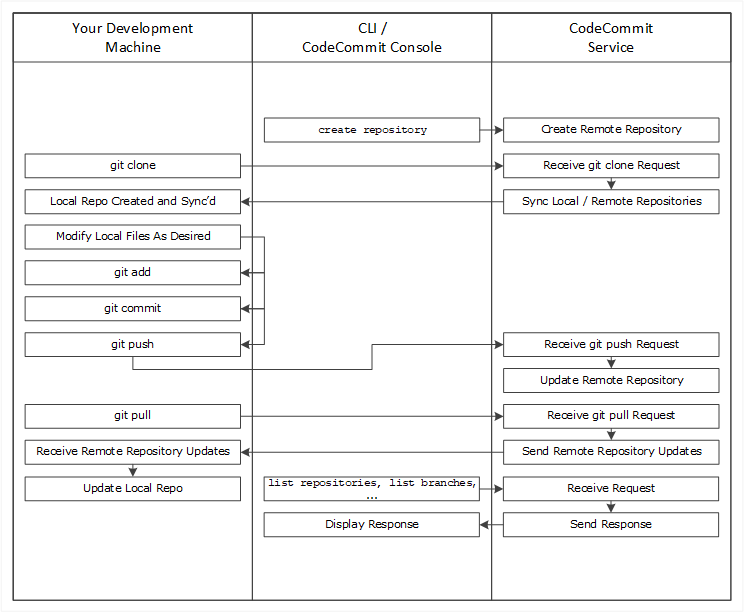

AWS CodeCommit is no longer available to new customers. Existing customers of
AWS CodeCommit can continue to use the service as normal.
[Learn more"](https://aws.amazon.com/blogs/devops/how-to-migrate-your-aws-codecommit-repository-to-another-git-provider "https://aws.amazon.com/blogs/devops/how-to-migrate-your-aws-codecommit-repository-to-another-git-provider")

# What is AWS CodeCommit?

AWS CodeCommit is a version control service hosted by Amazon Web Services that you can use to privately
store and manage assets (such as documents, source code, and binary files) in the cloud.
For information about
pricing for CodeCommit, see [Pricing.](http://aws.amazon.com/codecommit/pricing/ "http://aws.amazon.com/codecommit/pricing/")

###### Note

CodeCommit is in scope with many compliance programs. For details about AWS and compliance
efforts, see [AWS Services
In Scope by Compliance Program](https://aws.amazon.com/compliance/services-in-scope/ "https://aws.amazon.com/compliance/services-in-scope/").

This is a HIPAA Eligible Service. For more information about AWS, U.S. Health Insurance Portability and Accountability Act of 1996 (HIPAA), and using AWS services to process, store, and transmit protected health information (PHI), see [HIPAA Overview](https://aws.amazon.com/compliance/hipaa-compliance/ "https://aws.amazon.com/compliance/hipaa-compliance/").

For information about this service and ISO 27001, a security management standard that specifies security management best practices, see [ISO 27001 Overview](https://aws.amazon.com/compliance/iso-27001-faqs/ "https://aws.amazon.com/compliance/iso-27001-faqs/").

For information about this service and the Payment Card Industry Data Security Standard
(PCI DSS), see [PCI DSS
Overview](https://aws.amazon.com/compliance/pci-dss-level-1-faqs/ "https://aws.amazon.com/compliance/pci-dss-level-1-faqs/").

For information about this service and the Federal Information Processing Standard (FIPS)
Publication 140-2 US government standard that specifies the security requirements for
cryptographic modules that protect sensitive information, see [Federal Information Processing Standard (FIPS)
140-2 Overview](https://aws.amazon.com/compliance/fips/ "https://aws.amazon.com/compliance/fips/") and [Git connection endpoints](regions.md#regions-git "regions.md#regions-git").

###### Topics

- [Introducing CodeCommit](#welcome-introducing "#welcome-introducing")
- [CodeCommit, Git, and choosing the right AWS service for your
  needs](#welcome-alternate-services "#welcome-alternate-services")
- [How does CodeCommit work?](#welcome-how-it-works "#welcome-how-it-works")
- [How is CodeCommit different from file versioning in
  Amazon S3?](#welcome-arc-vs-s3 "#welcome-arc-vs-s3")
- [How do I get started with CodeCommit?](#welcome-get-started "#welcome-get-started")
- [Where can I learn more about Git?](#welcome-get-started-with-git "#welcome-get-started-with-git")

## Introducing CodeCommit

CodeCommit is a secure, highly scalable, managed source control service that hosts private Git
repositories. CodeCommit eliminates the need for you to manage your own source control system or
worry about scaling its infrastructure. You can use CodeCommit to store anything from code to
binaries. It supports the standard functionality of Git, so it works seamlessly with your
existing Git-based tools.

With CodeCommit, you can:

- **Benefit from a fully managed service hosted by AWS**.
  CodeCommit provides high service availability and durability and eliminates the administrative
  overhead of managing your own hardware and software. There is no hardware to provision and
  scale and no server software to install, configure, and update.
- **Store your code securely**. CodeCommit repositories are
  encrypted at rest as well as in transit.
- **Work collaboratively on code.** CodeCommit repositories
  support pull requests, where users can review and comment on each other's code changes
  before merging them to branches; notifications that automatically send emails to users
  about pull requests and comments; and more.
- **Easily scale your version control projects**. CodeCommit
  repositories can scale up to meet your development needs. The service can handle
  repositories with large numbers of files or branches, large file sizes, and lengthy
  revision histories.
- **Store anything, anytime**. CodeCommit has no limit on the
  size of your repositories or on the file types you can store.
- **Integrate with other AWS and third-party services**.
  CodeCommit keeps your repositories close to your other production resources in the AWS Cloud,
  which helps increase the speed and frequency of your development lifecycle. It is
  integrated with IAM and can be used with other AWS services and in parallel with other
  repositories. For more information, see [Product and service integrations with AWS CodeCommit](integrations.md "integrations.md").
- **Easily migrate files from other remote repositories**.
  You can migrate to CodeCommit from any Git-based repository.
- **Use the Git tools you already know**. CodeCommit supports
  Git commands as well as its own AWS CLI commands and APIs.

## CodeCommit, Git, and choosing the right AWS service for your

needs

As a Git-based service, CodeCommit is well suited to most version control needs. There are no
arbitrary limits on file size, file type, and repository size. However, there are inherent
limitations to Git that can negatively affect the performance of certain kinds of operations,
particularly over time. You can avoid potential degradation of CodeCommit repository performance by
avoiding using it for use cases where other AWS services are better suited to the task. You
can also optimize Git performance for complex repositories. Here are some use cases where Git,
and therefore CodeCommit, might not be the best solution for you, or where you might need to take
additional steps to optimize for Git.

| Use case                                | Description                                                                                                                                                                                                                                                                                                                                                                                                                                                                                                              | Other services to consider                                                                                                                                                                                                                                                                                                                                                                                                 |
| --------------------------------------- | ------------------------------------------------------------------------------------------------------------------------------------------------------------------------------------------------------------------------------------------------------------------------------------------------------------------------------------------------------------------------------------------------------------------------------------------------------------------------------------------------------------------------ | -------------------------------------------------------------------------------------------------------------------------------------------------------------------------------------------------------------------------------------------------------------------------------------------------------------------------------------------------------------------------------------------------------------------------- | ------------------------------------------------- | --------------------------- |
| Large files that change frequently      | Git uses delta encoding to store differences between versions of files. For<br>example, if you change a few words in a document, Git will only store those changed<br>words. If you have files or objects over 5 MB with many changes, Git might need to<br>reconstruct a large chain of delta differences. This can consume an increasing amount<br>of compute resources on both your local computer and in CodeCommit as these files grow over<br>time.                                                                | To version large files, consider Amazon Simple Storage Service (Amazon S3). For more information, see<br>[Using Versioning](../../../AmazonS3/latest/userguide/Versioning.md "../../../AmazonS3/latest/userguide/Versioning.md") in the _Amazon Simple Storage Service User Guide_.                                                                                                                                        |
| Database                                | Git repositories grow larger over time. Because versioning tracks all changes,<br>any change will increase your repository size. In other words, as you commit data,<br>even if you delete data in a commit, data is added to a repository. As there is more<br>data to process and transmit over time, Git will slow down. This is particularly<br>detrimental to a database use case. Git was not designed as a database.                                                                                              | To create and use a database with consistent performance regardless of size,<br>consider Amazon DynamoDB. For more information, see the [Amazon DynamoDB Getting Started Guide](../../../amazondynamodb/latest/gettingstartedguide.md "../../../amazondynamodb/latest/gettingstartedguide.md").                                                                                                                            |
| Audit trails                            | Typically, audit trails are kept for long periods of time and are continuously<br>generated by system processes at a very frequent cadence. Git was designed to securely<br>store source code generated by groups of developers on a development cycle. Rapidly<br>changing repositories that continually store programmatically-generated system changes<br>will see performance degrade over time.                                                                                                                     | To store audit trails, consider Amazon Simple Storage Service (Amazon S3). To audit AWS activity,<br>depending on your use case, consider using [AWS CloudTrail](https://aws.amazon.com/cloudtrail/ "https://aws.amazon.com/cloudtrail/"), [AWS Config](https://aws.amazon.com/config/ "https://aws.amazon.com/config/"), or [Amazon CloudWatch](https://aws.amazon.com/cloudwatch/ "https://aws.amazon.com/cloudwatch/"). |
| Backups                                 | Git was designed to version source code written by developers. You can [push commits to two remote repositories](how-to-mirror-repo-pushes.md "how-to-mirror-repo-pushes.md"),<br>including a CodeCommit repository, as a backup strategy. However, Git was not designed to<br>handle backups of your computer file system, database dumps, or similar backup<br>content. Doing so might slow down your system and increase the amount of time required<br>to clone and push a repository.                               | For information about backing up to the AWS Cloud, see [Backup & Restore](https://aws.amazon.com/backup-restore/ "https://aws.amazon.com/backup-restore/").                                                                                                                                                                                                                                                                |
| Large numbers of branches or references | When a Git client pushes or pulls repository data, the remote server must send<br>all branches and references such as tags, even if you are only interested in a single<br>branch. If you have thousands of branches and references, this can take time to<br>process and send (pack negotiation) and result in apparently slow repository response.<br>The more branches and tags you have, the longer this process can take. We recommend<br>using CodeCommit, but delete branches and tags that are no longer needed. | To analyze the number of references in a CodeCommit repository to determine which<br>might not be needed, you can use one of the following commands:<br>• Linux, macOS, or Unix, or Bash emulator on Windows:<br>```<br>git ls-remote                                                                                                                                                                                      | wc -l<br>`<br>• Powershell:<br>`<br>git ls-remote | Measure-Object -line<br>``` |

## How does CodeCommit work?

CodeCommit is familiar to users of Git-based repositories, but even those unfamiliar should
find the transition to CodeCommit relatively simple. CodeCommit provides a console for the easy creation
of repositories and the listing of existing repositories and branches. In a few simple steps,
users can find information about a repository and clone it to their computer, creating a local
repo where they can make changes and then push them to the CodeCommit repository. Users can work
from the command line on their local machines or use a GUI-based editor.

The following figure shows how you use your development machine, the AWS CLI or CodeCommit
console, and the CodeCommit service to create and manage repositories:



1. Use the AWS CLI or the CodeCommit console to create a CodeCommit repository.
2. From your development machine, use Git to run **git clone**, specifying
   the name of the CodeCommit repository. This creates a local repo that connects to the
   CodeCommit repository.
3. Use the local repo on your development machine to modify (add, edit, and delete)
   files, and then run **git add** to stage the modified files locally. Run
   **git commit** to commit the files locally, and then run **git
   push** to send the files to the CodeCommit repository.
4. Download changes from other users. Run **git pull** to synchronize the
   files in the CodeCommit repository with your local repo. This ensures you're working
   with the latest version of the files.

You can use the AWS CLI or the CodeCommit console to track and manage your repositories.

## How is CodeCommit different from file versioning in

Amazon S3?

CodeCommit is optimized for team software development. It manages batches of changes across
multiple files, which can occur in parallel with changes made by other developers. Amazon S3
versioning supports the recovery of past versions of files, but it's not focused on
collaborative file tracking features that software development teams need.

## How do I get started with CodeCommit?

To get started with CodeCommit:

1. Follow the steps in [Setting up](setting-up.md "setting-up.md") to prepare your development machines.
2. Follow the steps in one or more of the tutorials in [Getting started](getting-started-topnode.md "getting-started-topnode.md").
3. [Create](how-to-create-repository.md "how-to-create-repository.md") version control projects in
   CodeCommit or [migrate](how-to-migrate-repository.md "how-to-migrate-repository.md") version control projects
   to CodeCommit.

## Where can I learn more about Git?

If you don't know it already, you should [learn how to use
Git](how-to-basic-git.md "how-to-basic-git.md"). Here are some helpful resources:

- [Pro Git](http://git-scm.com/book "http://git-scm.com/book"), an online version of the
  _Pro Git_ book. Written by Scott Chacon. Published by
  Apress.
- [Git Immersion](http://gitimmersion.com/ "http://gitimmersion.com/"), a try-it-yourself guided
  tour that walks you through the fundamentals of using Git. Published by Neo Innovation,
  Inc.
- [Git Reference](https://git-scm.com/docs "https://git-scm.com/docs"), an online quick
  reference that can also be used as a more in-depth Git tutorial. Published by the GitHub
  team.
- [Git
  Cheat Sheet](https://github.com/github/training-kit/blob/master/downloads/github-git-cheat-sheet.md "https://github.com/github/training-kit/blob/master/downloads/github-git-cheat-sheet.md") with basic Git command syntax. Published by the GitHub team.
- [Git Pocket Guide](http://www.amazon.com/Git-Pocket-Guide-Richard-Silverman/dp/1449325866 "http://www.amazon.com/Git-Pocket-Guide-Richard-Silverman/dp/1449325866"). Written by Richard E. Silverman. Published by O'Reilly Media,
  Inc.
