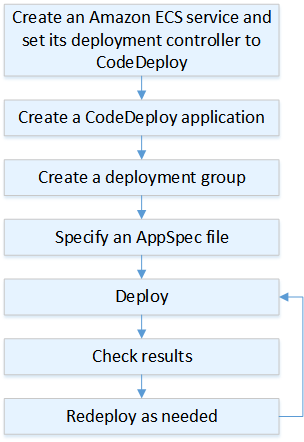
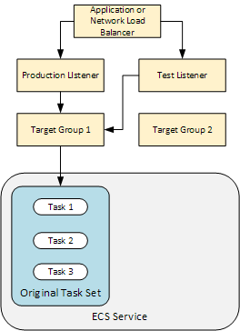
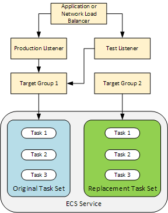
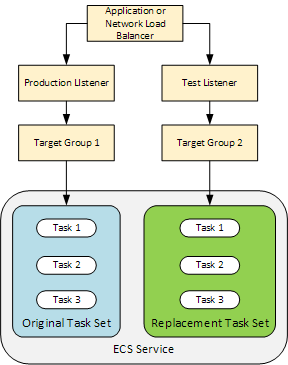
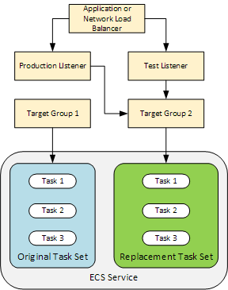
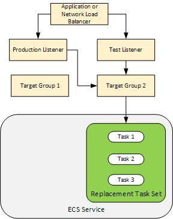

# Deployments on an Amazon ECS Compute Platform

This topic provides information about the components and workflow of CodeDeploy deployments
that use the Amazon ECS compute platform.

###### Topics

- [Before you begin an Amazon ECS
  deployment](#deployment-steps-prerequisites-ecs "#deployment-steps-prerequisites-ecs")
- [Deployment workflow (high level) on an
  Amazon ECS compute platform](#deployment-process-workflow-ecs "#deployment-process-workflow-ecs")
- [What happens during an Amazon ECS
  deployment](#deployment-steps-what-happens "#deployment-steps-what-happens")
- [Uploading your application
  revision](#deployment-steps-uploading-your-app-ecs "#deployment-steps-uploading-your-app-ecs")
- [Creating your
  application and deployment groups](#deployment-steps-registering-app-deployment-groups-ecs "#deployment-steps-registering-app-deployment-groups-ecs")
- [Deploying your application revision](#deployment-steps-deploy-ecs "#deployment-steps-deploy-ecs")
- [Updating your application](#deployment-steps-updating-your-app-ecs "#deployment-steps-updating-your-app-ecs")
- [Stopped and failed deployments](#deployment-stop-fail-ecs "#deployment-stop-fail-ecs")
- [Redeployments and deployment rollbacks](#deployment-rollback-ecs "#deployment-rollback-ecs")
- [Amazon ECS blue/green deployments through
  AWS CloudFormation](#deployment-steps-ecs-cf "#deployment-steps-ecs-cf")

## Before you begin an Amazon ECS

deployment

Before you begin an Amazon ECS application deployment, you must have the following ready.
Some requirements are specified when you create your deployment group, and some are
specified in the AppSpec file.

| Requirement                                        | Where specified  |
| -------------------------------------------------- | ---------------- |
| Amazon ECS cluster                                 | Deployment group |
| Amazon ECS service                                 | Deployment group |
| Application Load Balancer or Network Load Balancer | Deployment group |
| Production listener                                | Deployment group |
| Test listener (optional)                           | Deployment group |
| Two target groups                                  | Deployment group |
| Amazon ECS task definition                         | AppSpec file     |
| Container name                                     | AppSpec file     |
| Container port                                     | AppSpec file     |

**Amazon ECS cluster**

An Amazon ECS _cluster_ is a logical grouping of tasks
or services. You specify the Amazon ECS cluster that contains your Amazon ECS service when you
create your CodeDeploy application's deployment group. For more information, see [Amazon ECS clusters](../../../AmazonECS/latest/developerguide/ECS_clusters.md "../../../AmazonECS/latest/developerguide/ECS_clusters.md") in the _Amazon Elastic Container Service User Guide_.

**Amazon ECS service**

An Amazon ECS _service_ maintains and runs specified
instances of a task definition in an Amazon ECS cluster. Your Amazon ECS service must be enabled
for CodeDeploy. By default, an Amazon ECS service is enabled for Amazon ECS deployments. When you
create your deployment group, you choose to deploy an Amazon ECS service that is in your
Amazon ECS cluster. For more information, see [Amazon ECS services](../../../AmazonECS/latest/developerguide/ecs_services.md "../../../AmazonECS/latest/developerguide/ecs_services.md") in the _Amazon Elastic Container Service User
Guide_.

**Application Load Balancer or Network Load Balancer**

You must use Elastic Load Balancing with the Amazon ECS service you want to update with an Amazon ECS
deployment. You can use an Application Load Balancer or a Network Load Balancer. We recommend an Application Load Balancer so you can take
advantage of features such as dynamic port mapping and path-based routing and priority
rules. You specify the load balancer when you create your CodeDeploy application's
deployment group. For more information, see [Set up a load balancer,
target groups, and listeners for CodeDeploy Amazon ECS deployments](deployment-groups-create-load-balancer-for-ecs.md "deployment-groups-create-load-balancer-for-ecs.md") and [Creating a load balancer](../../../AmazonECS/latest/developerguide/create-load-balancer.md "../../../AmazonECS/latest/developerguide/create-load-balancer.md") in the
_Amazon Elastic Container Service User Guide_.

**One or two listeners**

A _listener_ is used by your load balancer to
direct traffic to your target groups. One production listener is required. You can
specify an optional second test listener that directs traffic to your replacement task
set while you run validation tests. You specify one or both listeners when you create
your deployment group. If you use the Amazon ECS console to create your Amazon ECS service, your
listeners are created for you. For more information, see [Listeners for your application load
balancers](../../../elasticloadbalancing/latest/application/load-balancer-listener.md "../../../elasticloadbalancing/latest/application/load-balancer-listener.md") in the _Elastic Load Balancing User Guide_ and
[Creating a service](../../../AmazonECS/latest/developerguide/create-service.md "../../../AmazonECS/latest/developerguide/create-service.md") in the
_Amazon Elastic Container Service User Guide_.

**Two Amazon ECS target groups**

A _target group_ is used to route traffic to a
registered target. An Amazon ECS deployment requires two target groups: one for your Amazon ECS
application's original task set and one for its replacement task set. During
deployment, CodeDeploy creates a replacement task set and reroutes traffic from the
original task set to the new one. You specify the target groups when you create your
CodeDeploy application's deployment group.

During a deployment, CodeDeploy determines which target group is associated with the
task set in your Amazon ECS service that has the status `PRIMARY` (this is the
original task set) and associates one target group with it, and then associates the
other target group with the replacement task set. If you do another deployment, the
target group associated with the current deployment's original task set is associated
with the next deployment's replacement task set. For more information, see [Target groups for your
application load balancers](../../../elasticloadbalancing/latest/application/load-balancer-target-groups.md "../../../elasticloadbalancing/latest/application/load-balancer-target-groups.md") in the _Elastic Load Balancing User
Guide_.

**An Amazon ECS task
definition**

A _task definition_ is required to run the
Docker container that contains your Amazon ECS application. You specify the ARN of your
task definition in your CodeDeploy application's AppSpec file. For more information, see
[Amazon ECS task definitions](../../../AmazonECS/latest/developerguide/task_definitions.md "../../../AmazonECS/latest/developerguide/task_definitions.md") in
the _Amazon Elastic Container Service User Guide_ and [AppSpec 'resources'
section for Amazon ECS deployments](reference-appspec-file-structure-resources.md#reference-appspec-file-structure-resources-ecs "reference-appspec-file-structure-resources.md#reference-appspec-file-structure-resources-ecs").

**A container for your Amazon ECS
application**

A Docker _container_ is a unit of software that
packages up code and its dependencies so your application can run. A container
isolates your application so it runs in different computing environments. Your load
balancer directs traffic to a container in your Amazon ECS application's task set. You
specify the name of your container in your CodeDeploy application's AppSpec file. The
container specified in your AppSpec file must be one of the containers specified in
your Amazon ECS task definition. For more information, see [What is Amazon Elastic Container Service?](../../../AmazonECS/latest/developerguide/Welcome.md "../../../AmazonECS/latest/developerguide/Welcome.md") in the _Amazon Elastic Container Service User Guide_ and [AppSpec 'resources'
section for Amazon ECS deployments](reference-appspec-file-structure-resources.md#reference-appspec-file-structure-resources-ecs "reference-appspec-file-structure-resources.md#reference-appspec-file-structure-resources-ecs").

**A port for your replacement
task set**

During your Amazon ECS deployment, your load balancer directs traffic to this
_port_ on the container specified in your CodeDeploy
application's AppSpec file. You specify the port in your CodeDeploy application's
AppSpec file. For more information, see [AppSpec 'resources'
section for Amazon ECS deployments](reference-appspec-file-structure-resources.md#reference-appspec-file-structure-resources-ecs "reference-appspec-file-structure-resources.md#reference-appspec-file-structure-resources-ecs").

## Deployment workflow (high level) on an

Amazon ECS compute platform

The following diagram shows the primary steps in the deployment of updated Amazon ECS
services.

These steps include:

1. Create an AWS CodeDeploy application by specifying a name that uniquely represents what
   you want to deploy. To deploy an Amazon ECS application, in your AWS CodeDeploy application,
   choose the Amazon ECS compute platform. CodeDeploy uses an application during a deployment to
   reference the correct deployment components, such as the deployment group, target
   groups, listeners, and traffic rerouting behavior, and application revision. For more
   information, see [Create an application with CodeDeploy](applications-create.md "applications-create.md").
2. Set up a deployment group by specifying:
   - The deployment group name.
   - Your Amazon ECS cluster and service name. The Amazon ECS service's deployment controller
     must be set to CodeDeploy.
   - The production listener, an optional test listener, and target groups used
     during a deployment.
   - Deployment settings, such as when to reroute production traffic to the
     replacement Amazon ECS task set in your Amazon ECS service and when to terminate the original
     Amazon ECS task set in your Amazon ECS service.
   - Optional settings, such as triggers, alarms, and rollback behavior.

3. Specify an _application specification file_ (AppSpec file). You can
   upload it to Amazon S3, enter it into the console in YAML or JSON format, or specify it with
   the AWS CLI or SDK. The AppSpec file specifies an Amazon ECS task definition for the
   deployment, a container name and port mapping used to route traffic, and Lambda functions
   run after deployment lifecycle hooks. The container name must be a container in your
   Amazon ECS task definition. For more information, see [Working with application revisions for CodeDeploy](application-revisions.md "application-revisions.md").
4. Deploy your application revision. AWS CodeDeploy reroutes traffic from the original
   version of a task set in your Amazon ECS service to a new, replacement task set. Target
   groups specified in the deployment group are used to serve traffic to the original and
   replacement task sets. After the deployment is complete, the original task set is
   terminated. You can specify an optional test listener to serve test traffic to your
   replacement version before traffic is rerouted to it. For more information, see [Create a deployment with CodeDeploy](deployments-create.md "deployments-create.md").
5. Check the deployment results. For more information, see [Monitoring deployments in CodeDeploy](monitoring.md "monitoring.md").

## What happens during an Amazon ECS

deployment

Before an Amazon ECS deployment with a test listener starts, you must configure its
components. For more information, see [Before you begin an Amazon ECS
deployment](#deployment-steps-prerequisites-ecs "#deployment-steps-prerequisites-ecs").

The following diagram shows the relationship between these components when an Amazon ECS
deployment is ready to start.

When the deployment starts, the deployment lifecycle events start to execute one at a
time. Some lifecycle events are hooks that only execute Lambda functions specified in the
AppSpec file. The deployment lifecycle events in the following table are listed in the
order they execute. For more information, see [AppSpec 'hooks' section for an Amazon ECS
deployment](reference-appspec-file-structure-hooks.md#appspec-hooks-ecs "reference-appspec-file-structure-hooks.md#appspec-hooks-ecs").

| Lifecycle event                                       | Lifecycle event action                                        |
| ----------------------------------------------------- | ------------------------------------------------------------- |
| `BeforeInstall` (a hook for Lambda functions)         | Run Lambda functions.                                         |
| Install                                               | Set up the replacement task set.                              |
| `AfterInstall` (a hook for Lambda functions)          | Run Lambda functions.                                         |
| AllowTestTraffic                                      | Route traffic from the test listener to target group 2.       |
| `AfterAllowTestTraffic` (a hook for Lambda functions) | Run Lambda functions.                                         |
| `BeforeAllowTraffic` (a hook for Lambda functions)    | Run Lambda functions.                                         |
| AllowTraffic                                          | Route traffic from the production listener to target group 2. |
| `AfterAllowTraffic`                                   | Run Lambda functions.                                         |

###### Note

Lambda functions in a hook are optional.

1. ######

Execute any Lambda functions specified in the `BeforeInstall` hook in the
AppSpec file. 2. ######

During the `Install` lifecycle event:

    1. A replacement task set is created in your Amazon ECS service.
    2. The updated containerized application is installed into the replacement task
     set.
    3. The second target group is associated with the replacement task set. This diagram shows deployment components with the new replacement task set. The

containerized application is inside this task set. The task set is composed of three
tasks. (An application can have any number of tasks.) The second target group is now
associated with the replacement task set.

 3. ######

Execute any Lambda functions specified in the `AfterInstall` hook in the
AppSpec file. 4. ######

The `AllowTestTraffic` event is invoked. During this lifecycle event, the
test listener routes traffic to the updated containerized application.

 5. ######

Execute any Lambda functions specified in the `AfterAllowTestTraffic` hook
in the AppSpec file. Lambda functions can validate the deployment using the test
traffic. For example, a Lambda function can serve traffic to the test listener and track
metrics from the replacement task set. If rollbacks are configured, you can configure a
CloudWatch alarm that triggers a rollback when the validation test in your Lambda function
fails.

After the validation tests are complete, one of the following occurs:

    * If validation fails and rollbacks are configured, the deployment status is
     marked `Failed` and components return to their state when the deployment
     started.
    * If validation fails and rollbacks are not configured, the deployment status is
     marked `Failed` and components remain in their current state.
    * If validation succeeds, the deployment continues to the
     `BeforeAllowTraffic` hook.

For more information, see [Monitoring deployments with CloudWatch alarms in
CodeDeploy](monitoring-create-alarms.md "monitoring-create-alarms.md"), [Automatic
rollbacks](deployments-rollback-and-redeploy.md#deployments-rollback-and-redeploy-automatic-rollbacks "deployments-rollback-and-redeploy.md#deployments-rollback-and-redeploy-automatic-rollbacks"), and [Configure advanced options
for a deployment group](deployment-groups-configure-advanced-options.md "deployment-groups-configure-advanced-options.md"). 6. ######

Execute any Lambda functions specified in the `BeforeAllowTraffic` hook in
the AppSpec file. 7. ######

The `AllowTraffic` event is invoked. Production traffic is rerouted from
the original task set to the replacement task set. The following diagram shows the
replacement task set receiving production traffic.

 8. ######

Execute any Lambda functions specified in the `AfterAllowTraffic` hook in
the AppSpec file. 9. ######

After all events succeed, the deployment status is set to `Succeeded` and
the original task set is removed.

## Uploading your application

revision

Place an AppSpec file in Amazon S3 or enter it directly into the console or AWS CLI. For
more information, see [Application Specification Files](application-specification-files.md "application-specification-files.md").

## Creating your

application and deployment groups

A CodeDeploy deployment group on an Amazon ECS compute platform identifies listeners to serve
traffic to your updated Amazon ECS application and two target groups used during your deployment.
A deployment group also defines a set of configuration options, such as alarms and rollback
configurations.

## Deploying your application revision

Now you're ready to deploy the updated Amazon ECS service specified in your deployment group.
You can use the CodeDeploy console or the [create-deployment](../../../cli/latest/reference/deploy/create-deployment.md "../../../cli/latest/reference/deploy/create-deployment.md") command. There are
parameters you can specify to control your deployment, including the revision and deployment
group.

## Updating your application

You can make updates to your application and then use the CodeDeploy console or call the
[create-deployment](../../../cli/latest/reference/deploy/create-deployment.md "../../../cli/latest/reference/deploy/create-deployment.md") command to push a revision.

## Stopped and failed deployments

You can use the CodeDeploy console or the [stop-deployment](../../../cli/latest/reference/deploy/stop-deployment.md "../../../cli/latest/reference/deploy/stop-deployment.md") command to stop a
deployment. When you attempt to stop the deployment, one of three things happens:

- The deployment stops, and the operation returns a status of succeeded. In this case,
  no more deployment lifecycle events are run on the deployment group for the stopped
  deployment.
- The deployment does not immediately stop, and the operation returns a status of
  pending. In this case, some deployment lifecycle events might still be running on the
  deployment group. After the pending operation is complete, subsequent calls to stop the
  deployment return a status of succeeded.
- The deployment cannot stop, and the operation returns an error. For more
  information, see [Error
  information](../APIReference/API_ErrorInformation.md "../APIReference/API_ErrorInformation.md") and [Common
  errors](../APIReference/CommonErrors.md "../APIReference/CommonErrors.md") in the AWS CodeDeploy API Reference.

## Redeployments and deployment rollbacks

CodeDeploy implements rollbacks by rerouting traffic from the replacement task set to the
original task set.

You can configure a deployment group to automatically roll back deployments when certain
conditions are met, including when a deployment fails or an alarm monitoring threshold is
met. You can also override the rollback settings specified for a deployment group in an
individual deployment.

You can also choose to roll back a failed deployment by manually redeploying a
previously deployed revision.

In all cases, the new or rolled-back deployment is assigned its own deployment ID. The
CodeDeploy console displays a list of deployments that are the result of an automatic deployment.

If you redeploy, the target group associated with the current deployment's original task
set is associated with the redeployment's replacement task set.

For more information, see [Redeploy and roll back a deployment with
CodeDeploy](deployments-rollback-and-redeploy.md "deployments-rollback-and-redeploy.md").

## Amazon ECS blue/green deployments through

AWS CloudFormation

You can use AWS CloudFormation to manage Amazon ECS blue/green deployments through CodeDeploy. For more
information, see [Create an Amazon ECS blue/green deployment
through CloudFormation](deployments-create-ecs-cfn.md "deployments-create-ecs-cfn.md").

###### Note

Managing Amazon ECS blue/green deployments with CloudFormation is not available in the
Asia Pacific (Osaka) region.
