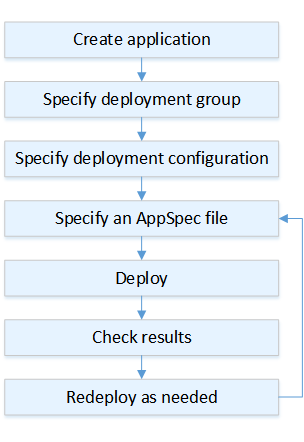

# Deployments on an

AWS Lambda Compute Platform

This topic provides information about the components and workflow of CodeDeploy deployments
that use the AWS Lambda compute platform.

###### Topics

- [Deployment workflow on an AWS Lambda
  compute platform](#deployment-process-workflow-lambda "#deployment-process-workflow-lambda")
- [Uploading your application
  revision](#deployment-steps-uploading-your-app-lambda "#deployment-steps-uploading-your-app-lambda")
- [Creating your
  application and deployment groups](#deployment-steps-registering-app-deployment-groups-lambda "#deployment-steps-registering-app-deployment-groups-lambda")
- [Deploying your application revision](#deployment-steps-deploy-lambda "#deployment-steps-deploy-lambda")
- [Updating your
  application](#deployment-steps-updating-your-app-lambda "#deployment-steps-updating-your-app-lambda")
- [Stopped and failed deployments](#deployment-stop-fail-lambda "#deployment-stop-fail-lambda")
- [Redeployments and deployment rollbacks](#deployment-rollback-lambda "#deployment-rollback-lambda")

## Deployment workflow on an AWS Lambda

compute platform

The following diagram shows the primary steps in the deployment of new and updated
AWS Lambda functions.

These steps include:

1. Create an application and give it a name that uniquely identifies the application
   revisions you want to deploy. To deploy Lambda functions, choose
   AWS Lambda compute platform when you create your application. CodeDeploy uses this name
   during a deployment to make sure it is referencing the correct deployment components,
   such as the deployment group, deployment configuration, and application revision. For
   more information, see [Create an application with CodeDeploy](applications-create.md "applications-create.md").
2. Set up a deployment group by specifying your deployment group's name.
3. Choose a deployment configuration to specify how traffic is shifted from your
   original AWS Lambda function version to your new Lambda function version. For more
   information, see [View Deployment Configuration Details](deployment-configurations-view-details.md "deployment-configurations-view-details.md").
4. Uploading an _application specification file_ (AppSpec file) to Amazon S3.
   The AppSpec file specifies a Lambda function version and Lambda functions used to
   validate your deployment. If you don't want to create an AppSpec file, you can
   specify a Lambda function version and Lambda deployment validation functions directly in
   the console using YAML or JSON. For more information, see [Working with application revisions for CodeDeploy](application-revisions.md "application-revisions.md").
5. Deploy your application revision to the deployment group. AWS CodeDeploy deploys the
   Lambda function revision you specified. The traffic is shifted to your Lambda function
   revision using the deployment AppSpec file you chose when you created your application.
   For more information, see [Create a deployment with CodeDeploy](deployments-create.md "deployments-create.md").
6. Check the deployment results. For more information, see [Monitoring deployments in CodeDeploy](monitoring.md "monitoring.md").

## Uploading your application

revision

Place an AppSpec file in Amazon S3 or enter it directly into the console or AWS CLI. For
more information, see [Application Specification Files](application-specification-files.md "application-specification-files.md").

## Creating your

application and deployment groups

A CodeDeploy deployment group on an AWS Lambda compute platform identifies a collection of
one or more AppSpec files. Each AppSpec file can deploy one Lambda function version. A
deployment group also defines a set of configuration options for future deployments, such as
alarms and rollback configurations.

## Deploying your application revision

Now you're ready to deploy the function revision specified in the AppSpec file to the
deployment group. You can use the CodeDeploy console or the [create-deployment](../../../cli/latest/reference/deploy/create-deployment.md "../../../cli/latest/reference/deploy/create-deployment.md")
command. There are parameters you can specify to control your deployment, including the
revision, deployment group, and deployment configuration.

## Updating your

application

You can make updates to your application and then use the CodeDeploy console or call the
[create-deployment](../../../cli/latest/reference/deploy/create-deployment.md "../../../cli/latest/reference/deploy/create-deployment.md") command to push a revision.

## Stopped and failed deployments

You can use the CodeDeploy console or the [stop-deployment](../../../cli/latest/reference/deploy/stop-deployment.md "../../../cli/latest/reference/deploy/stop-deployment.md") command to stop a
deployment. When you attempt to stop the deployment, one of three things happens:

- The deployment stops, and the operation returns a status of succeeded. In this case,
  no more deployment lifecycle events are run on the deployment group for the stopped
  deployment.
- The deployment does not immediately stop, and the operation returns a status of
  pending. In this case, some deployment lifecycle events might still be running on the
  deployment group. After the pending operation is complete, subsequent calls to stop the
  deployment return a status of succeeded.
- The deployment cannot stop, and the operation returns an error. For more
  information, see [ErrorInformation](../APIReference/API_ErrorInformation.md "../APIReference/API_ErrorInformation.md") and [Common
  errors](../APIReference/CommonErrors.md "../APIReference/CommonErrors.md") in the AWS CodeDeploy API Reference.

Like stopped deployments, failed deployments might result in some deployment lifecycle
events having already been run. To find out why a deployment failed, you can use the CodeDeploy
console or analyze the log file data from the failed deployment. For more information, see
[Application revision and log
file cleanup](codedeploy-agent.md#codedeploy-agent-revisions-logs-cleanup "codedeploy-agent.md#codedeploy-agent-revisions-logs-cleanup") and [View log data for CodeDeploy EC2/On-Premises
deployments](deployments-view-logs.md "deployments-view-logs.md").

## Redeployments and deployment rollbacks

CodeDeploy implements rollbacks by redeploying, as a new deployment, a previously deployed
revision.

You can configure a deployment group to automatically roll back deployments when certain
conditions are met, including when a deployment fails or an alarm monitoring threshold is
met. You can also override the rollback settings specified for a deployment group in an
individual deployment.

You can also choose to roll back a failed deployment by manually redeploying a
previously deployed revision.

In all cases, the new or rolled-back deployment is assigned its own deployment ID. The
list of deployments you can view in the CodeDeploy console shows which ones are the result of an
automatic deployment.

For more information, see [Redeploy and roll back a deployment with
CodeDeploy](deployments-rollback-and-redeploy.md "deployments-rollback-and-redeploy.md").
