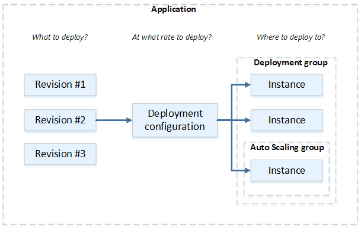
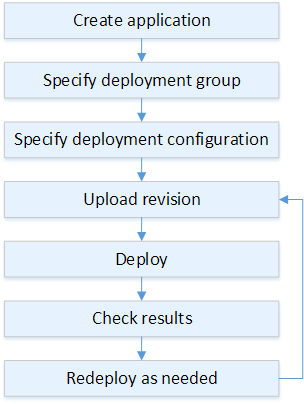

# Deployments on an

EC2/On-Premises Compute Platform

This topic provides information about the components and workflow of CodeDeploy deployments
that use the EC2/On-Premises compute platform. For information about blue/green deployments, see
[Overview of a blue/green
deployment](welcome.md#welcome-deployment-overview-blue-green "welcome.md#welcome-deployment-overview-blue-green").

###### Topics

- [Deployment components on an
  EC2/on-premises compute platform](#deployment-steps-components-server "#deployment-steps-components-server")
- [Deployment workflow on an EC2/on-premises
  compute platform](#deployment-steps-workflow "#deployment-steps-workflow")
- [Setting up instances](#deployment-steps-setting-up-instances "#deployment-steps-setting-up-instances")
- [Uploading your application
  revision](#deployment-steps-uploading-your-app "#deployment-steps-uploading-your-app")
- [Creating your
  application and deployment groups](#deployment-steps-registering-app-deployment-groups "#deployment-steps-registering-app-deployment-groups")
- [Deploying your application revision](#deployment-steps-deploy "#deployment-steps-deploy")
- [Updating your application](#deployment-steps-updating-your-app "#deployment-steps-updating-your-app")
- [Stopped and failed deployments](#deployment-stop-fail "#deployment-stop-fail")
- [Redeployments and deployment rollbacks](#deployment-rollback "#deployment-rollback")

## Deployment components on an

EC2/on-premises compute platform

The following diagram shows the components in a CodeDeploy deployment on an EC2/On-Premises
compute platform.

## Deployment workflow on an EC2/on-premises

compute platform

The following diagram shows the major steps in the deployment of application
revisions:

These steps include:

1. Create an application and give it a name that uniquely identifies the application
   revisions you want to deploy and the compute platform for your application. CodeDeploy uses
   this name during a deployment to make sure it is referencing the correct deployment
   components, such as the deployment group, deployment configuration, and application
   revision. For more information, see [Create an application with CodeDeploy](applications-create.md "applications-create.md").
2. Set up a deployment group by specifying a deployment type and the instances to which
   you want to deploy your application revisions. An in-place deployment updates instances
   with the latest application revision. A blue/green deployment registers a replacement
   set of instances for the deployment group with a load balancer and deregisters the
   original instances.

You can specify the tags applied to the instances, the Amazon EC2 Auto Scaling group names, or
both.

If you specify one group of tags in a deployment group, CodeDeploy deploys to instances
that have at least one of the specified tags applied. If you specify two or more tag
groups, CodeDeploy deploys only to the instances that meet the criteria for each of the tag
groups. For more information, see [Tagging Instances for Deployments](instances-tagging.md "instances-tagging.md").

In all cases, the instances must be configured to be used in a deployment (that is,
they must be tagged or belong to an Amazon EC2 Auto Scaling group) and have the CodeDeploy agent installed
and running.

We provide you with an CloudFormation template that you can use to quickly set up an Amazon EC2
instance based on Amazon Linux or Windows Server. We also provide you with the standalone CodeDeploy agent
so that you can install it on Amazon Linux, Ubuntu Server, Red Hat Enterprise Linux (RHEL), or Windows Server
instances. For more information, see [Create a deployment group with CodeDeploy](deployment-groups-create.md "deployment-groups-create.md").

You can also specify the following options:

    * **Amazon SNS notifications**. Create triggers that send
     notifications to subscribers of an Amazon SNS topic when specified events, such as
     success or failure events, occur in deployments and instances. For more information,
     see [Monitoring Deployments with Amazon SNS Event Notifications](monitoring-sns-event-notifications.md "monitoring-sns-event-notifications.md").
    * **Alarm-based deployment management**. Implement
     Amazon CloudWatch alarm monitoring to stop deployments when your metrics exceed or fall below
     the thresholds set in CloudWatch.
    * **Automatic deployment rollbacks**. Configure a
     deployment to roll back automatically to the previously known good revision when a
     deployment fails or an alarm threshold is met.

3. Specify a deployment configuration to indicate to how many instances your
   application revisions should be simultaneously deployed and to describe the success and
   failure conditions for the deployment. For more information, see [View Deployment Configuration Details](deployment-configurations-view-details.md "deployment-configurations-view-details.md").
4. Upload an application revision to Amazon S3 or GitHub. In addition to the files you want
   to deploy and any scripts you want to run during the deployment, you must include an
   _application specification file_ (AppSpec file). This file contains
   deployment instructions, such as where to copy the files onto each instance and when to
   run deployment scripts. For more information, see [Working with application revisions for CodeDeploy](application-revisions.md "application-revisions.md").
5. Deploy your application revision to the deployment group. The CodeDeploy agent on each
   instance in the deployment group copies your application revision from Amazon S3 or GitHub to
   the instance. The CodeDeploy agent then unbundles the revision, and using the
   AppSpec file, copies the files into the specified locations and executes any
   deployment scripts. For more information, see [Create a deployment with CodeDeploy](deployments-create.md "deployments-create.md").
6. Check the deployment results. For more information, see [Monitoring deployments in CodeDeploy](monitoring.md "monitoring.md").
7. Redeploy a revision. You might want to do this if you need to fix a bug in the
   source content, or run the deployment scripts in a different order, or address a failed
   deployment. To do this, rebundle your revised source content, any deployment scripts,
   and the AppSpec file into a new revision, and then upload the revision to the Amazon S3
   bucket or GitHub repository. Then execute a new deployment to the same deployment group
   with the new revision. For more information, see [Create a deployment with CodeDeploy](deployments-create.md "deployments-create.md").

## Setting up instances

You must set up instances before you can deploy application revisions for the first
time. If an application revision requires three production servers and two backup servers,
you launch or use five instances.

To manually provision instances:

1. Install the CodeDeploy agent on the instances. The CodeDeploy agent can be installed on Amazon Linux,
   Ubuntu Server, RHEL, and Windows Server instances.
2. Enable tagging, if you are using tags to identify instances in a deployment group.
   CodeDeploy relies on tags to identify and group instances into CodeDeploy deployment groups.
   Although the Getting Started tutorials used both, you can simply use a key or a value to
   define a tag for a deployment group.
3. Launch Amazon EC2 instances with an IAM instance profile attached. The IAM instance
   profile must be attached to an Amazon EC2 instance as it is launched for the CodeDeploy agent to
   verify the identity of the instance.
4. Create a service role. Provide service access so that CodeDeploy can expand the tags in
   your AWS account.

For an initial deployment, the CloudFormation template does all of this for you. It creates and
configures new, single Amazon EC2 instances based on Amazon Linux or Windows Server with the CodeDeploy agent
already installed. For more information, see [Working with instances for CodeDeploy](instances.md "instances.md").

###### Note

For a blue/green deployment, you can choose between using instances that you already
have for the replacement environment or letting CodeDeploy provision new instances for you as
part of the deployment process.

## Uploading your application

revision

Place an AppSpec file under the root folder in your application's source content
folder structure. For more information, see [Application Specification Files](application-specification-files.md "application-specification-files.md").

Bundle the application's source content folder structure into an archive file format
such as zip, tar, or compressed tar. Upload the archive file (the
_revision_) to an Amazon S3 bucket or GitHub repository.

###### Note

The tar and compressed tar archive file formats (.tar and .tar.gz) are not supported
for Windows Server instances.

## Creating your

application and deployment groups

A CodeDeploy deployment group identifies a collection of instances based on their tags,
Amazon EC2 Auto Scaling group names, or both. Multiple application revisions can be deployed to the same
instance. An application revision can be deployed to multiple instances.

For example, you could add a tag of "Prod" to the three production servers and "Backup"
to the two backup servers. These two tags can be used to create two different deployment
groups in the CodeDeploy application, allowing you to choose which set of servers (or both)
should participate in a deployment.

You can use multiple tag groups in a deployment group to restrict deployments to a
smaller set of instances. For information, see [Tagging Instances for Deployments](instances-tagging.md "instances-tagging.md").

## Deploying your application revision

Now you're ready to deploy your application revision from Amazon S3 or GitHub to the
deployment group. You can use the CodeDeploy console or the [create-deployment](../../../cli/latest/reference/deploy/create-deployment.md "../../../cli/latest/reference/deploy/create-deployment.md")
command. There are parameters you can specify to control your deployment, including the
revision, deployment group, and deployment configuration.

## Updating your application

You can make updates to your application and then use the CodeDeploy console or call the
[create-deployment](../../../cli/latest/reference/deploy/create-deployment.md "../../../cli/latest/reference/deploy/create-deployment.md") command to push a revision.

## Stopped and failed deployments

You can use the CodeDeploy console or the [stop-deployment](../../../cli/latest/reference/deploy/stop-deployment.md "../../../cli/latest/reference/deploy/stop-deployment.md") command to stop a
deployment. When you attempt to stop the deployment, one of three things happens:

- The deployment stops, and the operation returns a status of succeeded. In this case,
  no more deployment lifecycle events are run on the deployment group for the stopped
  deployment. Some files might have already been copied to, and some scripts might have
  already been run on, one or more of the instances in the deployment group.
- The deployment does not immediately stop, and the operation returns a status of
  pending. In this case, some deployment lifecycle events might still be running on the
  deployment group. Some files might have already been copied to, and some scripts might
  have already been run on, one or more of the instances in the deployment group. After
  the pending operation is complete, subsequent calls to stop the deployment return a
  status of succeeded.
- The deployment cannot stop, and the operation returns an error. For more
  information, see [ErrorInformation](../APIReference/API_ErrorInformation.md "../APIReference/API_ErrorInformation.md") and [Common
  errors](../APIReference/CommonErrors.md "../APIReference/CommonErrors.md") in the AWS CodeDeploy API Reference.

Like stopped deployments, failed deployments might result in some deployment lifecycle
events having already been run on one or more of the instances in the deployment group. To
find out why a deployment failed, you can use the CodeDeploy console, call the
[get-deployment-instance](../../../cli/latest/reference/deploy/get-deployment-instance.md "../../../cli/latest/reference/deploy/get-deployment-instance.md") command, or analyze the log file data from the failed
deployment. For more information, see [Application revision and log
file cleanup](codedeploy-agent.md#codedeploy-agent-revisions-logs-cleanup "codedeploy-agent.md#codedeploy-agent-revisions-logs-cleanup") and [View log data for CodeDeploy EC2/On-Premises
deployments](deployments-view-logs.md "deployments-view-logs.md").

## Redeployments and deployment rollbacks

CodeDeploy implements rollbacks by redeploying, as a new deployment, a previously deployed
revision.

You can configure a deployment group to automatically roll back deployments when certain
conditions are met, including when a deployment fails or an alarm monitoring threshold is
met. You can also override the rollback settings specified for a deployment group in an
individual deployment.

You can also choose to roll back a failed deployment by manually redeploying a
previously deployed revision.

In all cases, the new or rolled-back deployment is assigned its own deployment ID. The
list of deployments you can view in the CodeDeploy console shows which ones are the result of an
automatic deployment.

For more information, see [Redeploy and roll back a deployment with
CodeDeploy](deployments-rollback-and-redeploy.md "deployments-rollback-and-redeploy.md").
