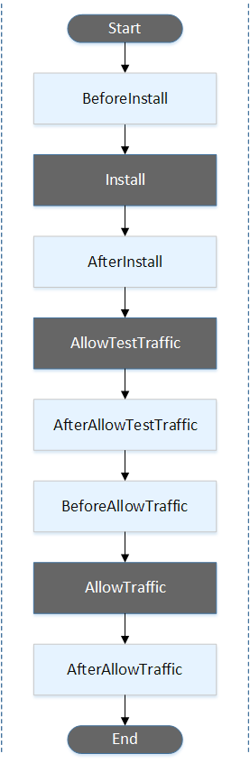
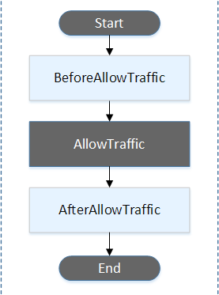
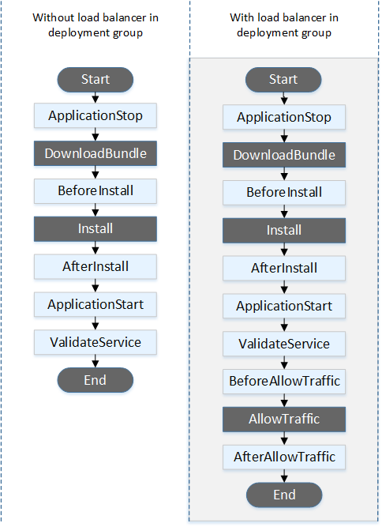
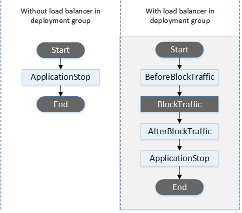
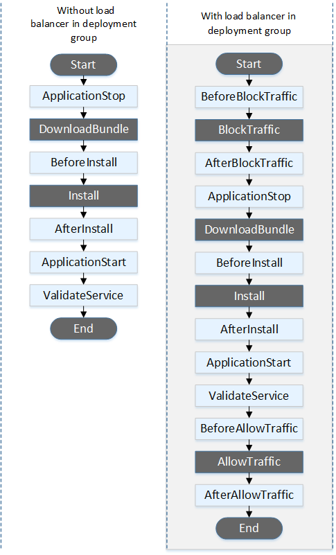
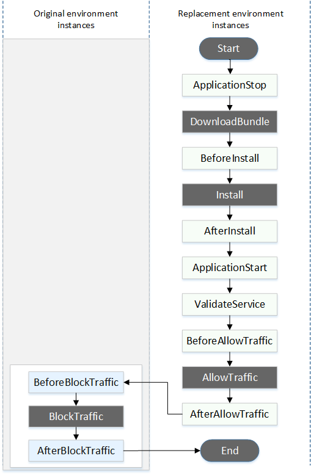

# AppSpec 'hooks' section

The content in the `'hooks'` section of the AppSpec file varies, depending
on the compute platform for your deployment. The `'hooks'` section for an
EC2/On-Premises deployment contains mappings that link deployment lifecycle event
hooks to one or more scripts. The `'hooks'` section for a Lambda or an Amazon ECS
deployment specifies Lambda validation functions to run during a deployment lifecycle event.
If an event hook is not present, no operation is executed for that event. This section is
required only if you are running scripts or Lambda validation functions as part of the
deployment.

###### Topics

- [AppSpec 'hooks' section for an Amazon ECS
  deployment](#appspec-hooks-ecs "#appspec-hooks-ecs")
- [AppSpec 'hooks' section for an
  AWS Lambda deployment](#appspec-hooks-lambda "#appspec-hooks-lambda")
- [AppSpec 'hooks' section for an
  EC2/On-Premises deployment](#appspec-hooks-server "#appspec-hooks-server")

## AppSpec 'hooks' section for an Amazon ECS

deployment

###### Topics

- [List of lifecycle
  event hooks for an Amazon ECS deployment](#reference-appspec-file-structure-hooks-list-ecs "#reference-appspec-file-structure-hooks-list-ecs")
- [Run order of
  hooks in an Amazon ECS deployment.](#reference-appspec-file-structure-hooks-run-order-ecs "#reference-appspec-file-structure-hooks-run-order-ecs")
- [Structure
  of 'hooks' section](#reference-appspec-file-structure-hooks-section-structure-ecs "#reference-appspec-file-structure-hooks-section-structure-ecs")
- [Sample Lambda 'hooks' function](#reference-appspec-file-structure-hooks-section-structure-ecs-sample-function "#reference-appspec-file-structure-hooks-section-structure-ecs-sample-function")

### List of lifecycle

event hooks for an Amazon ECS deployment

An AWS Lambda hook is one Lambda function specified with a string on a
new line after the name of the lifecycle event. Each hook is executed once per
deployment. Following are descriptions of the lifecycle events where you can run a hook
during an Amazon ECS deployment.

- `BeforeInstall` – Use to run tasks before the replacement task set
  is created. One target group is associated with the original task set. If an
  optional test listener is specified, it is associated with the original task set. A
  rollback is not possible at this point.
- `AfterInstall` – Use to run tasks after the replacement task set is
  created and one of the target groups is associated with it. If an optional test
  listener is specified, it is associated with the original task set. The results of a
  hook function at this lifecycle event can trigger a rollback.
- `AfterAllowTestTraffic` – Use to run tasks after the test listener
  serves traffic to the replacement task set. The results of a hook function at this
  point can trigger a rollback.
- `BeforeAllowTraffic` – Use to run tasks after the second target
  group is associated with the replacement task set, but before traffic is shifted to
  the replacement task set. The results of a hook function at this lifecycle event can
  trigger a rollback.
- `AfterAllowTraffic` – Use to run tasks after the second target
  group serves traffic to the replacement task set. The results of a hook function at
  this lifecycle event can trigger a rollback.

For more information, see [What happens during an Amazon ECS
deployment](deployment-steps-ecs.md#deployment-steps-what-happens "deployment-steps-ecs.md#deployment-steps-what-happens") and [Tutorial: Deploy an Amazon ECS service with a
validation test](tutorial-ecs-deployment-with-hooks.md "tutorial-ecs-deployment-with-hooks.md").

### Run order of

hooks in an Amazon ECS deployment.

In an Amazon ECS deployment, event hooks run in the following order:



###### Note

The **Start**, **Install**, **TestTraffic**, **AllowTraffic**, and **End** events
in the deployment cannot be scripted, which is why they appear in gray in this
diagram.

### Structure

of 'hooks' section

The following are examples of the structure of the `'hooks'`
section.

Using YAML:

```
Hooks:
  - BeforeInstall: "`BeforeInstallHookFunctionName`"
  - AfterInstall: "`AfterInstallHookFunctionName`"
  - AfterAllowTestTraffic: "`AfterAllowTestTrafficHookFunctionName`"
  - BeforeAllowTraffic: "`BeforeAllowTrafficHookFunctionName`"
  - AfterAllowTraffic: "`AfterAllowTrafficHookFunctionName`"
```

Using JSON:

```
"Hooks": [
		{
			"BeforeInstall": "`BeforeInstallHookFunctionName`"
		},
		{
			"AfterInstall": "`AfterInstallHookFunctionName`"
		},
		{
			"AfterAllowTestTraffic": "`AfterAllowTestTrafficHookFunctionName`"
		},
		{
			"BeforeAllowTraffic": "`BeforeAllowTrafficHookFunctionName`"
		},
		{
			"AfterAllowTraffic": "`AfterAllowTrafficHookFunctionName`"
		}
	]
}
```

### Sample Lambda 'hooks' function

Use the `'hooks'` section to specify a Lambda function that CodeDeploy can call
to validate an Amazon ECS deployment. You can use the same function or a different one for
the `BeforeInstall`, `AfterInstall`,
`AfterAllowTestTraffic`, `BeforeAllowTraffic`, and
`AfterAllowTraffic` deployment lifecycle events. Following completion of
the validation tests, the Lambda `AfterAllowTraffic` function calls back CodeDeploy
and delivers a result of `Succeeded` or `Failed`.

###### Important

The deployment is considered to have failed if CodeDeploy is not notified by the Lambda
validation function within one hour.

Before invoking a Lambda hook function, the server must be notified of the
deployment ID and the lifecycle event hook execution ID using the
`putLifecycleEventHookExecutionStatus` command.

The following is a sample Lambda hook function written in Node.js.

```
'use strict';

const aws = require('aws-sdk');
const codedeploy = new aws.CodeDeploy({apiVersion: '2014-10-06'});

exports.handler = (event, context, callback) => {
    //Read the DeploymentId from the event payload.
    var deploymentId = event.DeploymentId;

    //Read the LifecycleEventHookExecutionId from the event payload
    var lifecycleEventHookExecutionId = event.LifecycleEventHookExecutionId;

    /*
     Enter validation tests here.
    */

    // Prepare the validation test results with the deploymentId and
    // the lifecycleEventHookExecutionId for CodeDeploy.
    var params = {
        deploymentId: deploymentId,
        lifecycleEventHookExecutionId: lifecycleEventHookExecutionId,
        status: 'Succeeded' // status can be 'Succeeded' or 'Failed'
    };

    // Pass CodeDeploy the prepared validation test results.
    codedeploy.putLifecycleEventHookExecutionStatus(params, function(err, data) {
        if (err) {
            // Validation failed.
            callback('Validation test failed');
        } else {
            // Validation succeeded.
            callback(null, 'Validation test succeeded');
        }
    });
};
```

## AppSpec 'hooks' section for an

AWS Lambda deployment

###### Topics

- [List of lifecycle
  event hooks for an AWS Lambda deployment](#reference-appspec-file-structure-hooks-list-lambda "#reference-appspec-file-structure-hooks-list-lambda")
- [Run order of
  hooks in a Lambda function version deployment](#reference-appspec-file-structure-hooks-run-order-lambda "#reference-appspec-file-structure-hooks-run-order-lambda")
- [Structure of 'hooks' section](#reference-appspec-file-structure-hooks-section-structure-lambda "#reference-appspec-file-structure-hooks-section-structure-lambda")
- [Sample Lambda 'hooks' function](#reference-appspec-file-structure-hooks-section-structure-lambda-sample-function "#reference-appspec-file-structure-hooks-section-structure-lambda-sample-function")

### List of lifecycle

event hooks for an AWS Lambda deployment

An AWS Lambda hook is one Lambda function specified with a string on a
new line after the name of the lifecycle event. Each hook is executed once per
deployment. Here are descriptions of the hooks available for use in your AppSpec file.

- **BeforeAllowTraffic** – Use to run tasks
  before traffic is shifted to the deployed Lambda function version.
- **AfterAllowTraffic** – Use to run tasks
  after all traffic is shifted to the deployed Lambda function version.

### Run order of

hooks in a Lambda function version deployment

In a serverless Lambda function version deployment, event hooks run in the following
order:



###### Note

The **Start**, **AllowTraffic**, and **End** events in the
deployment cannot be scripted, which is why they appear in gray in this
diagram.

### Structure of 'hooks' section

The following are examples of the structure of the 'hooks' section.

Using YAML:

```
hooks:
   - BeforeAllowTraffic: `BeforeAllowTrafficHookFunctionName`
   - AfterAllowTraffic: `AfterAllowTrafficHookFunctionName`
```

Using JSON:

```
"hooks": [{
    "BeforeAllowTraffic": "`BeforeAllowTrafficHookFunctionName`"
    },
    {
    "AfterAllowTraffic": "`AfterAllowTrafficHookFunctionName`"
}]

```

### Sample Lambda 'hooks' function

Use the 'hooks' section to specify a Lambda function that CodeDeploy can call to validate
a Lambda deployment. You can use the same function or a different one for the
`BeforeAllowTraffic` and `AfterAllowTraffic` deployment
lifecycle events. Following completion of the validation tests, the Lambda validation
function calls back CodeDeploy and delivers a result of `Succeeded` or
`Failed`.

###### Important

The deployment is considered to have failed if CodeDeploy is not notified by the Lambda
validation function within one hour.

Before invoking a Lambda hook function, the server must be notified of the
deployment ID and the lifecycle event hook execution ID using the
`putLifecycleEventHookExecutionStatus` command.

The following is a sample Lambda hook function written in Node.js.

```
'use strict';

const aws = require('aws-sdk');
const codedeploy = new aws.CodeDeploy({apiVersion: '2014-10-06'});

exports.handler = (event, context, callback) => {
    //Read the DeploymentId from the event payload.
    var deploymentId = event.DeploymentId;

    //Read the LifecycleEventHookExecutionId from the event payload
    var lifecycleEventHookExecutionId = event.LifecycleEventHookExecutionId;

    /*
     Enter validation tests here.
    */

    // Prepare the validation test results with the deploymentId and
    // the lifecycleEventHookExecutionId for CodeDeploy.
    var params = {
        deploymentId: deploymentId,
        lifecycleEventHookExecutionId: lifecycleEventHookExecutionId,
        status: 'Succeeded' // status can be 'Succeeded' or 'Failed'
    };

    // Pass CodeDeploy the prepared validation test results.
    codedeploy.putLifecycleEventHookExecutionStatus(params, function(err, data) {
        if (err) {
            // Validation failed.
            callback('Validation test failed');
        } else {
            // Validation succeeded.
            callback(null, 'Validation test succeeded');
        }
    });
};
```

## AppSpec 'hooks' section for an

EC2/On-Premises deployment

###### Topics

- [List of lifecycle event
  hooks](#reference-appspec-file-structure-hooks-list "#reference-appspec-file-structure-hooks-list")
- [Lifecycle event
  hook availability](#reference-appspec-file-structure-hooks-availability "#reference-appspec-file-structure-hooks-availability")
- [Run order of hooks in
  a deployment](#reference-appspec-file-structure-hooks-run-order "#reference-appspec-file-structure-hooks-run-order")
- [Structure of
  'hooks' section](#reference-appspec-file-structure-hooks-section-structure "#reference-appspec-file-structure-hooks-section-structure")
- [Referencing files in your hook
  scripts](#codedeploy-agent-working-directory "#codedeploy-agent-working-directory")
- [Environment variable availability for hooks](#reference-appspec-file-structure-environment-variable-availability "#reference-appspec-file-structure-environment-variable-availability")
- [Hooks example](#reference-appspec-file-structure-hooks-example "#reference-appspec-file-structure-hooks-example")

### List of lifecycle event

hooks

An EC2/On-Premises deployment hook is executed once per deployment to an
instance. You can specify one or more scripts to run in a hook. Each hook for a
lifecycle event is specified with a string on a separate line. Here are descriptions of
the hooks available for use in your AppSpec file.

For information about which lifecycle event hooks are valid for which deployment and
rollback types, see [Lifecycle event
hook availability](#reference-appspec-file-structure-hooks-availability "#reference-appspec-file-structure-hooks-availability").

- `ApplicationStop` – This deployment lifecycle event occurs even
  before the application revision is downloaded. You can specify scripts for this
  event to gracefully stop the application or remove currently installed packages in
  preparation for a deployment. The AppSpec file and scripts used for this
  deployment lifecycle event are from the previous successfully deployed application
  revision.

###### Note

An AppSpec file does not exist on an instance before you deploy to it. For
this reason, the `ApplicationStop` hook does not run the first time you
deploy to the instance. You can use the `ApplicationStop` hook the
second time you deploy to an instance.

To determine the location of the last successfully deployed application
revision, the CodeDeploy agent looks up the location listed in the
``deployment-group-id`\_last_successful_install`
file. This file is located in:

`/opt/codedeploy-agent/deployment-root/deployment-instructions`
folder on Amazon Linux, Ubuntu Server, and RHEL Amazon EC2 instances.

`C:\ProgramData\Amazon\CodeDeploy\deployment-instructions`
folder on Windows Server Amazon EC2 instances.

To troubleshoot a deployment that fails during the `ApplicationStop`
deployment lifecycle event, see [Troubleshooting a
failed ApplicationStop, BeforeBlockTraffic, or AfterBlockTraffic deployment lifecycle
event](troubleshooting-deployments.md#troubleshooting-deployments-lifecycle-event-failures "troubleshooting-deployments.md#troubleshooting-deployments-lifecycle-event-failures").

- `DownloadBundle` – During this deployment lifecycle event, the
  CodeDeploy agent copies the application revision files to a temporary location:

`/opt/codedeploy-agent/deployment-root/`deployment-group-id`/`deployment-id`/deployment-archive`
folder on Amazon Linux, Ubuntu Server, and RHEL Amazon EC2 instances.

`C:\ProgramData\Amazon\CodeDeploy\`deployment-group-id`\`deployment-id`\deployment-archive`
folder on Windows Server Amazon EC2 instances.

This event is reserved for the CodeDeploy agent and cannot be used to run
scripts.

To troubleshoot a deployment that fails during the `DownloadBundle`
deployment lifecycle event, see [Troubleshooting a failed
DownloadBundle deployment lifecycle event with UnknownError: not opened for
reading](troubleshooting-deployments.md#troubleshooting-deployments-downloadbundle "troubleshooting-deployments.md#troubleshooting-deployments-downloadbundle").

- `BeforeInstall` – You can use this deployment lifecycle event
  for preinstall tasks, such as decrypting files and creating a backup of the current
  version.
- `Install` – During this deployment lifecycle event, the CodeDeploy
  agent copies the revision files from the temporary location to the final destination
  folder. This event is reserved for the CodeDeploy agent and cannot be used to run
  scripts.
- `AfterInstall` – You can use this deployment lifecycle event
  for tasks such as configuring your application or changing file permissions.
- `ApplicationStart` – You typically use this deployment
  lifecycle event to restart services that were stopped during
  `ApplicationStop`.
- `ValidateService` – This is the last deployment lifecycle
  event. It is used to verify the deployment was completed successfully.
- `BeforeBlockTraffic` – You can use this deployment lifecycle
  event to run tasks on instances before they are deregistered from a load
  balancer.

To troubleshoot a deployment that fails during the
`BeforeBlockTraffic` deployment lifecycle event, see [Troubleshooting a
failed ApplicationStop, BeforeBlockTraffic, or AfterBlockTraffic deployment lifecycle
event](troubleshooting-deployments.md#troubleshooting-deployments-lifecycle-event-failures "troubleshooting-deployments.md#troubleshooting-deployments-lifecycle-event-failures").

- `BlockTraffic` – During this deployment lifecycle event,
  internet traffic is blocked from accessing instances that are currently serving
  traffic. This event is reserved for the CodeDeploy agent and cannot be used to run
  scripts.
- `AfterBlockTraffic` – You can use this deployment lifecycle
  event to run tasks on instances after they are deregistered from their respective
  load balancer.

To troubleshoot a deployment that fails during the
`AfterBlockTraffic` deployment lifecycle event, see [Troubleshooting a
failed ApplicationStop, BeforeBlockTraffic, or AfterBlockTraffic deployment lifecycle
event](troubleshooting-deployments.md#troubleshooting-deployments-lifecycle-event-failures "troubleshooting-deployments.md#troubleshooting-deployments-lifecycle-event-failures").

- `BeforeAllowTraffic` – You can use this deployment lifecycle
  event to run tasks on instances before they are registered with a load
  balancer.
- `AllowTraffic` – During this deployment lifecycle event,
  internet traffic is allowed to access instances after a deployment. This event is
  reserved for the CodeDeploy agent and cannot be used to run scripts.
- `AfterAllowTraffic` – You can use this deployment lifecycle
  event to run tasks on instances after they are registered with a load
  balancer.

### Lifecycle event

hook availability

The following table lists the lifecycle event hooks available for each deployment
and rollback scenario.

| Lifecycle event name                                                                                                                                                                                                                                                                                                                                                                                                  | Auto Scaling launch deployment¹ | Auto Scaling termination deployment¹ | In-place deployment² | Blue/green deployment: Original instances | Blue/green deployment: Replacement instances | Blue/green deployment rollback: Original instances | Blue/green deployment rollback: Replacement instances |
| --------------------------------------------------------------------------------------------------------------------------------------------------------------------------------------------------------------------------------------------------------------------------------------------------------------------------------------------------------------------------------------------------------------------- | ------------------------------- | ------------------------------------ | -------------------- | ----------------------------------------- | -------------------------------------------- | -------------------------------------------------- | ----------------------------------------------------- |
| **ApplicationStop**                                                                                                                                                                                                                                                                                                                                                                                                   | ✓                               | ✓                                    | ✓                    |                                           | ✓                                            |                                                    |                                                       |
| **DownloadBundle**³                                                                                                                                                                                                                                                                                                                                                                                                   | ✓                               |                                      | ✓                    |                                           | ✓                                            |                                                    |                                                       |
| **BeforeInstall**                                                                                                                                                                                                                                                                                                                                                                                                     | ✓                               |                                      | ✓                    |                                           | ✓                                            |                                                    |                                                       |
| **Install**³                                                                                                                                                                                                                                                                                                                                                                                                          | ✓                               |                                      | ✓                    |                                           | ✓                                            |                                                    |                                                       |
| **AfterInstall**                                                                                                                                                                                                                                                                                                                                                                                                      | ✓                               |                                      | ✓                    |                                           | ✓                                            |                                                    |                                                       |
| **ApplicationStart**                                                                                                                                                                                                                                                                                                                                                                                                  | ✓                               |                                      | ✓                    |                                           | ✓                                            |                                                    |                                                       |
| **ValidateService**                                                                                                                                                                                                                                                                                                                                                                                                   | ✓                               |                                      | ✓                    |                                           | ✓                                            |                                                    |                                                       |
| **BeforeBlockTraffic**                                                                                                                                                                                                                                                                                                                                                                                                |                                 | ✓                                    | ✓                    | ✓                                         |                                              |                                                    | ✓                                                     |
| **BlockTraffic**³                                                                                                                                                                                                                                                                                                                                                                                                     |                                 | ✓                                    | ✓                    | ✓                                         |                                              |                                                    | ✓                                                     |
| **AfterBlockTraffic**                                                                                                                                                                                                                                                                                                                                                                                                 |                                 | ✓                                    | ✓                    | ✓                                         |                                              |                                                    | ✓                                                     |
| **BeforeAllowTraffic**                                                                                                                                                                                                                                                                                                                                                                                                | ✓                               |                                      | ✓                    |                                           | ✓                                            | ✓                                                  |                                                       |
| **AllowTraffic**³                                                                                                                                                                                                                                                                                                                                                                                                     | ✓                               |                                      | ✓                    |                                           | ✓                                            | ✓                                                  |                                                       |
| **AfterAllowTraffic**                                                                                                                                                                                                                                                                                                                                                                                                 | ✓                               |                                      | ✓                    |                                           | ✓                                            | ✓                                                  |                                                       |
| ¹ For information about Amazon EC2 Auto Scaling deployments, see [How Amazon EC2 Auto Scaling works with<br>CodeDeploy](integrations-aws-auto-scaling.md#integrations-aws-auto-scaling-behaviors "integrations-aws-auto-scaling.md#integrations-aws-auto-scaling-behaviors").<br>² Also applies to the rollback of an in-place deployment.<br>³ Reserved for CodeDeploy operations. Cannot be used to run<br>scripts. |

### Run order of hooks in

a deployment

**Auto Scaling launch deployments**

During an Auto Scaling launch deployment, CodeDeploy runs event hooks in the following
order.

For more information about Auto Scaling launch deployments, see [How Amazon EC2 Auto Scaling works with
CodeDeploy](integrations-aws-auto-scaling.md#integrations-aws-auto-scaling-behaviors "integrations-aws-auto-scaling.md#integrations-aws-auto-scaling-behaviors").



###### Note

The **Start**, **DownloadBundle**, **Install**, **AllowTraffic**, and **End** events
in the deployment cannot be scripted, which is why they appear in gray in this
diagram. However, you can edit the `'files'` section of the AppSpec file
to specify what's installed during the **Install**
event.

**Auto Scaling termination deployments**

During an Auto Scaling termination deployment, CodeDeploy runs event hooks in the following
order.

For more information about Auto Scaling termination deployments, see [Enabling
termination deployments during Auto Scaling scale-in events](integrations-aws-auto-scaling.md#integrations-aws-auto-scaling-behaviors-hook-enable "integrations-aws-auto-scaling.md#integrations-aws-auto-scaling-behaviors-hook-enable").



###### Note

The **Start**, **BlockTraffic**, and **End** events in the
deployment cannot be scripted, which is why they appear in gray in this diagram.

**In-place deployments**

In an in-place deployment, including the rollback of an in-place deployment, event
hooks are run in the following order:

###### Note

For in-place deployments, the six hooks related to blocking and allowing traffic
apply only if you specify a Classic Load Balancer, Application Load Balancer, or Network Load Balancer from Elastic Load Balancing in the deployment
group.



###### Note

The **Start**, **DownloadBundle**, **Install**, and **End** events in the deployment cannot be scripted, which is why
they appear in gray in this diagram. However, you can edit the `'files'`
section of the AppSpec file to specify what's installed during the **Install** event.

**Blue/green deployments**

In a blue/green deployment, event hooks are run in the following order:



###### Note

The **Start**, **DownloadBundle**, **Install**, **BlockTraffic**, **AllowTraffic**,
and **End** events in the deployment cannot be scripted,
which is why they appear in gray in this diagram. However, you can edit the 'files'
section of the AppSpec file to specify what's installed during the **Install** event.

### Structure of

'hooks' section

The `'hooks'` section has the following structure:

```
hooks:
   `deployment-lifecycle-event-name`:
     - location: `script-location`
       timeout: `timeout-in-seconds`
       runas: `user-name`
```

You can include the following elements in a **hook**
entry after the deployment lifecycle event name:

**location**

Required. The location in the bundle of the script file for the revision. The
location of scripts you specify in the `hooks` section is relative to
the root of the application revision bundle. For more information, see [Plan a revision for CodeDeploy](application-revisions-plan.md "application-revisions-plan.md").

**timeout**

Optional. The number of seconds to allow the script to execute before it is
considered to have failed. The default is 3600 seconds (1 hour).

###### Note

3600 seconds (1 hour) is the maximum amount of time allowed for script
execution for each deployment lifecycle event. If scripts exceed this limit, the
deployment stops and the deployment to the instance fails. Make sure the total
number of seconds specified in **timeout** for all
scripts in each deployment lifecycle event does not exceed this limit.

**runas**

Optional. The user to impersonate when running the script. By default, this is
the CodeDeploy agent running on the instance. CodeDeploy does not store passwords, so the
user cannot be impersonated if the **runas** user
needs a password. This element applies to Amazon Linux and Ubuntu Server instances
only.

### Referencing files in your hook

scripts

If you are hooking up a script to a CodeDeploy lifecycle event as described in [AppSpec 'hooks' section](reference-appspec-file-structure-hooks.md "reference-appspec-file-structure-hooks.md"), and you want to reference a
file (for example, `helper.sh`) in your script, then you will need to
specify `helper.sh` using:

- (Recommended) An absolute path. See [Using absolute paths](#codedeploy-agent-working-dir-absolute "#codedeploy-agent-working-dir-absolute").
- A relative path. See [Using relative paths](#codedeploy-agent-working-dir-relative "#codedeploy-agent-working-dir-relative").

#### Using absolute paths

To reference a file using its _absolute_ path, you can
either:

- Specify the absolute path in the `files` section of the
  AppSpec file, in the `destination` property. Then, specify the same
  absolute path in your hook script. For more information, see [AppSpec 'files' section
  (EC2/On-Premises deployments only)](reference-appspec-file-structure-files.md "reference-appspec-file-structure-files.md").
- Specify a dynamic absolute path in your hook script. For more information, see
  [Deployment archive
  location](#codedeploy-agent-working-dir-archive "#codedeploy-agent-working-dir-archive").

**Deployment archive location**

During the [DownloadBundle](#reference-appspec-file-structure-hooks-list "#reference-appspec-file-structure-hooks-list") lifecycle event, the CodeDeploy agent extracts the [revision](application-revisions.md "application-revisions.md") for the deployment to a directory
that has the following format:

``root-directory`/`deployment-group-id`/`deployment-id`/deployment-archive`

The `root-directory` portion of the path is always set to
either the default shown in the following table, or is controlled by the
`:root_dir` configuration setting. For more information about
configuration settings, see [CodeDeploy agent configuration reference](reference-agent-configuration.md "reference-agent-configuration.md").

| Agent platform                        | Default root directory                  |
| ------------------------------------- | --------------------------------------- |
| Linux – all rpm distributions         | `/opt/codedeploy-agent/deployment-root` |
| Ubuntu Server – all deb distributions | `/opt/codedeploy-agent/deployment-root` |
| Windows Server                        | `%ProgramData%\Amazon\CodeDeploy`       |

From your hook scripts, you could access the current deployment archive using the
the root directory path and the `DEPLOYMENT_ID` and
`DEPLOYMENT_GROUP_ID` environment variables. For more information about
variables you can use, see [Environment variable availability for hooks](#reference-appspec-file-structure-environment-variable-availability "#reference-appspec-file-structure-environment-variable-availability").

For example, here is how you could access a `data.json` file
that resides at the root of your revision on Linux:

```
#!/bin/bash

rootDirectory="/opt/codedeploy-agent/deployment-root" # note: this will be different if you
                                                      # customize the :root_dir configuration
dataFile="$rootDirectory/$DEPLOYMENT_GROUP_ID/$DEPLOYMENT_ID/deployment-archive/data.json"
data=$(cat dataFile)
```

As another example, here is how you could access a `data.json`
file that resides at the root of your revision using Powershell on Windows:

```
$rootDirectory="$env:ProgramData\Amazon\CodeDeploy" # note: this will be different if you
                                                    # customize the :root_dir configuration
$dataFile="$rootDirectory\$env:DEPLOYMENT_GROUP_ID\$env:DEPLOYMENT_ID\deployment-archive\data.json"
$data=(Get-Content $dataFile)
```

#### Using relative paths

To reference a file using its _relative_ path, you'll need to
know the CodeDeploy agent's working directory. File paths are relative to this
directory.

The following table shows the working directory for each supported platform of the
CodeDeploy agent.

| Agent platform                                                                                                            | Process management method | Working directory for lifecycle event scripts |
| ------------------------------------------------------------------------------------------------------------------------- | ------------------------- | --------------------------------------------- |
| Linux – all rpm distributions                                                                                             | systemd (default)         | `/`                                           |
| init.d – [Learn<br>more](codedeploy-agent.md#codedeploy-agent-processes "codedeploy-agent.md#codedeploy-agent-processes") | `/opt/codedeploy-agent`   |
| Ubuntu Server – all debian distributions                                                                                  | all                       | `/opt/codedeploy-agent`                       |
| Windows Server                                                                                                            | not applicable            | `C:\Windows\System32`                         |

### Environment variable availability for hooks

During each deployment lifecycle event, hook scripts can access the following
environment variables:

**APPLICATION_NAME**

The name of the application in CodeDeploy that is part of the current deployment
(for example, `WordPress_App`).

**DEPLOYMENT_ID**

The ID CodeDeploy has assigned to the current deployment (for example,
`d-AB1CDEF23`).

**DEPLOYMENT_GROUP_NAME**

The name of the deployment group in CodeDeploy that is part of the current
deployment (for example, `WordPress_DepGroup`).

**DEPLOYMENT_GROUP_ID**

The ID of the deployment group in CodeDeploy that is part of the current deployment
(for example, `b1a2189b-dd90-4ef5-8f40-4c1c5EXAMPLE`).

**LIFECYCLE_EVENT**

The name of the current deployment lifecycle event (for example,
`AfterInstall`).

These environment variables are local to each deployment lifecycle event.

There are additional environment variables available to hook scripts depending on
the source of the deployment bundle:

**Bundle from Amazon S3**

- **BUNDLE_BUCKET**

The name of the Amazon S3 bucket from which the deployment bundle was downloaded (for
example, `my-s3-bucket`).

- **BUNDLE_KEY**

The object key for the downloaded bundle within the Amazon S3 bucket (for example,
`WordPress_App.zip`).

- **BUNDLE_VERSION**

The object version for the bundle (for example,
`3sL4kqtJlcpXroDTDmJ+rmSpXd3dIbrHY+MTRCxf3vjVBH40Nr8X8gdRQBpUMLUo`).
This variable is only set if the Amazon S3 bucket has [object versioning](../../../AmazonS3/latest/userguide/Versioning.md "../../../AmazonS3/latest/userguide/Versioning.md")
enabled.

- **BUNDLE_ETAG**

The object etag for the bundle (for example,
`b10a8db164e0754105b7a99be72e3fe5-4`).

**Bundle from GitHub**

- **BUNDLE_COMMIT**

The SHA256 commit hash of the bundle generated by Git (for example,
`d2a84f4b8b650937ec8f73cd8be2c74add5a911ba64df27458ed8229da804a26`).

The following script changes the listening port on an Apache HTTP server to 9090
instead of 80 if the value of **DEPLOYMENT_GROUP_NAME** is
equal to `Staging`. This script must be invoked during the
`BeforeInstall` deployment lifecycle event:

```
if [ "$DEPLOYMENT_GROUP_NAME" == "Staging" ]
then
    sed -i -e 's/Listen 80/Listen 9090/g' /etc/httpd/conf/httpd.conf
fi
```

The following script example changes the verbosity level of messages recorded in its
error log from warning to debug if the value of the **DEPLOYMENT_GROUP_NAME** environment variable is equal to
`Staging`. This script must be invoked during the
`BeforeInstall` deployment lifecycle event:

```
if [ "$DEPLOYMENT_GROUP_NAME" == "Staging" ]
then
    sed -i -e 's/LogLevel warn/LogLevel debug/g' /etc/httpd/conf/httpd.conf
fi
```

The following script example replaces the text in the specified webpage with text
that displays the value of these environment variables. This script must be invoked
during the `AfterInstall` deployment lifecycle event:

```
#!/usr/bin/python

import os

strToSearch="<h2>This application was deployed using CodeDeploy.</h2>"
strToReplace="<h2>This page for "+os.environ['APPLICATION_NAME']+" application and "+os.environ['DEPLOYMENT_GROUP_NAME']+" deployment group with "+os.environ['DEPLOYMENT_GROUP_ID']+" deployment group ID was generated by a "+os.environ['LIFECYCLE_EVENT']+" script during "+os.environ['DEPLOYMENT_ID']+" deployment.</h2>"

fp=open("/var/www/html/index.html","r")
buffer=fp.read()
fp.close()

fp=open("/var/www/html/index.html","w")
fp.write(buffer.replace(strToSearch,strToReplace))
fp.close()
```

### Hooks example

Here is an example of a **hooks** entry that specifies
two hooks for the `AfterInstall` lifecycle event:

```
hooks:
   AfterInstall:
     - location: Scripts/RunResourceTests.sh
       timeout: 180
     - location: Scripts/PostDeploy.sh
       timeout: 180
```

The `Scripts/RunResourceTests.sh` script runs during the
`AfterInstall` stage of the deployment process. The deployment is
unsuccessful if it takes the script more than 180 seconds (3 minutes) to run.

The location of scripts you specify in the 'hooks' section is relative to the root
of the application revision bundle. In the preceding example, a file named
`RunResourceTests.sh` is in a directory named `Scripts`.
The `Scripts` directory is at the root level of the bundle. For more
information, see [Plan a revision for CodeDeploy](application-revisions-plan.md "application-revisions-plan.md").
