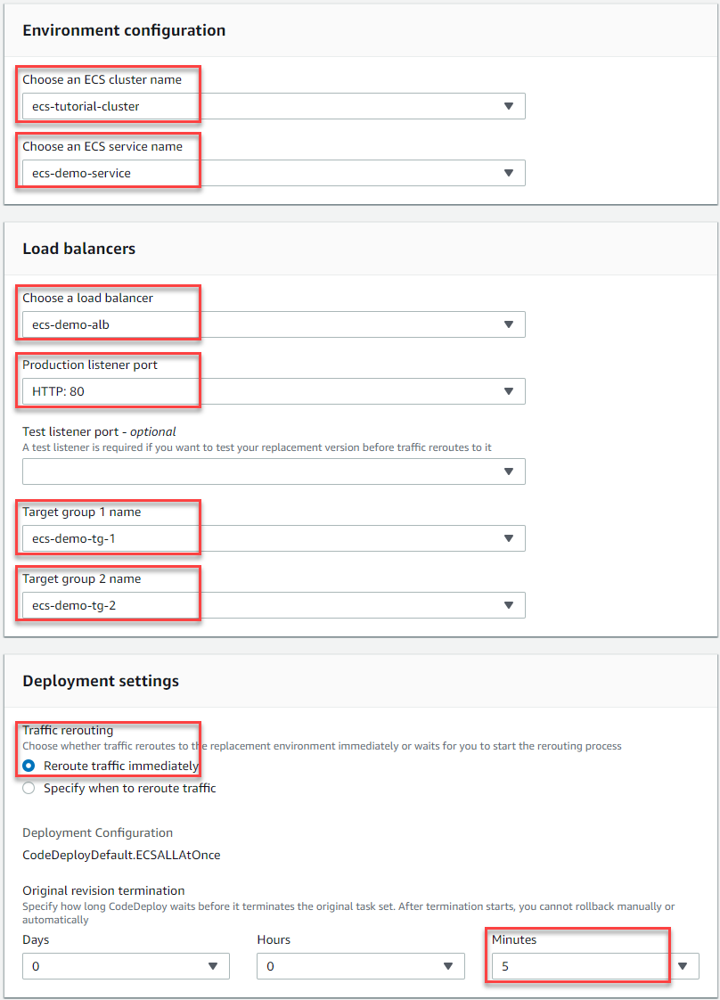
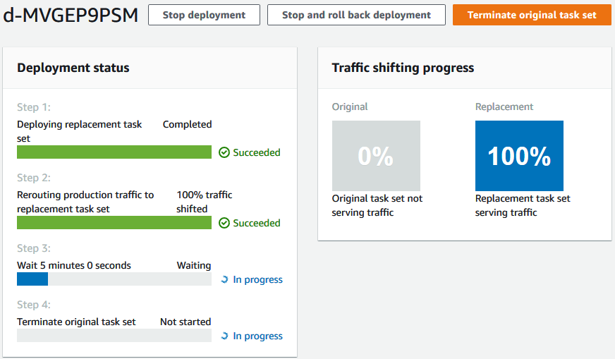

# Step 3: Use the CodeDeploy console to deploy your

application

In this section, you create a CodeDeploy application and deployment group to deploy your
updated application into Amazon ECS. During deployment, CodeDeploy shifts the production traffic for
your application to its new version in a new, replacement task set. To complete this step, you
need the following items:

- Your Amazon ECS cluster name.
- Your Amazon ECS service name.
- Your Application Load Balancer name.
- Your production listener port.
- Your target group names.
- The name of the S3 bucket you created.

###### To create a CodeDeploy application

1. Sign in to the AWS Management Console and open the CodeDeploy console at
   [https://console.aws.amazon.com/codedeploy/](https://console.aws.amazon.com/codedeploy/ "https://console.aws.amazon.com/codedeploy/").
2. Choose **Create application**.
3. In **Application name**, enter
   `ecs-demo-codedeploy-app`.
4. In **Compute platform**, choose **Amazon
   ECS**.
5. Choose **Create application**.

###### To create a CodeDeploy deployment group

1. On the **Deployment groups** tab of your application page, choose
   **Create deployment group**.
2. In **Deployment group name**, enter
   `ecs-demo-dg`.
3. In **Service role**, choose a service role that grants CodeDeploy access
   to Amazon ECS. For more information, see [Identity and access management for
   AWS CodeDeploy](security-iam.md "security-iam.md").
4. In **Environment configuration**, choose your Amazon ECS cluster name and
   service name.
5. From **Load balancers**, choose the name of the load balancer that
   serves traffic to your Amazon ECS service.
6. From **Production listener port**, choose the port and protocol for
   the listener that serves production traffic to your Amazon ECS service (for example,
   **HTTP: 80**). This tutorial does not include an optional test
   listener, so do not choose a port from **Test listener port**.
7. From **Target group 1 name** and **Target group 2
   name**, choose two different target groups to route traffic during your
   deployment. Make sure that these are the target groups you created for your load balancer.
   It does not matter which is used for target group 1 and which is used for target group
8.
9. Choose **Reroute traffic immediately**.
10. For **Original revision termination**, choose 0 days, 0 hours, and 5
    minutes. This lets you see your deployment complete faster than if you use the default (1
    hour).

 10. Choose **Create deployment group**.

###### To deploy your Amazon ECS application

1. From your deployment group console page, choose **Create
   deployment**.
2. For **Deployment group**, choose **ecs-demo-dg**.
3. For **Revision type**, choose **My application is stored in
   Amazon S3**. In **Revision location**, enter the name of your
   S3 bucket.
4. For **Revision file type**, choose **.json** or
   **.yaml**, as appropriate.
5. (Optional) In **Deployment description**, enter a description for
   your deployment.
6. Choose **Create deployment**.
7. In **Deployment status**, you can monitor your deployment. After
   100% of production traffic is routed to the replacement task set and before the
   five-minute wait time expires, you can choose **Terminate original task
   set** to immediately terminate the original task set. If you do not choose
   **Terminate original task set**, the original task set terminates after
   the five-minute wait time you specified expires.

