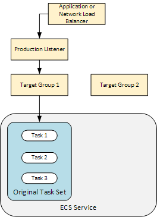
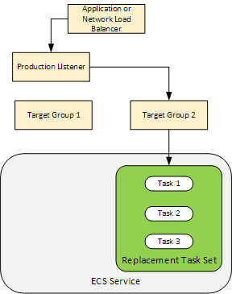

# Tutorial: Deploy an application into Amazon ECS

In this tutorial, you learn how to deploy an application into Amazon ECS using CodeDeploy. You start
with an application you already created and deployed into Amazon ECS. The first step is to update
your application by modifying its task definition file with a new tag. Next, you use CodeDeploy to
deploy the update. During deployment, CodeDeploy installs your update into a new, replacement task
set. Then, it shifts production traffic from the original version of your Amazon ECS application,
which is in its original task set, to the updated version in the replacement task set.

During an Amazon ECS deployment, CodeDeploy uses a load balancer that is configured with two target
groups and one production traffic listener. The following diagram shows how the load balancer,
production listener, target groups, and your Amazon ECS application are related before the deployment
starts. This tutorial uses an Application Load Balancer. You can also use a Network Load Balancer.

After a successful deployment, the production traffic listener serves traffic to your new
replacement task set and the original task set is terminated. The following diagram shows how
your resources are related after a successful deployment. For more information, see [What happens during an Amazon ECS
deployment](deployment-steps-ecs.md#deployment-steps-what-happens "deployment-steps-ecs.md#deployment-steps-what-happens").

For information about how to use the AWS CLI to deploy an application into Amazon ECS, see [Tutorial:
Creating a service using a blue/green deployment](../../../AmazonECS/latest/developerguide/create-blue-green.md "../../../AmazonECS/latest/developerguide/create-blue-green.md"). For information about how to use
CodePipeline to detect and automatically deploy changes to an Amazon ECS service with CodeDeploy, see [Tutorial: Create a pipeline with an Amazon ECR source and ECS-to-CodeDeploy deployment](../../../codepipeline/latest/userguide/tutorials-ecs-ecr-codedeploy.md "../../../codepipeline/latest/userguide/tutorials-ecs-ecr-codedeploy.md").

After you complete this tutorial, you can use the CodeDeploy application and deployment group you
created to add a deployment validation test in [Tutorial: Deploy an Amazon ECS service with a
validation test](tutorial-ecs-deployment-with-hooks.md "tutorial-ecs-deployment-with-hooks.md").

###### Topics

- [Prerequisites](tutorial-ecs-prereqs.md "tutorial-ecs-prereqs.md")
- [Step 1: Update your Amazon ECS
  application](tutorial-ecs-update-the-ecs-application.md "tutorial-ecs-update-the-ecs-application.md")
- [Step 2: Create the AppSpec file](tutorial-ecs-create-appspec-file.md "tutorial-ecs-create-appspec-file.md")
- [Step 3: Use the CodeDeploy console to deploy your
  application](tutorial-ecs-deployment-deploy.md "tutorial-ecs-deployment-deploy.md")
- [Step 4: Clean up](tutorial-ecs-clean-up.md "tutorial-ecs-clean-up.md")
