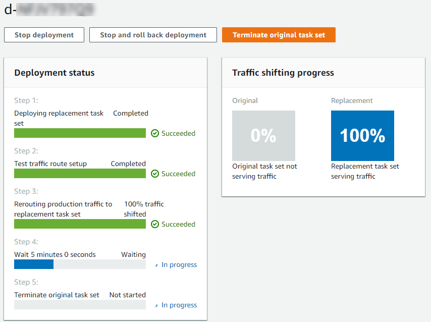

# Step 5: Use the CodeDeploy console to deploy

your Amazon ECS service

In this section, you update your deployment group by specifying the port for your test
listener. This is the listener you created in [Step 1: Create a test
listener](tutorial-ecs-with-hooks-create-second-listener.md "tutorial-ecs-with-hooks-create-second-listener.md") . During deployment, CodeDeploy
runs your validation test during the `AfterAllowTestTraffic` deployment lifecycle
hook using test traffic served to your replacement task set using the test listener. Your
validation test returns the result `Succeeded`, so the deployment proceeds with the
next deployment lifecycle event. In a real world scenario, your test function returns
`Succeeded` or `Failed`.

###### To add a test listener to your deployment group

1. Sign in to the AWS Management Console and open the CodeDeploy console at
   [https://console.aws.amazon.com/codedeploy/](https://console.aws.amazon.com/codedeploy/ "https://console.aws.amazon.com/codedeploy/").
2. From the navigation pane, choose **Applications**.
3. Choose the application you created in [Tutorial: Deploy an application into Amazon ECS](tutorial-ecs-deployment.md "tutorial-ecs-deployment.md"). If you used the suggested name, it is
   **ecs-demo-codedeploy-app**.
4. In **Deployment groups**, choose the deployment group you created in
   [Tutorial: Deploy an application into Amazon ECS](tutorial-ecs-deployment.md "tutorial-ecs-deployment.md"). If
   you used the suggested name, it is **ecs-demo-dg**.
5. Choose **Edit**.
6. From **Test listener port**, choose the port and protocol for the
   test listener you created earlier in this tutorial. This should be **HTTP:
   8080**.
7. Choose **Save changes**.

###### To deploy your Amazon ECS application

1. From your deployment group console page, choose **Create
   deployment**.
2. For **Deployment group**, choose **ecs-demo-dg**.
3. For **Revision type**, choose **My application is stored in
   Amazon S3**. In **Revision location**, enter the name of your
   S3 bucket and AppSpec file (for example,
   `s3://my-s3-bucket/appspec.json`).
4. For **Revision file type**, choose **.json** or
   **.yaml** as appropriate.
5. (Optional) In **Deployment description**, enter a description for
   your deployment.
6. Choose **Create deployment**.
   You can monitor your deployment in **Deployment status**.
   After 100% of production traffic is routed to the replacement task set, you
   can choose **Terminate original task set** to immediately terminate the
   original task set. If you do not choose **Terminate original task set**, the
   original task set terminates after the duration you specified when you created your deployment
   group.

