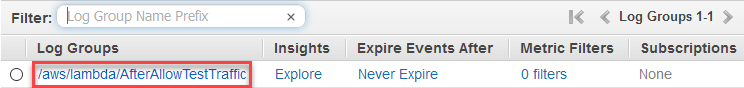
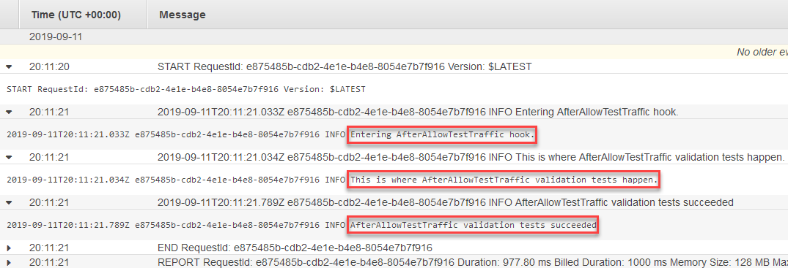

# Step 6: View your Lambda hook function

output in CloudWatch Logs

If your CodeDeploy deployment is successful, the validation tests in your Lambda hook fuctions
are successful, too. You can confirm this by looking at the log for the hook function in
CloudWatch Logs.

1. Open the CloudWatch console at
   [https://console.aws.amazon.com/cloudwatch/](https://console.aws.amazon.com/cloudwatch/ "https://console.aws.amazon.com/cloudwatch/").
2. From the navigation pane, choose **Logs**. You should see one new
   log group for the Lambda hook function you specified in your AppSpec file.

 3. Choose the new log group. This should be
**/aws/lambda/AfterAllowTestTrafficHook**. 4. Choose the log stream. If you see more than one log stream, choose the one with the
most recent date and time under **Last Event Time**. 5. Expand the log stream events to confirm your Lambda hook function wrote success
messages to the log. The following shows the `AfterAllowTraffic` Lambda hook
function was successful.

