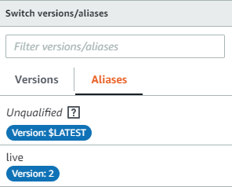
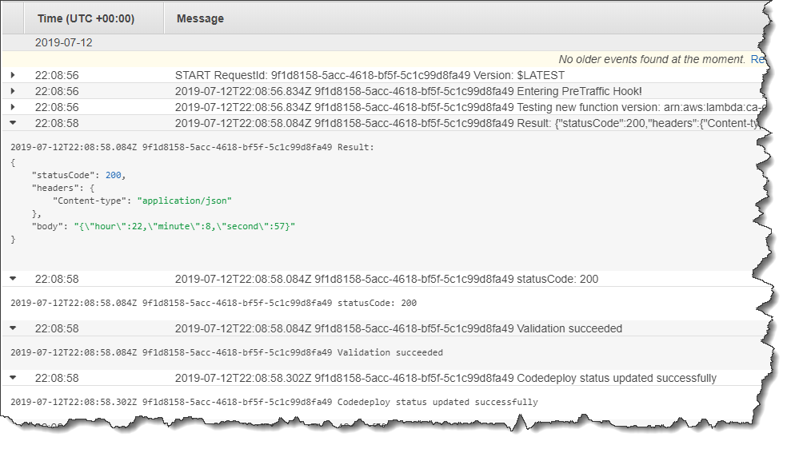

# Step 4: View your deployment

results

In this step, you view the results of your deployment. If your deployment succeeds, you
can confirm that your updated Lambda function receives production traffic. If your deployment
fails, you can use CloudWatch Logs to view the output of the validation tests in the Lambda function that
run during your deployment's lifecycle hoooks.

###### Topics

- [Test your deployed
  function](#tutorial-lambda-sam-deploy-test-deployed-function "#tutorial-lambda-sam-deploy-test-deployed-function")
- [View hook events in CloudWatch Logs](#tutorial-lambda-view-hook-events "#tutorial-lambda-view-hook-events")

## Test your deployed

function

The **sam deploy** command updates the
`my-date-time-app-myDateTimeFunction` Lambda function. The function version is
updated to 2 and added to the `live` alias.

###### To see the update in the Lambda console

1. Open the AWS Lambda console at
   [https://console.aws.amazon.com/lambda/](https://console.aws.amazon.com/lambda/ "https://console.aws.amazon.com/lambda/").
2. From the navigation pane, choose the
   `my-date-time-app-myDateTimeFunction` function. In the console, its name
   contains an identifier, so it looks like
   `my-date-time-app-myDateTimeFunction-123456ABCDEF`.
3. Choose **Qualifiers**, and then choose
   **Aliases**. After the deployment is complete (approximately 10
   minutes), for the `live` alias, you should see **Version:
   2**.

 4. In **Function code**, view the source code for your function. Your
changes should appear. 5. (Optional) You can use the test instructions in [Step 2: Update the Lambda
function](tutorial-lambda-sam-update-function.md "tutorial-lambda-sam-update-function.md") to test your updated function.
Create a new test event with the following payload, and then confirm the result contains
the current hour, minute, and second.

```
{
    "option": "time"
  }
```

To use the AWS CLI to test your updated function, run the following command, and then
open `out.txt` to confirm the result contains the current hour,
minute, and second.

```
aws lambda invoke --function `your-function-arn` --payload "{\"option\": \"time\"}" out.txt
```

###### Note

If you use the AWS CLI to test your function before the deployment is complete, you
might receive unexpected results. This is because CodeDeploy incrementally shifts 10
percent of traffic to the updated version every minute. During the deployment, some
traffic still points to the original version, so `aws lambda invoke` might
use the original version. After 10 minutes, the deployment is complete and all traffic
points to the new version of the function.

## View hook events in CloudWatch Logs

During the `BeforeAllowTraffic` hook, CodeDeploy executes your
`CodeDeployHook_beforeAllowTraffic` Lambda function. During the
`AfterAllowTraffic` hook, CodeDeploy executes your
`CodeDeployHook_afterAllowTraffic` Lambda function. Each function runs a
validation test that invokes the updated version of your function using the new
`time` parameter. If the update of your Lambda function is successful, the
`time` option does not cause an error and validation is successful. If the
function was not updated, the unrecognized parameter causes an error and validation fails.
These validation tests are for demonstration purposes only. You write your own tests to
validate your deployment. You can use the CloudWatch Logs console to view your validation tests.

###### To view your CodeDeploy hook events

1. Open the CloudWatch console at
   [https://console.aws.amazon.com/cloudwatch/](https://console.aws.amazon.com/cloudwatch/ "https://console.aws.amazon.com/cloudwatch/").
2. From the navigation pane, choose **Logs**.
3. From the list of log groups, choose
   **/aws/lambda/CodeDeployHook_beforeAllowTraffic** or
   **/aws/lambda/CodeDeployHook_afterAllowTraffic**.
4. Choose the log stream. You should see only one.
5. Expand the events to see their details.


