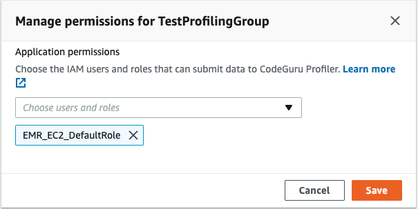
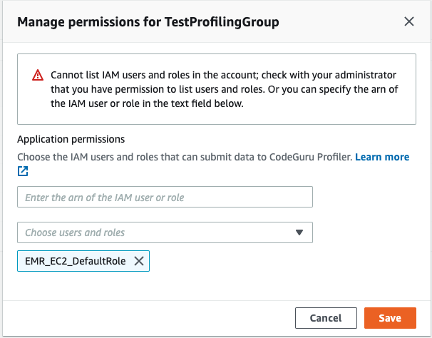

# Set up in the CodeGuru Profiler console

## Step 1: Sign up for AWS

When you sign up for Amazon Web Services (AWS), your AWS account is automatically signed up
for all services in AWS, including CodeGuru Profiler. You're charged only for the services that you
use.

If you have an AWS account already, move on to the next task. If you don't have an AWS
account, use the following procedure to create one.

###### To create an AWS account

1. Open [https://portal.aws.amazon.com/billing/signup](https://portal.aws.amazon.com/billing/signup "https://portal.aws.amazon.com/billing/signup").
2. Follow the online instructions.

Part of the sign-up procedure involves receiving a phone call or text message and entering
a verification code on the phone keypad.

When you sign up for an AWS account, an _AWS account root user_ is created. The root user has access to all AWS services
and resources in the account. As a security best practice, assign administrative access to a user, and use only the root user to perform [tasks that require root user access](../../../IAM/latest/UserGuide/id_root-user.md#root-user-tasks "../../../IAM/latest/UserGuide/id_root-user.md#root-user-tasks").

## Step 2: Create a CodeGuru Profiler profiling group

A profiling group can profile one or more applications. Data is aggregated and displayed
based on the whole profiling group.

For example, if you have a collection of microservices that handle restaurant
recommendations, you can collect profile data and identify performance issues across all
these microservices in a single profiling group named "Restaurant-Recommendations".

###### To create a profiling group from the CodeGuru Profiler console

1. Sign in to the AWS Management Console, and then open the CodeGuru Profiler console at
   [https://console.aws.amazon.com/codeguru/profiler](https://console.aws.amazon.com/codeguru/profiler "https://console.aws.amazon.com/codeguru/profiler").
2. In the navigation pane on the left, choose **Profiler**, and then
   choose **Profiling groups**.
3. On the **Profiling groups** page, choose **Create profiling
   group**.
4. Provide a **Name** for the new profiling group. Choose the compute
   platform that on which your applications are running. If your applications run on
   AWS Lambda, choose the **AWS Lambda** option. Choose
   **Other** if your applications run on a compute platform other than
   AWS Lambda, such as Amazon EC2, on-premises servers, or a different platform.
5. Choose **Create profiling group**.

## Step 3: Set permissions

The CodeGuru Profiler profiling agent needs permissions to write data to the profiling group.

You can add the necessary permissions by adding the following policy.

```
arn:aws:iam::aws:policy/AmazonCodeGuruProfilerAgentAccess
```

###### To set permissions for the new CodeGuru Profiler agent:

1. Start by choosing **Give access to users and roles**. Choose the
   IAM users and roles that can submit profiling data and configure the agent.
2. If your applications run on AWS Lambda, choose the role that your AWS Lambda function
   uses.
3. After you grant permissions for a user or role, you don't need to attach IAM
   policies for agent permissions.



Use `IAM:ListUsers` and `IAM:ListRoles` permissions to see
your users and roles. Otherwise, you can add a user or Amazon Resource Name (ARN) role. You'll see the
following message.



Alternatively, you can add a policy like the following to the role that your
application uses. For more information about roles, see [Modifying a role](../../../IAM/latest/UserGuide/id_roles_manage_modify.md "../../../IAM/latest/UserGuide/id_roles_manage_modify.md").

```
{
    "Version": "2012-10-17",
    "Statement": [
        {
            "Effect": "Allow",
            "Action": [
                "codeguru-profiler:ConfigureAgent",
                "codeguru-profiler:PostAgentProfile"
            ],
            "Resource": "arn:aws:codeguru-profiler:<region>:<accountID>:profilingGroup/<profilingGroupName>"
        }
    ]
}
```

If your application is running in a Region that CodeGuru Profiler doesn't support and if you have
the appropriate permissions, you can submit profiling data to one of the supported Regions.
For more information about using CodeGuru Profiler in a Region it doesn't support, see [Working with unsupported
Regions](working-with-unsupported-regions.md "working-with-unsupported-regions.md").

## Step 4: Start CodeGuru Profiler in your application

### Run your application with the profiling agent

Run your application with the CodeGuru Profiler profiling agent. You can use CodeGuru Profiler on your
Python or Java virtual machine (JVM)-based applications.

For your JVM-based application, you can either start the agent as a JVM agent, or
start it manually with a code change in your application. To start profiling your
application, see [Integrating with JVM](integrating-with-java.md "integrating-with-java.md").

To start profiling your Python application, see [Integrating
with Python](integrating-with-python.md "integrating-with-python.md").

### Enable data collection for the heap summary

visualization

The CodeGuru Profiler heap summary shows your application's heap usage over time. This feature is
available for JVM applications. For more information on the heap summary, see [Understanding the heap
summary](working-with-visualizations-heap-summary.md "working-with-visualizations-heap-summary.md").

Heap summary collection requires Java agent version 1.2.4 or
greater. Opt in to heap summary data collection by completing the onboarding method used
to enable the agent. The following are the onboarding methods from which you can
choose.

#### Command line (-javaagent)

Add `heapSummaryEnabled:true`. The following example shows how to enable
heap summary collection.

```
-javaagent:/path/to/codeguru-profiler-java-agent-standalone-1.2.4.jar="profilingGroupName:myProfilingGroup,heapSummaryEnabled:true"
```

#### Update your code

Set `.withHeapSummary` to `true`. The following is an example
of what your code might look like.

```
class MyClass {
    public static void main(String[] args) {
        Profiler.builder()
            .profilingGroupName("MyProfilingGroup")
            .withHeapSummary(true) // optional - to start without heap profiling set to false or remove line
            .build()
            .start();
        ...
    }
```

#### Environment variables

Set `AWS_CODEGURU_PROFILER_HEAP_SUMMARY_ENABLED` to
`true`.
