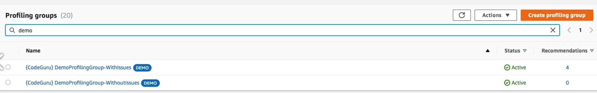
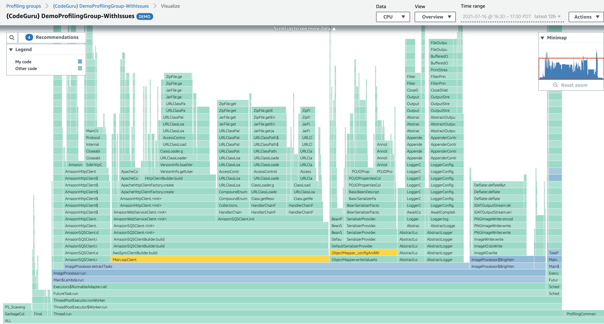

# Java sample application

This tutorial walks through the complete setup necessary to run Amazon CodeGuru Profiler within two
sample applications: one that features issues to generate CodeGuru Profiler recommendations and one that
does not. You can then view the resulting CodeGuru Profiler runtime data and recommendations.

To view the sample application, navigate to the [CodeGuru Profiler demo
application](https://github.com/aws-samples/aws-codeguru-profiler-demo-application "https://github.com/aws-samples/aws-codeguru-profiler-demo-application"). CodeGuru Profiler runs inside the sample application and collects and reports
profiling data about the application, which can be viewed from the CodeGuru Profiler console.

This tutorial’s sample application does some basic image processing, with some CPU-heavy
operations alongside some IO-heavy operations. It uses an Amazon Simple Storage Service bucket for cloud storage of
images and an Amazon Simple Queue Service queue to order the names of images to be processed. It consists
chiefly of two components which run in parallel, the task publisher and the image
processor:

`TaskPublisher` checks the S3 bucket for available images, and submits the name
of some of these images to the SQS queue.

`ImageProcessor` polls SQS for names of images to process. Processing an image
involves downloading it from S3, applying some image transforms (e.g. converting to
monochrome), and uploading the result back to S3.

When running `DemoApplication-WithIssues`, you see messages such as
`Expensive` exception and `Pointless` work being logged. This is
expected, and you can see how these issues appear on the CodeGuru Profiler console.

## Option 1: Quick demo

The results of this application are available to review within the CodeGuru console.
There is no need to run the code if you just want to see the CodeGuru Profiler output.

1. Sign in to the AWS Management Console, and then open the CodeGuru Profiler console at
   [https://console.aws.amazon.com/codeguru/profiler](https://console.aws.amazon.com/codeguru/profiler "https://console.aws.amazon.com/codeguru/profiler").
2. In the navigation pane on the left, choose **Profiler**, and then
   choose **Profiling groups**.
3. On the **Profiling groups** page, choose `{CodeGuru}
DemoProfilingGroup-WithIssues` and `{CodeGuru}
DemoProfilingGroup-WithoutIssues` to view runtime performance data and
   recommendations. To better understand the console, see step 4.



## Option 2: Complete demo

### Prerequisites

For this tutorial, you will need:

- The latest version of the AWS Command Line Interface. For more information, see [Installing, updating, and uninstalling the AWS Command Line Interface](../../../cli/latest/userguide/cli-chap-install.md "../../../cli/latest/userguide/cli-chap-install.md").
- Maven to build and run the code. For information on installing Maven, see [Welcome to Apache Maven](https://maven.apache.org/ "https://maven.apache.org/").
- The [sample
  application](https://github.com/aws-samples/aws-codeguru-profiler-demo-application "https://github.com/aws-samples/aws-codeguru-profiler-demo-application") cloned to your desired directory.

### Step 1: Create AWS resources

Set up the required components by running the following AWS commands in your
terminal.

1. Configure the AWS CLI.

When prompted, specify the AWS access key and AWS secret access key of the
IAM user that you will use with CodeGuru Profiler.

When prompted for the default Region name, specify the Region where you will
create the pipeline, such as `us-west-2`.

When prompted for the default output format, specify the .json.

```
aws configure
```

2. Create two profiling groups in CodeGuru Profiler, named
   `DemoApplication-WithIssues` and
   `DemoApplication-WithoutIssues`.

```
aws codeguruprofiler create-profiling-group --profiling-group-name DemoApplication-WithIssues
aws codeguruprofiler create-profiling-group --profiling-group-name DemoApplication-WithoutIssues
```

3. Create an Amazon SQS queue.

```
aws sqs create-queue --queue-name DemoApplicationQueue
```

4. Create an Amazon S3 bucket. Replace the YOUR-BUCKET with your desired bucket
   name.

```
aws s3 mb s3://demo-application-test-bucket-YOUR-BUCKET
```

5. Provision an IAM role. For information, see [Creating IAM roles](../../../IAM/latest/UserGuide/id_roles_create.md "../../../IAM/latest/UserGuide/id_roles_create.md") or use one that is associated with your AWS
   account.

Attach the `AmazonSQSFullAccess, AmazonS3FullAccess,` and
`AmazonCodeGuruProfilerFullAccess` AWS managed policies to the IAM
role.

### Step 2: Run a sample application

Follow these steps to run one of the sample applications. You select which sample
application to run in step 2. To run the other sample application, repeat the following
steps, selecting the other sample application in step 2.

1. Export the Amazon SQS URL, the S3; bucket name, and the target Region.

Remember to replace `YOUR-AWS-REGION`, `YOUR-ACCOUNT-ID`,
and `YOUR-BUCKET`. `YOUR-AWS-REGION` should be the Region you
specified in the AWS CLI configuration. `YOUR-ACCOUNT-ID` should be your
AWS account ID. `YOUR-BUCKET` should be the bucket name you specified
during Amazon S3 bucket creation.

```
export DEMO_APP_SQS_URL=https://sqs.YOUR-AWS-REGION.amazonaws.com/YOUR-ACCOUNT-ID/DemoApplicationQueue
export DEMO_APP_BUCKET_NAME=demo-application-test-bucket-1092734-YOUR-BUCKET
export AWS_CODEGURU_TARGET_REGION=YOUR-AWS-REGION
```

2. Export the CodeGuru Profiler profiling group

To run the sample application with issues, run the following command.

```
export AWS_CODEGURU_PROFILER_GROUP_NAME=DemoApplication-WithIssues
```

To run the sample application without issues, run the following command.

```
export AWS_CODEGURU_PROFILER_GROUP_NAME=DemoApplication-WithoutIssues
```

3. Generate the sample application .jar file.

```
1. mvn clean install
```

4. Run the demo.

```
java -javaagent:codeguru-profiler-java-agent-standalone-1.2.4.jar \
  -jar target/DemoApplication-1.0-jar-with-dependencies.jar with-issues
```

5. Verify that your profiling group is running.

Navigate to the [CodeGuru Profiler console](https://console.aws.amazon.com/codeguru/profiler/ "https://console.aws.amazon.com/codeguru/profiler/").

Choose **Profiling groups**.

The `DemoApplication-WithIssues` profiling group should have the status
**Pending**. You may need to wait a few minutes for this to update.
After running the demo for around 15 minutes, the group should have the status
**Profiling**.

Run the demo for a few hours to generate ample data for recommendations.

### Step 3: Understanding the console

The CodeGuru Profiler console is where you can view the data that Profiler has gathered from
running the application.

1. Navigate to the [CodeGuru Profiler console](https://console.aws.amazon.com/codeguru/profiler/ "https://console.aws.amazon.com/codeguru/profiler/").
2. Choose **Profiling groups**.
3. Choose the `DemoApplication-WithIssues` or the
   `DemoApplication-WithoutIssues` profiling group

The following sections are displayed, along with options for other visualizations or a
full recommendations report.

- **Profiling group status** displays the status of the profiling
  group and metrics from data collected in the past 12 hours.
- **CPU summary** displays the amount of system CPU capacity that
  the application consumes. You can choose **Visualize CPU** to view
  the flame graph.



- **Latency summary** displays the amount of time the application’s
  threads spend in the **Blocked**, **Waiting**, and
  **Timed Waiting** thread states.
- **Heap usage** displays how much of your application's maximum
  heap capacity is consumed by the application.
- **Anomalies** display any deviations from trends that CodeGuru Profiler
  detects.
- **Recommendations** display suggestions to optimize the
  application.

The `DemoApplication-WithIssues` generates recommendations, while the
`DemoApplication-WithoutIssues` does not. These recommendations have to do
with the purposefully inefficient lines of code that unnecessarily recreate loggers, SDK
service clients, and Jackson Object Mappers. You can choose **View
report** next to the **Recommendations** section for more
details on these inefficiencies, including their location, estimated costs, and suggested
resolution steps.

The average heap usage in the `DemoApplication-WithIssues` is significantly
higher, indicating that the application requires significantly more memory.

### Cleanup

Upon completion of this tutorial, clean up the resources created.

Delete the profiling groups by following the procedure in [Deleting a profiling group](working-with-profiling-groups-delete.md "working-with-profiling-groups-delete.md").

Delete the Amazon S3 bucket, replacing `YOUR-BUCKET` with your specified bucket
name. Note that all objects stored in the bucket will be deleted as well.

```
aws s3 rb s3://demo-application-test-bucket-1092734-YOUR-BUCKET --force
```

Delete the Amazon SQS queue. Note that this will delete the queue itself, not just the
messages in the queue.

```
aws sqs delete-queue
```
