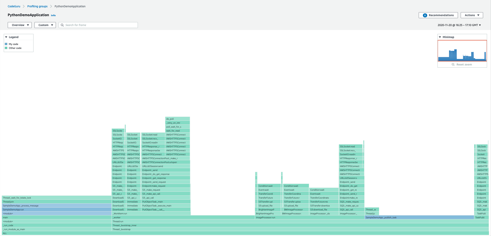

# Python sample application

In this tutorial, you’ll walk through the complete set up necessary to run Amazon CodeGuru Profiler
within a sample application. You’ll then be able to view the profiling group's resulting
runtime data.

To view the sample application, navigate to the [CodeGuru Profiler Python demo application](https://github.com/aws-samples/aws-codeguru-profiler-python-demo-application/tree/main/sample-demo-app "https://github.com/aws-samples/aws-codeguru-profiler-python-demo-application/tree/main/sample-demo-app"). CodeGuru Profiler runs inside the sample application and
collects and reports profiling data about the application, which can be viewed from the AWS
console.

This tutorial’s sample application does some basic image processing, with some CPU-heavy
operations alongside some IO-heavy operations. It uses an Amazon Simple Storage Service bucket for cloud storage of
images and an Amazon Simple Queue Service queue to order the names of images to be processed. It consists
chiefly of two components which run in parallel, the task publisher and the image
processor:

`TaskPublisher` checks the S3 bucket for available images, and submits the name
of some of these images to the SQS queue.

`ImageProcessor` polls SQS for names of images to process. Processing an image
involves downloading it from S3, applying some image transforms (e.g. converting to
monochrome), and uploading the result back to S3.

## Prerequisites

For this tutorial, you will need:

- The latest version of the AWS Command Line Interface. For more information, see [Installing, updating, and uninstalling the AWS Command Line Interface](../../../cli/latest/userguide/cli-chap-install.md "../../../cli/latest/userguide/cli-chap-install.md").
- Python 3.6 or later.
- The [sample application](https://github.com/aws-samples/aws-codeguru-profiler-python-demo-application/tree/main/sample-demo-app "https://github.com/aws-samples/aws-codeguru-profiler-python-demo-application/tree/main/sample-demo-app") cloned to your desired directory.

## Step 1: Create a profiling group

Set up the required components by running the following AWS commands in your
terminal.

1. Configure the AWS CLI.

When prompted, specify the AWS access key and AWS secret access key of the IAM user
that you will use with CodeGuru Profiler.

When prompted for the default Region name, specify the Region where you will create
the pipeline, such as `us-west-2`.

When prompted for the default output format, specify the .json.

```
aws configure
```

2. Create a profiling group in CodeGuru Profiler, named `PythonDemoApplication`.

```
aws codeguruprofiler create-profiling-group --profiling-group-name PythonDemoApplication
```

3. Create an Amazon SQS queue.

```
aws sqs create-queue --queue-name DemoApplicationQueue
```

4. Create an Amazon S3 bucket. Replace the YOUR-BUCKET with your desired bucket name.

```
aws s3 mb s3://python-demo-application-test-bucket-YOUR-BUCKET
```

5. Provision an IAM role. For information, see [Creating IAM roles](../../../IAM/latest/UserGuide/id_roles_create.md "../../../IAM/latest/UserGuide/id_roles_create.md") or use one that is associated with your AWS
   account.

Attach the `AmazonSQSFullAccess, AmazonS3FullAccess,` and
`AmazonCodeGuruProfilerFullAccess` AWS managed policies to the IAM
role. 6. Export the Amazon SQS URL, Amazon S3 bucket name, and the target Region.

Remember to replace YOUR-AWS-REGION, YOUR-ACCOUNT-ID, and YOUR-BUCKET .
YOUR-AWS-REGION should be the Region you specified in the AWS CLI configuration.
YOUR-ACCOUNT-ID should be your AWS account ID. YOUR-BUCKET should be the bucket name
you specified during Amazon S3 bucket creation.

```
export DEMO_APP_SQS_URL=https://sqs.YOUR-AWS-REGION.amazonaws.com/YOUR-ACCOUNT-ID/DemoApplicationQueue
export DEMO_APP_BUCKET_NAME=python-demo-application-test-bucket-YOUR-BUCKET
export AWS_CODEGURU_TARGET_REGION=YOUR-AWS-REGION
```

## Step 2: Set up the virtual environment

Create the virtual environment and install necessary resources by running the following
commands in your terminal.

1. Create and activate the virtual environment.

```
python3 -m venv ./venv
source venv/bin/activate
```

2. Install boto3 and skimage. Installing scikit-image with Python 3.9 may cause
   failures. For more information, see [Installing
   schikit-learn via pip](https://github.com/scikit-image/scikit-image/issues/5060 "https://github.com/scikit-image/scikit-image/issues/5060").

```
pip3 install boto3 scikit-image
```

3. Install the CodeGuru Profiler agent.

```
pip3 install codeguru_profiler_agent
```

## Step 3: Run the application

Run the following command in your terminal to start the application. Then, verify that
the application has begun profiling.

1. Run the sample application with the CodeGuru Profiler Python Agent.

Note that when running the demo application for the first time, it is expected to
see error messages such as No messages exist in SQS queue at the moment, retry later.
and Failed to list images in demo-application-test-bucket-1092734-YOUR-BUCKET under
input-images/ printing to the terminal. Our demo application will handle image upload
and SQS message publication after a few seconds.

```
python3 -m codeguru_profiler_agent -p PythonDemoApplication aws_python_sample_application/main.py
```

2. Verify that your profiling group is running.

Navigate to the [CodeGuru Profiler console](https://console.aws.amazon.com/codeguru/profiler/ "https://console.aws.amazon.com/codeguru/profiler/").

Choose **Profiling groups**.

The PythonDemoApplication group should have status "Pending". You may need to wait a
few minutes for this to update. After running the demo for approximately 15 to 20
minutes, the group should have status "Profiling", and you can view runtime data.

## Step 4: Understanding the console

The CodeGuru Profiler console is where you can view the data that Profiler has gathered from
running the application.

1. Navigate to the [CodeGuru Profiler console](https://console.aws.amazon.com/codeguru/profiler/ "https://console.aws.amazon.com/codeguru/profiler/").
2. Choose **Profiling groups**.
3. Choose the `PythonDemoApplication` group.

The following sections are displayed, along with options for other visualizations or a
full recommendations report.

- **Profiling group status** displays the status of the profiling
  group and metrics from data collected in the past 12 hours.
- **CPU summary** displays the amount of system CPU capacity that the
  application consumes. You can choose **Visualize CPU** to view the
  flame graph.



- **Latency summary** displays the amount of time the application’s
  threads spend in the Blocked, Waiting, and Timed Waiting thread states.
- **Heap usage** displays how much of your application's maximum heap
  capacity is consumed by the application.
- **Anomalies** display any deviations from trends that CodeGuru Profiler
  detects.
- **Recommendations** display suggestions to optimize the
  application.

## Cleanup

Upon completion of this tutorial, clean up the resources created.

Delete the profiling groups by following the procedure in [Deleting a profiling group](working-with-profiling-groups-delete.md "working-with-profiling-groups-delete.md").

Delete the Amazon S3 bucket, replacing `YOUR-BUCKET` with your specified bucket
name. Note that all objects stored in the bucket will be deleted as well.

```
aws s3 rb s3://python-demo-application-test-bucket-YOUR-BUCKET --force
```

Delete the Amazon SQS queue. Note that this will delete the queue itself, not just the
messages in the queue.

```
aws sqs delete-queue
```
