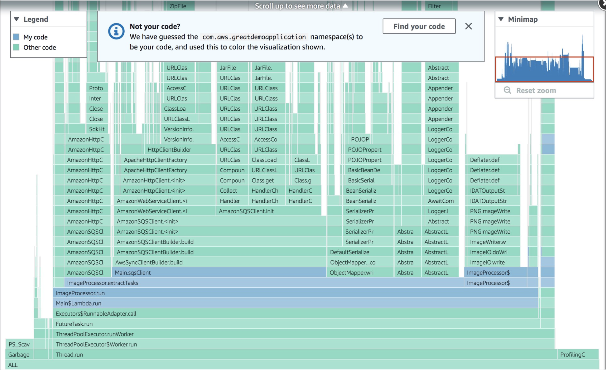

# Choosing my code in

visualizations

CodeGuru Profiler differentiates your code in the overview visualization, so you can quickly
identify the methods you are working on.

The blue portion of the flame graph highlights your code. The green portion of the graph
highlights other code that your application uses, such as libraries and frameworks.

You can change the coloring by manually selecting which package
name
you want CodeGuru Profiler to identify as your code.

###### To view your code

1. Choose **Actions**.
2. Choose **Select my code**.
3. Search for the profile namespace that you want to view. The namespaces are sorted
   based on how much of the overall profiling data they represent.
