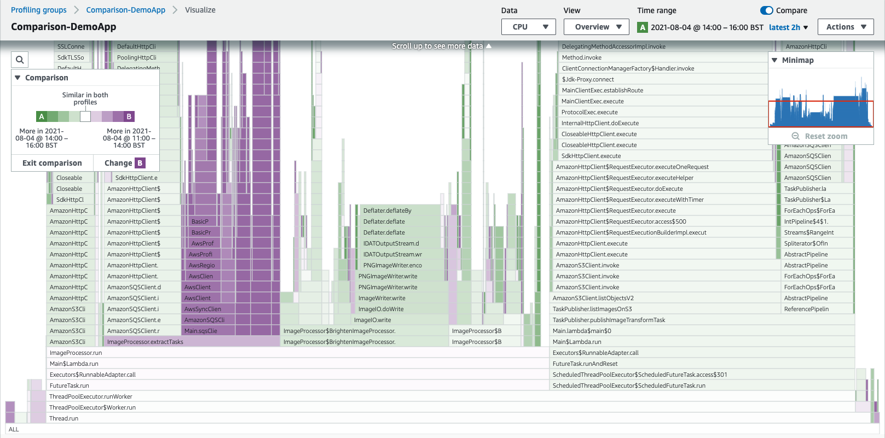
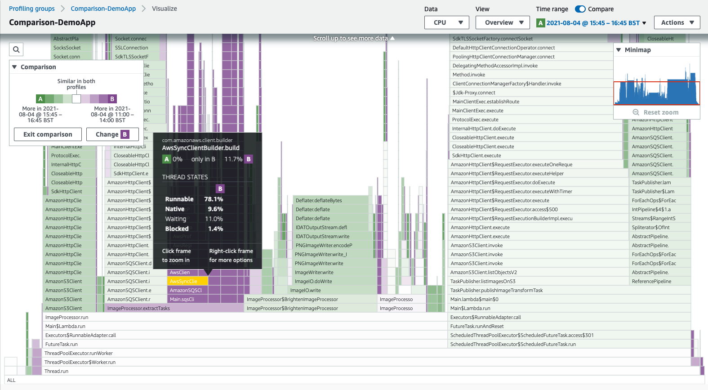

# Comparing two time ranges

The CodeGuru Profiler **Compare** option allows you to view differences between two
different time ranges of the same profiling group. It can be used for overview, hotspots, and
inspect visualizations. This feature is not available for the heap summary
visualization.

###### To enable the compare visualization

1. Choose **Compare**.
2. Set **B** to be the time to which you want to compare to your current
   visualization.
3. Choose **Apply**.
   If you'd like to change the time range comparison, choose **Change
   B**.

These comparisons are visualized by color. Functions that take more time in one time range
appear more prominently as the color of the corresponding time range. Less saturated colors
indicate a smaller difference between the two time ranges. A very light or white color
indicates little to no difference between the time ranges.

In this example, the two time ranges are A (green) and B (purple). The visualization
allows you to pinpoint the areas in darker violet that indicate the function took more time in
time range B. Similarly, the darker green indicates functions spending more time in time range
A. The more faded sections of the visualization indicate a similar amount of time was taken by
the function in both time ranges.

## Understanding the comparison

You can see more information about a function if you pause over it. In the following
example, you can see the CPU cost reduced betwen the first time range and the second.

###### Note

It's normal to see changes in your profiling data without any code changes. The
profiling data may vary depending on when and how your application runs. Keep in mind
your application characteristics when selecting a comparison time range. For example, you
might find interesting profiling data if you compare data from your current time range
with the data from a week earlier.

