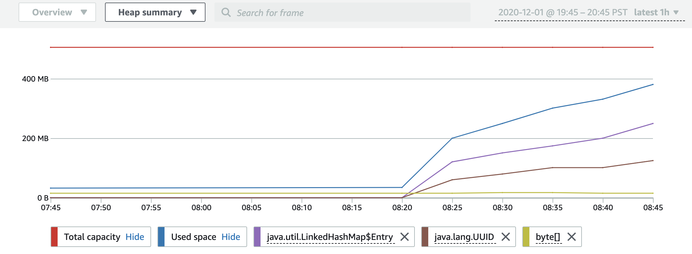

# Understanding the heap

summary

The **Heap summary** visualization shows your application’s heap usage
over time. You can change the time period shown using the time range selector in the
top-right. For information on enabling the heap summary data collection feature, see [Step 4: Start CodeGuru Profiler in your application](setting-up-long.md#setting-up-step-4 "setting-up-long.md#setting-up-step-4").

To view your application's heap summary visualization, select your profiling group in the [CodeGuru Profiler console](https://console.aws.amazon.com/codeguru/profiler/ "https://console.aws.amazon.com/codeguru/profiler/"), navigate to
the **Heap usage** panel, and select **Visualize
heap**.

## Total capacity

This shows the maximum heap size configured for the JVM. If your application’s used
space reaches this value then you may run out of memory. This value is equal to your JVM’s
Xmx value (if configured).

## Used space

This shows how much heap space your application requires to store all objects required
in memory after a garbage collection cycle. If this value continuously grows over time until
it reaches total capacity, then that could be an indication of a memory leak. If this value
is very low compared to total capacity, then you may be able to save money by reducing your
system’s memory.

## Heap summary table

The **Heap summary** table shows information about the object types
consuming the most heap space in your application. The size of each type only accounts for
the shallow memory requirement of that type, and does not include the size of objects
referenced by objects of that type. Values are averaged across all hosts reporting data at
the same time.

Only object types that consume more than 0.5% (by default) of your heap’s total capacity
across all objects are detected. Object types with consumption below that threshold are
counted as part of the used capacity value, and are not shown individually in the
table.

Object types that are below that threshold for at least one data point are shown with an
**Incomplete data** badge. The values shown are only averages of the data
available, and do not include time periods during which the object type size was lower than
the 0.5% capacity threshold.

###### Object types

- The **Average usage by type** shows how much heap space your
  application requires to store all objects required in memory after a garbage collection
  cycle. If this value continuously grows over time until it reaches total capacity, it
  could indicate a memory leak. If this value is very low compared to total capacity, then
  you may be able to save money by reducing your system’s memory.
- The **Average number of objects** indicates the average number of
  objects of this type on the heap during the time period.
- Use the **my code** namespace (if configured) to categorize the
  type into one of several categories. The **my code** namespace can be
  configured in the **Actions** dropdown list at the top of the page. The
  table of object types can be filtered based on this code type.
