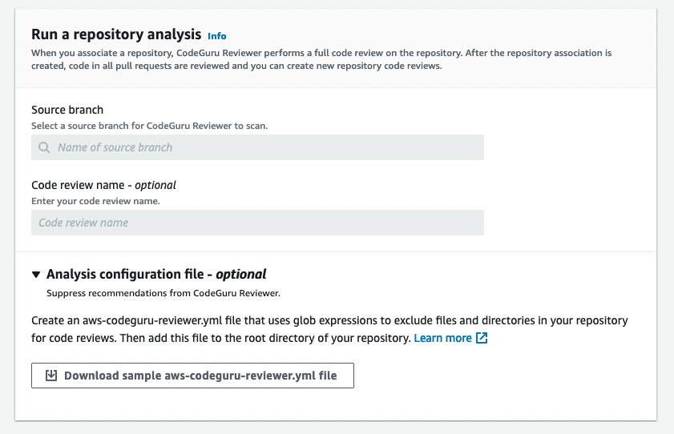

Starting November 7, 2025, you will not be able to create new repository associations in Amazon CodeGuru Reviewer. If you would like to use the service, create repository associations prior to November 7, 2025. To learn about services with capabilities similar to CodeGuru Reviewer, see [Amazon CodeGuru Reviewer availability change](codeguru-reviewer-availability-change.md "codeguru-reviewer-availability-change.md").

# Create an AWS CodeCommit repository association in

Amazon CodeGuru Reviewer

You can create an AWS CodeCommit repository association using the Amazon CodeGuru Reviewer console, the
AWS CodeCommit console, the AWS CLI, or the CodeGuru Reviewer SDK. Before you create a CodeCommit repository
association, you must have a CodeCommit repository in the same AWS account and Region in which
you want your CodeGuru Reviewer code reviews. For more information, see [Create an AWS CodeCommit
repository](../../../codecommit/latest/userguide/how-to-create-repository.md "../../../codecommit/latest/userguide/how-to-create-repository.md") in the _AWS CodeCommit User Guide_.

###### Topics

- [Create a CodeCommit repository
  association (CodeGuru Reviewer console)](#create-codecommit-association-console "#create-codecommit-association-console")
- [Create a CodeCommit repository
  association (CodeCommit console)](#create-codecommit-association-other-console "#create-codecommit-association-other-console")
- [Create a CodeCommit repository association
  (AWS CLI)](#create-codecommit-association-cli "#create-codecommit-association-cli")
- [Create a CodeCommit repository association
  (AWS SDKs)](#create-codecommit-association-sdk "#create-codecommit-association-sdk")

## Create a CodeCommit repository

association (CodeGuru Reviewer console)

###### To create a CodeCommit repository association

1.  Open the Amazon CodeGuru Reviewer console at
    [https://console.aws.amazon.com/codeguru/reviewer/](https://console.aws.amazon.com/codeguru/reviewer/ "https://console.aws.amazon.com/codeguru/reviewer/").
2.  In the navigation pane, choose **Repositories**.
3.  Choose **Associate repository and run analysis**.
4.  Choose **AWS CodeCommit**.
5.  From **Repository location**, choose the name of your CodeCommit
    repository that contains the source code you want CodeGuru Reviewer to analyze.
6.  (Optional) Expand **Encryption key - optional** to use
    your own AWS Key Management Service key (KMS key) to encrypt your associated repository. For more information,
    see [Encrypting a repository association in
    Amazon CodeGuru Reviewer](encrypt-repository-association.md "encrypt-repository-association.md").
    1. Select **Customize encryption settings (advanced)**.
    2. Do one of the following:
       - If you already have a KMS key that you manage, enter its Amazon Resource Name (ARN). For information
         about finding the ARN of your key using the console, see
         [Finding the
         key ID and key ARN](../../../kms/latest/developerguide/find-cmk-id-arn.md "../../../kms/latest/developerguide/find-cmk-id-arn.md") in the _AWS Key Management Service Developer Guide_.
       - If you want to create a KMS key, choose **Create an AWS KMS key** and follow
         the steps in the AWS KMS console. For more information, see
         [Creating keys](../../../kms/latest/developerguide/create-keys.md "../../../kms/latest/developerguide/create-keys.md") in the
         _AWS Key Management Service Developer Guide_.

7.  In **Run a repository analysis**, specify information for your associated repository's
    first full scan. This scan generates your repository's initial code review. For more information, see
    [Get recommendations using full repository
    analysis](create-code-reviews.md#get-repository-scan "create-code-reviews.md#get-repository-scan").

        1. From **Source branch**, choose the branch to use.
        2. (Optional) In **Code review name**, type a name for your code review.
        3. (Optional) Expand **Analysis configuration file - optional** to download a sample `aws-codeguru-reviewer.yml` file to use as a template. Modify the file and upload it to the root directory of your repository. For more information about the analysis configuration file, see [Suppress
         recommendations](recommendation-suppression.md "recommendation-suppression.md").

    

8.  (Optional) Expand **Tags** to add one or more tags to your repository association.
    For more information, see [Tagging a repository association in
    Amazon CodeGuru Reviewer](tag-repository-association.md "tag-repository-association.md").
    1. Choose **Add new tag**.
    2. In **Key**, enter a name for the tag. You can add an optional
       value for the tag in **Value**.
    3. (Optional) To add another tag, choose **Add new tag**.

9.  Choose **Associate repository and run analysis**. On the
    **Repositories** page, the **Status** is
    **Associating**. When the association is complete, the status
    changes to **Associated** and a full repository analysis begins.
    Refresh the page to check for the status change.

## Create a CodeCommit repository

association (CodeCommit console)

You can [connect to CodeGuru Reviewer directly from the CodeCommit console.](../../../codecommit/latest/userguide/how-to-amazon-codeguru-reviewer.md#how-to-amazon-codeguru-reviewer-associate "../../../codecommit/latest/userguide/how-to-amazon-codeguru-reviewer.md#how-to-amazon-codeguru-reviewer-associate") This allows you to create a
CodeCommit repository association with CodeGuru Reviewer without leaving your CodeCommit repository context.

## Create a CodeCommit repository association

(AWS CLI)

For information about using the AWS CLI with CodeGuru Reviewer, see the [CodeGuru Reviewer section of the AWS CLI Command Reference](https://awscli.amazonaws.com/v2/documentation/api/latest/reference/codeguru-reviewer/index.html "https://awscli.amazonaws.com/v2/documentation/api/latest/reference/codeguru-reviewer/index.html").

###### To create a CodeCommit repository association

1. Make sure that you have configured the AWS CLI with the AWS Region in which you
   want to create your code reviews and in which your CodeCommit repository exists. To verify
   the Region, run the following command at the command line or terminal and review the
   information for the default name.

```
aws configure
```

The default Region name must match the AWS Region for the repository in CodeCommit. 2. Run the **associate-repository** command specifying the name of the
CodeCommit repository you want to associate.

```
aws codeguru-reviewer associate-repository --repository CodeCommit={Name=`my-codecommit-repo`}
```

3. If successful, this command outputs a [`RepositoryAssociation`](../reviewer-api/API_RepositoryAssociation.md "../reviewer-api/API_RepositoryAssociation.md") object.

```
{
    "RepositoryAssociation": {
        "AssociationId": "repository-association-uuid",
        "Name": "`my-codecommit-repo`",
        "LastUpdatedTimeStamp": 1595634764.029,
        "ProviderType": "CodeCommit",
        "CreatedTimeStamp": 1595634764.029,
        "Owner": "123456789012",
        "State": "Associating",
        "StateReason": "Pending Repository Association",
        "AssociationArn": "arn:aws:codeguru-reviewer:us-west-2:123456789012:association:repository-association-uuid",
    }
}
```

4. When the **associate-repository** command succeeds, the status in
   the returned output is **Associating**. When the association is
   complete, the status changes to **Associated** and you can create a
   pull request or a full repository analysis to get recommendations. You can check your
   repository association's status using the `describe-repository` command
   with its Amazon Resource Name (ARN).

```
aws codeguru-reviewer describe-repository-association --association-arn arn:aws:codeguru-reviewer:us-west-2:123456789012:association:repository-association-uuid

```

5. If successful, this command outputs a [`RepositoryAssociation`](../reviewer-api/API_RepositoryAssociation.md "../reviewer-api/API_RepositoryAssociation.md") object which shows its status.

```
{
    "RepositoryAssociation": {
        "AssociationId": "repository-association-uuid",
        "Name": "`my-codecommit-repo`",
        "LastUpdatedTimeStamp": 1595634764.029,
        "ProviderType": "CodeCommit",
        "CreatedTimeStamp": 1595634764.029,
        "Owner": "123456789012",
        "State": "Associated",
        "StateReason": ""Pull Request Notification configuration successful",
        "AssociationArn": "arn:aws:codeguru-reviewer:us-west-2:123456789012:association:repository-association-uuid"
    }
}
```

## Create a CodeCommit repository association

(AWS SDKs)

To create a CodeCommit repository association with the AWS SDKs, use the
`AssociateRepository` API. For more information, see [AssociateRepository](../reviewer-api/API_AssociateRepository.md "../reviewer-api/API_AssociateRepository.md") in the _Amazon CodeGuru Reviewer API Reference_.
