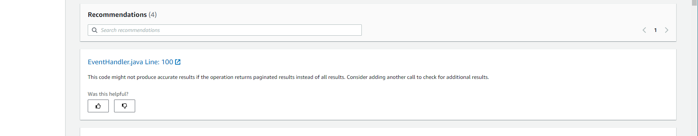

Starting November 7, 2025, you will not be able to create new repository associations in Amazon CodeGuru Reviewer. If you would like to use the service, create repository associations prior to November 7, 2025. To learn about services with capabilities similar to CodeGuru Reviewer, see [Amazon CodeGuru Reviewer availability change](codeguru-reviewer-availability-change.md "codeguru-reviewer-availability-change.md").

# View recommendations and provide

feedback

After you access the detailed code review page by choosing the name of the code review
from the **Code reviews** page, you can view the recommendations from the
code review directly in the console. To leave feedback on a code review in the console, do the
following:

1. Navigate to the **Code reviews** page in the CodeGuru Reviewer console.
2. Choose the name of the code review from the **Code reviews** page. A
   detailed code review page opens.
3. In the **Recommendations** section, choose the thumbs-up or
   thumbs-down icon for a recommendation to indicate whether it was helpful or not.
   Providing feedback can improve the quality of recommendations Amazon CodeGuru Reviewer provides for your
   code, making CodeGuru Reviewer increasingly effective in later analyses.

You can also view recommendations and provide feedback in incremental code reviews
directly in your repository source provider, or by using the CLI. For more information, see
[Step 4: Provide feedback](provide-feedback.md "provide-feedback.md").

Your feedback is used to improve CodeGuru Reviewer through model-tuning efforts that will help make
CodeGuru Reviewer recommendations more useful to you and others.
