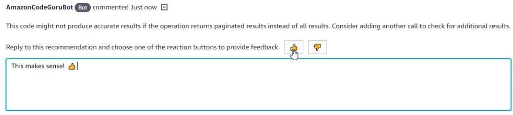

Starting November 7, 2025, you will not be able to create new repository associations in Amazon CodeGuru Reviewer. If you would like to use the service, create repository associations prior to November 7, 2025. To learn about services with capabilities similar to CodeGuru Reviewer, see [Amazon CodeGuru Reviewer availability change](codeguru-reviewer-availability-change.md "codeguru-reviewer-availability-change.md").

# Step 4: Provide feedback

CodeGuru Reviewer is based on program analysis and machine learning models, so it's constantly
improving. To assist in the machine learning process and enhance the experience with CodeGuru Reviewer,
you can provide feedback on the recommendations in the **Code reviews** page
on the CodeGuru Reviewer console. You can also provide feedback directly in the pull requests to indicate
whether they were helpful to you.

Your feedback and comments are shared with CodeGuru Reviewer. This can help CodeGuru Reviewer to improve its
models and become more helpful to you and others in the future. When you provide feedback,
your code is not shared. For more information, see [Captured data in CodeGuru Reviewer](data-protection.md#data-captured "data-protection.md#data-captured").

###### Note

The source code reviewed by CodeGuru Reviewer is not stored. For more information, see [Captured data in CodeGuru Reviewer](data-protection.md#data-captured "data-protection.md#data-captured").

###### Topics

- [Provide feedback using the CodeGuru Reviewer
  console](#provide-feedback-in-console "#provide-feedback-in-console")
- [Provide feedback using pull request
  comments](#provide-feedback-in-pull-requests "#provide-feedback-in-pull-requests")
- [Provide feedback using the CLI](#provide-feedback-cli "#provide-feedback-cli")

## Provide feedback using the CodeGuru Reviewer

console

You can provide feedback for recommendations on incremental code reviews or full
repository analysis code reviews [using the
**Code reviews** page](give-feedback-from-code-review-details.md "give-feedback-from-code-review-details.md") of the CodeGuru Reviewer console. Choose the name of
a code review to view details and recommendations from that code review. Then choose the
thumbs-up or thumbs-down icon under each recommendation to indicate whether the
recommendation was helpful.

## Provide feedback using pull request

comments

You can also provide feedback for incremental code reviews by replying to comments in
pull requests, without leaving your repository context. In AWS CodeCommit you can view the
recommendations on the **Activity** or **Changes** tab. A
thumbs-up or thumbs-down icon is provided next to comments made by CodeGuru Reviewer. Choose a
thumbs-up icon if the recommendation was helpful and a thumbs-down icon if it wasn't. In
other repository source providers, you can reply to a comment made by CodeGuru Reviewer, and include
either a thumbs-up or thumbs-down emoji in your comment to indicate whether it was helpful
or not. For more information, see [Using emoji](https://docs.github.com/en/github/writing-on-github/basic-writing-and-formatting-syntax#using-emoji "https://docs.github.com/en/github/writing-on-github/basic-writing-and-formatting-syntax#using-emoji") on the GitHub website and [Use symbols, emojis, and special characters](https://support.atlassian.com/confluence-cloud/docs/use-symbols-emojis-and-special-characters/ "https://support.atlassian.com/confluence-cloud/docs/use-symbols-emojis-and-special-characters/") on the Bitbucket website.

The following image shows an example of feedback in CodeCommit.

## Provide feedback using the CLI

You can also use the AWS CLI or the AWS SDK to provide feedback on recommendations. If
you have the code review ARN, you can call [`ListRecommendations`](../reviewer-api/API_ListRecommendations.md "../reviewer-api/API_ListRecommendations.md"). This returns the list of all recommendations
for a completed code review. You can then use [`PutRecommendationFeedback`](../reviewer-api/API_PutRecommendationFeedback.md "../reviewer-api/API_PutRecommendationFeedback.md") to store reactions and send feedback as
UTF-8 text code for emojis.

To view the feedback that you have submitted, call [`DescribeRecommendationFeedback`](../reviewer-api/API_DescribeRecommendationFeedback.md "../reviewer-api/API_DescribeRecommendationFeedback.md") using the
`RecommendationId`. To view feedback from all users, call [`ListRecommendationFeedback`](../reviewer-api/API_ListRecommendationFeedback.md "../reviewer-api/API_ListRecommendationFeedback.md") by using a filter on
`RecommendationIds` and `UserIds`. For more information, see the
[Amazon CodeGuru Reviewer API Reference](../reviewer-api/Welcome.md "../reviewer-api/Welcome.md").
