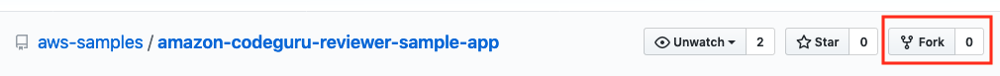
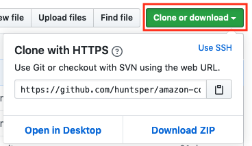
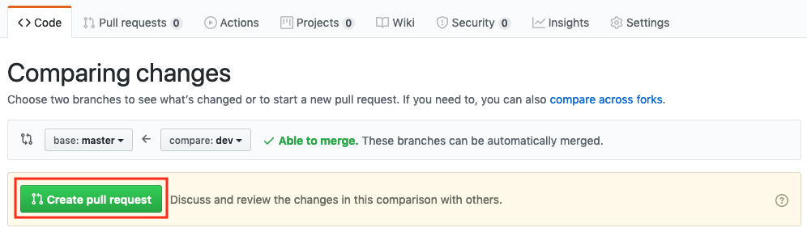
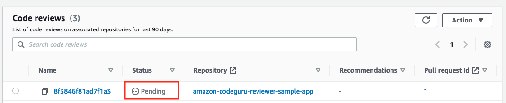
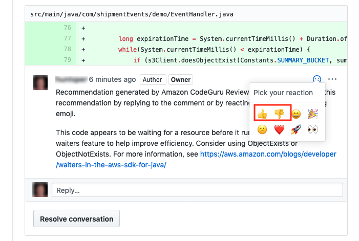
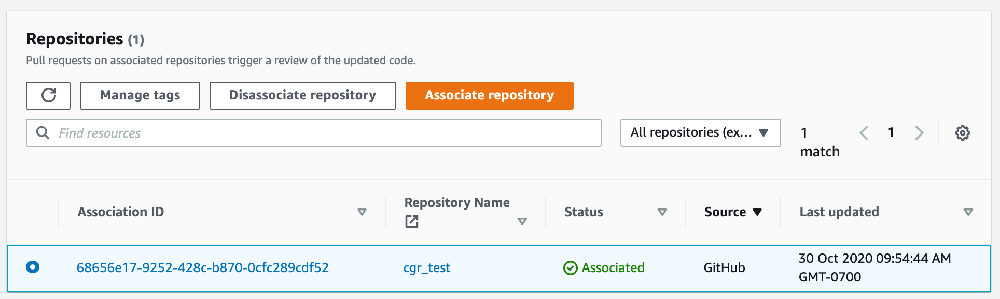

Starting November 7, 2025, you will not be able to create new repository associations in Amazon CodeGuru Reviewer. If you would like to use the service, create repository associations prior to November 7, 2025. To learn about services with capabilities similar to CodeGuru Reviewer, see [Amazon CodeGuru Reviewer availability change](codeguru-reviewer-availability-change.md "codeguru-reviewer-availability-change.md").

# Tutorial: monitor source code in a GitHub

repository

In this tutorial, you learn how to configure Amazon CodeGuru Reviewer to monitor source code so that it
can create recommendations that improve the code.

You work with an actual suboptimal example application in a GitHub repository as a test
case. After you associate the repository with CodeGuru Reviewer, you create a code change and submit a
pull request that triggers program analysis.

Because the example application contains intentional inefficiencies, CodeGuru Reviewer creates
recommendations about how to make it better. You learn how to review the recommendations and
then how to provide feedback about them. Customer feedback from code reviews helps improve
CodeGuru Reviewer recommendations over time.

To run this tutorial, you must have a [GitHub](https://github.com/ "https://github.com/")
account.

###### Note

- This tutorial creates code reviews that might result in charges to your AWS
  account. For more information, see [Amazon CodeGuru Pricing](https://aws.amazon.com/codeguru/pricing/ "https://aws.amazon.com/codeguru/pricing/").

- Don't use the example code in production. It's intentionally problematic and
  intended for demonstration purposes only.

## Step 1: Fork the repository

Fork the example application repository so you can create a pull request on it.

1. Log in to GitHub and navigate to the **[https://github.com/aws-samples/amazon-codeguru-reviewer-sample-app](https://github.com/aws-samples/amazon-codeguru-reviewer-sample-app "https://github.com/aws-samples/amazon-codeguru-reviewer-sample-app")**
   example application repository.
2. Choose **Fork** to fork the example application to your GitHub
   account.



## Step 2: Associate the forked

repository

Create a repository association with the example application's repository so that CodeGuru Reviewer
listens to it for pull requests.

1. Open the Amazon CodeGuru Reviewer console at
   [https://console.aws.amazon.com/codeguru/reviewer/](https://console.aws.amazon.com/codeguru/reviewer/ "https://console.aws.amazon.com/codeguru/reviewer/").
2. Choose **Associate repository**.
3. Make sure **GitHub or GitHub Enterprise Cloud** is selected, and
   then choose **Connect to your GitHub account**.
4. To allow CodeGuru Reviewer to access your account, choose **Authorize
   aws-codesuite**. If prompted, confirm your GitHub password.
5. Select the **amazon-codeguru-reviewer-sample-app** repository,
   and then choose **Associate**.

CodeGuru Reviewer is now associated with the repository and listening for pull requests.

## Step 3: Push a change to the

code

Push a change to the example application's code. Later in this tutorial, you create a
pull request for this change.

1. Run the following Git command to clone the forked repository, replacing
   `USER_ID` with your actual GitHub user ID.

```
git clone https://github.com/USER_ID/amazon-codeguru-reviewer-sample-app.git
```

You can get the clone URL by choosing **Clone or download**.



###### Note

If you access your GitHub repositories using SSH, use the SSH URL instead of
the HTTPS URL shown in this step. 2. Check out a new branch using the following command.

```
cd amazon-codeguru-reviewer-sample-app
git checkout -b dev
```

3. Copy the Java class at
   `src/main/java/com/shipmentEvents/handlers/EventHandler.java` into
   `src/main/java/com/shipmentEvents/demo`.

```
cp src/main/java/com/shipmentEvents/handlers/EventHandler.java src/main/java/com/shipmentEvents/demo/
```

GitHub and CodeGuru Reviewer treat `EventHandler.java` as a new file. 4. Push your changes to the example application's repository.

```
git add --all
git commit -m 'new demo file'
git push --set-upstream origin dev
```

## Step 4: Create a pull request

Create a pull request for CodeGuru Reviewer to review.

1. In your forked GitHub repository, choose **New pull request**.
2. On the left side of the comparison (**base**), select
   **USER_ID/amazon-codeguru-reviewer-sample-app**, where
   `USER_ID` is your GitHub user ID. Leave the branch at
   **master**.
3. On the right side of the comparison (**compare**), change the
   branch to **dev**. The branches should show as **Able to
   merge**.

 4. Choose **Create pull request**, then choose **Create pull
request** again.

## Step 5: Review

recommendations

After a few minutes, CodeGuru Reviewer issues recommendations on the same GitHub page where the
pull request was created. You can check the status of the code review in CodeGuru Reviewer console.

1. Open the Amazon CodeGuru Reviewer console at
   [https://console.aws.amazon.com/codeguru/reviewer/](https://console.aws.amazon.com/codeguru/reviewer/ "https://console.aws.amazon.com/codeguru/reviewer/").
2. In the navigation pane, expand **Reviewer** and choose
   **Code reviews**.
3. After a code review is complete, choose it to view its details.



When the code review is complete and the recommendations appear in GitHub, you can
provide feedback on the recommendations using the thumbs up or thumbs down icon. Any
positive or negative feedback is used to help improve the performance of CodeGuru Reviewer so that
recommendations get better over time.



## Step 6: Clean up

After you're finished with this tutorial, clean up your resources.

1. In your GitHub fork of **amazon-codeguru-reviewer-sample-app**,
   go to **Settings**, and then choose **Delete this
   repository**. Follow the instructions to delete the forked repository.
2. Delete your clone of the forked repository, for example, `rm -rf
amazon-codeguru-reviewer-sample-app`.
3. In the CodeGuru Reviewer console, select the example repository and choose
   **Disassociate repository**.


