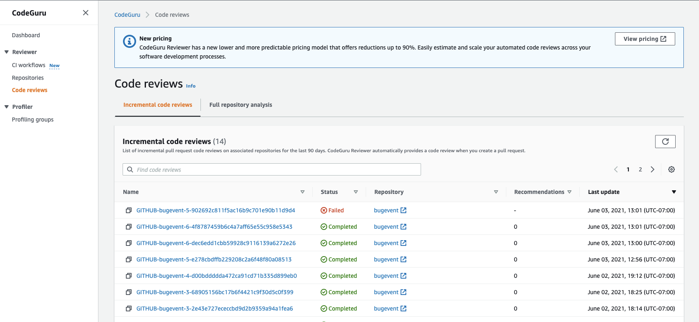

As of November 7, 2025, you can't create new repository associations in Amazon CodeGuru Reviewer. To learn about services with capabilities similar to CodeGuru Reviewer, see [Amazon CodeGuru Reviewer availability change](codeguru-reviewer-availability-change.md "codeguru-reviewer-availability-change.md").

# View all code reviews

You can view all code reviews from the past 90 days and their statuses on the
**Code reviews** page in the Amazon CodeGuru Reviewer console. There is an
**incremental code review** tab to view code reviews done on incremental
code reviews and a **Full repository analysis** tab to view code reviews
requested for full repository analyses.

To learn about the types of recommendations, see [Amazon CodeGuru Reviewer Detector
Library](../../detector-library/index.md "../../detector-library/index.md").

## Code reviews page

To view this page, in the navigation pane, choose **Reviewer**,
**Code reviews**.

###### Note

After 90 days have passed since a code review was done, you can't view that code
review in the Amazon CodeGuru Reviewer console. But you might be able to view the recommendations from
incremental code reviews in the repository source provider.

To view code reviews with the AWS CLI or the AWS SDK, call `ListCodeReviews`.
You can filter using `ProviderType`, `RepositoryName`, or
`State`. For more information, see the [Amazon CodeGuru Reviewer API Reference](../reviewer-api/Welcome.md "../reviewer-api/Welcome.md").

## Navigate to repositories and pull

requests

From the **Code reviews** page, you can navigate to the repository or
the pull request that CodeGuru Reviewer scanned. On either the **Incremental code
review** or **Full repository analysis** tab, choose
a name under the **Repository** column.
