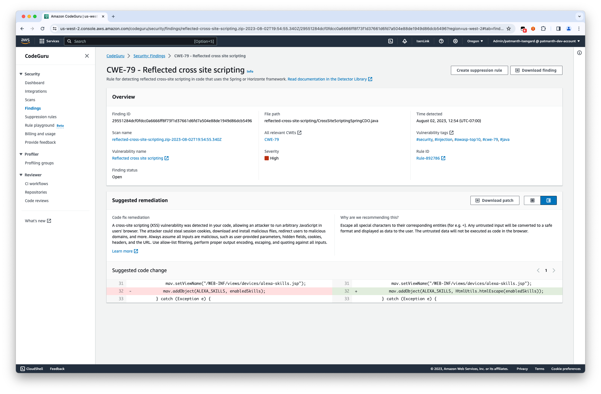

On November 20, 2025, AWS will discontinue support for Amazon CodeGuru Security. After
November 20, 2025, you will no longer be able to access the /codeguru/security console, service
resources, or documentation. For more information, see [End of support for CodeGuru Security](end-of-support.md "end-of-support.md").

# Address findings

After analyzing your finding, update your code based on the suggested remediation, and then
re-run the same scan on the updated code resource to make sure the vulnerability was remediated
and to close the finding.

If there is a suggested code change, see the following instructions for updating your code
with inline code fixes. You can retrieve the suggested code changes from the console, the AWS CLI, and
AWS SDKs.

###### Important

Be sure to keep track of scan names, so you know which scan to re-run on your updated
resource. If you scan a different resource, you will compromise metrics that help to monitor the
security posture of your applications.

###### Topics

- [Add suggested code changes with the console](#suggested-code-changes "#suggested-code-changes")
- [Address findings with the AWS CLI and AWS SDKs](#address-findings-cli-sdk "#address-findings-cli-sdk")

## Add suggested code changes with the console

For some findings, CodeGuru Security highlights the vulnerable sections of your code and provides
inline code fixes to remediate the vulnerability. Several code changes may be offered for you to
select from depending on what solution applies to your use case.

To update your code with a suggested code change using the console, you can download a
diff file with the new code or copy and paste the new code into your file.

1. Open the Findings page in the CodeGuru Security console at [https://console.aws.amazon.com/codeguru/security/findings/](https://console.aws.amazon.com/codeguru/security/findings/ "https://console.aws.amazon.com/codeguru/security/findings/") and choose the finding you
   want to address.
2. In the **Suggested remediation** panel, you can view the vulnerable lines of code to be
   removed, the suggested code change, and where to add it. If there are alternate code change
   solutions, choose the arrows above the code boxes to switch between options.
3. Determine which code fix you want to use to update your code. Then, choose **Download patch** to download the diff file, which shows the vulnerable
   lines of code to remove and the new code to replace it with.

Alternatively, you can manually update your resource. Be sure to remove the vulnerable
lines of code and add the updated code to the correct section of your code.

The following image is an example of a vulnerability that you can download a
patch for.

 4. Once your code is updated, re-run the scan to check that the vulnerability was remediated
and to close the finding. For information on how to re-run a scan, see [Scan a revised file in the console](create-scans-console.md#console-scan-revised-file "create-scans-console.md#console-scan-revised-file").

## Address findings with the AWS CLI and AWS SDKs

Use the [`GetFindings`](../security-api/API_GetFindings.md "../security-api/API_GetFindings.md") or [`BatchGetFindings`](../security-api/API_BatchGetFindings.md "../security-api/API_BatchGetFindings.md") operations to retrieve findings, including the suggested
remediation for a given vulnerability. Then, make the change that applies to your use case and
re-run your scan using the same scan name. If you need to make inline code changes, remove the
vulnerable lines of code and add the new code to the correct section of your code.
