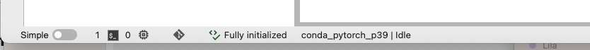
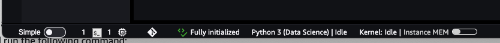
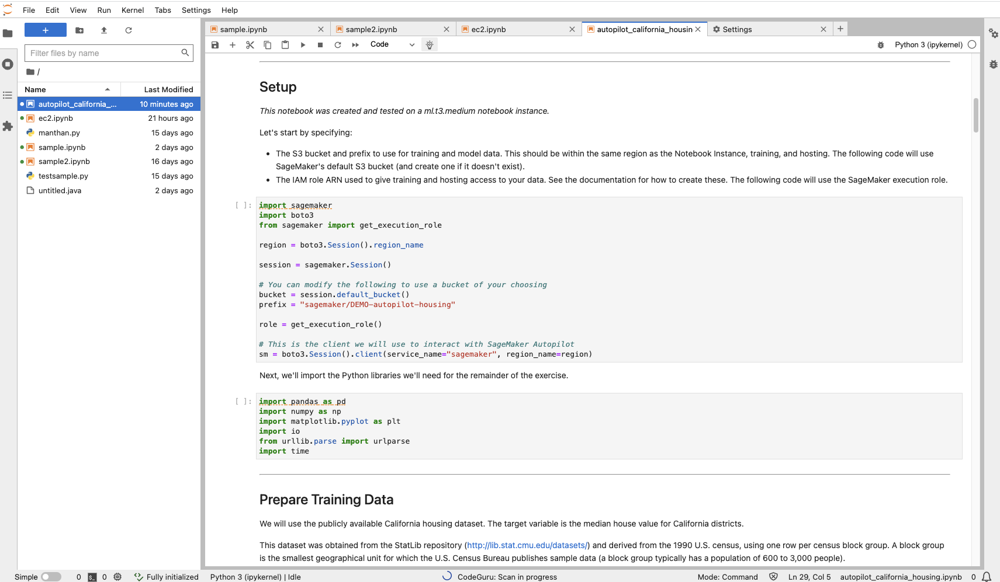
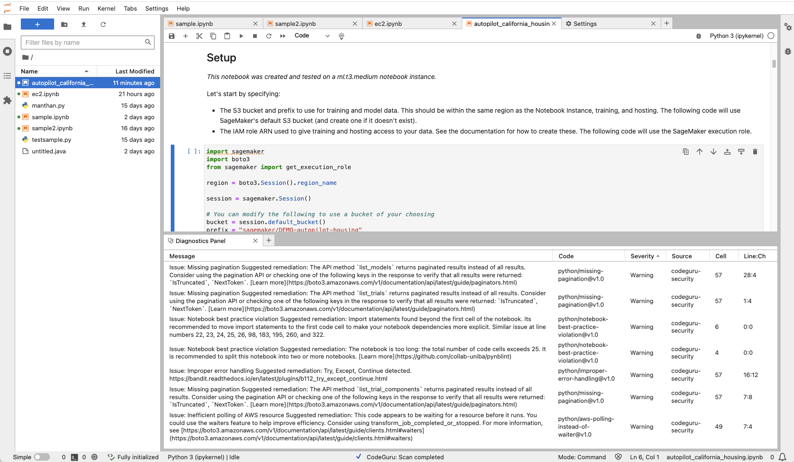
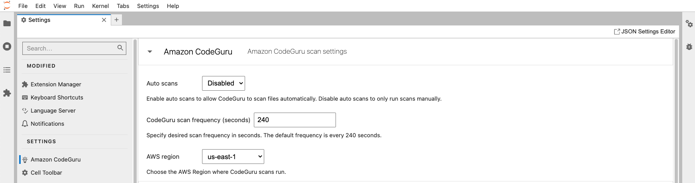

On November 20, 2025, AWS will discontinue support for Amazon CodeGuru Security. After
November 20, 2025, you will no longer be able to access the /codeguru/security console, service
resources, or documentation. For more information, see [End of support for CodeGuru Security](end-of-support.md "end-of-support.md").

# Tutorial: Run scans with SageMaker AI Studio and JupyterLab

The Amazon CodeGuru Security extension scans your Python and notebook files and
provides security recommendations and quality improvements to your code.

After running a scan, detected vulnerabilities or quality issues in your code are
underlined. Each underlined section corresponds to a finding that details the issue and suggested
remediation. You can view all findings in the diagnostic panel. Once you update your code, you
can re-run a scan to see if the finding has been remediated.

The following instructions show you how to install and use the CodeGuru Security extension
in JupyterLab and Amazon SageMaker AI Studio. Before you begin installation, make sure you've
followed the steps in [Setting up Amazon CodeGuru Security](setting-up-codeguru-security.md "setting-up-codeguru-security.md").

## Step 1: Install the CodeGuru Security extension

You can install the CodeGuru Security extension in one of two ways, via the command line or
in the extension manager.

You can find more information on installing JupyterLab extensions in the JupyterLab [Extensions documentation](https://jupyterlab.readthedocs.io/en/stable/user/extensions.html "https://jupyterlab.readthedocs.io/en/stable/user/extensions.html").

###### Note

If you're using SageMaker AI Studio, make sure to run `conda activate studio` and
`conda deactivate` before and after running the following commands.

If you're using JupyterLab, make sure to run the commands in the same environment where
JupyterLab is installed.

If you installed JupyterLab with the `conda` environment, activate the
environment where JupyterLab is installed before running the following commands.

### Install with the command line (recommended)

#### JupyterLab

1. Open a command prompt window and run the following command to install the
   extension.

```
pip install amazon-codeguru-jupyterlab-extension
```

2. Restart your JupyterLab server.
3. In your browser, refresh the page to view the extension in JupyterLab.

You can verify that the extension is installed if the LSP server displays **Fully initialized** on the bottom left corner. The following image
shows the LSP server with the **Fully initialized**
status.



#### SageMaker Studio

1. Open a command prompt window.
2. Run the following commands to install the extension in the
   `conda` environment:

```
conda activate studio
  pip install amazon-codeguru-jupyterlab-extension
  conda deactivate
```

3. Restart your SageMaker Studio server by running the following command:

```
restart-jupyter-server
```

4. In your browser, refresh the page to view the extension in SageMaker Studio.

You can verify that the extension is installed if the LSP server displays **Fully initialized** on the bottom left corner. The following image
shows the LSP server with the **Fully initialized**
status.



If you still don't see the extension, try creating a new notebook instance with your
application code, and then install the extension.

### Install with the extension manager

1. Open SageMaker AI Studio or JupyterLab.
2. In the left navigation bar, choose the Extension Manager icon.
3. Search @aws/amazon-codeguru-extension.
4. Locate the extension called **@aws/amazon-codeguru-extension** and choose **Install**.
5. A pop-up appears with the title **Server Companion**.
   Choose **OK**.
6. After a few moments, the following message appears in the Extension Manager:

"A build is needed to include the latest changes."

Choose **Rebuild**. 7. After the rebuild is complete, a pop-up appears. Choose **Save and
Reload**. 8. Open a command prompt window and run the following command:

```
 pip install amazon-codeguru-jupyterlab-extension
```

9. Restart your JupyterLab or SageMaker Studio server.
10. Refresh your browser to view the extension.

You can verify that the extension is installed if the LSP server displays
**Fully initialized** on the bottom left corner.

## Step 2: Update IAM permissions

To use the extension, a role or user must have the necessary permissions. Follow these steps to
update permissions policies with IAM. If you’re using the extension in JupyterLab, you must also
refresh your AWS account credentials.

1. Update the permissions policy for each role or user who is using the extension. We
   recommended that you use the AWS managed policy [AmazonCodeGuruSecurityScanAccess](security-iam-awsmanpol.md#security-iam-awsmanpol-AmazonCodeGuruSecurityScanAccess "security-iam-awsmanpol.md#security-iam-awsmanpol-AmazonCodeGuruSecurityScanAccess"). For more information on creating policies, see
   [Managed policies and inline policies](../../../IAM/latest/UserGuide/access_policies_managed-vs-inline.md "../../../IAM/latest/UserGuide/access_policies_managed-vs-inline.md").

Go to the [AWS IAM Console](https://console.aws.amazon.com/iam/ "https://console.aws.amazon.com/iam/") and
attach the managed policy to your roles or users.

If you're using SageMaker AI Studio, attach the policy to the
`AmazonSageMaker-ExecutionRole`.

Alternatively, create a new policy with the
following permissions.

JSON

```
`{
 "Version":"2012-10-17",
 "Statement": [
 {
 "Sid": "AmazonCodeGuruSecurityScanAccess",
 "Effect": "Allow",
 "Action": [
 "codeguru-security:CreateScan",
 "codeguru-security:CreateUploadUrl",
 "codeguru-security:GetScan",
 "codeguru-security:GetFindings"
 ],
 "Resource": "arn:aws:codeguru-security:*:*:scans/*"
 }
 ]
}`

```

2. If you’re using SageMaker AI Studio, you can skip this step. If you’re using
   JupyterLab, refresh your AWS account credentials via the command line by running the following
   command:

```
aws configure
```

## Step 3: Run a scan

Once you’ve installed the extension and updated the permissions policy, you are ready
to run a scan in JupyterLab or SageMaker AI Studio.

1. Open the file you want to run a CodeGuru Security scan on in your JupyterLab or SageMaker AI Studio
   notebook instance.
2. If the LSP server displays **Fully initialized** on the
   bottom left corner, the extension is installed, and you are ready to run a scan.

###### Note

If you see **Server extension missing**, restart your
SageMaker Studio or JupyterLab server. 3. You can initiate a scan in one of the following ways:

    * Choose any code cell in your file, and then choose the light bulb icon in the top task
     bar.
    * Open the context (right-click) menu on any code cell in your file, and then choose
     **Run code scan**.

4. Once a scan is running, **CodeGuru: Scan in progress** will
   appear on the bottom panel of the page. The scan might take several seconds to complete. Once
   complete, the bottom panel displays **CodeGuru: Scan completed**
   and the findings are underlined in your code.

The following image shows an in-progress scan.



## Step 4: View and address findings

Once a scan is complete, you see findings underlined in your code.

1. To view more information on the findings, open the context (right-click) menu for any
   cell and choose **Show diagnostics panel**. A panel with
   information about the findings and recommendations appears at the bottom of the notebook
   file.

The following image shows a completed scan with the diagnostics panel open to view
findings.



To view a popover with a summary of the finding, hold your cursor over the underlined
code. 2. In the diagnostics panel, choose a finding to redirect your cursor to the
corresponding lines of code. 3. After you update your code based on the recommendations, you can re-run the scan
to see if the issue has been addressed.

Once you change your code, the scan findings disappear. You must re-run the scan to see
them again.

## Step 5: Updating scan settings

You can specify the frequency of scan runs and the Region where you run scans.

1. Choose **Settings** in the top navigation bar.
2. Choose **Advanced Settings Editor**.
3. In the left navigation bar, choose
   **CodeGuru Security**.
4. Automatic code scans are disabled by default. If you want scans to run automatically, choose **Enabled** in the dropdown menu next to **Auto scans**.

If enabled, automatic scans run every 240 seconds by default. If you want to change the
frequency of automatic scans, specify a value for **CodeGuru scan
frequency**.

The following image shows the CodeGuru Security scan settings tab with Auto scans
disabled.

 5. To specify what AWS Region your scans are run in, choose a Region in the dropdown menu next to
**Region**.

You can change the AWS Region where you run scans to keep data in a specific
Region while scanning, or to be billed in a specific Region.

## Step 6: Disable or uninstall the extension

Disabling the extension prevents you from running scans until it is re-enabled. If you
uninstall the extension, you must repeat the installation process to reinstall
it.

###### Note

If you're using SageMaker AI Studio, be sure to run `conda activate studio` and
`conda deactivate` before and after running the following commands.

If you're using JupyterLab, make sure to run the commands in the same environment where
JupyterLab is installed.

If you installed JupyterLab with the `conda` environment, activate the
environment where JupyterLab is installed before running the following commands.

### Disable the extension

Open a command prompt window and run the following command.

```
jupyter labextension disable @aws/amazon-codeguru-extension
```

### Uninstall the extension

#### Uninstall with the command line

1. Open a command prompt window and run the following command.

```
pip uninstall amazon-codeguru-jupyterlab-extension
```

2. You might also want to remove dependent packages by running the following
   commands:

```
pip uninstall jupyterlab-lsp
pip uninstall python-lsp-server
```

#### Uninstall with the extension manager

1. Open a command prompt window and run the following command.

```
pip uninstall amazon-codeguru-jupyterlab-extension
```

2. In the Extension Manager, locate the @aws/amazon-codeguru-extension extension and choose
   **Uninstall**.
3. The following message appears in the Extension Manager:

"A build is needed to include the latest changes."

Choose **Rebuild**. 4. After the rebuild is complete, a pop-up appears. Choose **Save and
Reload**. 5. You might also want to remove dependent packages by running the following
commands:

```
pip uninstall jupyterlab-lsp
pip uninstall python-lsp-server
```
