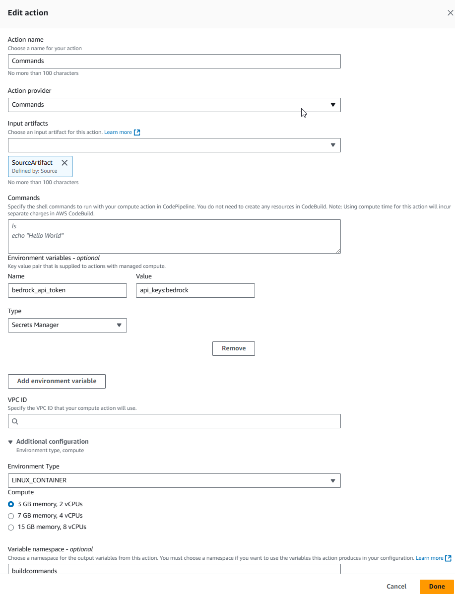

# Commands action reference

The Commands action allows you to run shell commands in a virtual compute instance. When
you run the action, commands specified in the action configuration are run in a separate
container. All artifacts that are specified as input artifacts to a CodeBuild action are
available inside of the container running the commands. This action allows you to specify
commands without first creating a CodeBuild project. For more information, see [ActionDeclaration](../APIReference/API_ActionDeclaration.md "../APIReference/API_ActionDeclaration.md") and [OutputArtifact](../APIReference/API_OutputArtifact.md "../APIReference/API_OutputArtifact.md") in the _AWS CodePipeline API Reference_.

###### Important

This action uses CodePipeline managed CodeBuild compute to run commands in a build environment.
Running the commands action will incur separate charges in AWS CodeBuild.

###### Note

The Commands action is only available for V2 type pipelines.

###### Topics

- [Considerations for the
  Commands action](#action-reference-Commands-considerations "#action-reference-Commands-considerations")
- [Service role policy
  permissions](#action-reference-Commands-policy "#action-reference-Commands-policy")
- [Action type](#action-reference-Commands-type "#action-reference-Commands-type")
- [Configuration parameters](#action-reference-Commands-config "#action-reference-Commands-config")
- [Input artifacts](#action-reference-Commands-input "#action-reference-Commands-input")
- [Output artifacts](#action-reference-Commands-output "#action-reference-Commands-output")
- [Environment variables](#action-reference-Commands-envvars "#action-reference-Commands-envvars")
- [Service role permissions: Commands action](#edit-role-Commands "#edit-role-Commands")
- [Action declaration (example)](#action-reference-Commands-example "#action-reference-Commands-example")
- [See also](#action-reference-Commands-links "#action-reference-Commands-links")

## Considerations for the

Commands action

The following considerations apply for the Commands action.

- The commands action uses CodeBuild resources similar to the CodeBuild action, while
  allowing shell environment commands in a virtual compute instance without the
  need to associate or create a build project.

###### Note

Running the commands action will incur separate charges in
AWS CodeBuild.

- Because the Commands action in CodePipeline uses CodeBuild resources, the builds run by
  the action will be attributed to the build limits for your account in CodeBuild.
  Builds run by the Commands action will count toward the concurrent build limits
  as configured for that account.
- The timeout for builds with the Commands action is 55 minutes, as based on
  CodeBuild builds.
- The compute instance uses an isolated build environment in CodeBuild.

###### Note

Because the isolated build environment is used at the account level, an
instance might be reused for another pipeline execution.

- All formats are supported except multi-line formats. You must use single-line
  format when entering commands.
- The commands action is supported for cross-account actions. To add a
  cross-account commands action, add `actionRoleArn` from your target
  account in the action declaration.
- For this action, CodePipeline will assume the pipeline service role and use that role
  to allow access to resources at runtime. It is recommended to configure the
  service role so that the permissions are scoped down to the action level.
- The permissions added to the CodePipeline service role are detailed in [Add permissions to the CodePipeline
  service role](how-to-custom-role.md#how-to-update-role-new-services "how-to-custom-role.md#how-to-update-role-new-services") .
- The permission needed to view logs in the console is detailed in [Permissions required to view
  compute logs in the CodePipeline console](security-iam-permissions-console-logs.md "security-iam-permissions-console-logs.md") .
- Unlike other actions in CodePipeline, you do not set fields in the action
  configuration; you set the action configuration fields outside of the action
  configuration.

## Service role policy

permissions

When CodePipeline runs the action, CodePipeline creates a log group using the name of the pipeline
as follows. This enables you to scope down permissions to log resources using the
pipeline name.

```
/aws/codepipeline/`MyPipelineName`
```

If you are using an existing service role, to use the Commands action, you will need
to add the following permissions for the service role.

- logs:CreateLogGroup
- logs:CreateLogStream
- logs:PutLogEvents

In the service role policy statement, scope down the permissions to the pipeline level
as shown in the following example.

```
{
    "Effect": "Allow",
    "Action": [
        "logs:CreateLogGroup",
        "logs:CreateLogStream",
        "logs:PutLogEvents"
    ],
    "Resource": [
        "arn:aws:logs:*:`YOUR_AWS_ACCOUNT_ID`:log-group:/aws/codepipeline/`YOUR_PIPELINE_NAME`",
        "arn:aws:logs:*:`YOUR_AWS_ACCOUNT_ID`:log-group:/aws/codepipeline/`YOUR_PIPELINE_NAME`:*"
   ]
}
```

To view logs in the console using the action details dialog page, the permission to
view logs must be added to the console role. For more information, see the console
permissions policy example in [Permissions required to view
compute logs in the CodePipeline console](security-iam-permissions-console-logs.md "security-iam-permissions-console-logs.md").

## Action type

- Category: `Compute`
- Owner: `AWS`
- Provider: `Commands`
- Version: `1`

## Configuration parameters

**Commands**

Required: Yes

You can provide shell commands for the `Commands` action to
run. In the console, commands are entered on separate lines. In the CLI,
commands are entered as separate strings.

###### Note

Multi-line formats are not supported and will result in an error
message. Single-line format must be used for entering commands in the
**Commands** field.

###### Important

The EnvironmentType and ComputeType values match those in CodeBuild. We
support a subset of the available types. For more information, see
[Build Environment Compute Types](../../../codebuild/latest/userguide/build-env-ref-compute-types.md "../../../codebuild/latest/userguide/build-env-ref-compute-types.md").

**EnvironmentType**

Required: No

The OS image for the build environment that supports the Commands action.
The following are valid values for build environments:

- LINUX_CONTAINER
- WINDOWS_SERVER_2022_CONTAINER

The selection for **EnvironmentType** will then allow the
compute type for that OS in the **ComputeType** field. For
more information about the CodeBuild compute types available for this action,
see the [Build
environment compute modes and types](../../../codebuild/latest/userguide/build-env-ref-compute-types.md "../../../codebuild/latest/userguide/build-env-ref-compute-types.md") reference in the CodeBuild User
Guide.

###### Note

If not specified, the compute defaults to the following for the build
environment:

- **Compute type:** BUILD_GENERAL1_SMALL
- **Environment type:** LINUX_CONTAINER

**ComputeType**

Required: No

Based on the selection for EnvironmentType, the compute type can be
provided. The following are available values for compute; however, note that
the options available can vary by OS.

- BUILD_GENERAL1_SMALL
- BUILD_GENERAL1_MEDIUM
- BUILD_GENERAL1_LARGE

###### Important

Some compute types are not compatible with certain environment types.
For example, WINDOWS_SERVER_2022_CONTAINER is not compatible with
BUILD_GENERAL1_SMALL. Using incompatible combinations causes the action
to fail and generates a runtime error.

**outputVariables**

Required: No

Specify the names of the variables in your environment that you want to
export. For a reference of CodeBuild environment variables, see [Environment variables in build environments](../../../codebuild/latest/userguide/build-env-ref-env-vars.md "../../../codebuild/latest/userguide/build-env-ref-env-vars.md") in the _CodeBuild User Guide_.

**Files**

Required: No

You can provide files that you want to export as output artifacts for the
action.

The supported format for files is the same as for CodeBuild file patterns. For
example, enter `**/` for all files. For more information, see
[Build specification reference for CodeBuild](../../../codebuild/latest/userguide/build-spec-ref.md#build-spec.artifacts.files "../../../codebuild/latest/userguide/build-spec-ref.md#build-spec.artifacts.files") in the _CodeBuild User Guide_.



**VpcId**

Required: No

The VPC ID for your resources.

**Subnets**

Required: No

The subnets for the VPC. This field is needed when your commands need to
connect to resources in a VPC.

**SecurityGroupIds**

Required: No

The security groups for the VPC. This field is needed when your commands
need to connect to resources in a VPC.

The following is a JSON example of the action with configuration fields shown for
environment and compute type, along with example environment variable.

```
 {
            "name": "Commands1",
            "actionTypeId": {
              "category": "Compute",
              "owner": "AWS",
              "provider": "Commands",
              "version": "1"
            },
            "inputArtifacts": [
              {
                "name": "SourceArtifact"
              }
            ],
            "commands": [
              "ls",
              "echo hello",
              "echo $BEDROCK_TOKEN",
            ],
            "configuration": {
              "EnvironmentType": "LINUX_CONTAINER",
              "ComputeType": "BUILD_GENERAL1_MEDIUM"
            },
            "environmentVariables": [
              {
                "name": "BEDROCK_TOKEN",
                "value": "apiTokens:bedrockToken",
                "type": "SECRETS_MANAGER"
              }
            ],
            "runOrder": 1
          }
```

## Input artifacts

- **Number of artifacts:**
  `1 to 10`

## Output artifacts

- **Number of artifacts:**
  `0 to 1`

## Environment variables

**Key**

The key in a key-value environment variable pair, such as
`BEDROCK_TOKEN`.

**Value**

The value for the key-value pair, such as
`apiTokens:bedrockToken`. The value can be parameterized with
output variables from pipeline actions or pipeline variables.

When using the `SECRETS_MANAGER` type, this value must be the
name of a secret you have already stored in AWS Secrets Manager.

**Type**

Specifies the type of use for the environment variable value. The value
can be either `PLAINTEXT` or `SECRETS_MANAGER`. If the
value is `SECRETS_MANAGER`, provide the Secrets reference in the
`EnvironmentVariable` value. When not specified, this
defaults to `PLAINTEXT`.

###### Note

We strongly discourage the use of _plaintext_ environment variables to store sensitive
values, especially AWS credentials. When you use the CodeBuild console or
AWS CLI, _plaintext_ environment
variables are displayed in plain text. For sensitive values, we
recommend that you use the `SECRETS_MANAGER` type
instead.

###### Note

When you enter the `name`, `value`, and `type`
for your environment variables configuration, especially if the environment variable
contains CodePipeline output variable syntax, do not exceed the 1000-character limit for
the configuration’s value field. A validation error is returned when this limit is
exceeded.

For an example action declaration showing an environment variable, see [Configuration parameters](#action-reference-Commands-config "#action-reference-Commands-config").

###### Note

- The `SECRETS_MANAGER` type is only supported for the Commands
  action.
- Secrets referenced in the Commands action will be redacted in the build
  logs similar to CodeBuild. But pipeline users who have **Edit**
  access to the pipeline can still potentially access these secret values by
  modifying the commands.
- To use the SecretsManager, you must add the following permissions to your
  pipeline service role:

```
{
            "Effect": "Allow",
            "Action": [
                "secretsmanager:GetSecretValue"
            ],
            "Resource": [
                "`SECRET_ARN`"
            ]
        }
```

## Service role permissions: Commands action

For Commands support, add the following to your policy statement:

JSON

```
`{
 "Version":"2012-10-17",
 "Statement": [
 {
 "Effect": "Allow",
 "Action": [
 "logs:CreateLogGroup",
 "logs:CreateLogStream",
 "logs:PutLogEvents"
 ],
 "Resource": [
 "`arn:aws:iam::*:role/Service*`",
 "`arn:aws:iam::*:role/Service*`"
 ]
 }
 ]
}`

```

## Action declaration (example)

YAML

```
name: Commands_action
actionTypeId:
  category: Compute
  owner: AWS
  provider: Commands
  version: '1'
runOrder: 1
configuration: {}
commands:
- ls
- echo hello
- 'echo pipeline Execution Id is #{codepipeline.PipelineExecutionId}'
outputArtifacts:
- name: BuildArtifact
  files:
  - **/
inputArtifacts:
- name: SourceArtifact
outputVariables:
- AWS_DEFAULT_REGION
region: us-east-1
namespace: compute
```

JSON

```
{
    "name": "Commands_action",
    "actionTypeId": {
        "category": "Compute",
        "owner": "AWS",
        "provider": "Commands",
        "version": "1"
    },
    "runOrder": 1,
    "configuration": {},
    "commands": [
        "ls",
        "echo hello",
        "echo pipeline Execution Id is #{codepipeline.PipelineExecutionId}"
    ],
    "outputArtifacts": [
        {
            "name": "BuildArtifact",
            "files": [
                "**/"
            ]
        }
    ],
    "inputArtifacts": [
        {
            "name": "SourceArtifact"
        }
    ],
    "outputVariables": [
        "AWS_DEFAULT_REGION"
    ],
    "region": "us-east-1",
    "namespace": "compute"
}
```

## See also

The following related resources can help you as you work with this action.

- [Tutorial: Create a pipeline that runs commands with
  compute (V2 type)](tutorials-commands.md "tutorials-commands.md")
  – This tutorial provides a sample pipeline with the Commands
  action.
