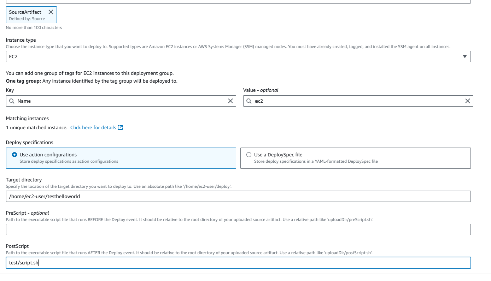
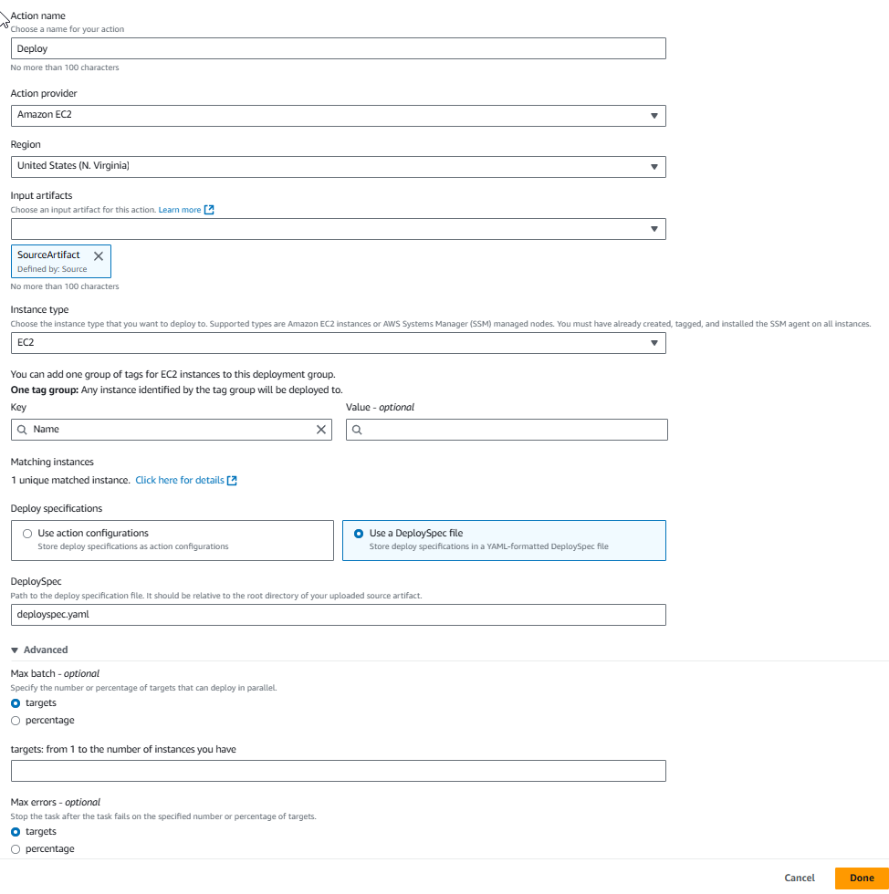

# Amazon EC2 action reference

You use an Amazon EC2 `EC2` action to deploy application code to your deployment
fleet. Your deployment fleet can consist of Amazon EC2 Linux instances or Linux SSM-managed
nodes. Your instances must have the SSM agent installed.

###### Note

This action supports Linux instance types only. The maximum fleet size supported is
500 instances.

The action will choose a number of instances based on a specified maximum. The failed
instances from previous instances will be chosen first. The action will skip the deployment
on certain instances if the instance has already received deployment of the same input
artifact, such as a case where the action failed previously.

###### Note

This action is only supported for V2 type pipelines.

###### Topics

- [Action type](#action-reference-EC2Deploy-type "#action-reference-EC2Deploy-type")
- [Configuration parameters](#action-reference-EC2Deploy-parameters "#action-reference-EC2Deploy-parameters")
- [Input artifacts](#action-reference-EC2Deploy-input "#action-reference-EC2Deploy-input")
- [Output artifacts](#action-reference-EC2Deploy-output "#action-reference-EC2Deploy-output")
- [Service role policy
  permissions for the EC2 deploy action](#action-reference-EC2Deploy-permissions-action "#action-reference-EC2Deploy-permissions-action")
- [Deploy spec file
  reference](#action-reference-EC2Deploy-spec-reference "#action-reference-EC2Deploy-spec-reference")
- [Action declaration](#action-reference-EC2Deploy-example "#action-reference-EC2Deploy-example")
- [Action declaration with Deploy
  spec example](#action-reference-EC2Deploy-example-spec "#action-reference-EC2Deploy-example-spec")
- [See also](#action-reference-EC2Deploy-links "#action-reference-EC2Deploy-links")

## Action type

- Category: `Deploy`
- Owner: `AWS`
- Provider: `EC2`
- Version: `1`

## Configuration parameters

**InstanceTagKey**

Required: Yes

The tag key of the instances that you created in Amazon EC2, such as
`Name`.

**InstanceTagValue**

Required:
No

The tag value of the instances that you created in Amazon EC2, such as
`my-instances`.

When this value is not specified, all instances with **InstanceTagKey** will be matched.

**InstanceType**

Required: Yes

The type of instances or SSM nodes created in Amazon EC2. The valid values are
`EC2` and `SSM_MANAGED_NODE`.

You must have already created, tagged, and installed the SSM agent on all
instances.

###### Note

When you create the instance, you create or use an existing EC2
instance role. To avoid `Access Denied` errors, you must add
S3 bucket permissions to the instance role to give the instance
permissions to the CodePipeline artifact bucket. Create a default role or
update your existing role with the `s3:GetObject` permission
scoped down to the artifact bucket for your pipeline's Region.

**TargetDirectory**

Required:
Yes
(If script is specified)

The directory to be used on your Amazon EC2 instance to run scripts.

**DeploySpec**

Required: Yes (If deploy spec is specified)

The file to be used to configure deployment install and lifecycle events.
For deploy spec field descriptions and information, see [Deploy spec file
reference](#action-reference-EC2Deploy-spec-reference "#action-reference-EC2Deploy-spec-reference"). To view an
action configuration with the deploy spec file specified, see the example in
[Action declaration with Deploy
spec example](#action-reference-EC2Deploy-example-spec "#action-reference-EC2Deploy-example-spec").

**MaxBatch**

Required: No

The maximum number of instances allowed to deploy in parallel.

**MaxError**

Required: No

The maximum number of instance errors allowed during deployment.

**TargetGroupNameList**

Required: No

The list of target group names for deployment. You must have already
created the target groups.

Target groups provide a set of instances to process specific requests. If
the target group is specified, instances will be removed from the target
group before deployment and added back to the target group after
deployment.

**PreScript**

Required: No

The script to be run before the action Deploy phase.

**PostScript**

Required: Yes

The script to be run after the action Deploy phase.

The following image shows an example of the **Edit** page for the
action where **Use action configurations** is chosen.



The following image shows an example of the **Edit** page for the
action where **Use a DeploySpec file** is chosen.



## Input artifacts

- **Number of artifacts:**
  `1`
- **Description:** The files provided, if any, to
  support the script actions during the deployment.

## Output artifacts

- **Number of artifacts:**
  `0`
- **Description:** Output artifacts do not apply
  for this action type.

## Service role policy

permissions for the EC2 deploy action

When CodePipeline runs the action, CodePipeline service role requires the following permissions,
appropriately scoped down for access with least privilege.

JSON

```
`{
 "Version":"2012-10-17",
 "Statement": [
 {
 "Sid": "StatementWithAllResource",
 "Effect": "Allow",
 "Action": [
 "ec2:DescribeInstances",
 "elasticloadbalancing:DescribeTargetGroupAttributes",
 "elasticloadbalancing:DescribeTargetGroups",
 "elasticloadbalancing:DescribeTargetHealth",
 "ssm:CancelCommand",
 "ssm:DescribeInstanceInformation",
 "ssm:ListCommandInvocations"
 ],
 "Resource": [
 "*"
 ]
 },
 {
 "Sid": "StatementForLogs",
 "Effect": "Allow",
 "Action": [
 "logs:CreateLogGroup",
 "logs:CreateLogStream",
 "logs:PutLogEvents"
 ],
 "Resource": [
 "arn:aws:logs:us-east-1:`111122223333`:log-group:/aws/codepipeline/{{pipelineName}}:*"
 ]
 },
 {
 "Sid": "StatementForElasticloadbalancing",
 "Effect": "Allow",
 "Action": [
 "elasticloadbalancing:DeregisterTargets",
 "elasticloadbalancing:RegisterTargets"
 ],
 "Resource": [
 "arn:aws:elasticloadbalancing:us-east-1:`111122223333`:targetgroup/[[targetGroupName]]/*"
 ]
 },
 {
 "Sid": "StatementForSsmOnTaggedInstances",
 "Effect": "Allow",
 "Action": [
 "ssm:SendCommand"
 ],
 "Resource": [
 "arn:aws:ec2:us-east-1:`111122223333`:instance/*"
 ],
 "Condition": {
 "StringEquals": {
 "aws:ResourceTag/{{tagKey}}": "{{tagValue}}"
 }
 }
 },
 {
 "Sid": "StatementForSsmApprovedDocuments",
 "Effect": "Allow",
 "Action": [
 "ssm:SendCommand"
 ],
 "Resource": [
 "arn:aws:ssm:us-east-1::document/AWS-RunPowerShellScript",
 "arn:aws:ssm:us-east-1::document/AWS-RunShellScript"
 ]
 }
 ]
}`

```

### Log groups for your pipeline in

CloudWatch logs

When CodePipeline runs the action, CodePipeline creates a log group using the name of the
pipeline as follows. This enables you to scope down permissions to log resources
using the pipeline name.

```
/aws/codepipeline/`MyPipelineName`
```

The following permissions for logging are included in the above updates for the
service role.

- logs:CreateLogGroup
- logs:CreateLogStream
- logs:PutLogEvents

To view logs in the console using the action details dialog page, the permission
to view logs must be added to the console role. For more information, see the
console permissions policy example in [Permissions required to view
compute logs in the CodePipeline console](security-iam-permissions-console-logs.md "security-iam-permissions-console-logs.md").

### Service role policy permissions for CloudWatch logs

When CodePipeline runs the action, CodePipeline creates a log group using the name of the
pipeline as follows. This enables you to scope down permissions to log resources
using the pipeline name.

```
/aws/codepipeline/`MyPipelineName`
```

To view logs in the console using the action details dialog page, the permission
to view logs must be added to the console role. For more information, see the
console permissions policy example in [Permissions required to view
compute logs in the CodePipeline console](security-iam-permissions-console-logs.md "security-iam-permissions-console-logs.md").

## Deploy spec file

reference

When CodePipeline runs the action, you can specify a spec file to configure deployment to
your instances. The deploy spec file specifies what to install and which lifecycle event
hooks to run in response to deployment lifecycle events. The deploy spec file is always
YAML-formatted. The deploy spec file is used to:

- Map the source files in your application revision to their destinations on the
  instance.
- Specify custom permissions for deployed files.
- Specify scripts to be run on each instance at various stages of the deployment
  process.

The deploy spec file supports specific deployment configuration parameters supported
by CodeDeploy with the AppSpec file. You can use your existing AppSpec file directly,
and any unsupported parameters will be ignored. For more information about the AppSpec
file in CodeDeploy, see the Application Specification file reference in the _[CodeDeploy](../../../codedeploy/latest/userguide/reference-appspec-file.md "../../../codedeploy/latest/userguide/reference-appspec-file.md")
User Guide_.

The file deployment parameters are specified as follows.

- `files` - The deploy spec file designates the `source:`
  and `destination:` for the deployment files.
- `scripts` - The scripted events for the deployment. Two events are
  supported: `BeforeDeploy` and `AfterDeploy`.
- `hooks` - The lifecycle hooks for the event. The following hooks
  are supported: `ApplicationStop`, `BeforeInstall`,
  `AfterInstall`, `ApplicationStart`, and
  `ValidateService`.

###### Note

The hooks parameter is available for AppSpec compatibility with CodeDeploy
and is only available in version 0.0 (AppSpec format). For this format,
CodePipeline will perform a best effort mapping of the events.

Correct YAML spacing must be used in the spec file; otherwise, an error is raised if
the locations and number of spaces in a deploy spec file are not correct. For more
information about spacing, see the [YAML](http://www.yaml.org/ "http://www.yaml.org/")
specification.

An example deploy spec file is below.

```
version: 0.1
files:
  - source: /index.html
    destination: /var/www/html/
scripts:
  BeforeDeploy:
    - location: scripts/install_dependencies
      timeout: 300
      runas: myuser
  AfterDeploy:
    - location: scripts/start_server
      timeout: 300
      runas: myuser
```

To view an action configuration with the deploy spec file specified, see the example
in [Action declaration with Deploy
spec example](#action-reference-EC2Deploy-example-spec "#action-reference-EC2Deploy-example-spec").

## Action declaration

YAML

```
name: DeployEC2
actions:
- name: EC2
  actionTypeId:
    category: Deploy
    owner: AWS
    provider: EC2
    version: '1'
  runOrder: 1
  configuration:
    InstanceTagKey: Name
    InstanceTagValue: my-instances
    InstanceType: EC2
    PostScript: "test/script.sh",
    TargetDirectory: "/home/ec2-user/deploy"
  outputArtifacts: []
  inputArtifacts:
  - name: SourceArtifact
  region: us-east-1
```

JSON

```
{
    "name": "DeployEC2",
    "actions": [
        {
            "name": "EC2Deploy",
            "actionTypeId": {
                "category": "Deploy",
                "owner": "AWS",
                "provider": "EC2",
                "version": "1"
            },
            "runOrder": 1,
            "configuration": {
                "InstanceTagKey": "Name",
                "InstanceTagValue": "my-instances",
                "InstanceType": "EC2",
                "PostScript": "test/script.sh",
                "TargetDirectory": "/home/ec2-user/deploy"
            },
            "outputArtifacts": [],
            "inputArtifacts": [
                {
                    "name": "SourceArtifact"
                }
            ],
            "region": "us-east-1"
        }
    ]
},
```

## Action declaration with Deploy

spec example

YAML

```
name: DeployEC2
actions:
- name: EC2
  actionTypeId:
    category: Deploy
    owner: AWS
    provider: EC2
    version: '1'
  runOrder: 1
  configuration:
    DeploySpec: "deployspec.yaml"
    InstanceTagKey: Name
    InstanceTagValue: my-instances
    InstanceType: EC2
  outputArtifacts: []
  inputArtifacts:
  - name: SourceArtifact
  region: us-east-1
```

JSON

```
{
    "name": "DeployEC2",
    "actions": [
        {
            "name": "EC2Deploy",
            "actionTypeId": {
                "category": "Deploy",
                "owner": "AWS",
                "provider": "EC2",
                "version": "1"
            },
            "runOrder": 1,
            "configuration": {
                "DeploySpec": "deployspec.yaml",
                "InstanceTagKey": "Name",
                "InstanceTagValue": "my-instances",
                "InstanceType": "EC2"
            },
            "outputArtifacts": [],
            "inputArtifacts": [
                {
                    "name": "SourceArtifact"
                }
            ],
            "region": "us-east-1"
        }
    ]
},
```

## See also

The following related resources can help you as you work with this action.

- [Tutorial: Deploy to Amazon EC2 instances with
  CodePipeline](tutorials-ec2-deploy.md "tutorials-ec2-deploy.md")
  – This tutorial walks you through the creation of a EC2 instances where
  you will deploy a script file, along with creation of the pipeline using the EC2
  action.
- [EC2 Deploy action fails with an error message
  No such file](troubleshooting.md#troubleshooting-ec2-deploy "troubleshooting.md#troubleshooting-ec2-deploy") – This topic describes
  troubleshooting for file not found errors with the EC2 action.
