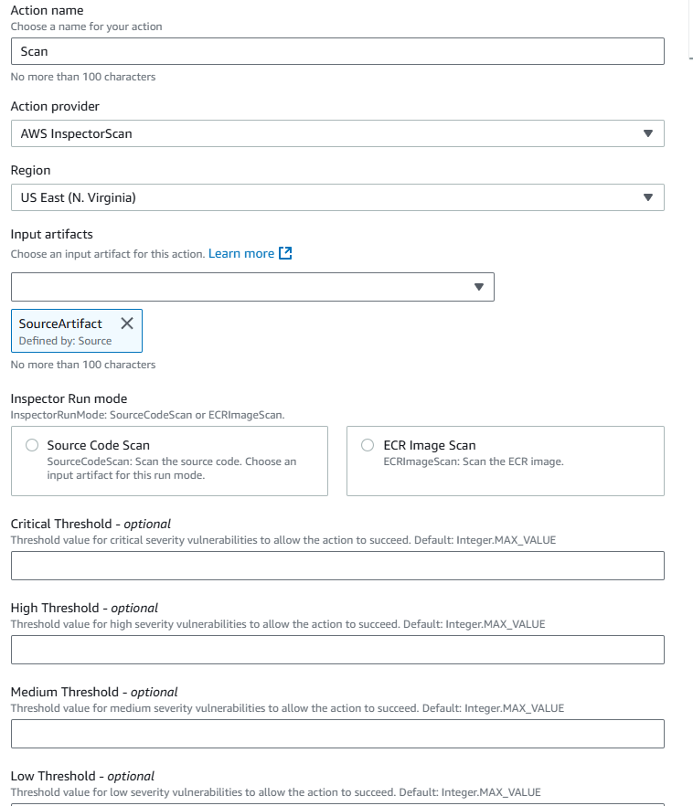

# Amazon Inspector `InspectorScan` invoke

action reference

Amazon Inspector is a vulnerability management service that automatically discovers workloads and
continually scans them for software vulnerabilities and unintended network exposure. The
`InspectorScan` action in CodePipeline automates detecting and fixing security
vulnerabilities in your open source code. The action is a managed compute action with
security scanning capabilities. You can use InspectorScan with application source code in
your third-party repository, such as GitHub or Bitbucket Cloud, or with images for container
applications. Your action will scan and report on vulnerability levels and alerts that you
configure.

###### Important

This action uses CodePipeline managed CodeBuild compute to run commands in a build environment.
Running the action will incur separate charges in AWS CodeBuild.

###### Topics

- [Action type ID](#action-reference-InspectorScan-type "#action-reference-InspectorScan-type")
- [Configuration parameters](#action-reference-InspectorScan-parameters "#action-reference-InspectorScan-parameters")
- [Input artifacts](#action-reference-InspectorScan-input "#action-reference-InspectorScan-input")
- [Output artifacts](#action-reference-InspectorScan-output "#action-reference-InspectorScan-output")
- [Output variables](#w2aac55c62c19 "#w2aac55c62c19")
- [Service role permissions:
  InspectorScan action](#edit-role-InspectorScan "#edit-role-InspectorScan")
- [Action declaration](#w2aac55c62c23 "#w2aac55c62c23")
- [See also](#action-reference-InspectorScan-links "#action-reference-InspectorScan-links")

## Action type ID

- Category: `Invoke`
- Owner: `AWS`
- Provider: `InspectorScan`
- Version: `1`

Example:

```

            {
                "Category": "Invoke",
                "Owner": "AWS",
                "Provider": "InspectorScan",
                "Version": "1"
            },
```

## Configuration parameters

**InspectorRunMode**

(Required) The string that indicates the mode of the scan. Valid values
are `SourceCodeScan | ECRImageScan`.

**ECRRepositoryName**

The name of the Amazon ECR repository where the image was pushed.

**ImageTag**

The tag used for the image.

The parameters for this action scan for levels of vulnerability that you specify. The
following levels for vulnerability thresholds are available:

**CriticalThreshold**

The number of critical severity vulnerabilities found in your source
beyond which CodePipeline should fail the action.

**HighThreshold**

The number of high severity vulnerabilities found in your source beyond
which CodePipeline should fail the action.

**MediumThreshold**

The number of medium severity vulnerabilities found in your source beyond
which CodePipeline should fail the action.

**LowThreshold**

The number of low severity vulnerabilities found in your source beyond
which CodePipeline should fail the action.



## Input artifacts

- **Number of artifacts:**
  `1`
- **Description:** The source code to scan for
  vulnerabilities. If the scan is for an ECR repository, this input artifact is
  not needed.

## Output artifacts

- **Number of artifacts:**
  `1`
- **Description:** Vulnerability details of your
  source in the form of a Software Bill of Materials (SBOM) file.

## Output variables

When configured, this action produces variables that can be referenced by the action
configuration of a downstream action in the pipeline. This action produces variables
which can be viewed as output variables, even if the action doesn't have a namespace.
You configure an action with a namespace to make those variables available to the
configuration of downstream actions.

For more information, see [Variables reference](reference-variables.md "reference-variables.md").

**HighestScannedSeverity**

The highest severity output from the scan. Valid values are `medium |
 high | critical`.

## Service role permissions:

`InspectorScan` action

For the `InspectorScan` action support, add the following to your policy
statement:

```
{
        "Effect": "Allow",
        "Action": "inspector-scan:ScanSbom",
        "Resource": "*"
    },
    {
        "Effect": "Allow",
        "Action": [
            "ecr:GetDownloadUrlForLayer",
            "ecr:BatchGetImage",
            "ecr:BatchCheckLayerAvailability"
        ],
        "Resource": "`resource_ARN`"
    },
```

In addition, if not already added for the Commands action, add the following
permissions to your service role in order to view CloudWatch logs.

```
{
    "Effect": "Allow",
    "Action": [
        "logs:CreateLogGroup",
        "logs:CreateLogStream",
        "logs:PutLogEvents"
    ],
    "Resource": "`resource_ARN`"
},
```

###### Note

Scope down the permissions to the pipeline resource level by using resource-based
permissions in the service role policy statement.

## Action declaration

YAML

```
name: Scan
actionTypeId:
  category: Invoke
  owner: AWS
  provider: InspectorScan
  version: '1'
runOrder: 1
configuration:
  InspectorRunMode: SourceCodeScan
outputArtifacts:
- name: output
inputArtifacts:
- name: SourceArtifact
region: us-east-1
```

JSON

```
{
                        "name": "Scan",
                        "actionTypeId": {
                            "category": "Invoke",
                            "owner": "AWS",
                            "provider": "InspectorScan",
                            "version": "1"
                        },
                        "runOrder": 1,
                        "configuration": {
                            "InspectorRunMode": "SourceCodeScan"
                        },
                        "outputArtifacts": [
                            {
                                "name": "output"
                            }
                        ],
                        "inputArtifacts": [
                            {
                                "name": "SourceArtifact"
                            }
                        ],
                        "region": "us-east-1"
                    },
```

## See also

The following related resources can help you as you work with this action.

- For more information about Amazon Inspector, see the [Amazon Inspector](http://aws.amazon.com/inspector/ "http://aws.amazon.com/inspector/") User Guide.
