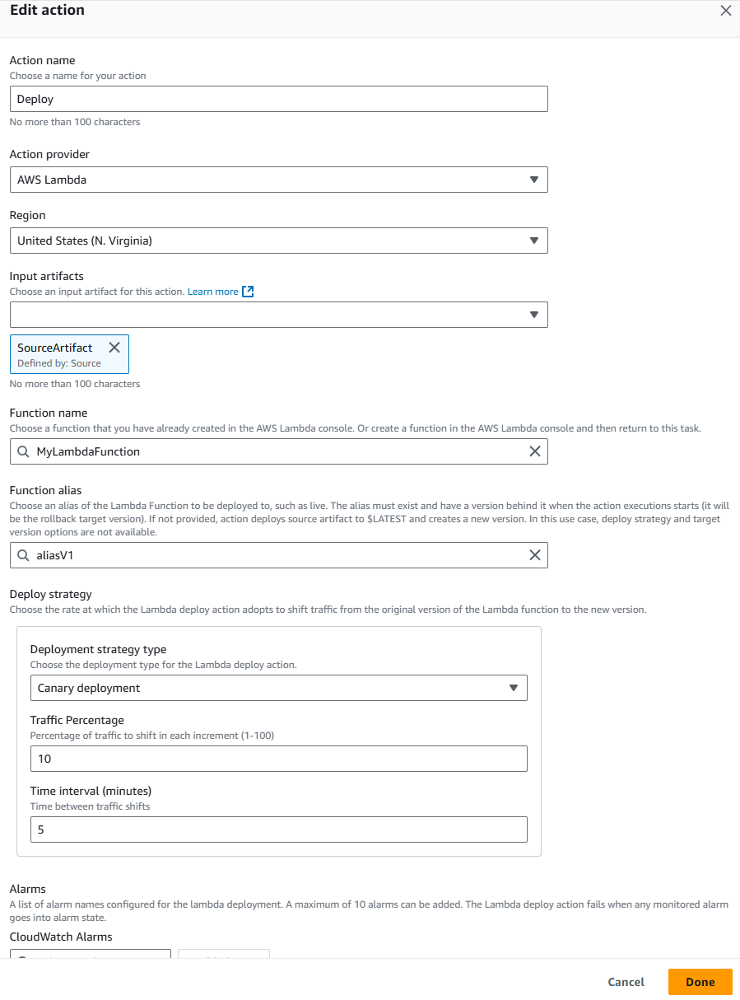

# AWS Lambda deploy action reference

You use an AWS Lambda deploy action to manage deploying your application code for your
serverless deployment. You can deploy a function and use deployment strategies for traffic
deployment as follows:

- Canary and
  linear
  deployments
  for traffic shifting
- All at once
  deployments

###### Note

This action is only supported for V2 type pipelines.

###### Topics

- [Action type](#action-reference-LambdaDeploy-type "#action-reference-LambdaDeploy-type")
- [Configuration parameters](#action-reference-LambdaDeploy-parameters "#action-reference-LambdaDeploy-parameters")
- [Input artifacts](#action-reference-LambdaDeploy-input "#action-reference-LambdaDeploy-input")
- [Output artifacts](#action-reference-LambdaDeploy-output "#action-reference-LambdaDeploy-output")
- [Output variables](#action-reference-LambdaDeploy-output-variables "#action-reference-LambdaDeploy-output-variables")
- [Service role policy
  permissions for the
  Lambda
  deploy action](#action-reference-LambdaDeploy-permissions-action "#action-reference-LambdaDeploy-permissions-action")
- [Action declaration](#action-reference-LambdaDeploy-example "#action-reference-LambdaDeploy-example")
- [See also](#action-reference-LambdaDeploy-links "#action-reference-LambdaDeploy-links")

## Action type

- Category: `Deploy`
- Owner: `AWS`
- Provider:
  `Lambda`
- Version: `1`

## Configuration parameters

**FunctionName**

Required: Yes

The name of the function that you created in Lambda, such as
`MyLambdaFunction`.

You must have already created a version.

**FunctionAlias**

Required: No

The alias of the function that you created in Lambda and is the function to
be deployed to, such as `live`. The alias must exist and has one
version behind it when the action executions starts. (It will be the
rollback target version.)

If not provided, the action deploys the source artifact to
`$LATEST` and creates a new version. In this use case, the
deploy strategy and target version options are not available.

**PublishedTargetVersion**

Required: No

The desired Lambda Function version to be deployed to FunctionAlias. It
can be pipeline or action level variables, such as
`#{variables.lambdaTargetVersion}`. The version must be
published when action execution starts.

Required if no input artifact is provided.

**DeployStrategy**

Required:
No
(Default is
`AllAtOnce`)

Determines the rate that the Lambda deploy action adopts to shift traffic
from the original version of the Lambda function to the new version for
**FunctionAlias**. Available deploy
strategies are canary or linear. Accepted formats:

- `AllAtOnce` -

Shifts all traffic to the updated Lambda functions at once.

If not specified, the default is `AllAtOnce`)

- `Canary10Percent5Minutes` - Shifts 10 percent of
  traffic in the first increment. The remaining 90 percent is deployed
  five minutes later.

The values for both percentage and minutes can be changed.

- `Linear10PercentEvery1Minute` - Shifts 10 percent of
  traffic every minute until all traffic is shifted.

The values for both percentage and minutes can be changed.

The following considerations apply for this field:

- Maximum total wait time is 2 days.
- Only available when **FunctionAlias**
  is provided.

**Alarms**

Required: No

A comma-separated list of alarm names configured for the Lambda
deployment. A maximum of 10 alarms can be added. The action fails when
monitored alarms go to the ALARM state.

The following image shows an example of the Edit page for the action.



## Input artifacts

- **Number of artifacts:**
  `1`
- **Description:** The files provided, if any, to
  support the script actions during the deployment.

## Output artifacts

- **Number of artifacts:**
  `0`
- **Description:** Output artifacts do not apply
  for this action type.

## Output variables

When configured, this action produces variables that can be referenced by the action
configuration of a downstream action in the pipeline. This action produces variables
which can be viewed as output variables, even if the action doesn't have a namespace.
You configure an action with a namespace to make those variables available to the
configuration of downstream actions.

For more information, see [Variables reference](reference-variables.md "reference-variables.md").

**FunctionVersion**

The new Lambda function version that was deployed.

## Service role policy

permissions for the
Lambda
deploy action

When CodePipeline runs the action, CodePipeline service role requires the following permissions,
appropriately scoped down for access with least privilege.

JSON

```
`{
 "Version":"2012-10-17",
 "Statement": [
 {
 "Sid": "StatementForLambda",
 "Effect": "Allow",
 "Action": [
 "lambda:GetAlias",
 "lambda:GetFunctionConfiguration",
 "lambda:GetProvisionedConcurrencyConfig",
 "lambda:PublishVersion",
 "lambda:UpdateAlias",
 "lambda:UpdateFunctionCode"
 ],
 "Resource": [
 "arn:aws:lambda:us-east-1:`111122223333`:function:{{FunctionName}}",
 "arn:aws:lambda:us-east-1:`111122223333`:function:{{FunctionName}}:*"
 ]
 },
 {
 "Sid": "StatementForCloudWatch",
 "Effect": "Allow",
 "Action": [
 "cloudwatch:DescribeAlarms"
 ],
 "Resource": [
 "arn:aws:cloudwatch:us-east-1:`111122223333`:alarm:{{AlarmNames}}"
 ]
 },
 {
 "Sid": "StatementForLogs1",
 "Effect": "Allow",
 "Action": [
 "logs:CreateLogGroup"
 ],
 "Resource": [
 "arn:aws:logs:us-east-1:`111122223333`:log-group:/us-east-1/codepipeline/{{pipelineName}}",
 "arn:aws:logs:us-east-1:`111122223333`:log-group:/us-east-1/codepipeline/{{pipelineName}}:*"
 ]
 },
 {
 "Sid": "StatementForLogs2",
 "Effect": "Allow",
 "Action": [
 "logs:CreateLogStream",
 "logs:PutLogEvents"
 ],
 "Resource": [
 "arn:aws:logs:us-east-1:`111122223333`:log-group:/us-east-1/codepipeline/{{pipelineName}}:log-stream:*"
 ]
 }
 ]
}`

```

## Action declaration

YAML

```
name: Deploy
actionTypeId:
  category: Deploy
  owner: AWS
  provider: Lambda
  version: '1'
runOrder: 1
configuration:
  DeployStrategy: Canary10Percent5Minutes
  FunctionAlias: aliasV1
  FunctionName: MyLambdaFunction
outputArtifacts: []
inputArtifacts:
- name: SourceArtifact
region: us-east-1
namespace: DeployVariables
```

JSON

```
{
    "name": "Deploy",
    "actionTypeId": {
        "category": "Deploy",
        "owner": "AWS",
        "provider": "Lambda",
        "version": "1"
    },
    "runOrder": 1,
    "configuration": {
        "DeployStrategy": "Canary10Percent5Minutes",
        "FunctionAlias": "aliasV1",
        "FunctionName": "MyLambdaFunction"
    },
    "outputArtifacts": [],
    "inputArtifacts": [
        {
            "name": "SourceArtifact"
        }
    ],
    "region": "us-east-1",
    "namespace": "DeployVariables"
},
```

## See also

The following related resources can help you as you work with this action.

- [Tutorial: Lambda
  function
  deployments with CodePipeline](tutorials-lambda-deploy.md "tutorials-lambda-deploy.md") – This tutorial walks you through the creation of a
  sample
  Lambda function where you
  will
  create an alias and version, add the zipped Lambda function to your source
  location, and run the Lambda action in your
  pipeline.
