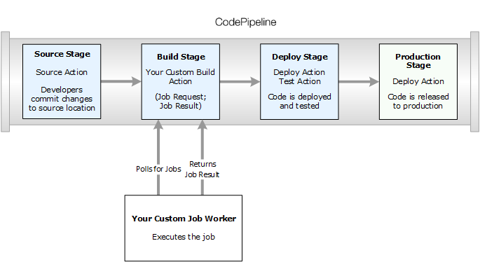
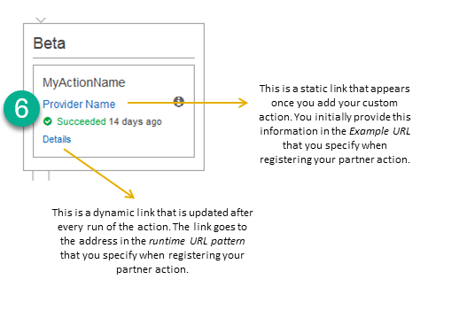
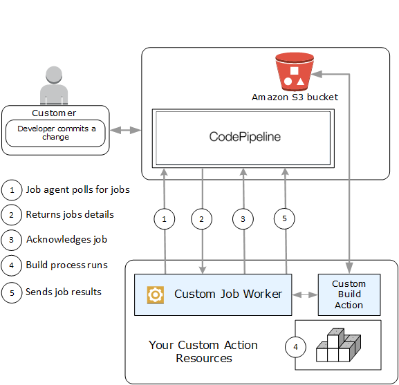

# Create and add a custom action in

CodePipeline

AWS CodePipeline includes a number of actions that help you configure build, test, and deploy
resources for your automated release process. If your release process includes activities
that are not included in the default actions, such as an internally developed build process
or a test suite, you can create a custom action for that purpose and include it in your
pipeline. You can use the AWS CLI to create custom actions in pipelines associated with your
AWS account.

You can create custom actions for the following AWS CodePipeline action categories:

- A custom build action that builds or transforms the items
- A custom deploy action that deploys items to one or more servers, websites, or
  repositories
- A custom test action that configures and runs automated tests
- A custom invoke action that runs functions
  When you create a custom action, you must also create a job worker that will poll CodePipeline for job
  requests for this custom action, execute the job, and return the status result to CodePipeline. This job
  worker can be located on any computer or resource as long as it has access to the public
  endpoint for CodePipeline. To easily manage access and security, consider hosting your job worker
  on an Amazon EC2 instance.

The following diagram shows a high-level view of a pipeline that includes a custom build
action:


When a pipeline includes a custom action as part of a stage, the pipeline will create a job
request. A custom job worker detects that request and performs that job (in this example, a
custom process using third-party build software). When the action is complete, the job
worker returns either a success result or a failure result. If a success result is received,
the pipeline will provide the revision and its artifacts to the next action. If a failure is
returned, the pipeline will not provide the revision to the next action in the
pipeline.

###### Note

These instructions assume that you have already completed the steps in [Getting started with CodePipeline](getting-started-codepipeline.md "getting-started-codepipeline.md").

###### Topics

- [Create a custom action](#actions-create-custom-action-cli "#actions-create-custom-action-cli")
- [Create a job worker for your
  custom action](#actions-create-custom-action-job-worker "#actions-create-custom-action-job-worker")
- [Add a custom action to a
  pipeline](#actions-create-custom-action-add "#actions-create-custom-action-add")

## Create a custom action

###### To create a custom action with the AWS CLI

1. Open a text editor and create a JSON file for your custom action that includes
   the action category, the action provider, and any settings required by your
   custom action. For example, to create a custom build action that requires only
   one property, your JSON file might look like this:

```
{
    "category": "Build",
    "provider": "`My-Build-Provider-Name`",
    "version": "1",
    "settings": {
        "entityUrlTemplate": "https://`my-build-instance/job/{Config:ProjectName}/`",
        "executionUrlTemplate": "https://`my-build-instance/job/{Config:ProjectName}/lastSuccessfulBuild/{ExternalExecutionId}/`"
    },
    "configurationProperties": [{
        "name": "`ProjectName`",
        "required": true,
        "key": true,
        "secret": false,
        "queryable": false,
        "description": "`The name of the build project must be provided when this action is added to the pipeline.`",
        "type": "String"
    }],
    "inputArtifactDetails": {
        "maximumCount": `integer`,
        "minimumCount": `integer`
    },
    "outputArtifactDetails": {
        "maximumCount": `integer`,
        "minimumCount": `integer`
    },
    "tags": [{
      "key": "Project",
      "value": "ProjectA"
    }]
}
```

This example adds tagging to the custom action by including the
`Project` tag key and `ProjectA` value on the custom
action. For more information about tagging resources in CodePipeline, see [Tagging resources](tag-resources.md "tag-resources.md").

There are two properties included in the JSON file,
`entityUrlTemplate` and `executionUrlTemplate`. You
can refer to a name in the configuration properties of the custom action within
the URL templates by following the format of
`{Config:`name`}`, as long as the
configuration property is both required and not secret. For example, in the
sample above, the `entityUrlTemplate` value refers to the
configuration property `ProjectName`.

    * `entityUrlTemplate`: the static link that provides
     information about the service provider for the action. In the example,
     the build system includes a static link to each build project. The link
     format will vary, depending on your build provider (or, if you are
     creating a different action type, such as test, other service provider).
     You must provide this link format so that when the custom action is
     added, the user can choose this link to open a browser to a page on your
     website that provides the specifics for the build project (or test
     environment).
    * `executionUrlTemplate`: the dynamic link that will be
     updated with information about the current or most recent run of the
     action. When your custom job worker updates the status of a job (for
     example, success, failure, or in progress), it will also provide an
     `externalExecutionId` that will be used to complete the
     link. This link can be used to provide details about the run of an
     action.

For example, when you view the action in the pipeline, you see the following
two links:




This static link appears after you add your custom action
and points to the address in `entityUrlTemplate`, which you specify
when you create your custom action.


This dynamic link is updated after every run of the action
and points to the address in `executionUrlTemplate`, which you
specify when you create your custom action.

For more information about these link types, as well as
`RevisionURLTemplate` and `ThirdPartyURL`, see [ActionTypeSettings](../APIReference/API_ActionTypeSettings.md "../APIReference/API_ActionTypeSettings.md")
and [CreateCustomActionType](../APIReference/API_CreateCustomActionType.md "../APIReference/API_CreateCustomActionType.md") in the [CodePipeline API
Reference](../APIReference.md "../APIReference.md"). For more information about action structure requirements
and how to create an action, see [CodePipeline pipeline structure reference](reference-pipeline-structure.md "reference-pipeline-structure.md"). 2. Save the JSON file and give it a name you can easily remember (for example,
`MyCustomAction`.json). 3. Open a terminal session (Linux, OS X, Unix) or command prompt (Windows) on a
computer where you have installed the AWS CLI. 4. Use the AWS CLI to run the **aws codepipeline
create-custom-action-type** command, specifying the name of the JSON
file you just created.

For example, to create a build custom action:

###### Important

Be sure to include `file://` before the file name. It is required in this command.

```
aws codepipeline create-custom-action-type --cli-input-json file://`MyCustomAction`.json
```

5. This command returns the entire structure of the custom action you created, as
   well as the `JobList` action configuration property, which is added
   for you. When you add the custom action to a pipeline, you can use
   `JobList` to specify which projects from the provider you can
   poll for jobs. If you do not configure this, all available jobs will be returned
   when your custom job worker polls for jobs.

For example, the preceding command might return a structure similar to the
following:

```
{
    "actionType": {
        "inputArtifactDetails": {
            "maximumCount": 1,
            "minimumCount": 1
       },
       "actionConfigurationProperties": [
            {
                "secret": false,
                "required": true,
                "name": "`ProjectName`",
                "key": true,
                "description": "`The name of the build project must be provided when this action is added to the pipeline.`"
            }
        ],
        "outputArtifactDetails": {
            "maximumCount": 0,
            "minimumCount": 0
        },
        "id": {
            "category": "Build",
            "owner": "Custom",
            "version": "1",
            "provider": "`My-Build-Provider-Name`"
        },
        "settings": {
            "entityUrlTemplate": "https://`my-build-instance/job/{Config:ProjectName}/`",
            "executionUrlTemplate": "https://`my-build-instance/job/mybuildjob/lastSuccessfulBuild/{ExternalExecutionId}/`"
        }
    }
}
```

###### Note

As part of the output of the **create-custom-action-type**
command, the `id` section includes `"owner":
 "Custom"`. CodePipeline automatically assigns `Custom` as the
owner of custom action types. This value can't be assigned or changed when
you use the **create-custom-action-type** command or the
**update-pipeline** command.

## Create a job worker for your

custom action

Custom actions require a job worker that will poll CodePipeline for job requests for the
custom action, execute the job, and return the status result to CodePipeline. The job worker can be
located on any computer or resource as long as it has access to the public endpoint for
CodePipeline.

There are many ways to design your job worker. The following sections provide some
practical guidance for developing your custom job worker for CodePipeline.

###### Topics

- [Choose and configure a
  permissions management strategy for your job worker](#actions-create-custom-action-permissions "#actions-create-custom-action-permissions")
- [Develop a job
  worker for your custom action](#actions-create-custom-action-job-worker-workflow "#actions-create-custom-action-job-worker-workflow")
- [Custom job worker
  architecture and examples](#actions-create-custom-action-job-worker-common "#actions-create-custom-action-job-worker-common")

### Choose and configure a

permissions management strategy for your job worker

To develop a custom job worker for your custom action in CodePipeline, you will need a
strategy for the integration of user and permission management.

The simplest strategy is to add the infrastructure you need for your custom job
worker by creating Amazon EC2 instances with an IAM instance role, which allow you to
easily scale up the resources you need for your integration. You can use the
built-in integration with AWS to simplify the interaction between your custom job
worker and CodePipeline.

###### To set up Amazon EC2 instances

1. Learn more about Amazon EC2 and determine whether it is the right choice for
   your integration. For information, see [Amazon EC2 - Virtual Server Hosting](http://aws.amazon.com/ec2 "http://aws.amazon.com/ec2").
2. Get started creating your Amazon EC2 instances. For information, see [Getting Started with Amazon EC2 Linux
   Instances](../../../AWSEC2/latest/GettingStartedGuide.md "../../../AWSEC2/latest/GettingStartedGuide.md").

Another strategy to consider is using identity federation with IAM to integrate
your existing identity provider system and resources. This strategy is particularly
useful if you already have a corporate identity provider or are already configured
to support users using web identity providers. Identity federation allows you to
grant secure access to AWS resources, including CodePipeline, without having to create or
manage IAM users. You can use features and policies for password security
requirements and credential rotation. You can use sample applications as templates
for your own design.

###### To set up identity federation

1. Learn more about IAM identity federation. For information, see [Manage
   Federation](http://aws.amazon.com/iam/details/manage-federation/ "http://aws.amazon.com/iam/details/manage-federation/").
2. Review the examples in [Scenarios for Granting Temporary Access](../../../STS/latest/UsingSTS/STSUseCases.md "../../../STS/latest/UsingSTS/STSUseCases.md") to identify the
   scenario for temporary access that best fits the needs of your custom
   action.
3. Review code examples of identity federation relevant to your
   infrastructure, such as:
   - [Identity
     Federation Sample Application for an Active Directory Use
     Case](http://aws.amazon.com/code/1288653099190193 "http://aws.amazon.com/code/1288653099190193")

4. Get started configuring identity federation. For information, see [Identity Providers and
   Federation](../../../IAM/latest/UserGuide/id_roles_providers.md "../../../IAM/latest/UserGuide/id_roles_providers.md") in _IAM User Guide_.

Ceate
one of the following to use under
your
AWS account
when running your custom action and job
worker.

Users need programmatic access if they want to interact with AWS outside of the AWS Management Console. The way to grant programmatic access depends on the type of user that's accessing AWS.

To grant users programmatic access, choose one of the following options.

| Which user needs programmatic access?                     | To                                                                                                              | By                                                                                                                                                                                                                                                                                                                                                                                                                                                                                                                                                                                                                                                                                                                                                             |
| --------------------------------------------------------- | --------------------------------------------------------------------------------------------------------------- | -------------------------------------------------------------------------------------------------------------------------------------------------------------------------------------------------------------------------------------------------------------------------------------------------------------------------------------------------------------------------------------------------------------------------------------------------------------------------------------------------------------------------------------------------------------------------------------------------------------------------------------------------------------------------------------------------------------------------------------------------------------- | ------------------------------------------------------------------------------------------------------------------------------------------------------------------------------------------------------------------------------------------------------------------------------------------------------------------------------------------------------------------------------------------------------------------------------------------------------------------------------------------------------------------------------------------------------------------------------------------------------------------------------------------------------------------------------------------------------------------------------------------------------------------------------------------------------------------------------------------------------------------------------------------------------------------------------------------------------------------------------------------------------------------------------------------------------------------------------------------------------------------------------------------------------------------------------------------------------------------------------------------------------------------------------------------------------------------------------------------------------------------------------------------------------------------------------------------------------------------------------------------------------------------------------------------------------------------------------------------------------------------------------------------------------------------------------------------------------------------------------------------------------------------------------------------------------------------------------------------------------------------------------------------------------------------------------------------------------------------------------------------------------------------------------------------------------------------------------------------------------------------------------------------------------------------------------------------------------------------------------------------------------------------------------------------------------------------------------------------------------------------------------------------------------------------------------------------------------------------------------------------------------------------------------------------------------------------------------------------------------------------------------------------------------------------------------------------------------------------------------------------------------------------------------------------------------------------------------------------------------------------------------------------------------------------------------------------------------------------------------------------------------------------------------------------------------------------------------------------------------------------------------------------------------------------------------------------------------------------------------------------------------------------------------------------------------------------------------------------------------------------------------------------------------------------------------------------------------------------------------------------------------------------------------------------------------------------------------------------------------------------------------------------------------------------------------------------------------------------------------------------------------------------------------------------------------------------------------------------------------------------------------------------------------------------------------------------------------------------------------------------------------------------------------------------------------------------------------------------------------------------------------------------------------------------------------------------------------------------------------------------------------------------------------------------------------------------------------------------------------------------------------------------------------------------------------------------------------------------------------------------------------------------------------------------------------------------------------------------------------------------------------------------------------------------------------------------------------------------------------------------------------------------------------------------------------------------------------------------------------------------------------------------------------------------------------------------------------------------------------------------------------------------------------------------------------------------------------------------------------------------------------------------------------------------------------------------------------------------------------------------------------------------------------------------------------------------------------------------------------------------------------------------------------------------------------------------------------------------------------------------------------------------------------------------------------------------------------------------------------------------------------------------------------------------------------------------------------------------------------------------------------------------------------------------------------------------------------------------------------------------------------------------------------------------------------------------------------------------------------------------------------------------------------------------------------------------------------------------------------------------------------------------------------------------------------------------------------------------------------------------------------------------------------------------------------------------------------------------------------------------------------------------------------------------------------------------------------------------------------------------------------------------------------------------------------------------------------------------------------------------------------------------------------------------------------------------------------------------------------------------------------------------------------------------------------------------------------------------------------------------------------------------------------------------------------------------------------------------------------------------------------------------------------------------------------------------------------------------------------------------------------------------------------------------------------------------------------------------------------------------------------------------------------------------------------------------------------------------------------------------------------------------------------------------------------------------------------------------------------------------------------------------------------------------------------------------------------------------------------------------------------------------------------------------------------------------------------------------------------------------------------------------------------------------------------------------------------------------------------------------------------------------------------------------------------------------------------------------------------------------------------------------------------------------------------------------------------------------------------------------------------------------------------------------------------------------------------------------------------------------------------------------------------------------------------------------------------------------------------------------------------------------------------------------------------------------------------------------------------------------------------------------------------------------------------------------------------------------------------------------------------------------------------------------------------------------------------------------------------------------------------------------------------------------------------------------------------------------------------------------------------------------------------------------------------------------------------------------------------------------------------------------------------------------------------------------------------------------------------------------------------------------------------------------------------------------------------------------------------------------------------------------------------------------------------------------------------------------------------------------------------------------------------------------------------------------------------------------------------------------------------------------------------------------------------------------------------------------------------------------------------------------------------------------------------------------------------------------------------------------------------------------------------------------------------------------------------------------------------------------------------------------------------------------------------------------------------------------------------------------------------------------------------------------------------------------------------------------------------------------------------------------------------------------------------------------------------------------------------------------------------------------------------------------------------------------------------------------------------------------------------------------------------------------------------------------------------------------------------------------------------------------------------------------- |
| Workforce identity (Users managed in IAM Identity Center) | Use temporary credentials to sign programmatic requests to the AWS CLI, AWS SDKs, or AWS APIs.                  | Following the instructions for the interface that you want to use. <br>• For the AWS CLI, see [Configuring the AWS CLI to use AWS IAM Identity Center](../../../cli/latest/userguide/cli-configure-sso.md "../../../cli/latest/userguide/cli-configure-sso.md") in the _AWS Command Line Interface User Guide_. <br>• For AWS SDKs, tools, and AWS APIs, see [IAM Identity Center authentication](../../../sdkref/latest/guide/access-sso.md "../../../sdkref/latest/guide/access-sso.md") in the _AWS SDKs and Tools Reference Guide_.                                                                                                                                                                                                                        |
| IAM                                                       | Use temporary credentials to sign programmatic requests to the AWS CLI, AWS SDKs, or AWS APIs.                  | Following the instructions in [Using temporary credentials with AWS resources](../../../IAM/latest/UserGuide/id_credentials_temp_use-resources.md "../../../IAM/latest/UserGuide/id_credentials_temp_use-resources.md") in the _IAM User Guide_.                                                                                                                                                                                                                                                                                                                                                                                                                                                                                                               |
| IAM                                                       | (Not recommended)Use long-term credentials to sign programmatic requests to the AWS CLI, AWS SDKs, or AWS APIs. | Following the instructions for the interface that you want to use. <br>• For the AWS CLI, see [Authenticating using IAM user credentials](../../../cli/latest/userguide/cli-authentication-user.md "../../../cli/latest/userguide/cli-authentication-user.md") in the _AWS Command Line Interface User Guide_. <br>• For AWS SDKs and tools, see [Authenticate using long-term credentials](../../../sdkref/latest/guide/access-iam-users.md "../../../sdkref/latest/guide/access-iam-users.md") in the _AWS SDKs and Tools Reference Guide_. <br>• For AWS APIs, see [Managing access keys for IAM users](../../../IAM/latest/UserGuide/id_credentials_access-keys.md "../../../IAM/latest/UserGuide/id_credentials_access-keys.md") in the _IAM User Guide_. | The following is an example policy you might create for use with your custom job worker. This policy is meant as an example only and is provided as-is. JSON `` `{ "Version":"2012-10-17", "Statement": [ { "Effect": "Allow", "Action": [ "codepipeline:PollForJobs", "codepipeline:AcknowledgeJob", "codepipeline:GetJobDetails", "codepipeline:PutJobSuccessResult", "codepipeline:PutJobFailureResult" ], "Resource": [ "arn:aws:codepipeline:`us-east-2`::actionType:custom/Build/`MyBuildProject`/1/" ] } ] }` `` ###### Note Consider using the `AWSCodePipelineCustomActionAccess` managed policy. ### Develop a job worker for your custom action After you've chosen your permissions management strategy, you should consider how your job worker will interact with CodePipeline. The following high-level diagram shows the workflow of a custom action and job worker for a build process.  1. Your job worker polls CodePipeline for jobs using `PollForJobs`. 2. When a pipeline is triggered by a change in its source stage (for example, when a developer commits a change), the automated release process begins. The process continues until the stage at which your custom action has been configured. When it reaches your action in this stage, CodePipeline queues a job. This job will appear if your job worker calls `PollForJobs` again to get status. Take the job detail from `PollForJobs` and pass it back to your job worker. 3. The job worker calls `AcknowledgeJob` to send CodePipeline a job acknowledgment. CodePipeline returns an acknowledgment that indicates the job worker should continue the job (`InProgress`), or, if you have more than one job worker polling for jobs and another job worker has already claimed the job, an `InvalidNonceException` error response will be returned. After the `InProgress` acknowledgment, CodePipeline waits for results to be returned. 4. The job worker initiates your custom action on the revision, and then your action runs. Along with any other actions, your custom action returns a result to the job worker. In the example of a build custom action, the action pulls artifacts from the Amazon S3 bucket, builds them, and pushes successfully built artifacts back to the Amazon S3 bucket. 5. While the action is running, the job worker can call `PutJobSuccessResult` with a continuation token (the serialization of the state of the job generated by the job worker, for example a build identifier in JSON format, or an Amazon S3 object key), as well as the `ExternalExecutionId` information that will be used to populate the link in `executionUrlTemplate`. This will update the console view of the pipeline with a working link to specific action details while it is in progress. Although not required, it is a best practice because it enables users to view the status of your custom action while it runs. Once `PutJobSuccessResult` is called, the job is considered complete. A new job is created in CodePipeline that includes the continuation token. This job will appear if your job worker calls `PollForJobs` again. This new job can be used to check on the state of the action, and either returns with a continuation token, or returns without a continuation token once the action is complete. ###### Note If your job worker performs all the work for a custom action, you should consider breaking your job worker processing into at least two steps. The first step establishes the details page for your action. Once you have created the details page, you can serialize the state of the job worker and return it as a continuation token, subject to size limits (see [Quotas in AWS CodePipeline](limits.md "limits.md")). For example, you could write the state of the action into the string you use as the continuation token. The second step (and subsequent steps) of your job worker processing perform the actual work of the action. The final step returns success or failure to CodePipeline, with no continuation token on the final step. For more information about using the continuation token, see the specifications for `PutJobSuccessResult` in the [CodePipeline API Reference](../APIReference.md "../APIReference.md"). 6. Once the custom action completes, the job worker returns the result of the custom action to CodePipeline by calling one of two APIs: <br>• `PutJobSuccessResult` without a continuation token, which indicates the custom action ran successfully <br>• `PutJobFailureResult`, which indicates the custom action did not run successfully Depending on the result, the pipeline will either continue on to the next action (success) or stop (failure). ### Custom job worker architecture and examples After you have mapped out your high-level workflow, you can create your job worker. Although the specifics of your custom action will ultimately determine what is needed for your job worker, most job workers for custom actions include the following functionality: <br>• Polling for jobs from CodePipeline using `PollForJobs`. <br>• Acknowledging jobs and returning results to CodePipeline using `AcknowledgeJob`, `PutJobSuccessResult`, and `PutJobFailureResult`. <br>• Retrieving artifacts from and/or putting artifacts into the Amazon S3 bucket for the pipeline. To download artifacts from the Amazon S3 bucket, you must create an Amazon S3 client that uses Signature Version 4 signing (Sig V4). Sig V4 is required for AWS KMS. To upload artifacts to the Amazon S3 bucket, you must additionally configure the Amazon S3 `PutObject` request to use encryption. Currently only AWS Key Management Service (AWS KMS) is supported for encryption. AWS KMS uses AWS KMS keys. In order to know whether to use an AWS managed key or a customer managed key to upload artifacts, your custom job worker must look at the [job data](../APIReference/API_JobData.md "../APIReference/API_JobData.md") and check the [encryption key](../APIReference/API_EncryptionKey.md "../APIReference/API_EncryptionKey.md") property. If the property is set, you should use that customer managed key ID when configuring AWS KMS. If the key property is null, you use the AWS managed key. CodePipeline uses the AWS managed key unless otherwise configured. For an example that shows how to create the AWS KMS parameters in Java or .NET, see [Specifying the AWS Key Management Service in Amazon S3 Using the AWS SDKs](../../../AmazonS3/latest/userguide/kms-using-sdks.md "../../../AmazonS3/latest/userguide/kms-using-sdks.md"). For more information about the Amazon S3 bucket for CodePipeline, see [CodePipeline concepts](concepts.md "concepts.md"). A more complex example of a custom job worker is available on GitHub. This sample is open source and provided as-is. <br>• [Sample Job Worker for CodePipeline](https://github.com/awslabs/aws-codepipeline-custom-job-worker "https://github.com/awslabs/aws-codepipeline-custom-job-worker"): Download the sample from the GitHub repository. ## Add a custom action to a pipeline After you have a job worker, you can add your custom action to a pipeline by creating a new one and choosing it when you use the Create Pipeline wizard, by editing an existing pipeline and adding the custom action, or by using the AWS CLI, the SDKs, or the APIs. ###### Note You can create a pipeline in the Create Pipeline wizard that includes a custom action if it is a build or deploy action. If your custom action is in the test category, you must add it by editing an existing pipeline. ###### Topics <br>• [Add a custom action to an existing pipeline (CLI)](#actions-create-custom-action-add-cli "#actions-create-custom-action-add-cli") ### Add a custom action to an existing pipeline (CLI) You can use the AWS CLI to add a custom action to an existing pipeline. 1. Open a terminal session (Linux, macOS, or Unix) or command prompt (Windows) and run the **get-pipeline** command to copy the pipeline structure you want to edit into a JSON file. For example, for a pipeline named `MyFirstPipeline`, you would type the following command: `` aws codepipeline get-pipeline --name `MyFirstPipeline` >`pipeline.json` `` This command returns nothing, but the file you created should appear in the directory where you ran the command. 2. Open the JSON file in any text editor and modify the structure of the file to add your custom action to an existing stage. ###### Note If you want your action to run in parallel with another action in that stage, make sure you assign it the same `runOrder` value as that action. For example, to modify the structure of a pipeline to add a stage named Build and to add a build custom action to that stage, you might modify the JSON to add the Build stage before a deployment stage as follows: `` `, { "name": "MyBuildStage", "actions": [ { "inputArtifacts": [ { "name": "MyApp" } ], "name": "MyBuildCustomAction", "actionTypeId": { "category": "Build", "owner": "Custom", "version": "1", "provider": "My-Build-Provider-Name" }, "outputArtifacts": [ { "name": "MyBuiltApp" } ], "configuration": { "ProjectName": "MyBuildProject" }, "runOrder": 1 } ] }`, { "name": "Staging", "actions": [ { "inputArtifacts": [ { "name": "MyBuiltApp" } ], "name": "Deploy-CodeDeploy-Application", "actionTypeId": { "category": "Deploy", "owner": "AWS", "version": "1", "provider": "CodeDeploy" }, "outputArtifacts": [], "configuration": { "ApplicationName": "CodePipelineDemoApplication", "DeploymentGroupName": "CodePipelineDemoFleet" }, "runOrder": 1 } ] } ] } `` 3. To apply your changes, run the **update-pipeline** command, specifying the pipeline JSON file, similar to the following: ###### Important Be sure to include `file://` before the file name. It is required in this command. `` aws codepipeline update-pipeline --cli-input-json file://`pipeline.json` `` This command returns the entire structure of the edited pipeline. 4. Open the CodePipeline console and choose the name of the pipeline you just edited. The pipeline shows your changes. The next time you make a change to the source location, the pipeline will run that revision through the revised structure of the pipeline. |
