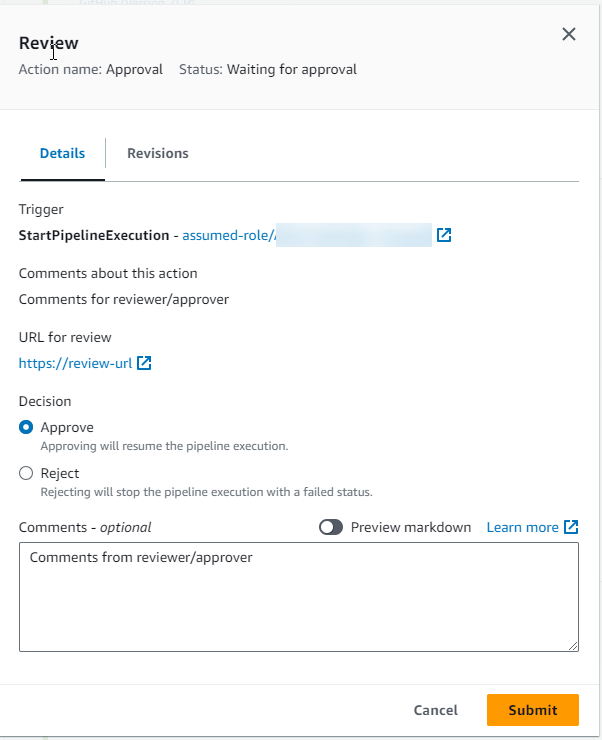
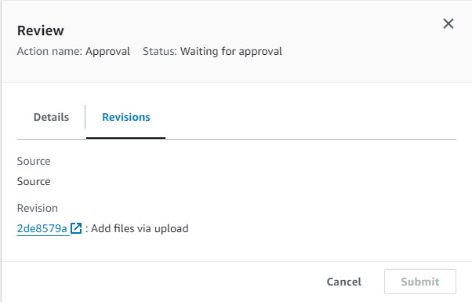

# Approve or reject an approval action in

CodePipeline

When a pipeline includes an approval action, the pipeline execution stops at the point
where the action has been added. The pipeline won't resume unless someone manually
approves the action. If an approver rejects the action, or if no approval response is
received within seven days of the pipeline stopping for the approval action, the
pipeline status becomes "Failed."

If the person who added the approval action to the pipeline configured notifications,
you might receive an email with the pipeline information and status for approval.

## Approve or reject an approval

action (console)

If you receive a notification that includes a direct link to an approval action,
choose the **Approve or reject** link, sign in to the console, and
then continue with step 7 here. Otherwise, follow all of these steps.

1. Open the CodePipeline console at
   [https://console.aws.amazon.com/codepipeline/](https://console.aws.amazon.com/codepipeline/ "https://console.aws.amazon.com/codepipeline/").
2. On the **All Pipelines** page, choose the name of the
   pipeline.
3. Locate the stage with the approval
   action.
   Choose **Review**.

The **Review** dialog box displays. The
**Details** tab shows the review content and
comments.



The **Revisions** tab shows the source revisions for the
execution.

 4. On
the **Details** tab, view the comments
and URL, if any. The message also displays the URL of content for you to
review, if one was included. 5. If a URL was provided, choose the
**URL
for review** link in the action to open the
target webpage, and then review the content. 6. In the
**Review**
window, enter review comments, such as why you are approving or rejecting
the action, and then choose **Approve** or
**Reject**. 7. Choose **Submit**.

## Approve or reject an approval

request (CLI)

To use the CLI to respond to an approval action, you must first use the
**get-pipeline-state** command to retrieve the token associated
with latest execution of the approval action.

1. At a terminal (Linux, macOS, or Unix) or command prompt (Windows), run the [get-pipeline-state](../../../cli/latest/reference/codepipeline/get-pipeline-state.md "../../../cli/latest/reference/codepipeline/get-pipeline-state.md")
   command on the pipeline that contains the approval action. For example, for
   a pipeline named `MyFirstPipeline`, enter
   the following:

```
aws codepipeline get-pipeline-state --name `MyFirstPipeline`
```

2. In the response to the command, locate the `token` value, which
   appears in `latestExecution` in the `actionStates`
   section for the approval action, as shown here:

```
{
    "created": 1467929497.204,
    "pipelineName": "MyFirstPipeline",
    "pipelineVersion": 1,
    "stageStates": [
        {
            "actionStates": [
                {
                    "actionName": "MyApprovalAction",
                    "currentRevision": {
                        "created": 1467929497.204,
                        "revisionChangeId": "CEM7d6Tp7zfelUSLCPPwo234xEXAMPLE",
                        "revisionId": "HYGp7zmwbCPPwo23xCMdTeqIlEXAMPLE"
                    },
                    "latestExecution": {
                        "lastUpdatedBy": "`identity`",
                        "summary": "The new design needs to be reviewed before release.",
                        "token": "`1a2b3c4d-573f-4ea7-a67E-XAMPLETOKEN`"
                    }
                }
//More content might appear here
}
```

3.  In a plain-text editor, create a file where you add the following, in JSON
    format:

        * The name of the pipeline that contains the approval action.
        * The name of the stage that contains the approval action.
        * The name of the approval action.
        * The token value you collected in the previous step.
        * Your response to the action (Approved or Rejected). The response
         must be capitalized.
        * Your summary comments.

    For the preceding `MyFirstPipeline`
    example, your file should look like this:

```
{
  "pipelineName": "`MyFirstPipeline`",
  "stageName": "`MyApprovalStage`",
  "actionName": "`MyApprovalAction`",
  "token": "`1a2b3c4d-573f-4ea7-a67E-XAMPLETOKEN`",
  "result": {
    "status": "`Approved`",
    "summary": "`The new design looks good. Ready to release to customers.`"
  }
}
```

4. Save the file with a name like
   `approvalstage-approved.json`.
5. Run the [put-approval-result](../../../cli/latest/reference/codepipeline/put-approval-result.md "../../../cli/latest/reference/codepipeline/put-approval-result.md") command, specifying the name of the
   approval JSON file, similar to the following:

###### Important

Be sure to include `file://` before the file name. It is required in this command.

```
aws codepipeline put-approval-result --cli-input-json file://`approvalstage-approved.json`
```
