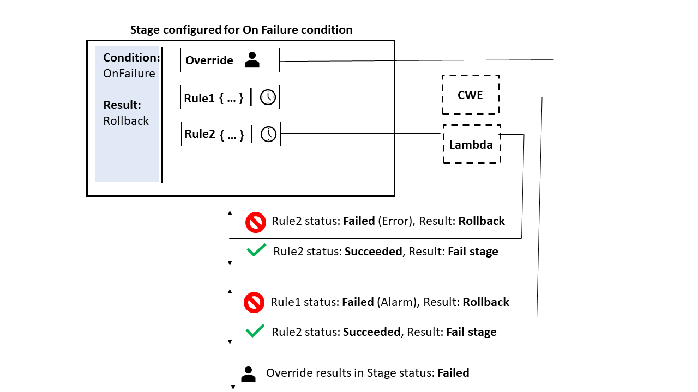
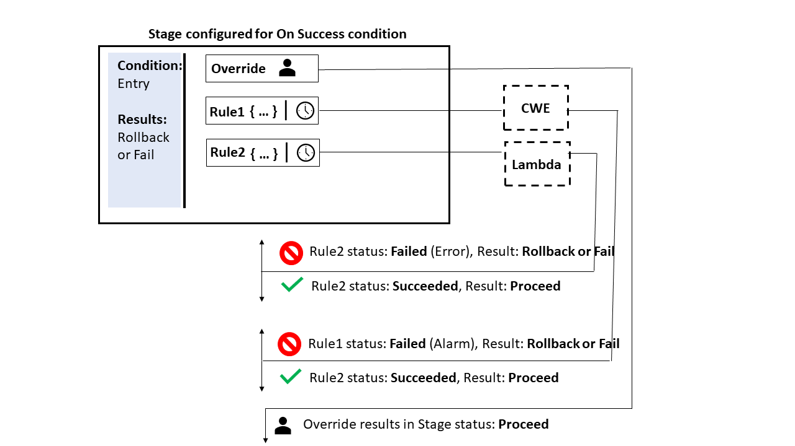

# How do stage conditions work?

For each condition that specifies a rule, the rule is run. If the condition fails, the
result is engaged. The stage performs the specified result only when the condition
fails. Optionally, as part of the rule, you also specify which resources CodePipeline
should use for certain cases. For example, the `CloudWatchAlarm` rule will
use a CloudWatch alarm resource to run checks for the condition.

A condition might match multiple rules, and each rule can specify one of three
providers.

The high-level flow for creating conditions as as follows.

1. Choose the type of condition from the available condition types in CodePipeline. For
   example, use an On Success condition type to set up a stage so that after the
   stage succeeds, a set of rules can be used to run checks before proceeding.
2. Choose the rule. For example, the `CloudWatchAlarm` rule will check
   for alarms and uses EB to check for a preconfigured alarm threshold. If the
   check is successful, and the alarm is below the threshold, the stage can
   proceed.
3. Configure the result, such as a rollback that would be used if the rule
   fails.
   Conditions are used for specific types of expressions and each has specific options
   for results available as follows:

- **Entry** - The conditions for making checks
  that, if met, allow entry to a stage. Rules are engaged with the following
  result options: **Fail** or **Skip**
- **On Failure** - The conditions for making checks
  for the stage when it fails. Rules are engaged with the following result option:
  **Rollback**
- **On Success** - The conditions for making checks
  for the stage when it succeeds. Rules are engaged with the following result
  options: **Rollback** or **Fail**
  The following diagram shows an example flow for the Entry condition type in CodePipeline.
  Conditions answer the question, What should happen if the condition is not met, meaning
  any rule fails? In the following flow, an Entry condition is configured with a
  LambdaInvoke rule and a `CloudWatchAlarm` rule. If the rule fails, then the
  configured result, such as Fail, is engaged.

The following diagram shows an example flow for the On Failure condition type in
CodePipeline. Conditions answer the question, What should happen if the condition is met,
meaning the rules all succeed their checks? In the following flow, an On Failure
condition is configured with a LambdaInvoke rule and a `CloudWatchAlarm`
rule. If the rule succeeds, then the configured result, such as Fail, is engaged.

The following diagram shows an example flow for the On Success condition type in
CodePipeline. Conditions answer the question, What should happen if the condition is met,
meaning the rules all succeed their checks? In the following flow, an On Success
condition is configured with a `LambdaInvoke` rule and a
`CloudWatchAlarm` rule. If the rule succeeds, then the configured result,
such as Fail, is engaged.

## Rules for stage conditions

When you configure stage conditions, you select from pre-defined rules and specify
the results for the rule. A condition state will be Failed if any of the rules in
the condition are failed and Succeeded if all the rules succeed. How criteria are
met for conditions for On Failure and On Success depends on the type of rule.

The following are managed rules that you can add to stage conditions.

- Conditions can use the **Commands** rule to specify
  commands to meet the rule criteria for conditions. For more information
  about this rule, see [Commands](rule-reference-Commands.md "rule-reference-Commands.md").
- Conditions can use the **AWS DeploymentWindow** rule to
  specify approved deployment times for allowing a deployment. The criteria
  for the rule will be measured with a provided cron expression for a
  deployment window. The rule succeeds when the date and time in the
  deployment window meet the criteria in the cron expression for the rule. For
  more information about this rule, see [DeploymentWindow](rule-reference-DeploymentWindow.md "rule-reference-DeploymentWindow.md").
- Conditions can use the **AWS Lambda** rule to check for
  error states returned from configured Lambda functions. The rule is met when
  the check receives the Lambda function result. An error from the Lambda
  function meets the criteria for On Failure conditions. For more information
  about this rule, see [LambdaInvoke](rule-reference-LambdaInvoke.md "rule-reference-LambdaInvoke.md").
- Conditions can use the **AWS CloudWatchAlarm** rule to
  check for alarms configured from CloudWatch events. The rule is met when the check
  returns an alarm state of OK, ALARM, or INSUFF_DATA. For On Success
  conditions, OK and INSUFFICIENT_DATA meet the criteria. ALARM meets the
  criteria for On Failure conditions. For more information about this rule,
  see [CloudWatchAlarm](rule-reference-CloudWatchAlarm.md "rule-reference-CloudWatchAlarm.md").
- Conditions can use the **VariableCheck** rule to create a
  condition where the output variable is checked against a provided
  expression. The rule passes the check when the variable value meets the rule
  criteria, such as the value being equal or greater than a specified output
  variable. For more information about this rule, see [VariableCheck](rule-reference-VariableCheck.md "rule-reference-VariableCheck.md").
