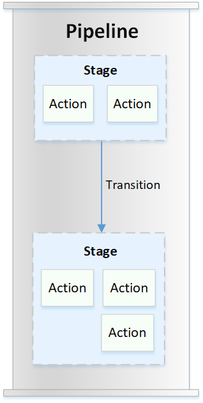

# CodePipeline concepts

Modeling and configuring your automated release process is easier if you understand the
concepts and terms used in AWS CodePipeline. Here are some concepts to know about as you use
CodePipeline.

For an example of a DevOps pipeline, see [DevOps pipeline example](concepts-devops-example.md "concepts-devops-example.md").

The following terms are used in CodePipeline:

###### Topics

- [Pipelines](#concepts-pipelines "#concepts-pipelines")
- [Pipeline executions](#concepts-executions "#concepts-executions")
- [Stage operations](#concepts-stage-executions "#concepts-stage-executions")
- [Action executions](#concepts-action-executions "#concepts-action-executions")
- [Execution types](#concepts-execution-types "#concepts-execution-types")
- [Action types](#concepts-action-types "#concepts-action-types")
- [Artifacts](#concepts-artifacts "#concepts-artifacts")
- [Source revisions](#concepts-source-revisions "#concepts-source-revisions")
- [Triggers](#concepts-triggers "#concepts-triggers")
- [Variables](#concepts-variables "#concepts-variables")
- [Conditions](#concepts-conditions "#concepts-conditions")
- [Rules](#concepts-rules "#concepts-rules")

## Pipelines

A _pipeline_ is a workflow construct that describes how software
changes go through a release process. Each pipeline is made up of a series of
_stages_.

### Stages

A stage is a logical unit you can use to isolate an environment and to limit the number
of concurrent changes in that environment. Each stage contains actions that are performed on
the application [artifacts](concepts.md#concepts-artifacts "concepts.md#concepts-artifacts"). Your source code is an example of an artifact. A stage might be a
build stage, where the source code is built and tests are run. It can also be a deployment
stage, where code is deployed to runtime environments. Each stage is made up of a series of
serial or parallel _actions_.

### Transitions

A _transition_ is the point where a pipeline execution moves to the
next stage in the pipeline. You can disable a stage's inbound transition to prevent
executions from entering that stage, and then you can enable the transition to allow
executions to continue. When more than one execution arrives at a disabled transition, only
the latest execution continues to the next stage when the transition is enabled. This means
that newer executions continue to supersede waiting executions while the transition is
disabled, and then after the transition is enabled, the execution that continues is the
superseding execution.

### Actions

An _action_ is a set of operations performed on application code and
configured so that the actions run in the pipeline at a specified point. This can include
things like a source action from a code change, an action for deploying the application to
instances, and so on. For example, a deployment stage might contain a deployment action that
deploys code to a compute service like Amazon EC2 or AWS Lambda.

Valid CodePipeline action types are `source`, `build`, `test`,
`deploy`, `approval`, and `invoke`. For a list of action
providers, see [Valid action providers in CodePipeline](actions-valid-providers.md "actions-valid-providers.md") .

Actions can run in series or in parallel. For information about serial and parallel
actions in a stage, see the `runOrder` information in [action structure
requirements](reference-pipeline-structure.md#action-requirements "reference-pipeline-structure.md#action-requirements").

## Pipeline executions

An _execution_ is a set of changes released by a pipeline. Each
pipeline execution is unique and has its own ID. An execution corresponds to a set of changes,
such as a merged commit or a manual release of the latest commit. Two executions can release
the same set of changes at different times.

While a pipeline can process multiple executions at the same time, a pipeline stage
processes only one execution at a time. To do this, a stage is locked while it processes an
execution. Two pipeline executions can't occupy the same stage at the same time. The execution
waiting to enter the occupied stage is referred to an _inbound
execution_. An inbound execution can still fail, be superseded, or be manually
stopped. For more information about how inbound executions work, see [How Inbound Executions
Work](concepts-how-it-works.md#how-it-works-inbound-executions "concepts-how-it-works.md#how-it-works-inbound-executions").

Pipeline executions traverse pipeline stages in order. Valid statuses for pipelines are
`InProgress`, `Stopping`, `Stopped`,
`Succeeded`, `Superseded`, and `Failed`.

For more information, see [PipelineExecution](../APIReference/API_PipelineExecution.md "../APIReference/API_PipelineExecution.md").

### Stopped executions

The pipeline execution can be stopped manually so that the in-progress pipeline
execution does not continue through the pipeline. If stopped manually, a pipeline execution
shows a `Stopping` status until it is completely stopped. Then it shows a
`Stopped` status. A `Stopped` pipeline execution can be
retried.

There are two ways to stop a pipeline execution:

- **Stop and wait**
- **Stop and abandon**

For information about use cases for stopping an execution and sequence details for these
options, see [How pipeline executions are
stopped](concepts-how-it-works.md#concepts-how-it-works-stopping "concepts-how-it-works.md#concepts-how-it-works-stopping").

### Failed executions

If an execution fails, it stops and does not completely traverse the pipeline. Its
status is `FAILED` status and the stage is unlocked. A more recent execution can
catch up and enter the unlocked stage and lock it. You can retry a failed execution unless
the failed execution has been superseded or is not retryable. You can roll back a failed
stage to a previous successful execution.

### Execution modes

To deliver the latest set of changes through a pipeline, newer executions pass and
replace less recent executions already running through the pipeline. When this occurs, the
older execution is superseded by the newer execution. An execution can be superseded by a
more recent execution at a certain point, which is the point between stages. SUPERSEDED is
the default execution mode.

In SUPERSEDED mode, if an execution is waiting to enter a locked stage, a more recent
execution might catch up and supersede it. The newer execution now waits for the stage to
unlock, and the superseded execution stops with a `SUPERSEDED` status. When a
pipeline execution is superseded, the execution is stopped and does not completely traverse
the pipeline. You can no longer retry the superseded execution after it has been replaced at
this stage. Other available execution modes are PARALLEL or QUEUED mode.

For more information about execution modes and locked stages, see [How executions are processed in
SUPERSEDED mode](concepts-how-it-works.md#concepts-how-it-works-executions "concepts-how-it-works.md#concepts-how-it-works-executions").

## Stage operations

When a pipeline execution runs through a stage, the stage is in the process of completing
all of the actions within it. For information about how stage operations work and information
about locked stages, see [How executions are processed in
SUPERSEDED mode](concepts-how-it-works.md#concepts-how-it-works-executions "concepts-how-it-works.md#concepts-how-it-works-executions").

Valid statuses for stages are `InProgress`, `Stopping`,
`Stopped`, `Succeeded`, and `Failed`. You can retry a
failed stage unless the failed stage is not retryable. For more information, see [StageExecution](../APIReference/API_StageExecution.md "../APIReference/API_StageExecution.md"). You can roll back a stage
to a specified previous successful execution. A stage can be configured to roll back
automatically on failure as detailed in [Configuring stage rollback](stage-rollback.md "stage-rollback.md"). For more information, see [RollbackStage](../APIReference/API_RollbackStage.md "../APIReference/API_RollbackStage.md").

## Action executions

An _action execution_ is the process of completing a configured action
that operates on designated [artifacts](concepts.md#concepts-artifacts "concepts.md#concepts-artifacts"). These can be input artifacts, output artifacts, or both. For example, a
build action might run build commands on an input artifact, such as compiling application
source code. Action execution details include an action execution ID, the related pipeline
execution source trigger, and the input and output artifacts for the action.

Valid statuses for actions are `InProgress`, `Abandoned`,
`Succeeded`, or `Failed`. For more information, see [ActionExecution](../APIReference/API_ActionExecution.md "../APIReference/API_ActionExecution.md").

## Execution types

A pipeline or stage execution can be either a standard or a rolled-back execution.

For standard types, the execution has a unique ID and is a full pipeline run. A pipeline
rollback has a stage to be rolled back and a successful execution for the stage as the target
execution to which to roll back. The target pipeline execution is used to retrieve source
revisions and variables for the stage to rerun.

## Action types

_Action types_ are preconfigured actions that are available for
selection in CodePipeline. The action type is defined by its owner, provider, version, and category.
The action type provides customized parameters that are used to complete the action tasks in a
pipeline.

For information about the AWS services and third-party products and services you can
integrate into your pipeline based on action type, see [Integrations with CodePipeline action types](integrations-action-type.md "integrations-action-type.md").

For information about the integration models supported for action types in CodePipeline,
see [Integration model reference](reference-integrations.md "reference-integrations.md").

For information about how third-party providers can set up and manage action types in
CodePipeline, see [Working with action types](action-types.md "action-types.md").

## Artifacts

_Artifacts_ refers to the collection of data, such as application
source code, built applications, dependencies, definitions files, templates, and so on, that
is worked on by pipeline actions. Artifacts are produced by some actions and consumed by
others. In a pipeline, artifacts can be the set of files worked on by an action (_input artifacts_) or the updated output of a completed action
(_output artifacts_).

Actions pass output to another action for further processing using the pipeline artifact
bucket. CodePipeline copies artifacts to the artifact store, where the action picks them up. For more
information about artifacts, see [Input and output artifacts](welcome-introducing-artifacts.md "welcome-introducing-artifacts.md").

## Source revisions

When you make a source code change, a new version is created. A _source
revision_ is the version of a source change that triggers a pipeline execution. An
execution processes source revisions. For GitHub and CodeCommit repositories, this is the commit.
For S3 buckets or actions, this is the object version.

You can start a pipeline execution with a source revision, such as a commit, that you
specify. The execution will process the specified revision and override what would have been
the revision used for the execution. For more information, see [Start a pipeline with a source
revision override](pipelines-trigger-source-overrides.md "pipelines-trigger-source-overrides.md").

## Triggers

_Triggers_ are events that start your pipeline. Some triggers, such as
starting a pipeline manually, are available for all source action providers in a pipeline.
Certain triggers depend on the source provider for a pipeline. For example, CloudWatch events
must be configured with event resources from Amazon CloudWatch that have the pipeline ARN added as a
target in the event rule. Amazon CloudWatch Events is the recommended trigger for automatic change detection
for pipelines with a CodeCommit or S3 source action. Webhooks are a type of trigger configured for
third-party repository events. For example, WebhookV2 is a trigger type that allows Git tags
to be used to start pipelines with third-party source providers such as GitHub.com, GitHub
Enterprise Server, GitLab.com, GitLab self-managed, or Bitbucket Cloud. In the pipeline
configuration, you can specify a filter for triggers, such as push or pull request. You can
filter code push events on Git tags, branches, or file paths. You can filter pull request
events on event (opened, updated, closed), branches, or file paths.

For more information about triggers, see [Start a pipeline in CodePipeline](pipelines-about-starting.md "pipelines-about-starting.md"). For a tutorial that walks you through using Git
tags as triggers for your pipeline, see [Tutorial: Use Git tags to start your pipeline](tutorials-github-tags.md "tutorials-github-tags.md").

###### Important

Pipelines that are inactive for longer than 30 days will have polling disabled for the pipeline.
For more information, see [pollingDisabledAt](pipeline-requirements.md#metadata.pollingDisabledAt "pipeline-requirements.md#metadata.pollingDisabledAt") in the pipeline structure reference.
For the steps to migrate your pipeline from polling to event-based change detection, see
[Change Detection Methods](change-detection-methods.md "change-detection-methods.md").

## Variables

A _variable_ is a value that can be used to dynamically configure
actions in your pipeline. Variables can be either declared on the pipeline level, or emitted
by actions in the pipeline. Variable values are resolved at the time of pipeline execution and
can be viewed in the execution history. For variables declared at the pipeline level, you can
either define default values in the pipeline configuration, or override them for a given
execution. For variables emitted by an action, the value is available after an action
succesfully completes. For more information, see [Variables reference](reference-variables.md "reference-variables.md").

## Conditions

A _condition_ contains a set of rules that are evaluated. If all rules
in a condition succeed, then the condition is met. You can configure conditions so that when
the criteria are not met, the specified result, such as failing the stage, engages. Conditions
are also referred to as gates because they allow you to specify when an execution will enter
and run through a stage or exit the stage after running through it. This is analogous to
allowing a line of traffic on a roadway to gather at a closed gate, and then specifying the
opening of the gate to allow flow of traffic into an area. Results for condition types include
failing the stage or rolling back the stage. Conditions help you to specify when these actions
happen in a pipeline stage. You can override conditions at runtime.

There are three types of conditions. Entry conditions answer the question “If the rules
for the condition are met, then enter the stage.” The stage is locked when the execution
enters the stage, and then the rules are run. For On Failure conditions, the rule engages when
a stage has failed, with a result of rolling back a failed stage. For On Success conditions,
the rule engages when a stage is successful, such as checking a successful run for alarms
before proceeding. For example, an On Success condition would result in a rollback of a
successful stage if the CloudWatchAlarm rule finds that there are alarms in the deployment
environment. For more information, see [How do stage conditions work?](concepts-how-it-works-conditions.md "concepts-how-it-works-conditions.md").

## Rules

Conditions use one or more preconfigured _rules_ that run and perform
checks that will then engage the configured result for when the condition is not met. For
example, meeting all rules for an Entry condition rule that checks for alarm status and
deployment window times will deploy a successful stage after all checks pass. For more
information, see [How do stage conditions work?](concepts-how-it-works-conditions.md "concepts-how-it-works-conditions.md").
