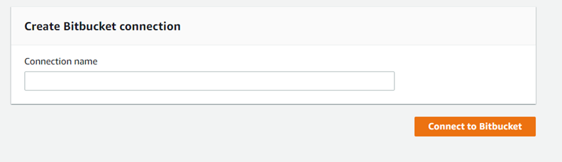
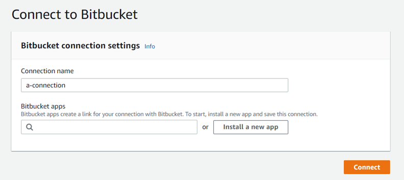
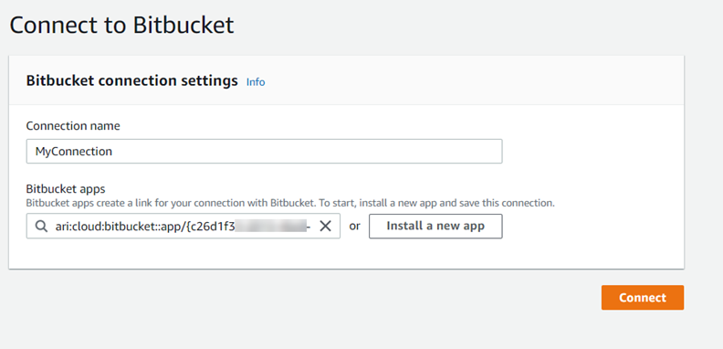

# Bitbucket Cloud connections

Connections allow you to authorize and establish configurations that associate your
third-party provider with your AWS resources. To associate your third-party repository as
a source for your pipeline, you use a connection.

###### Note

Instead of creating or using an existing connection in your account, you can use a
shared connection between another AWS account. See [Use a connection shared with another account](connections-shared.md "connections-shared.md").

###### Note

This feature is not available in the Asia Pacific (Hong Kong),
Asia Pacific (Hyderabad), Asia Pacific (Jakarta), Asia Pacific (Melbourne),
Asia Pacific (Osaka), Africa (Cape Town), Middle East (Bahrain),
Middle East (UAE), Europe (Spain), Europe (Zurich),
Israel (Tel Aviv), or AWS GovCloud (US-West) Regions. To reference other available
actions, see [Product and service integrations with CodePipeline](integrations.md "integrations.md"). For
considerations with this action in the Europe (Milan) Region, see the note in [CodeStarSourceConnection for
Bitbucket Cloud, GitHub, GitHub Enterprise Server, GitLab.com, and GitLab self-managed
actions](action-reference-CodestarConnectionSource.md "action-reference-CodestarConnectionSource.md").

To add a Bitbucket Cloud source action in CodePipeline, you can choose either to:

- Use the CodePipeline console **Create pipeline** wizard or
  **Edit action** page to choose the
  **Bitbucket** provider option. See [Create a connection to Bitbucket Cloud
  (console)](#connections-bitbucket-console "#connections-bitbucket-console") to add the action. The console
  helps you create a connections resource.

###### Note

You can create connections to a Bitbucket Cloud repository. Installed
Bitbucket provider types, such as Bitbucket Server, are not supported.

- Use the CLI to add the action configuration for the
  `CreateSourceConnection` action with the `Bitbucket`
  provider as follows:
  - To create your connections resources, see [Create a connection to
    Bitbucket
    Cloud (CLI)](#connections-bitbucket-cli "#connections-bitbucket-cli") to create a connections
    resource with the CLI.
  - Use the `CreateSourceConnection` example action configuration
    in [CodeStarSourceConnection for
    Bitbucket Cloud, GitHub, GitHub Enterprise Server, GitLab.com, and GitLab self-managed
    actions](action-reference-CodestarConnectionSource.md "action-reference-CodestarConnectionSource.md") to add your
    action as shown in [Create a pipeline (CLI)](pipelines-create.md#pipelines-create-cli "pipelines-create.md#pipelines-create-cli").

###### Note

You can also create a connection using the Developer Tools console under
**Settings**. See [Create a
Connection](../../../dtconsole/latest/userguide/connections-create.md "../../../dtconsole/latest/userguide/connections-create.md").

Before you begin:

- You must have created an account with the provider of the third-party repository,
  such as Bitbucket Cloud.
- You must have already created a third-party code repository, such as a Bitbucket
  Cloud repository.

###### Note

Bitbucket Cloud connections only provide access to repositories owned by the Bitbucket
Cloud account that was used to create the connection.

If the application is being installed in a Bitbucket Cloud workspace, you need
**Administer workspace** permissions. Otherwise, the option to
install the app will not display.

###### Topics

- [Create a connection to Bitbucket Cloud
  (console)](#connections-bitbucket-console "#connections-bitbucket-console")
- [Create a connection to
  Bitbucket
  Cloud (CLI)](#connections-bitbucket-cli "#connections-bitbucket-cli")

## Create a connection to Bitbucket Cloud

(console)

Use these steps to use the CodePipeline console to add a connections action for your
Bitbucket repository.

###### Note

You can create connections to a Bitbucket Cloud repository. Installed Bitbucket
provider types, such as Bitbucket Server, are not supported.

### Step 1: Create or edit your

pipeline

###### To create or edit your pipeline

1. Sign in to the CodePipeline console.
2. Choose one of the following.
   - Choose to create a pipeline. Follow the steps in _Create a Pipeline_ to complete the first
     screen and choose **Next**. On the
     **Source** page, under **Source Provider**, choose **Bitbucket**.
   - Choose to edit an existing pipeline. Choose
     **Edit**, and then choose **Edit
     stage**. Choose to add or edit your source action. On
     the **Edit action** page, under
     **Action name**, enter the name for
     your action. In **Action provider**,
     choose **Bitbucket**.

3. Do one of the following:
   - Under **Connection**, if you have not already
     created a connection to your provider, choose **Connect to
     Bitbucket**. Proceed to Step 2: Create a Connection to
     Bitbucket.
   - Under **Connection**, if you have already created
     a connection to your provider, choose the connection. Proceed to
     Step 3: Save the Source Action for Your Connection.

### Step 2: Create a connection to

Bitbucket Cloud

###### To create a connection to Bitbucket Cloud

1. On the **Connect to Bitbucket** settings page, enter your
   connection name and choose **Connect to Bitbucket**.



The **Bitbucket apps** field appears. 2. Under **Bitbucket apps**, choose an app installation or
choose **Install a new app** to create one.

###### Note

You only install the app once for each Bitbucket Cloud workspace or
account. If you have already installed the Bitbucket app, choose it and
move to step 4.

 3. If the login page for Bitbucket Cloud displays, log in with your
credentials and then choose to continue. 4. On the app installation page, a message shows that the AWS CodeStar app is trying
to connect to your Bitbucket account.

If you are using a Bitbucket workspace, change the **Authorize
for** option to the workspace. Only workspaces where you have
administrator access will display.

Choose **Grant access**. 5. In **Bitbucket apps**, the connection ID for your new
installation is displayed. Choose **Connect**. The created
connection displays in the connections list.



### Step 3: Save your

Bitbucket
Cloud source action

Use these steps on the wizard or **Edit action** page to save
your source action with your connection information.

###### To complete and save your source action with your connection

1. In **Repository name**, choose the name of your
   third-party
   repository.
2. Under **Pipeline triggers** you can add triggers if your
   action is an CodeConnections action. To configure the pipeline trigger configuration
   and to optionally filter with triggers, see more details in [Add trigger with code push or pull request event
   types](pipelines-filter.md "pipelines-filter.md").
3. In **Output artifact format**, you must choose the format
   for your artifacts.
   - To store output artifacts from the Bitbucket
     Cloud
     action using the default method, choose
     **CodePipeline default**. The action accesses
     the files from the
     Bitbucket
     Cloud repository and stores the artifacts in a ZIP
     file in the pipeline artifact store.
   - To store a JSON file that contains a URL reference to the
     repository so that downstream actions can perform Git commands
     directly, choose **Full clone**. This option can
     only be used by CodeBuild downstream actions.

   If you choose this option, you will need to update the permissions
   for your CodeBuild project service role as shown in [Add CodeBuild GitClone permissions for connections to
   Bitbucket, GitHub, GitHub Enterprise Server, or GitLab.com](troubleshooting.md#codebuild-role-connections "troubleshooting.md#codebuild-role-connections").

4. Choose **Next** on the wizard or
   **Save** on the **Edit action**
   page.

## Create a connection to

Bitbucket
Cloud (CLI)

You can use the AWS Command Line Interface (AWS CLI) to create a connection.

###### Note

You can create connections to a Bitbucket Cloud repository. Installed Bitbucket
provider types, such as Bitbucket Server, are not supported.

To do this, use the **create-connection** command.

###### Important

A connection created through the AWS CLI or AWS CloudFormation is in `PENDING`
status by default. After you create a connection with the CLI or CloudFormation, use the
console to edit the connection to make its status `AVAILABLE`.

###### To create a connection

1. Open a terminal (Linux, macOS, or Unix) or command prompt (Windows). Use the AWS CLI to run
   the **create-connection** command, specifying the
   `--provider-type` and `--connection-name` for your
   connection. In this example, the third-party provider name is
   `Bitbucket` and the specified connection name is
   `MyConnection`.

```
aws codestar-connections create-connection --provider-type Bitbucket --connection-name MyConnection
```

If successful, this command returns the connection ARN information similar to
the following.

```
{
    "ConnectionArn": "arn:aws:codestar-connections:us-west-2:`account_id`:connection/aEXAMPLE-8aad-4d5d-8878-dfcab0bc441f"
}
```

2. Use the console to complete the connection. For more information, see [Update a pending connection](../../../dtconsole/latest/userguide/connections-update.md "../../../dtconsole/latest/userguide/connections-update.md").
3. The pipeline defaults to detect changes on code push to the connection source
   repository. To configure the pipeline trigger configuration for manual release
   or for Git tags, do one of the following:
   - To configure the pipeline trigger configuration to start with a manual
     release only, add the following line to the configuration:

   ```
   "DetectChanges": "false",
   ```

   - To configure the pipeline trigger configuration to filter with
     triggers, see more details in [Add trigger with code push or pull request event
     types](pipelines-filter.md "pipelines-filter.md"). For example, the following adds
     Git tags to the pipeline level of the pipeline JSON definition. In this
     example, `release-v0` and `release-v1` are the Git
     tags to include, and `release-v2` is the Git tag to
     exclude.

   ```
   "triggers": [
               {
                   "providerType": "CodeStarSourceConnection",
                   "gitConfiguration": {
                       "sourceActionName": "Source",
                       "push": [
                           {
                               "tags": {
                                   "includes": [
                                       "release-v0", "release-v1"
                                   ],
                                   "excludes": [
                                       "release-v2"
                                   ]
                               }
                           }
                       ]
                   }
               }
           ]
   ```
