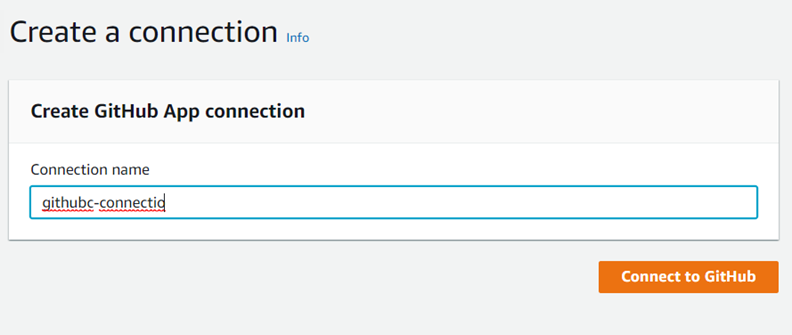
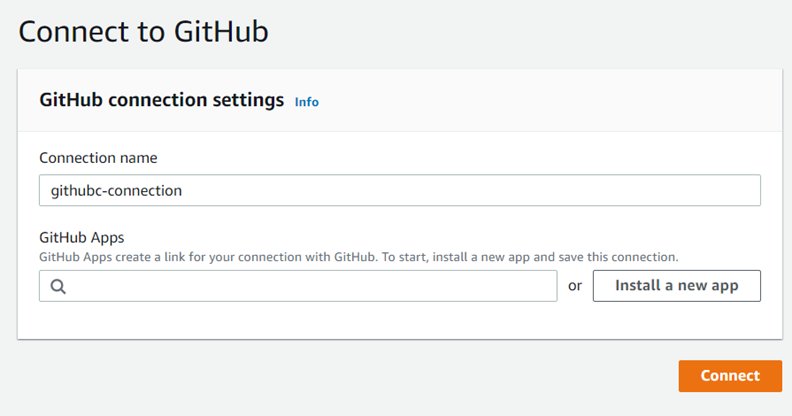

# GitHub connections

You use connections to authorize and establish configurations that associate your
third-party provider with your AWS resources.

###### Note

Instead of creating or using an existing connection in your account, you can use a
shared connection between another AWS account. See [Use a connection shared with another account](connections-shared.md "connections-shared.md").

###### Note

This feature is not available in the Asia Pacific (Hong Kong),
Asia Pacific (Hyderabad), Asia Pacific (Jakarta), Asia Pacific (Melbourne),
Asia Pacific (Osaka), Africa (Cape Town), Middle East (Bahrain),
Middle East (UAE), Europe (Spain), Europe (Zurich),
Israel (Tel Aviv), or AWS GovCloud (US-West) Regions. To reference other available
actions, see [Product and service integrations with CodePipeline](integrations.md "integrations.md"). For
considerations with this action in the Europe (Milan) Region, see the note in [CodeStarSourceConnection for
Bitbucket Cloud, GitHub, GitHub Enterprise Server, GitLab.com, and GitLab self-managed
actions](action-reference-CodestarConnectionSource.md "action-reference-CodestarConnectionSource.md").

To add a source action for your GitHub or GitHub Enterprise Cloud repository in CodePipeline, you
can choose either to:

- Use the CodePipeline console **Create pipeline** wizard or
  **Edit action** page to choose the **GitHub (via GitHub
  App)** provider option. See [Create a connection to GitHub Enterprise
  Server (console)](connections-ghes.md#connections-ghes-console "connections-ghes.md#connections-ghes-console") to add the action. The console helps
  you create a connections resource.

###### Note

For a tutorial that walks you through how to add a GitHub connection and use
the **Full clone** option in your pipeline to clone metadata,
see [Tutorial: Use full clone with a GitHub pipeline
source](tutorials-github-gitclone.md "tutorials-github-gitclone.md").

- Use the CLI to add the action configuration for the
  `CodeStarSourceConnection` action with the `GitHub`
  provider with the CLI steps shown in [Create a pipeline (CLI)](pipelines-create.md#pipelines-create-cli "pipelines-create.md#pipelines-create-cli").

###### Note

You can also create a connection using the Developer Tools console under
**Settings**. See [Create a
Connection](../../../dtconsole/latest/userguide/connections-create.md "../../../dtconsole/latest/userguide/connections-create.md").

Before you begin:

- You must have created an account with GitHub.
- You must have already created a GitHub code repository.
- If your CodePipeline service role was created before December 18, 2019, you might need to
  update its permissions to use `codestar-connections:UseConnection` for
  AWS CodeStar connections. For instructions, see [Add permissions to the CodePipeline
  service role](how-to-custom-role.md#how-to-update-role-new-services "how-to-custom-role.md#how-to-update-role-new-services").

###### Note

To create the connection, you must be the GitHub organization owner. For repositories
that are not under an organization, you must be the repository owner.

###### Topics

- [Create a connection to GitHub
  (console)](#connections-github-console "#connections-github-console")
- [Create a connection to GitHub (CLI)](#connections-github-cli "#connections-github-cli")

## Create a connection to GitHub

(console)

Use these steps to use the CodePipeline console to add a connections action for your GitHub
or GitHub Enterprise Cloud repository.

###### Note

In these steps, you can select specific repositories under **Repository Access**. Any repositories that are not selected will not
be accessible or visible by CodePipeline.

### Step 1: Create or edit your

pipeline

1. Sign in to the CodePipeline console.
2. Choose one of the following.
   - Choose to create a pipeline. Follow the steps in _Create a Pipeline_ to complete the first
     screen and choose **Next**. On the
     **Source** page, under **Source Provider**, choose **GitHub (via GitHub App)**.
   - Choose to edit an existing pipeline. Choose
     **Edit**, and then choose **Edit
     stage**. Choose to add or edit your source action. On
     the **Edit action** page, under
     **Action name**, enter the name for
     your action. In **Action provider**,
     choose **GitHub (via GitHub
     App)**.

3. Do one of the following:
   - Under **Connection**, if you have not already
     created a connection to your provider, choose **Connect to
     GitHub**. Proceed to Step 2: Create a Connection to
     GitHub.
   - Under **Connection**, if you have already created
     a connection to your provider, choose the connection. Proceed to
     Step 3: Save the source action for your connection.

### Step 2: Create a connection to

GitHub

After you choose to create the connection, the **Connect to
GitHub** page appears.



###### To create a connection to GitHub

1. Under **GitHub connection settings**, your connection
   name appears in **Connection name**. Choose
   **Connect to GitHub**. The access request page
   appears.
2. Choose **Authorize AWS Connector for GitHub**. The
   connection page displays and shows the **GitHub Apps**
   field.

 3. Under **GitHub Apps**, choose an app installation or
choose **Install a new app** to create one.

You install one app for all of your connections to a particular provider.
If you have already installed the AWS Connector for GitHub app, choose it
and skip this step.

###### Note

If you want to create a [user access token](https://docs.github.com/en/apps/creating-github-apps/authenticating-with-a-github-app/generating-a-user-access-token-for-a-github-app "https://docs.github.com/en/apps/creating-github-apps/authenticating-with-a-github-app/generating-a-user-access-token-for-a-github-app"), make sure that you've already installed
the AWS Connector for GitHub app and then leave the App installation
field empty. CodeConnections will use the user access token for the
connection. 4. On the **Install AWS Connector for GitHub** page,
choose the account where you want to install the app.

###### Note

You only install the app once for each GitHub account. If you
previously installed the app, you can choose
**Configure** to proceed to a modification page for
your app installation, or you can use the back button to return to the
console. 5. On the **Install AWS Connector for GitHub** page, leave
the defaults, and choose **Install**. 6. On the **Connect to GitHub** page, the connection ID for
your new installation appears in **GitHub Apps**. Choose
**Connect**.

### Step 3: Save your GitHub source

action

Use these steps on the **Edit action** page to save your source
action with your connection information.

###### To save your GitHub source action

1. In **Repository name**, choose the name of your
   third-party repository.
2. Under **Pipeline triggers** you can add triggers if your
   action is an CodeConnections action. To configure the pipeline trigger configuration
   and to optionally filter with triggers, see more details in [Add trigger with code push or pull request event
   types](pipelines-filter.md "pipelines-filter.md").
3. In **Output artifact format**, you must choose the format
   for your artifacts.
   - To store output artifacts from the GitHub action using the default
     method, choose **CodePipeline default**. The action
     accesses the files from the GitHub repository and stores the
     artifacts in a ZIP file in the pipeline artifact store.
   - To store a JSON file that contains a URL reference to the
     repository so that downstream actions can perform Git commands
     directly, choose **Full clone**. This option can
     only be used by CodeBuild downstream actions.

   If you choose this option, you will need to update the permissions
   for your CodeBuild project service role as shown in [Add CodeBuild GitClone permissions for connections to
   Bitbucket, GitHub, GitHub Enterprise Server, or GitLab.com](troubleshooting.md#codebuild-role-connections "troubleshooting.md#codebuild-role-connections"). For a tutorial
   that shows you how to use the **Full clone**
   option, see [Tutorial: Use full clone with a GitHub pipeline
   source](tutorials-github-gitclone.md "tutorials-github-gitclone.md").

4. Choose **Next** on the wizard or
   **Save** on the **Edit action**
   page.

## Create a connection to GitHub (CLI)

You can use the AWS Command Line Interface (AWS CLI) to create a connection.

To do this, use the **create-connection** command.

###### Important

A connection created through the AWS CLI or AWS CloudFormation is in `PENDING`
status by default. After you create a connection with the CLI or AWS CloudFormation, use the
console to edit the connection to make its status `AVAILABLE`.

###### To create a connection

1. Open a terminal (Linux, macOS, or Unix) or command prompt (Windows). Use the AWS CLI to run
   the **create-connection** command, specifying the
   `--provider-type` and `--connection-name` for your
   connection. In this example, the third-party provider name is
   `GitHub` and the specified connection name is
   `MyConnection`.

```
aws codestar-connections create-connection --provider-type GitHub --connection-name MyConnection
```

If successful, this command returns the connection ARN information similar to
the following.

```
{
    "ConnectionArn": "arn:aws:codestar-connections:us-west-2:`account_id`:connection/aEXAMPLE-8aad-4d5d-8878-dfcab0bc441f"
}
```

2. Use the console to complete the connection. For more information, see [Update a pending connection](../../../dtconsole/latest/userguide/connections-update.md "../../../dtconsole/latest/userguide/connections-update.md").
3. The pipeline defaults to detect changes on code push to the connection source
   repository. To configure the pipeline trigger configuration for manual release
   or for Git tags, do one of the following:
   - To configure the pipeline trigger configuration to start with a manual
     release only, add the following line to the configuration:

   ```
   "DetectChanges": "false",
   ```

   - To configure the pipeline trigger configuration to filter with
     triggers, see more details in [Add trigger with code push or pull request event
     types](pipelines-filter.md "pipelines-filter.md"). For example, the following adds
     to the pipeline level of the pipeline JSON definition. In this example,
     `release-v0` and `release-v1` are the Git tags
     to include, and `release-v2` is the Git tag to
     exclude.

   ```
   "triggers": [
               {
                   "providerType": "CodeStarSourceConnection",
                   "gitConfiguration": {
                       "sourceActionName": "Source",
                       "push": [
                           {
                               "tags": {
                                   "includes": [
                                       "release-v0", "release-v1"
                                   ],
                                   "excludes": [
                                       "release-v2"
                                   ]
                               }
                           }
                       ]
                   }
               }
           ]
   ```
