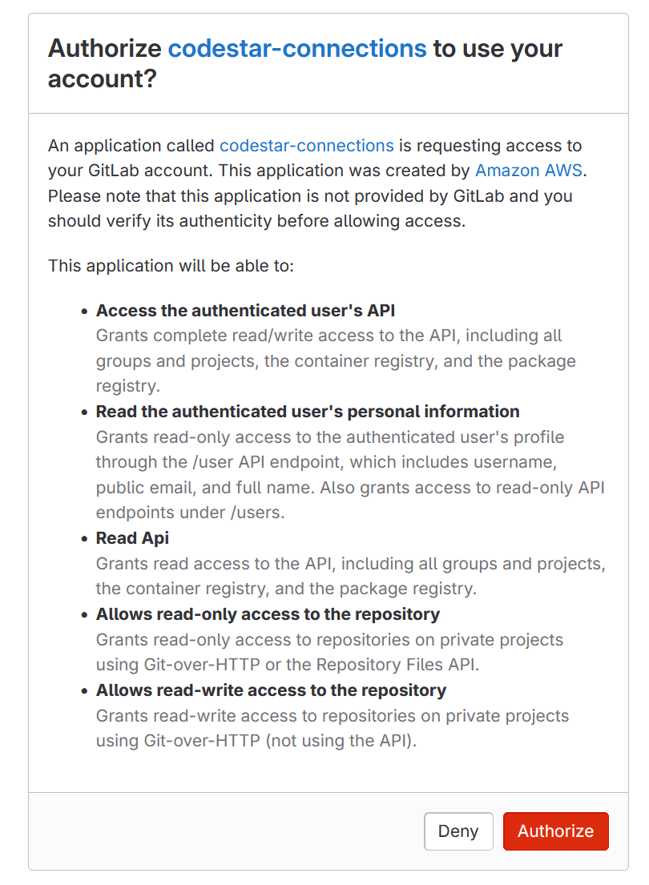

# GitLab.com connections

Connections allow you to authorize and establish configurations that associate your
third-party provider with your AWS resources. To associate your third-party repository as
a source for your pipeline, you use a connection.

###### Note

Instead of creating or using an existing connection in your account, you can use a
shared connection between another AWS account. See [Use a connection shared with another account](connections-shared.md "connections-shared.md").

###### Note

This feature is not available in the Asia Pacific (Hong Kong),
Asia Pacific (Hyderabad), Asia Pacific (Jakarta), Asia Pacific (Melbourne),
Asia Pacific (Osaka), Africa (Cape Town), Middle East (Bahrain),
Middle East (UAE), Europe (Spain), Europe (Zurich),
Israel (Tel Aviv), or AWS GovCloud (US-West) Regions. To reference other available
actions, see [Product and service integrations with CodePipeline](integrations.md "integrations.md"). For
considerations with this action in the Europe (Milan) Region, see the note in [CodeStarSourceConnection for
Bitbucket Cloud, GitHub, GitHub Enterprise Server, GitLab.com, and GitLab self-managed
actions](action-reference-CodestarConnectionSource.md "action-reference-CodestarConnectionSource.md").

To add a GitLab.com source action in CodePipeline, you can choose either to:

- Use the CodePipeline console **Create pipeline** wizard or
  **Edit action** page to choose the **GitLab**
  provider option. See [Create a connection to GitLab.com
  (console)](#connections-gitlab-console "#connections-gitlab-console") to add the action. The console
  helps you create a connections resource.
- Use the CLI to add the action configuration for the
  `CreateSourceConnection` action with the `GitLab` provider
  as follows:
  - To create your connections resources, see [Create a connection to GitLab.com (CLI)](#connections-gitlab-cli "#connections-gitlab-cli") to create a connections resource with the CLI.
  - Use the `CreateSourceConnection` example action configuration
    in [CodeStarSourceConnection for
    Bitbucket Cloud, GitHub, GitHub Enterprise Server, GitLab.com, and GitLab self-managed
    actions](action-reference-CodestarConnectionSource.md "action-reference-CodestarConnectionSource.md") to add your
    action as shown in [Create a pipeline (CLI)](pipelines-create.md#pipelines-create-cli "pipelines-create.md#pipelines-create-cli").

###### Note

You can also create a connection using the Developer Tools console under
**Settings**. See [Create a
Connection](../../../dtconsole/latest/userguide/connections-create.md "../../../dtconsole/latest/userguide/connections-create.md").

###### Note

By authorizing this connection installation in GitLab.com, you grant our service
permissions to process your data by accessing your account, and you can revoke the
permissions at any time by uninstalling the application.

Before you begin:

- You must have already created an account with GitLab.com.

###### Note

Connections only provide access to repositories owned by the account that was
used to create and authorize the connection.

###### Note

You can create connections to a repository where you have the **Owner** role in GitLab, and then the connection can be
used with the repository with resources such as CodePipeline. For repositories in
groups, you do not need to be the group owner.

- To specify a source for your pipeline, you must have already created a repository
  on gitlab.com.

###### Topics

- [Create a connection to GitLab.com
  (console)](#connections-gitlab-console "#connections-gitlab-console")
- [Create a connection to GitLab.com (CLI)](#connections-gitlab-cli "#connections-gitlab-cli")

## Create a connection to GitLab.com

(console)

Use these steps to use the CodePipeline console to add a connections action for your project
(repository) in GitLab.

###### To create or edit your pipeline

1. Sign in to the CodePipeline console.
2. Choose one of the following.
   - Choose to create a pipeline. Follow the steps in _Create a Pipeline_ to complete the first
     screen and choose **Next**. On the
     **Source** page, under **Source Provider**, choose **GitLab**.
   - Choose to edit an existing pipeline. Choose **Edit**,
     and then choose **Edit stage**. Choose to add or edit
     your source action. On the **Edit action**
     page, under **Action name**, enter the name
     for your action. In **Action provider**,
     choose **GitLab**.

3. Do one of the following:
   - Under **Connection**, if you have not already created
     a connection to your provider, choose **Connect to
     GitLab**. Proceed to step 4 to create the
     connection.
   - Under **Connection**, if you have already created a
     connection to your provider, choose the connection. Proceed to step
   9.

###### Note

If you close the pop-up window before a GitLab.com connection is created,
you need to refresh the page. 4. To create a connection to a GitLab.com repository, under **Select a
provider**, choose **GitLab**. In
**Connection name**, enter the name for the connection that
you want to create. Choose **Connect to GitLab**.

 5. When the sign-in page for GitLab.com displays, log in with your credentials,
and then choose **Sign in**. 6. If this is your first time authorizing the connection, an authorization page
displays with a message requesting authorization for the connection to access
your GitLab.com account.

Choose **Authorize**.

 7. The browser returns to the connections console page. Under **Create
GitLab connection**, the new connection is shown in
**Connection name**. 8. Choose **Connect to GitLab**.

You will be returned to the CodePipeline console.

###### Note

After a GitLab.com connection is successfully created, a success banner
will be displayed on the main window.

If you have not previously logged in to GitLab on the current machine,
you will need to manually close the pop-up window. 9. In **Repository name**, choose the name of your project in
GitLab by specifying the project path with the namespace. For example, for a
group-level repository, enter the repository name in the following format:
`group-name/repository-name`. For more information about the path
and namespace, see the `path_with_namespace` field in [https://docs.gitlab.com/ee/api/projects.html#get-single-project](https://docs.gitlab.com/ee/api/projects.html#get-single-project "https://docs.gitlab.com/ee/api/projects.html#get-single-project").
For more information about the namespace in GitLab, see [https://docs.gitlab.com/ee/user/namespace/](https://docs.gitlab.com/ee/user/namespace/ "https://docs.gitlab.com/ee/user/namespace/").

###### Note

For groups in GitLab, you must manually specify the project path with the
namespace. For example, for a repository named `myrepo` in a
group `mygroup`, enter the following:
`mygroup/myrepo`. You can find the project path with the
namespace in the URL in GitLab. 10. Under **Pipeline triggers** you can add triggers if your
action is an CodeConnections action. To configure the pipeline trigger configuration and
to optionally filter with triggers, see more details in [Add trigger with code push or pull request event
types](pipelines-filter.md "pipelines-filter.md"). 11. In **Branch name**, choose the branch where you want your
pipeline to detect source changes.

###### Note

If the branch name does not populate automatically, then you do not have
**Owner** access to the repository. Either
the project name is not valid, or the connection used doesn't have access to
the project/repository. 12. In **Output artifact format**, you must choose the format for
your artifacts.

    * To store output artifacts from the GitLab.com action using the default
     method, choose **CodePipeline default**. The action
     accesses the files from the GitLab.com repository and stores the
     artifacts in a ZIP file in the pipeline artifact store.
    * To store a JSON file that contains a URL reference to the repository
     so that downstream actions can perform Git commands directly, choose
     **Full clone**. This option can only be used by
     CodeBuild downstream actions.


    If you choose this option, you will need to update the permissions for
     your CodeBuild project service role as shown in [Add CodeBuild GitClone permissions for connections to
     Bitbucket, GitHub, GitHub Enterprise Server, or GitLab.com](troubleshooting.md#codebuild-role-connections "troubleshooting.md#codebuild-role-connections"). For a tutorial that
     shows you how to use the **Full clone** option, see
     [Tutorial: Use full clone with a GitHub pipeline
     source](tutorials-github-gitclone.md "tutorials-github-gitclone.md").

13. Choose to save the source action and continue.

## Create a connection to GitLab.com (CLI)

You can use the AWS Command Line Interface (AWS CLI) to create a connection.

To do this, use the **create-connection** command.

###### Important

A connection created through the AWS CLI or AWS CloudFormation is in `PENDING`
status by default. After you create a connection with the CLI or CloudFormation, use the
console to edit the connection to make its status `AVAILABLE`.

###### To create a connection

1. Open a terminal (Linux, macOS, or Unix) or command prompt (Windows). Use the AWS CLI to run
   the **create-connection** command, specifying the
   `--provider-type` and `--connection-name` for your
   connection. In this example, the third-party provider name is
   `GitLab` and the specified connection name is
   `MyConnection`.

```
aws codestar-connections create-connection --provider-type GitLab --connection-name MyConnection
```

If successful, this command returns the connection ARN information similar to
the following.

```
{
    "ConnectionArn": "arn:aws:codestar-connections:us-west-2:`account_id`:connection/aEXAMPLE-8aad-4d5d-8878-dfcab0bc441f"
}
```

2. Use the console to complete the connection. For more information, see [Update a pending connection](../../../dtconsole/latest/userguide/connections-update.md "../../../dtconsole/latest/userguide/connections-update.md").
3. The pipeline defaults to detect changes on code push to the connection source
   repository. To configure the pipeline trigger configuration for manual release
   or for Git tags, do one of the following:
   - To configure the pipeline trigger configuration to start with a manual
     release only, add the following line to the configuration:

   ```
   "DetectChanges": "false",
   ```

   - To configure the pipeline trigger configuration to filter with
     triggers, see more details in [Add trigger with code push or pull request event
     types](pipelines-filter.md "pipelines-filter.md"). For example, the following adds
     to the pipeline level of the pipeline JSON definition. In this example,
     `release-v0` and `release-v1` are the Git tags
     to include, and `release-v2` is the Git tag to
     exclude.

   ```
   "triggers": [
               {
                   "providerType": "CodeStarSourceConnection",
                   "gitConfiguration": {
                       "sourceActionName": "Source",
                       "push": [
                           {
                               "tags": {
                                   "includes": [
                                       "release-v0", "release-v1"
                                   ],
                                   "excludes": [
                                       "release-v2"
                                   ]
                               }
                           }
                       ]
                   }
               }
           ]
   ```
