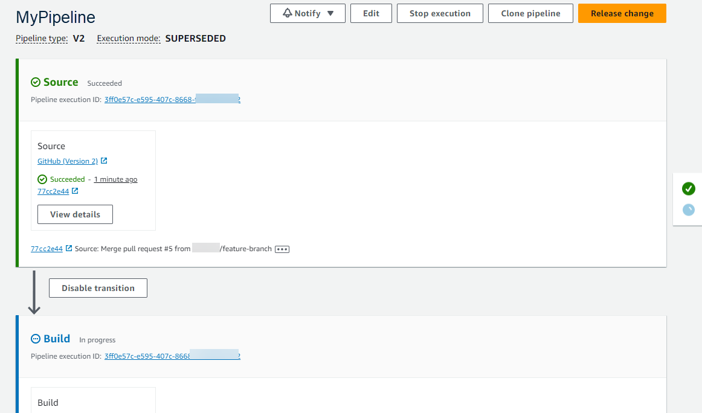
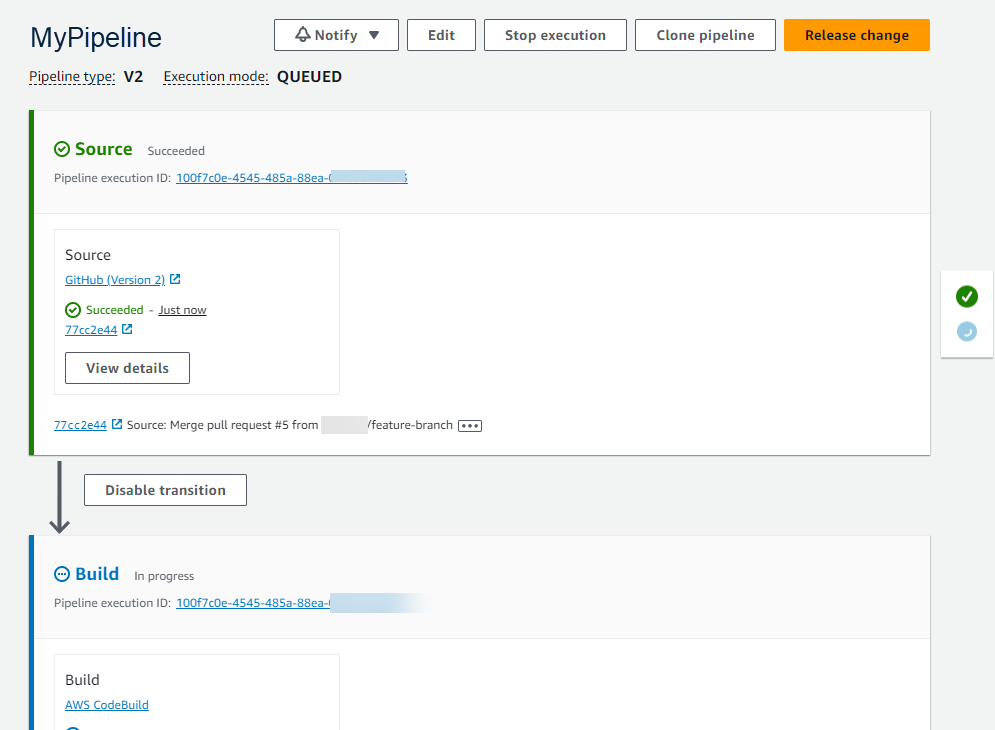
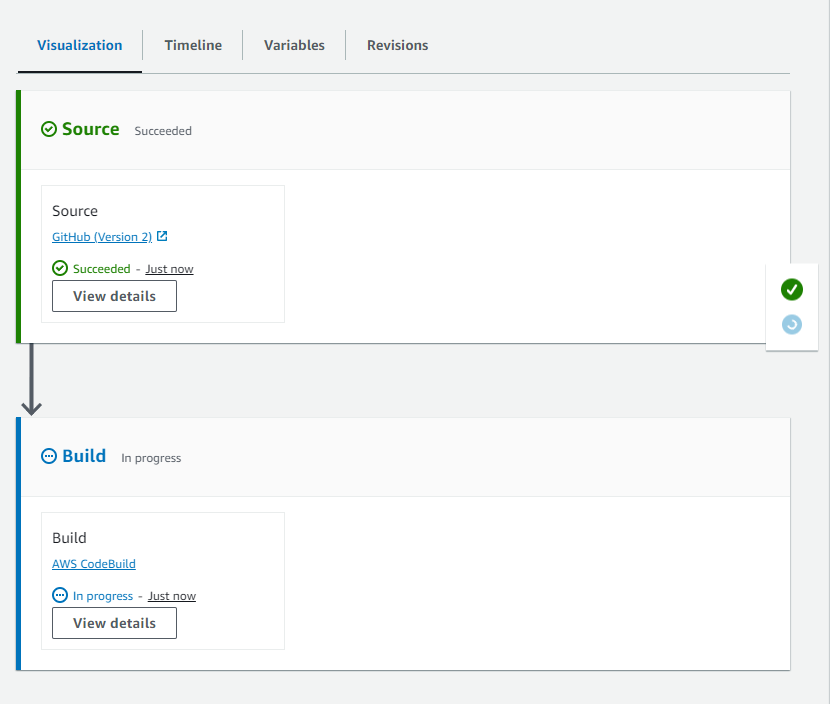

# Set or change the pipeline execution mode

You can set the execution mode for your pipeline to specify how multiple executions are
handled.

For more information about pipeline execution modes, see [How pipeline executions work](concepts-how-it-works.md "concepts-how-it-works.md").

###### Important

For pipelines in PARALLEL mode, when editing the pipeline execution mode to QUEUED or
SUPERSEDED, the pipeline state will not display the updated state as PARALLEL. For more
information, see [Pipelines changed from
PARALLEL mode will display a previous execution mode](troubleshooting.md#troubleshooting-execution-mode-displayedstate "troubleshooting.md#troubleshooting-execution-mode-displayedstate").

###### Important

For pipelines in PARALLEL mode, when editing the pipeline execution mode to QUEUED or
SUPERSEDED, the pipeline definition for the pipeline in each mode will not be updated. For more
information, see [Pipelines in PARALLEL mode have an
outdated pipeline definition if edited when changing to QUEUED or SUPERSEDED mode](troubleshooting.md#troubleshooting-execution-mode-editing "troubleshooting.md#troubleshooting-execution-mode-editing").

###### Important

For pipelines in PARALLEL mode, stage rollback is not available. Similarly, failure
conditions with a rollback result type cannot be added to a PARALLEL mode
pipeline.

## Considerations for viewing execution modes

There are considerations for viewing pipelines in specific execution modes.

For SUPERSEDED and QUEUED modes, use the pipeline view to see in-progress executions,
and click the execution ID to view details and history. For PARALLEL mode, click the
execution ID to view the in-progress execution on the Visualization tab.

The following shows the view for SUPERSEDED mode in CodePipeline.



The following shows the view for QUEUED mode in CodePipeline.



The following shows the view for PARALLEL mode in CodePipeline.

###### Important

For pipelines in PARALLEL mode, stage rollback is not available. Similarly,
failure conditions with a rollback result type cannot be added to a PARALLEL mode
pipeline.



## Considerations for switching between execution modes

The following are considerations for pipelines when changing the mode for the
pipeline. When switching from one execution mode to another in **Edit**
mode and then saving the change, certain views or states might adjust.

For example, when switching from PARALLEL mode to a QUEUED or SUPERSEDED mode, the
execution started in PARALLEL mode will continue to run. These can be viewed on the
execution history page. The pipeline view will show the execution that ran on QUEUED or
SUPERSEDED mode earlier or an empty state otherwise.

As another example, when switching from QUEUED or SUPERSEDED to PARALLEL mode, you
will no longer see the pipeline view/state page. To view an execution in PARALLEL mode,
use the visualization tab on the execution details page. Executions started in
SUPERSEDED or QUEUED mode will be cancelled.

The following table provides more detail.

| Mode change                                     | Pending and active execution details                                                                            | Pipeline state details                                                                                                |
| ----------------------------------------------- | --------------------------------------------------------------------------------------------------------------- | --------------------------------------------------------------------------------------------------------------------- |
| SUPERSEDED to SUPERSEDED / SUPERSEDED to QUEUED | • Active executions are cancelled after in-progress actions<br>complete.<br>• Pending executions are cancelled. | The pipeline state, such as **cancelled**, is preserved between the version of the first<br>mode and the second mode. |
| QUEUED to QUEUED / QUEUED to SUPERSEDED         | • Active executions are cancelled after in-progress actions<br>complete.<br>• Pending executions are cancelled. | The pipeline state, such as cancelled, is preserved between the<br>version of the first mode and the second mode.     |
| PARALLEL to PARALLEL                            | All executions are allowed to run independently of pipeline<br>definition updates.                              | Empty. Parallel mode does not have a pipeline state.                                                                  |
| SUPERSEDED to PARALLEL / QUEUED to PARALLEL     | • Active executions are cancelled after in-progress actions<br>complete.<br>• Pending executions are cancelled. | Empty. Parallel mode does not have a pipeline state.                                                                  |

## Set or change the pipeline execution mode (console)

You can use the console to set the pipeline execution mode.

1. Sign in to the AWS Management Console and open the CodePipeline console at [http://console.aws.amazon.com/codesuite/codepipeline/home](http://console.aws.amazon.com/codesuite/codepipeline/home "http://console.aws.amazon.com/codesuite/codepipeline/home").

The names and status of all pipelines associated with your AWS account are
displayed. 2. In **Name**, choose the name of the pipeline you want to
edit. 3. On the pipeline details page, choose **Edit**. 4. On the **Edit** page, choose **Edit: Pipeline
properties**. 5. Choose the mode for your pipeline.

    * **Superseded**
    * **Queued (Pipeline type V2
     required)**
    * **Parallel (Pipeline type V2
     required)**

6. On the **Edit** page, choose
   **Done**.

## Set the pipeline execution mode (CLI)

To use the AWS CLI to set the pipeline execution mode, use the
`create-pipeline` or `update-pipeline` command.

1. Open a terminal session (Linux, macOS, or Unix) or command prompt (Windows) and run the
   **get-pipeline** command to copy the pipeline structure into
   a JSON file. For example, for a pipeline named
   `MyFirstPipeline`, enter the following
   command:

```
aws codepipeline get-pipeline --name `MyFirstPipeline` >`pipeline.json`
```

This command returns nothing, but the file you created should appear in the
directory where you ran the command. 2. Open the JSON file in any plain-text editor and modify the structure of the
file to reflect the pipeline execution mode you want to set, such as
QUEUED.

```
"executionMode": "QUEUED"
```

The following example shows how you would set the execution mode to QUEUED in
an example pipeline with two stages.

```
{
    "pipeline": {
        "name": "MyPipeline",
        "roleArn": "arn:aws:iam::111122223333:role/service-role/AWSCodePipelineServiceRole-us-east-1-dkpippe",
        "artifactStore": {
            "type": "S3",
            "location": "`bucket`"
        },
        "stages": [
            {
                "name": "Source",
                "actions": [
                    {
                        "name": "Source",
                        "actionTypeId": {
                            "category": "Source",
                            "owner": "AWS",
                            "provider": "CodeCommit",
                            "version": "1"
                        },
                        "runOrder": 1,
                        "configuration": {
                            "BranchName": "main",
                            "OutputArtifactFormat": "CODE_ZIP",
                            "PollForSourceChanges": "true",
                            "RepositoryName": "MyDemoRepo"
                        },
                        "outputArtifacts": [
                            {
                                "name": "SourceArtifact"
                            }
                        ],
                        "inputArtifacts": [],
                        "region": "us-east-1",
                        "namespace": "SourceVariables"
                    }
                ]
            },
            {
                "name": "Build",
                "actions": [
                    {
                        "name": "Build",
                        "actionTypeId": {
                            "category": "Build",
                            "owner": "AWS",
                            "provider": "CodeBuild",
                            "version": "1"
                        },
                        "runOrder": 1,
                        "configuration": {
                            "ProjectName": "MyBuildProject"
                        },
                        "outputArtifacts": [
                            {
                                "name": "BuildArtifact"
                            }
                        ],
                        "inputArtifacts": [
                            {
                                "name": "SourceArtifact"
                            }
                        ],
                        "region": "us-east-1",
                        "namespace": "BuildVariables"
                    }
                ]
            }
        ],
        "version": 1,
        "executionMode": "QUEUED"
    }
}
```

3. If you are working with the pipeline structure retrieved using the
   **get-pipeline** command, you must modify the structure in
   the JSON file. You must remove the `metadata` lines from the file so
   the **update-pipeline** command can use it. Remove the section
   from the pipeline structure in the JSON file (the `"metadata": { }`
   lines and the `"created"`, `"pipelineARN"`, and
   `"updated"` fields).

For example, remove the following lines from the structure:

```
"metadata": {
  "pipelineArn": "arn:aws:codepipeline:`region`:`account-ID`:`pipeline-name`",
  "created": "`date`",
  "updated": "`date`"
  }
```

Save the file. 4. To apply your changes, run the **update-pipeline** command,
specifying the pipeline JSON file:

###### Important

Be sure to include `file://` before the file name. It is required in this command.

```
aws codepipeline update-pipeline --cli-input-json file://`pipeline.json`
```

This command returns the entire structure of the edited pipeline.

###### Note

The **update-pipeline** command stops the pipeline. If a
revision is being run through the pipeline when you run the
**update-pipeline** command, that run is stopped. You
must start the pipeline manually to run that revision through the updated
pipeline.
