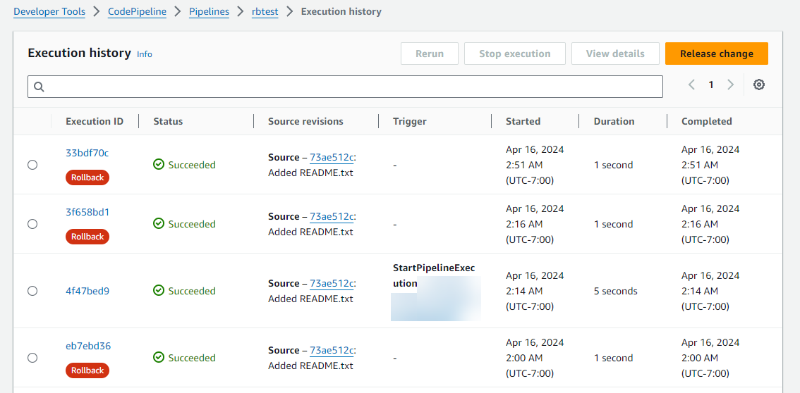
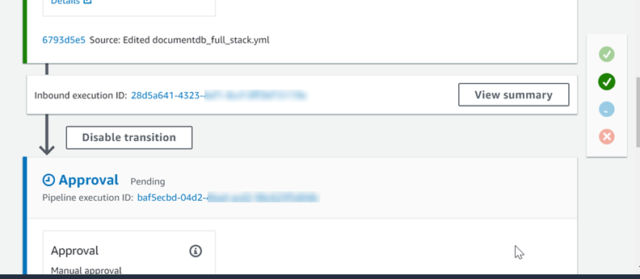
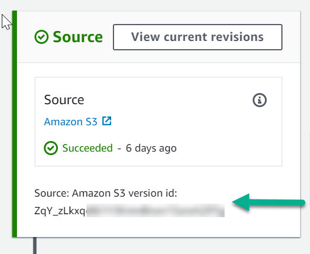
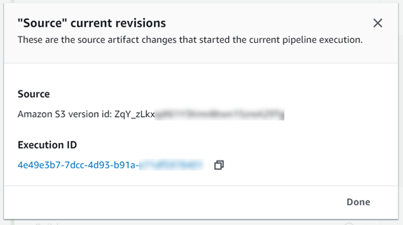

# View executions in CodePipeline

You can use the AWS CodePipeline console or the AWS CLI to view execution status, view execution
history, and retry failed stages or actions.

###### Topics

- [View pipeline execution history
  (console)](#pipelines-executions-console "#pipelines-executions-console")
- [View execution status
  (console)](#pipelines-executions-status-console "#pipelines-executions-status-console")
- [View an inbound execution
  (Console)](#pipelines-executions-inbound-console "#pipelines-executions-inbound-console")
- [View pipeline execution source
  revisions (console)](#pipelines-source-revisions-console "#pipelines-source-revisions-console")
- [View action executions
  (console)](#pipelines-action-executions-console "#pipelines-action-executions-console")
- [View action artifacts and artifact
  store information (console)](#pipelines-action-artifacts-console "#pipelines-action-artifacts-console")
- [View pipeline details and history (CLI)](#executions-view-cli "#executions-view-cli")

## View pipeline execution history

(console)

You can use the CodePipeline console to view a list of all of the pipelines in your account.
You can also view details for each pipeline, including when actions last ran in the
pipeline, whether a transition between stages is enabled or disabled, whether any
actions have failed, and other information. You can also view a history page that shows
details for all pipeline executions for which history has been recorded.

###### Note

When switching between specific execution modes, the pipeline view and history
might change. For more information, see [Set or change the pipeline execution mode](execution-modes.md "execution-modes.md").

Execution history is retained for up to 12 months.

You can use the console to view the history of executions in a pipeline, including
status, source revisions, and timing details for each execution.

1. Sign in to the AWS Management Console and open the CodePipeline console at [http://console.aws.amazon.com/codesuite/codepipeline/home](http://console.aws.amazon.com/codesuite/codepipeline/home "http://console.aws.amazon.com/codesuite/codepipeline/home").

The names of all pipelines associated with your AWS account are displayed,
along with their status. 2. In **Name**, choose the name of the pipeline. 3. Choose **View history**.

###### Note

For a pipeline in PARALLEL execution mode, the main pipeline view does not
show the pipeline structure or in-progress executions. For a pipeline in
PARALLEL execution mode, you access the pipeline structure by choosing the
ID for the execution you want to view from the execution history page.
Choose **History** in the left navigation, choose the
execution ID for the parallel execution, and then view the pipeline on the
**Visualization** tab.

 4. View the status, source revisions, change details, and triggers related to
each execution for your pipeline. Pipeline executions that have been rolled back
will show the execution type **Rollback** on the
details screen in the console. For the failed execution that triggered the
automatic rollback, the failed execution ID is shown. 5. Choose an execution. The detail view shows execution details, the
**Timeline** tab, the **Visualization**
tab, and the **Variables** tab. Variable values for variables
at the pipeline level are resolved at the time of pipeline execution and can be
viewed in the execution history for each execution.

###### Note

Output variables from pipeline actions can be viewed on the Output
variables tab under the history for each action execution.

## View execution status

(console)

You can view the pipeline status in **Status** on the execution
history page. Choose an execution ID link, and then view the action status.

The following are valid states for pipelines, stages, and actions:

###### Note

The following pipeline states also apply to a pipeline execution that is an
inbound execution. To view an inbound execution and its status, see [View an inbound execution
(Console)](#pipelines-executions-inbound-console "#pipelines-executions-inbound-console").

| Pipeline-level states | Pipeline state                                                                                                                                                      | Description |
| --------------------- | ------------------------------------------------------------------------------------------------------------------------------------------------------------------- | ----------- |
| InProgress            | The pipeline execution is currently running.                                                                                                                        |
| Stopping              | The pipeline execution is stopping due to a request to either stop<br>and wait or stop and abandon the pipeline execution.                                          |
| Stopped               | The stopping process is complete, and the pipeline execution is<br>stopped.                                                                                         |
| Succeeded             | The pipeline execution was completed successfully.                                                                                                                  |
| Superseded            | While this pipeline execution was waiting for the next stage to be<br>completed, a newer pipeline execution advanced and continued through the<br>pipeline instead. |
| Failed                | The pipeline execution was not completed successfully.                                                                                                              |

| Stage-level states | Stage state                                                                                                             | Description |
| ------------------ | ----------------------------------------------------------------------------------------------------------------------- | ----------- |
| InProgress         | The stage is currently running.                                                                                         |
| Stopping           | The stage execution is stopping due to a request to either stop and<br>wait or stop and abandon the pipeline execution. |
| Stopped            | The stopping process is complete, and the stage execution is<br>stopped.                                                |
| Succeeded          | The stage was completed successfully.                                                                                   |
| Failed             | The stage was not completed successfully.                                                                               |

| Action-level states | Action state                                                                                                                                          | Description |
| ------------------- | ----------------------------------------------------------------------------------------------------------------------------------------------------- | ----------- |
| InProgress          | The action is currently running.                                                                                                                      |
| Abandoned           | The action is abandoned due to a request to stop and abandon the<br>pipeline execution.                                                               |
| Succeeded           | The action was completed successfully.                                                                                                                |
| Failed              | For approval actions, the FAILED state means the action was either<br>rejected by the reviewer or failed due to an incorrect action<br>configuration. |

## View an inbound execution

(Console)

You can use the console to view the status and details for an inbound execution. When
the transition is enabled or the stage becomes available, an inbound execution that is
`InProgress` continues and enters the stage. An inbound execution with a
`Stopped` status does not enter the stage. An inbound execution status
changes to `Failed` if the pipeline is edited. When you edit a pipeline, all
in-progress executions do not continue, and the execution status changes to
`Failed`.

If you do not see an inbound execution, then there are no pending executions at a
disabled stage transition.

1. Sign in to the AWS Management Console and open the CodePipeline console at [http://console.aws.amazon.com/codesuite/codepipeline/home](http://console.aws.amazon.com/codesuite/codepipeline/home "http://console.aws.amazon.com/codesuite/codepipeline/home").

The names of all pipelines associated with your AWS account will be
displayed. 2. Choose the name of the pipeline for which you want to view the inbound
execution, Do one of the following:

    * Choose **View**. In the pipeline diagram, in the
     **Inbound execution ID** field in front
     of your disabled transition, you can view the inbound execution ID.


    

    Choose **View summary** to see execution details,
     such as the execution ID, source trigger, and the name of the next
     stage.
    * Choose the pipeline and choose **View
     history**.

## View pipeline execution source

revisions (console)

You can view details about source artifacts (output artifact that originated in the
first stage of a pipeline) that are used in an execution of a pipeline. The details
include identifiers, such as commit IDs, check-in comments, and, when you use the CLI,
version numbers of pipeline build actions. For some revision types, you can view and
open the URL of the commit. Source revisions are made up of the following:

- **Summary**: Summary information about the most
  recent revision of the artifact. For GitHub and CodeCommit repositories, the
  commit message. For Amazon S3 buckets or actions, the user-provided content of a
  codepipeline-artifact-revision-summary key specified in the object metadata.
- **revisionUrl**: The revision URL for the
  artifact revision (for example, the external repository URL).
- **revisionId**: The revision ID for the artifact
  revision. For example, for a source change in a CodeCommit or GitHub repository, this
  is the commit ID. For artifacts stored in GitHub or CodeCommit repositories, the
  commit ID is linked to a commit details page.

1. Sign in to the AWS Management Console and open the CodePipeline console at [http://console.aws.amazon.com/codesuite/codepipeline/home](http://console.aws.amazon.com/codesuite/codepipeline/home "http://console.aws.amazon.com/codesuite/codepipeline/home").

The names of all pipelines associated with your AWS accountwill be
displayed. 2. Choose the name of the pipeline for which you want to view source revision
details. Do one of the following:

    * Choose **View history**. In **Source
     revisions**, the source change for each execution is
     listed.
    * Locate an action for which you want to view source revision details,
     and then find the revision information at the bottom of its stage:


    

    Choose **View current revisions** to view source
     information. With the exception of artifacts stored in Amazon S3 buckets,
     identifiers such as commit IDs in this information detail view are
     linked to source information pages for the artifacts.


    

## View action executions

(console)

You can view action details for a pipeline, such as action execution ID, input
artifacts, output artifacts, and status. You can view action details by choosing a
pipeline in the console and then choosing an execution ID.

1. Sign in to the AWS Management Console and open the CodePipeline console at [http://console.aws.amazon.com/codesuite/codepipeline/home](http://console.aws.amazon.com/codesuite/codepipeline/home "http://console.aws.amazon.com/codesuite/codepipeline/home").

The names of all pipelines associated with your AWS account are displayed. 2. Choose the name of the pipeline for which you want to view action details, and
then choose **View history**. 3. In **Execution ID**, choose the execution ID for which you
want to view action execution details. 4. You can view the following information on the **Timeline**
tab:

    1. In **Action name**, choose the link to open a details
     page for the action where you can view status, stage name, action name,
     configuration data, and artifact information.
    2. In **Provider**, choose the link to view the action
     provider details. For example, in the preceding example pipeline, if you
     choose CodeDeploy in either the Staging or Production stages, the CodeDeploy
     console page for the CodeDeploy application configured for that stage is
     displayed.

## View action artifacts and artifact

store information (console)

You can view input and output artifact details for an action. You can also choose a
link that takes you to the artifact information for that action. Because the artifact
store uses versioning, each action execution has a unique input and output artifact
location.

1. Sign in to the AWS Management Console and open the CodePipeline console at [http://console.aws.amazon.com/codesuite/codepipeline/home](http://console.aws.amazon.com/codesuite/codepipeline/home "http://console.aws.amazon.com/codesuite/codepipeline/home").

The names of all pipelines associated with your AWS account are displayed. 2. Choose the name of the pipeline for which you want to view action details, and
then choose **View history**. 3. In **Execution ID**, choose the execution ID for which you
want to view action details. 4. On the **Timeline** tab, in **Action name**,
choose the link to open a details page for the action. 5. On the details page, on the **Execution** tab, view the
status and timing of the action execution. 6. On the **Configuration** tab, view the resource
configuration for the action (for example, the CodeBuild build project name). 7. On the **Artifacts** tab, view the artifact details in
**Artifact type** and **Artifact
provider**. Choose the link under **Artifact
name** to view the artifacts in the artifact store. 8. On the **Output variables** tab, view the resolved variables
from actions in the pipeline for the action execution.

## View pipeline details and history (CLI)

You can run the following commands to view details about your pipelines and pipeline
executions:

- **list-pipelines** command to view a summary of all of the
  pipelines associated with your AWS account.
- **get-pipeline** command to review details of a single
  pipeline.
- **list-pipeline-executions** to view summaries of the most
  recent executions for a pipeline.
- **get-pipeline-execution** to view information about an
  execution of a pipeline, including details about artifacts, the pipeline
  execution ID, and the name, version, and status of the pipeline.
- **get-pipeline-state** command to view pipeline, stage, and
  action status.
- **list-action-executions** to view action execution details for
  a pipeline.

###### Topics

- [View execution history with
  list-pipeline-executions (CLI)](#pipelines-executions-cli "#pipelines-executions-cli")
- [View pipeline state with
  get-pipeline-state (CLI)](#pipelines-executions-status-cli "#pipelines-executions-status-cli")
- [View inbound execution status
  with get-pipeline-state (CLI)](#pipelines-executions-inbound-cli "#pipelines-executions-inbound-cli")
- [View status and source revisions
  with get-pipeline-execution (CLI)](#pipelines-source-revisions-cli "#pipelines-source-revisions-cli")
- [View action executions with
  list-action-executions (CLI)](#pipelines-action-executions-cli "#pipelines-action-executions-cli")

### View execution history with

`list-pipeline-executions` (CLI)

You can view pipeline execution history.

- To view details about past executions of a pipeline, run the
  **[list-pipeline-executions](../../../cli/latest/reference/codepipeline/list-pipeline-executions.md "../../../cli/latest/reference/codepipeline/list-pipeline-executions.md")** command,
  specifying the unique name of the pipeline. For example, to view details
  about the current state of a pipeline named
  `MyFirstPipeline`, enter the
  following:

```
aws codepipeline list-pipeline-executions --pipeline-name `MyFirstPipeline`
```

This command returns summary information about all pipeline executions for
which history has been recorded. The summary includes start and end times,
duration, and status.

Pipeline executions that have been rolled back will show the execution
type `Rollback`. For the failed execution that triggered the
automatic rollback, the failed execution ID is shown.

The following example shows the returned data for a pipeline named
`MyFirstPipeline` that has had three
executions:

```
{
    "pipelineExecutionSummaries": [
        {
            "pipelineExecutionId": "eb7ebd36-353a-4551-90dc-18ca5EXAMPLE",
            "status": "Succeeded",
            "startTime": "2024-04-16T09:00:28.185000+00:00",
            "lastUpdateTime": "2024-04-16T09:00:29.665000+00:00",
            "sourceRevisions": [
                {
                    "actionName": "Source",
                    "revisionId": "revision_ID",
                    "revisionSummary": "Added README.txt",
                    "revisionUrl": "`console-URL`"
                }
            ],
            "trigger": {
                "triggerType": "StartPipelineExecution",
                "triggerDetail": "`trigger_ARN`"
            },
            "executionMode": "SUPERSEDED"
        },
        {
            "pipelineExecutionId": "fcd61d8b-4532-4384-9da1-2aca1EXAMPLE",
            "status": "Succeeded",
            "startTime": "2024-04-16T08:58:56.601000+00:00",
            "lastUpdateTime": "2024-04-16T08:59:04.274000+00:00",
            "sourceRevisions": [
                {
                    "actionName": "Source",
                    "revisionId": "revision_ID",
                    "revisionSummary": "Added README.txt",
                    "revisionUrl": "console_URL"
                }
            ],
            "trigger": {
                "triggerType": "StartPipelineExecution",
                "triggerDetail": "`trigger_ARN`"
            },
            "executionMode": "SUPERSEDED"
        }
```

To view more details about a pipeline execution, run the
**[get-pipeline-execution](../../../cli/latest/reference/codepipeline/get-pipeline-execution.md "../../../cli/latest/reference/codepipeline/get-pipeline-execution.md")**, specifying the
unique ID of the pipeline execution. For example, to view more details about
the first execution in the previous example, enter the following:

```
aws codepipeline get-pipeline-execution --pipeline-name `MyFirstPipeline` --pipeline-execution-id 7cf7f7cb-3137-539g-j458-d7eu3EXAMPLE
```

This command returns summary information about an execution of a pipeline,
including details about artifacts, the pipeline execution ID, and the name,
version, and status of the pipeline.

The following example shows the returned data for a pipeline named
`MyFirstPipeline`:

```
{
    "pipelineExecution": {
        "pipelineExecutionId": "3137f7cb-7cf7-039j-s83l-d7eu3EXAMPLE",
        "pipelineVersion": 2,
        "pipelineName": "MyFirstPipeline",
        "status": "Succeeded",
        "artifactRevisions": [
            {
                "created": 1496380678.648,
                "revisionChangeIdentifier": "1496380258.243",
                "revisionId": "7636d59f3c461cEXAMPLE8417dbc6371",
                "name": "MyApp",
                "revisionSummary": "Updating the application for feature 12-4820"
            }
        ]
    }
}
```

### View pipeline state with

`get-pipeline-state` (CLI)

You can use the CLI to view pipeline, stage, and action status.

- To view details about the current state of a pipeline, run the
  **[get-pipeline-state](../../../cli/latest/reference/codepipeline/get-pipeline-state.md "../../../cli/latest/reference/codepipeline/get-pipeline-state.md")** command, specifying
  the unique name of the pipeline. For example, to view details about the
  current state of a pipeline named
  `MyFirstPipeline`, enter the
  following:

```
aws codepipeline get-pipeline-state --name `MyFirstPipeline`
```

This command returns the current status of all stages of the pipeline and
the status of the actions in those stages.

The following example shows the returned data for a three-stage pipeline
named `MyFirstPipeline`, where the first
two stages and actions show success, the third shows failure, and the
transition between the second and third stages is disabled:

```
{
    "updated": 1427245911.525,
    "created": 1427245911.525,
    "pipelineVersion": 1,
    "pipelineName": "MyFirstPipeline",
    "stageStates": [
        {
            "actionStates": [
                {
                    "actionName": "Source",
                    "entityUrl": "https://console.aws.amazon.com/s3/home?#",
                    "latestExecution": {
                        "status": "Succeeded",
                        "lastStatusChange": 1427298837.768
                    }
                }
            ],
            "stageName": "Source"
        },
        {
            "actionStates": [
                {
                    "actionName": "Deploy-CodeDeploy-Application",
                    "entityUrl": "https://console.aws.amazon.com/codedeploy/home?#",
                    "latestExecution": {
                        "status": "Succeeded",
                        "lastStatusChange": 1427298939.456,
                        "externalExecutionUrl": "https://console.aws.amazon.com/?#",
                        "externalExecutionId": ""c53dbd42-This-Is-An-Example"",
                        "summary": "Deployment Succeeded"
                    }
                }
            ],
            "inboundTransitionState": {
                "enabled": true
            },
            "stageName": "Staging"
        },
        {
            "actionStates": [
                {
                    "actionName": "Deploy-Second-Deployment",
                    "entityUrl": "https://console.aws.amazon.com/codedeploy/home?#",
                    "latestExecution": {
                        "status": "Failed",
                        "errorDetails": {
                            "message": "Deployment Group is already deploying deployment ...",
                            "code": "JobFailed"
                        },
                        "lastStatusChange": 1427246155.648
                    }
                }
            ],
            "inboundTransitionState": {
                "disabledReason": "Disabled while I investigate the failure",
                "enabled": false,
                "lastChangedAt": 1427246517.847,
                "lastChangedBy": "arn:aws:iam::80398EXAMPLE:user/CodePipelineUser"
            },
            "stageName": "Production"
        }
    ]
}
```

### View inbound execution status

with `get-pipeline-state` (CLI)

You can use the CLI to view inbound execution status. When the transition is
enabled or the stage becomes available, an inbound execution that is
`InProgress` continues and enters the stage. An inbound execution
with a `Stopped` status does not enter the stage. An inbound execution
status changes to `Failed` if the pipeline is edited. When you edit a
pipeline, all in-progress executions do not continue, and the execution status
changes to `Failed`.

- To view details about the current state of a pipeline, run the
  **[get-pipeline-state](../../../cli/latest/reference/codepipeline/get-pipeline-state.md "../../../cli/latest/reference/codepipeline/get-pipeline-state.md")** command, specifying
  the unique name of the pipeline. For example, to view details about the
  current state of a pipeline named
  `MyFirstPipeline`, enter the
  following:

```
aws codepipeline get-pipeline-state --name `MyFirstPipeline`
```

This command returns the current status of all stages of the pipeline and
the status of the actions in those stages. The output also shows pipeline
execution ID in each stage, and whether there is an inbound execution ID for
a stage with a disabled transition.

The following example shows the returned data for a two-stage pipeline
named `MyFirstPipeline`, where the first
stage shows an enabled transition and a successful pipeline execution, and
the second stage, named `Beta`, shows a disabled transition and
an inbound execution ID. The inbound execution can have an
`InProgress`, `Stopped`, or `FAILED`
state.

```
{
    "pipelineName": "MyFirstPipeline",
    "pipelineVersion": 2,
    "stageStates": [
        {
            "stageName": "Source",
            "inboundTransitionState": {
                "enabled": true
            },
            "actionStates": [
                {
                    "actionName": "SourceAction",
                    "currentRevision": {
                        "revisionId": "PARcnxX_u0SMRBnKh83pHL09.zPRLLMu"
                    },
                    "latestExecution": {
                        "actionExecutionId": "14c8b311-0e34-4bda-EXAMPLE",
                        "status": "Succeeded",
                        "summary": "Amazon S3 version id: PARcnxX_u0EXAMPLE",
                        "lastStatusChange": 1586273484.137,
                        "externalExecutionId": "PARcnxX_u0EXAMPLE"
                    },
                    "entityUrl": "https://console.aws.amazon.com/s3/home?#"
                }
            ],
            "latestExecution": {
                "pipelineExecutionId": "27a47e06-6644-42aa-EXAMPLE",
                "status": "Succeeded"
            }
        },
        {
            "stageName": "Beta",
            "inboundExecution": {
                "pipelineExecutionId": "27a47e06-6644-42aa-958a-EXAMPLE",
                "status": "InProgress"
            },
            "inboundTransitionState": {
                "enabled": false,
                "lastChangedBy": "`USER_ARN`",
                "lastChangedAt": 1586273583.949,
                "disabledReason": "disabled"
            },
                    "currentRevision": {
            "actionStates": [
                {
                    "actionName": "BetaAction",
                    "latestExecution": {
                        "actionExecutionId": "a748f4bf-0b52-4024-98cf-EXAMPLE",
                        "status": "Succeeded",
                        "summary": "Deployment Succeeded",
                        "lastStatusChange": 1586272707.343,
                        "externalExecutionId": "d-KFGF3EXAMPLE",
                        "externalExecutionUrl": "https://us-west-2.console.aws.amazon.com/codedeploy/home?#/deployments/d-KFGF3WTS2"
                    },
                    "entityUrl": "https://us-west-2.console.aws.amazon.com/codedeploy/home?#/applications/my-application"
                }
            ],
            "latestExecution": {
                "pipelineExecutionId": "f6bf1671-d706-4b28-EXAMPLE",
                "status": "Succeeded"
            }
        }
    ],
    "created": 1585622700.512,
    "updated": 1586273472.662
}
```

### View status and source revisions

with `get-pipeline-execution` (CLI)

You can view details about source artifacts (output artifacts that originated in
the first stage of a pipeline) that are used in an execution of a pipeline. The
details include identifiers, such as commit IDs, check-in comments, time since the
artifact was created or updated and, when you use the CLI, version numbers of build
actions. For some revision types, you can view and open the URL of the commit for
the artifact version. Source revisions are made up of the following:

- **Summary**: Summary information about the
  most recent revision of the artifact. For GitHub and AWS CodeCommit repositories,
  the commit message. For Amazon S3 buckets or actions, the user-provided content
  of a codepipeline-artifact-revision-summary key specified in the object
  metadata.
- **revisionUrl**: The commit ID for the
  artifact revision. For artifacts stored in GitHub or AWS CodeCommit repositories,
  the commit ID is linked to a commit details page.

You can run the **get-pipeline-execution** command to view
information about the most recent source revisions that were included in a pipeline
execution. After you first run the **get-pipeline-state** command to
get details about all stages in a pipeline, you identify the execution ID that
applies to a stage for which you want source revision details. Then you use the
execution ID in the **get-pipeline-execution** command. (Because
stages in a pipeline might have been last successfully completed during different
pipeline runs, they can have different execution IDs.)

In other words, if you want to view details about artifacts currently in the
Staging stage, run the **get-pipeline-state** command, identify the
current execution ID of the Staging stage, and then run the
**get-pipeline-execution** command using that execution ID.

###### To view status and source revisions in a pipeline

1. Open a terminal (Linux, macOS, or Unix) or command prompt (Windows) and use the AWS CLI
   to run the **[get-pipeline-state](../../../cli/latest/reference/codepipeline/get-pipeline-state.md "../../../cli/latest/reference/codepipeline/get-pipeline-state.md")** command. For
   a pipeline named `MyFirstPipeline`, you
   would enter:

```
aws codepipeline get-pipeline-state --name MyFirstPipeline
```

This command returns the most recent state of a pipeline, including the
latest pipeline execution ID for each stage. 2. To view details about a pipeline execution, run the
**get-pipeline-execution** command, specifying the unique
name of the pipeline and the pipeline execution ID of the execution for
which you want to view artifact details. For example, to view details about
the execution of a pipeline named
`MyFirstPipeline`, with the execution
ID 3137f7cb-7cf7-039j-s83l-d7eu3EXAMPLE, you would enter the
following:

```
aws codepipeline get-pipeline-execution --pipeline-name `MyFirstPipeline` --pipeline-execution-id 3137f7cb-7cf7-039j-s83l-d7eu3EXAMPLE
```

This command returns information about each source revision that is part
of the pipeline execution and identifying information about the pipeline.
Only information about pipeline stages that were included in that execution
are included. There might be other stages in the pipeline that were not part
of that pipeline execution.

The following example shows the returned data for a portion of pipeline
named `MyFirstPipeline`, where an artifact
named "MyApp" is stored in a GitHub repository: 3. ```
{
"pipelineExecution": {
"artifactRevisions": [
{
"created": 1427298837.7689769,
"name": "MyApp",
"revisionChangeIdentifier": "1427298921.3976923",
"revisionId": "7636d59f3c461cEXAMPLE8417dbc6371",
"revisionSummary": "Updating the application for feature 12-4820",
"revisionUrl": "https://api.github.com/repos/anycompany/MyApp/git/commits/7636d59f3c461cEXAMPLE8417dbc6371"
}
],
"pipelineExecutionId": "3137f7cb-7cf7-039j-s83l-d7eu3EXAMPLE",
"pipelineName": "MyFirstPipeline",
"pipelineVersion": 2,
"status": "Succeeded",
"executionMode": "SUPERSEDED",
"executionType": "ROLLBACK",
"rollbackMetadata": {
"rollbackTargetPipelineExecutionId": "4f47bed9-6998-476c-a49d-e60beEXAMPLE"
}
}
}

````

### View action executions with
 `list-action-executions` (CLI)


You can view action execution details for a pipeline, such as action execution ID,
 input artifacts, output artifacts, execution result, and status. You provide the
 Execution ID filter to return a listing of actions in a pipeline execution:


###### Note

Detailed execution history is available for executions run on or after
 February 21, 2019.


* To view action executions for a pipeline, do one of the following:


	+ To view details for all action executions in a pipeline, run the
	 **list-action-executions** command, specifying
	 the unique name of the pipeline. For example, to view action
	 executions in a pipeline named
	 `MyFirstPipeline`, enter the
	 following:


	```
	aws codepipeline list-action-executions --pipeline-name MyFirstPipeline
	```

	The following shows a portion of sample output for this
	 command:


	```
	{
	    "actionExecutionDetails": [
	        {
	            "actionExecutionId": "`ID`",
	            "lastUpdateTime": 1552958312.034,
	            "startTime": 1552958246.542,
	            "pipelineExecutionId": "`Execution_ID`",
	            "actionName": "Build",
	            "status": "Failed",
	            "output": {
	                "executionResult": {
	                    "externalExecutionUrl": "`Project_ID`",
	                    "externalExecutionSummary": "Build terminated with state: FAILED",
	                    "externalExecutionId": "`ID`"
	                },
	                "outputArtifacts": []
	            },
	            "stageName": "Beta",
	            "pipelineVersion": 8,
	            "input": {
	                "configuration": {
	                    "ProjectName": "java-project"
	                },
	                "region": "us-east-1",
	                "inputArtifacts": [
	                    {
	                        "s3location": {
	                            "bucket": "codepipeline-us-east-1-`ID`",
	                            "key": "MyFirstPipeline/MyApp/Object.zip"
	                        },
	                        "name": "MyApp"
	                    }
	                ],
	                "actionTypeId": {
	                    "version": "1",
	                    "category": "Build",
	                    "owner": "AWS",
	                    "provider": "CodeBuild"
	                }
	            }
	        },

	. . .

	```
	+ To view all action executions in a pipeline execution, run the
	 **list-action-executions** command, specifying
	 the unique name of the pipeline and the execution ID. For example,
	 to view action executions for an
	 `Execution_ID`, enter the
	 following:


	```
	aws codepipeline list-action-executions --pipeline-name MyFirstPipeline --filter pipelineExecutionId=`Execution_ID`
	```
	+ The following shows a portion of sample output for this
	 command:


	```
	{
	    "actionExecutionDetails": [
	        {
	            "stageName": "Beta",
	            "pipelineVersion": 8,
	            "actionName": "Build",
	            "status": "Failed",
	            "lastUpdateTime": 1552958312.034,
	            "input": {
	                "configuration": {
	                    "ProjectName": "java-project"
	                },
	                "region": "us-east-1",
	                "actionTypeId": {
	                    "owner": "AWS",
	                    "category": "Build",
	                    "provider": "CodeBuild",
	                    "version": "1"
	                },
	                "inputArtifacts": [
	                    {
	                        "s3location": {
	                            "bucket": "codepipeline-us-east-1-`ID`",
	                            "key": "MyFirstPipeline/MyApp/Object.zip"
	                        },
	                        "name": "MyApp"
	                    }
	                ]
	            },


	. . .

	```
````
