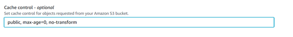
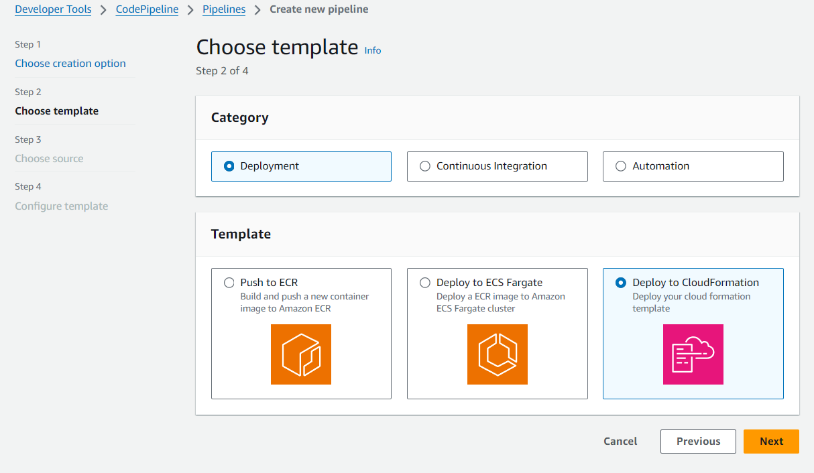
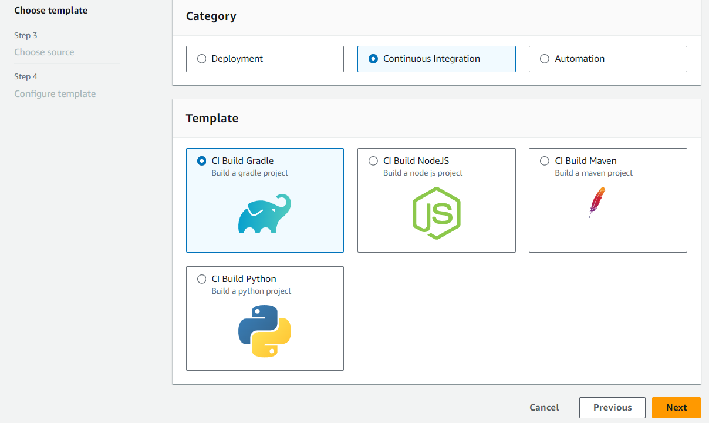
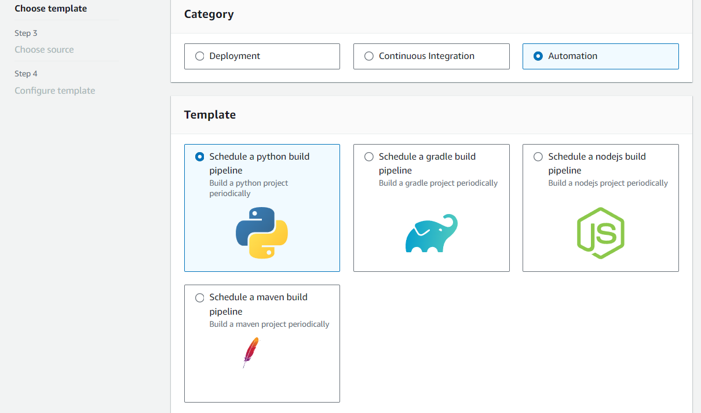
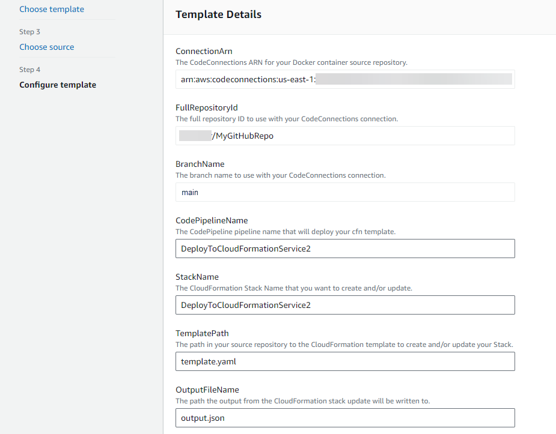

# Create a pipeline, stages, and actions

You can use the AWS CodePipeline console or the AWS CLI to create a pipeline. Pipelines must have
at least two stages. The first stage of a pipeline must be a source stage. The pipeline must
have at least one other stage that is a build or deployment stage.

###### Important

As part of creating a pipeline, an S3 artifact bucket provided by the customer will be
used by CodePipeline for artifacts. (This is different from the bucket used for an S3 source
action.) If the S3 artifact bucket is in a different account from the account for your
pipeline, make sure that the S3 artifact bucket is owned by AWS accounts that are safe
and will be dependable.

You can add actions to your pipeline that are in an AWS Region different from your
pipeline. A cross-Region action is one in which an AWS service is the provider for an
action and the action type or provider type are in an AWS Region different from your
pipeline. For more information, see [Add a cross-Region action in CodePipeline](actions-create-cross-region.md "actions-create-cross-region.md").

You can also create pipelines that build and deploy container-based applications by using
Amazon ECS as the deployment provider. Before you create a pipeline that deploys container-based
applications with Amazon ECS, you must create an image definitions file as described in [Image definitions file reference](file-reference.md "file-reference.md").

CodePipeline uses change detection methods to start your pipeline when a source code change is
pushed. These detection methods are based on source type:

- CodePipeline uses Amazon CloudWatch Events to detect changes in your CodeCommit source repository and branch
  or your S3 source bucket.

###### Note

When you use the console to create or edit a pipeline, the change detection resources
are created for you. If you use the AWS CLI to create the pipeline, you must create
the additional resources yourself. For more information, see [CodeCommit source actions and EventBridge](triggering.md "triggering.md").

###### Topics

- [Create a custom pipeline (console)](#pipelines-create-console "#pipelines-create-console")
- [Create a pipeline (CLI)](#pipelines-create-cli "#pipelines-create-cli")
- [Create a pipeline from static
  templates](#pipelines-create-templates "#pipelines-create-templates")

## Create a custom pipeline (console)

To create a custom pipeline in the console, you must provide the source file location
and information about the providers you will use for your actions.

When you use the console to create a pipeline, you must include a source stage and one
or both of the following:

- A build stage.
- A deployment stage.

When you use the pipeline wizard, CodePipeline creates the names of stages (source, build,
staging). These names cannot be changed. You can use more specific names (for example,
BuildToGamma or DeployToProd) to stages you add later.

###### Step 1: Create and name your pipeline

1. Sign in to the AWS Management Console and open the CodePipeline console at [http://console.aws.amazon.com/codesuite/codepipeline/home](http://console.aws.amazon.com/codesuite/codepipeline/home "http://console.aws.amazon.com/codesuite/codepipeline/home").
2. On the **Welcome** page, choose **Create
   pipeline**.

If this is your first time using CodePipeline, choose **Get
Started**. 3. On the **Step 1: Choose creation option** page, under
**Creation options**, choose the **Build custom
pipeline** option. Choose **Next**. 4. On the **Step 2: Choose pipeline settings** page, in
**Pipeline name**, enter the name for your pipeline.

In a single AWS account, each pipeline you create in an AWS Region must
have a unique name. Names can be reused for pipelines in different
Regions.

###### Note

After you create a pipeline, you cannot change its name. For information
about other limitations, see [Quotas in AWS CodePipeline](limits.md "limits.md"). 5. In **Pipeline type**, choose one of the following options.
Pipeline types differ in characteristics and price. For more information, see
[Pipeline types](pipeline-types.md "pipeline-types.md").

    * **V1** type pipelines have a JSON
     structure that contains standard pipeline, stage, and action-level
     parameters.
    * **V2** type pipelines have the same
     structure as a V1 type, along with additional parameter support, such as
     triggers on Git tags and pipeline-level variables.

6. In **Service role**, do one of the following:
   - Choose **New service role** to allow CodePipeline to create
     a new service role in IAM.
   - Choose **Existing service role** to use a service
     role already created in IAM. In **Role ARN**, choose
     your service role ARN from the list.

###### Note

Depending on when your service role was created, you might need to update
its permissions to support additional AWS services. For information, see
[Add permissions to the CodePipeline
service role](how-to-custom-role.md#how-to-update-role-new-services "how-to-custom-role.md#how-to-update-role-new-services").

For more information about the service role and its policy statement, see
[Manage the CodePipeline service role](how-to-custom-role.md "how-to-custom-role.md"). 7. (Optional) Under **Variables**, choose **Add
variable** to add variables at the pipeline level.

For more information about variables at the pipeline level, see [Variables reference](reference-variables.md "reference-variables.md"). For a
tutorial with a pipeline-level variable that is passed at the time of the
pipeline execution, see [Tutorial: Use pipeline-level variables](tutorials-pipeline-variables.md "tutorials-pipeline-variables.md").

###### Note

While it is optional to add variables at the pipeline level, for a
pipeline specified with variables at the pipeline level where no values are
provided, the pipeline execution will fail. 8. (Optional) Expand **Advanced settings**. 9. In **Artifact store**, do one of the following:

    1. Choose **Default location** to use the default
     artifact store, such as the S3 artifact bucket designated as the
     default, for your pipeline in the AWS Region you have selected for
     your pipeline.
    2. Choose **Custom location** if you already have an
     artifact store, such as an S3 artifact bucket, in the same Region as
     your pipeline. In **Bucket**, choose the bucket
     name.###### Note

This is not the source bucket for your source code. This is the artifact
store for your pipeline. A separate artifact store, such as an S3 bucket, is required
for each pipeline. When you create or edit a pipeline, you must have an artifact bucket
in the pipeline Region and one artifact bucket per AWS Region where you
are running an action.

For more information, see [Input and output artifacts](welcome-introducing-artifacts.md "welcome-introducing-artifacts.md") and [CodePipeline pipeline structure reference](reference-pipeline-structure.md "reference-pipeline-structure.md"). 10. In **Encryption key**, do one of the following:

    1. To use the CodePipeline default AWS KMS key to encrypt the data in the
     pipeline artifact store (S3 bucket), choose **Default AWS
     Managed Key**.
    2. To use your customer managed key to encrypt the data in the pipeline artifact
     store (S3 bucket), choose **Customer Managed Key**.
     Choose the key ID, key ARN, or alias ARN.

11. Choose **Next**.

###### Step 2: Create a source stage

1.  On the **Step 3: Add source stage** page, in **Source
    provider**, choose the type of repository where your source code is
    stored, specify its required options. The additional fields display depending on
    the source provider selected as follows.
    - For **Bitbucket Cloud, GitHub (via GitHub App),
      GitHub Enterprise Server, GitLab.com, or GitLab
      self-managed**:
      1. Under **Connection**, choose an existing
         connection or create a new one. To create or manage a connection
         for your GitHub source action, see [GitHub connections](connections-github.md "connections-github.md").
      2. Choose the repository you want to use as the source location
         for your pipeline.

      Choose to add a trigger or filter on trigger types to start
      your pipeline. For more information about working with triggers,
      see [Add trigger with code push or pull request event
      types](pipelines-filter.md "pipelines-filter.md"). For more information
      about filtering with glob patterns, see [Working with glob patterns in syntax](syntax-glob.md "syntax-glob.md"). 3. In **Output artifact format**, choose the
      format for your artifacts.

          + To store output artifacts from the GitHub action using
           the default method, choose **CodePipeline
           default**. The action accesses the files
           from the GitHub repository and stores the artifacts in a
           ZIP file in the pipeline artifact store.
          + To store a JSON file that contains a URL reference to
           the repository so that downstream actions can perform
           Git commands directly, choose **Full
           clone**. This option can only be used by
           CodeBuild downstream actions.


          If you choose this option, you will need to update the
           permissions for your CodeBuild project service role as shown
           in [Troubleshooting CodePipeline](troubleshooting.md "troubleshooting.md"). For a tutorial
           that shows you how to use the **Full
           clone** option, see [Tutorial: Use full clone with a GitHub pipeline
           source](tutorials-github-gitclone.md "tutorials-github-gitclone.md").

    - For **Amazon S3**:
      1. In **Amazon S3 location**, provide the S3
         bucket name and path to the object in a bucket with versioning
         enabled. The format of the bucket name and path looks like
         this:

      ```
       s3://`bucketName`/`folderName`/`objectName`
      ```

      ###### Note

      When Amazon S3 is the source provider for your pipeline, you
      may zip your source file or files into a single .zip and
      upload the .zip to your source bucket. You may also upload a
      single unzipped file; however, downstream actions that
      expect a .zip file will fail. 2. After you choose the S3 source bucket, CodePipeline creates the
      Amazon CloudWatch Events rule and the AWS CloudTrail trail to be created for this
      pipeline. Accept the defaults under **Change detection
      options**. This allows CodePipeline to use Amazon CloudWatch Events and
      AWS CloudTrail to detect changes for your new pipeline. Choose
      **Next**.

    - For **AWS CodeCommit**:
      - In **Repository name**, choose the name of
        the CodeCommit repository you want to use as the source location for
        your pipeline. In **Branch name**, from the
        drop-down list, choose the branch you want to use.
      - In **Output artifact format**, choose the
        format for your artifacts.
        - To store output artifacts from the CodeCommit action using
          the default method, choose **CodePipeline
          default**. The action accesses the files
          from the CodeCommit repository and stores the artifacts in a
          ZIP file in the pipeline artifact store.
        - To store a JSON file that contains a URL reference to
          the repository so that downstream actions can perform
          Git commands directly, choose **Full
          clone**. This option can only be used by
          CodeBuild downstream actions.

        If you choose this option, you will need to add the
        `codecommit:GitPull` permission to your
        CodeBuild service role as shown in [Add CodeBuild GitClone permissions for CodeCommit
        source actions](troubleshooting.md#codebuild-role-codecommitclone "troubleshooting.md#codebuild-role-codecommitclone").
        You will also need to add the
        `codecommit:GetRepository` permissions to
        your CodePipeline service role as shown in [Add permissions to the CodePipeline
        service role](how-to-custom-role.md#how-to-update-role-new-services "how-to-custom-role.md#how-to-update-role-new-services").
        For a tutorial that shows you how to use the
        **Full clone** option, see [Tutorial: Use full clone with a GitHub pipeline
        source](tutorials-github-gitclone.md "tutorials-github-gitclone.md").

      - After you choose the CodeCommit repository name and branch, a
        message is displayed in **Change detection
        options** showing the Amazon CloudWatch Events rule to be created
        for this pipeline. Accept the defaults under **Change
        detection options**. This allows CodePipeline to use
        Amazon CloudWatch Events to detect changes for your new pipeline.

    - For **Amazon ECR**:

          + In **Repository name**, choose the name of
           your Amazon ECR repository.
          + In **Image tag**, specify the image name and
           version, if different from LATEST.
          + In **Output artifacts**, choose the output
           artifact default, such as MyApp, that contains the image name
           and repository URI information you want the next stage to
           use.


          For a tutorial about creating a pipeline for Amazon ECS with CodeDeploy
           blue-green deployments that includes an Amazon ECR source stage, see
           [Tutorial: Create a pipeline with an Amazon ECR
           source and ECS-to-CodeDeploy deployment](tutorials-ecs-ecr-codedeploy.md "tutorials-ecs-ecr-codedeploy.md").

      When you include an Amazon ECR source stage in your pipeline, the source
      action generates an `imageDetail.json` file as an
      output artifact when you commit a change. For information about the
      `imageDetail.json` file, see [imageDetail.json file for Amazon ECS blue/green
      deployment actions](file-reference.md#file-reference-ecs-bluegreen "file-reference.md#file-reference-ecs-bluegreen").

###### Note

The object and file type must be compatible with the deployment system you
plan to use (for example, Elastic Beanstalk or CodeDeploy). Supported file types might
include .zip, .tar, and .tgz files. For more information about the supported
container types for Elastic Beanstalk, see [Customizing and Configuring
Elastic Beanstalk Environments](../../../elasticbeanstalk/latest/dg/customize-containers.md "../../../elasticbeanstalk/latest/dg/customize-containers.md") and [Supported Platforms](../../../elasticbeanstalk/latest/dg/concepts.md "../../../elasticbeanstalk/latest/dg/concepts.md").
For more information about deploying revisions with CodeDeploy, see [Uploading Your Application Revision](../../../codedeploy/latest/userguide/deployment-steps.md#deployment-steps-uploading-your-app "../../../codedeploy/latest/userguide/deployment-steps.md#deployment-steps-uploading-your-app") and [Prepare a
Revision](../../../codedeploy/latest/userguide/how-to-prepare-revision.md "../../../codedeploy/latest/userguide/how-to-prepare-revision.md"). 2. To configure the stage for automatic retry, choose **Enable automatic
retry on stage failure**. For more information about automatic
retry, see [Configure a stage for automatic retry on
failure](stage-retry.md#stage-retry-auto "stage-retry.md#stage-retry-auto"). 3. Choose **Next**.

###### Step 4: Create a build stage

This step is optional if you plan to create a deployment stage.

1.  On the **Step
    4:
    Add build stage** page, do one of the following, and then choose
    **Next**:
    - Choose **Skip build stage** if you plan to create a
      test
      or deployment stage.
    - To choose the Commands action for your build stage, choose
      **Commands**.

    ###### Note

    Running the Commands action will incur separate charges in
    AWS CodeBuild.
    If you plan to insert build commands as part of a CodeBuild action,
    go ahead and choose Other build providers, and then select
    CodeBuild.

    In **Commands**, enter the shell commands for your
    action. For more information about the Commands action, see [Commands action reference](action-reference-Commands.md "action-reference-Commands.md").
    - To choose other build providers such as CodeBuild, choose
      **Other providers**. From **Build
      provider**, choose a custom action provider of build
      services, and provide the configuration details for that provider. For
      an example of how to add Jenkins as a build provider, see [Tutorial: Create a four-stage pipeline](tutorials-four-stage-pipeline.md "tutorials-four-stage-pipeline.md").
    - From **Build provider**, choose
      **AWS CodeBuild**.

    In **Region**, choose the AWS Region where the
    resource exists. The **Region** field designates where
    the AWS resources are created for this action type and provider type.
    This field is displayed only for actions where the action provider is an
    AWS service. The **Region** field defaults to the
    same AWS Region as your pipeline.

    In **Project name**, choose your build project. If
    you have already created a build project in CodeBuild, choose it. Or you can
    create a build project in CodeBuild and then return to this task. Follow the
    instructions in [Create a Pipeline That Uses CodeBuild](../../../codebuild/latest/userguide/how-to-create-pipeline.md#pipelines-create-console "../../../codebuild/latest/userguide/how-to-create-pipeline.md#pipelines-create-console") in the _CodeBuild
    User Guide_.

    Under **Build specifications**, the CodeBuild
    buildspec file is optional, and you can enter commands instead. In
    **Insert build commands**, enter the shell commands
    for your action. For more information about considerations for using
    build commands, see [Commands action reference](action-reference-Commands.md "action-reference-Commands.md"). Choose **Use a
    buildspec file** if you want to run commands in other
    phases or if you have a long list of commands.

    In **Environment variables**, to add CodeBuild
    environment variables to your build action, choose **Add
    environment variable**. Each variable is made up of three
    entries:

        + In **Name**, enter the name or key of the
         environment variable.
        + In **Value**, enter the value of the
         environment variable. If you choose
         **Parameter** for the variable type, make
         sure this value is the name of a parameter you have already
         stored in AWS Systems Manager Parameter Store.


        ###### Note

        We strongly discourage the use of environment variables to
         store sensitive values, especially AWS credentials. When
         you use the CodeBuild console or AWS CLI, environment
         variables are displayed in plain text. For sensitive values,
         we recommend that you use the **Parameter**
         type instead.
        + (Optional) In **Type**, enter the type of
         environment variable. Valid values are
         **Plaintext** or
         **Parameter**. The default is
         **Plaintext**.

    (Optional) In **Build type**, choose one of the
    following:

        + To run each build in a single build action execution, choose
         **Single build**.
        + To run multiple builds in the same build action execution,
         choose **Batch build**.

    (Optional) If you chose to run batch builds, you can choose
    **Combine all artifacts from batch into a single
    location** to place all build artifacts into a single
    output artifact.

2.  To configure the stage for automatic retry, choose **Enable automatic
    retry on stage failure**. For more information about automatic
    retry, see [Configure a stage for automatic retry on
    failure](stage-retry.md#stage-retry-auto "stage-retry.md#stage-retry-auto").
3.  Choose **Next**.

###### Step 5: Create a test stage

This step is optional if you plan to create a build or deployment stage.

1. On the **Step 5: Add test stage** page, do one of the
   following, and then choose **Next**:
   - Choose **Skip test stage** if you plan to create a
     build or deployment stage.
   - In **Test provider**, choose the test action provider
     and complete the appropriate fields.

2. Choose **Next**.

###### Step

6:
Create a deployment stage

This step is optional if you have already created a build stage.

1.  On the **Step
    6:
    Add deploy stage** page, do one of the following, and then choose
    **Next**:
    - Choose **Skip deploy stage** if you created a build
      or
      test stage in the previous
      steps.

    ###### Note

    This option does not appear if you have already skipped the build
    or
    test stage.
    - In **Deploy provider**, choose a custom action that
      you have created for a deployment provider.

    In **Region**, for cross-Region actions only, choose
    the AWS Region where the resource is created. The
    **Region** field designates where the AWS
    resources are created for this action type and provider type. This field
    only displays for actions where the action provider is an AWS service.
    The **Region** field defaults to the same AWS Region
    as your pipeline.
    - In **Deploy provider**, fields are available for
      default providers as follows:
      - **CodeDeploy**

      In **Application name**, enter or choose the
      name of an existing CodeDeploy application. In **Deployment
      group**, enter the name of a deployment group for
      the application. Choose **Next**. You can also
      create an application, deployment group, or both in the CodeDeploy
      console.
      - **AWS Elastic Beanstalk**

      In **Application name**, enter or choose the
      name of an existing Elastic Beanstalk application. In **Environment
      name**, enter an environment for the application.
      Choose **Next**. You can also create an
      application, environment, or both in the Elastic Beanstalk console.
      - **AWS OpsWorks Stacks**

      In **Stack**, enter or choose the
      name of the stack you want to use. In **Layer**, choose the layer that your target
      instances belong to. In **App**,
      choose the application that you want to update and deploy. If
      you need to create an app, choose **Create a new one in
      AWS OpsWorks**.

      For information about adding an application to a stack and
      layer in AWS OpsWorks, see [Adding
      Apps](../../../opsworks/latest/userguide/workingapps-creating.md "../../../opsworks/latest/userguide/workingapps-creating.md") in the _AWS OpsWorks User Guide_.

      For an end-to-end example of how to use a simple pipeline in
      CodePipeline as the source for code that you run on AWS OpsWorks layers,
      see [Using
      CodePipeline with AWS OpsWorks Stacks](../../../opsworks/latest/userguide/other-services-cp.md "../../../opsworks/latest/userguide/other-services-cp.md").
      - **AWS CloudFormation**

      Do one of the following:

          - In **Action mode**, choose
           **Create or update a stack**, enter
           a stack name and template file name, and then choose the
           name of a role for AWS CloudFormation to assume. Optionally,
           enter the name of a configuration file and choose an
           IAM capability option.
          - In **Action mode**, choose
           **Create or replace a change set**,
           enter a stack name and change set name, and then choose
           the name of a role for AWS CloudFormation to assume. Optionally,
           enter the name of a configuration file and choose an
           IAM capability option.

      For information about integrating AWS CloudFormation capabilities into
      a pipeline in CodePipeline, see [Continuous Delivery with CodePipeline](../../../AWSCloudFormation/latest/UserGuide/continuous-delivery-codepipeline.md "../../../AWSCloudFormation/latest/UserGuide/continuous-delivery-codepipeline.md") in the
      _AWS CloudFormation User Guide_.
      - **Amazon ECS**

      In **Cluster name**, enter or choose the name
      of an existing Amazon ECS cluster. In **Service
      name**, enter or choose the name of the service
      running on the cluster. You can also create a cluster and
      service. In **Image filename**, enter the name
      of the image definitions file that describes your service's
      container and image.

      ###### Note

      The Amazon ECS deployment action requires an
      `imagedefinitions.json` file as an
      input to the deployment action. The default file name for the
      file is imagedefinitions.json. If you choose to use a
      different file name, you must provide it when you create the
      pipeline deployment stage. For more information, see [imagedefinitions.json file for Amazon ECS
      standard deployment actions](file-reference.md#pipelines-create-image-definitions "file-reference.md#pipelines-create-image-definitions").

      Choose **Next**.

      ###### Note

      Make sure your Amazon ECS cluster is configured with two or
      more instances. Amazon ECS clusters must contain at least two
      instances so that one is maintained as the primary instance
      and another is used to accommodate new deployments.

      For a tutorial about deploying container-based applications
      with your pipeline, see [Tutorial: Continuous
      Deployment with CodePipeline](../../../AmazonECS/latest/developerguide/ecs-cd-pipeline.md "../../../AmazonECS/latest/developerguide/ecs-cd-pipeline.md").
      - **Amazon ECS (Blue/Green)**

      Enter the CodeDeploy application and deployment group, Amazon ECS task
      definition, and AppSpec file information, and then choose
      **Next**.

      ###### Note

      The **Amazon ECS (Blue/Green)** action
      requires an imageDetail.json file as an input artifact to
      the deploy action. Because the Amazon ECR source action creates
      this file, pipelines with an Amazon ECR source action do not need
      to provide an `imageDetail.json` file.
      For more information, see [imageDetail.json file for Amazon ECS blue/green
      deployment actions](file-reference.md#file-reference-ecs-bluegreen "file-reference.md#file-reference-ecs-bluegreen").

      For a tutorial about creating a pipeline for blue-green
      deployments to an Amazon ECS cluster with CodeDeploy, see [Tutorial: Create a pipeline with an Amazon ECR
      source and ECS-to-CodeDeploy deployment](tutorials-ecs-ecr-codedeploy.md "tutorials-ecs-ecr-codedeploy.md").
      - **AWS Service Catalog**

      Choose **Enter deployment configuration** if
      you want to use fields in the console to specify your
      configuration, or choose **Configuration file**
      if you have a separate configuration file. Enter product and
      configuration information, and then choose
      **Next**.

      For a tutorial about deploying product changes to Service Catalog with
      your pipeline, see [Tutorial: Create a pipeline that deploys to
      Service Catalog](tutorials-S3-servicecatalog.md "tutorials-S3-servicecatalog.md").
      - **Alexa Skills Kit**

      In **Alexa Skill ID**, enter the skill ID for
      your Alexa skill. In **Client ID** and
      **Client secret**, enter the credentials
      generated using a Login with Amazon (LWA) security profile. In
      **Refresh token**, enter the refresh token
      you generated using the ASK CLI command for retrieving a refresh
      token. Choose **Next**.

      For a tutorial about deploying Alexa skills with your pipeline
      and generating the LWA credentials, see [Tutorial: Create a pipeline that deploys an
      Amazon Alexa skill](tutorials-alexa-skills-kit.md "tutorials-alexa-skills-kit.md").
      - **Amazon S3**

      In **Bucket**, enter the name of the S3
      bucket you want to use. Choose **Extract file before
      deploy** if the input artifact to your deploy stage
      is a ZIP file. If **Extract file before
      deploy** is selected, you may optionally enter a
      value for **Deployment path** to which your ZIP
      file will be unzipped. If it is not selected, you are required
      to to enter a value in **S3 object
      key**.

      ###### Note

      Most source and build stage output artifacts are zipped.
      All pipeline source providers except Amazon S3 zip your source
      files before providing them as the input artifact to the
      next action.

      (Optional) In **Canned ACL**, enter the
      [canned
      ACL](../../../AmazonS3/latest/userguide/acl-overview.md#canned-acl "../../../AmazonS3/latest/userguide/acl-overview.md#canned-acl") to apply to the object deployed to Amazon S3.

      ###### Note

      Applying a canned ACL overwrites any existing ACL applied
      to the object.

      (Optional) In **Cache control**, specify the
      cache control parameters for requests to download objects from
      the bucket. For a list of valid values, see the [`Cache-Control`](http://www.w3.org/Protocols/rfc2616/rfc2616-sec14.html#sec14.9 "http://www.w3.org/Protocols/rfc2616/rfc2616-sec14.html#sec14.9") header field for
      HTTP operations. To enter multiple values in **Cache
      control**, use a comma between each value. You can
      add a space after each comma (optional), as shown in this
      example.

      

      The preceding example entry is displayed in the CLI as
      follows:

      ```
      "CacheControl": "public, max-age=0, no-transform"
      ```

      Choose **Next**.

      For a tutorial about creating a pipeline with an Amazon S3
      deployment action provider, see [Tutorial: Create a pipeline that uses Amazon S3 as a
      deployment provider](tutorials-s3deploy.md "tutorials-s3deploy.md").

2.  To configure the stage for automatic retry, choose **Enable automatic
    retry on stage failure**. For more information about automatic
    retry, see [Configure a stage for automatic retry on
    failure](stage-retry.md#stage-retry-auto "stage-retry.md#stage-retry-auto").
3.  To configure the stage for automatic rollback, choose **Configure
    automatic rollback on stage failure**. For more information about
    automatic rollback, see [Configure a stage for automatic rollback](stage-rollback-auto.md "stage-rollback-auto.md").
4.  Choose **Next step**.

###### Step

7:
Review the pipeline

- On the **Step
  7:
  Review** page, review your pipeline configuration, and then choose
  **Create pipeline** to create the pipeline or
  **Previous** to go back and edit your choices. To exit the
  wizard without creating a pipeline, choose **Cancel**.

Now that you've created your pipeline, you can view it in the console. The pipeline
starts to run after you create it. For more information, see [View pipelines and details in CodePipeline](pipelines-view.md "pipelines-view.md"). For more information
about making changes to your pipeline, see [Edit a pipeline in CodePipeline](pipelines-edit.md "pipelines-edit.md").

## Create a pipeline (CLI)

To use the AWS CLI to create a pipeline, you create a JSON file to define the pipeline
structure, and then run the **create-pipeline** command with the
`--cli-input-json` parameter.

###### Important

You cannot use the AWS CLI to create a pipeline that includes partner actions. You
must use the CodePipeline console instead.

For more information about pipeline structure, see [CodePipeline pipeline structure reference](reference-pipeline-structure.md "reference-pipeline-structure.md") and [create-pipeline](../../../cli/latest/reference/codepipeline/create-pipeline.md "../../../cli/latest/reference/codepipeline/create-pipeline.md") in the CodePipeline [API
Reference](../../../cli/latest/reference/codepipeline.md "../../../cli/latest/reference/codepipeline.md").

To create a JSON file, use the sample pipeline JSON file, edit it, and then call that
file when you run the **create-pipeline** command.

**Prerequisites:**

You need the ARN of the service role you created for CodePipeline in [Getting started with CodePipeline](getting-started-codepipeline.md "getting-started-codepipeline.md"). You use the CodePipeline service role ARN in the pipeline JSON file when you run the
**create-pipeline** command. For more information about creating a
service role, see [Create the CodePipeline service role](pipelines-create-service-role.md "pipelines-create-service-role.md"). Unlike the console, running the
**create-pipeline** command in the AWS CLI does not have the option to
create the CodePipeline service role for you. The service role must already exist.

You need the name of an S3 bucket where artifacts for the pipeline are stored. This
bucket must be in the same Region as the pipeline. You use the bucket name in the
pipeline JSON file when you run the **create-pipeline** command. Unlike
the console, running the **create-pipeline** command in the AWS CLI does
not create an S3 bucket for storing artifacts. The bucket must already exist.

###### Note

You can also use the **get-pipeline** command to get a copy of the
JSON structure of that pipeline, and then modify that structure in a plain-text
editor.

###### Topics

###### To create the JSON file

1. At a terminal (Linux, macOS, or Unix) or command prompt (Windows), create a new text file
   in a local directory.
2. (Optional) You can add one or more variables at the pipeline level. You can
   reference this value in configuration of CodePipeline actions. You can add the variable
   names and values when you create the pipeline, and you can also choose to assign
   values when you start the pipeline in the console.

###### Note

While it is optional to add variables at the pipeline level, for a
pipeline specified with variables at the pipeline level where no values are
provided, the pipeline execution will fail.

A variable at the pipeline level is resolved at run time of pipeline. All
variables are immutable, meaning that they cannot be updated after a value is
assigned. Variables at the pipeline level with resolved values will display in
the history for each execution.

You provide variables at the pipeline level using the variables attribute in
the pipeline structure. In the following example, the variable
`Variable1` has a value of `Value1`.

```
       "variables": [
            {
                "name": "Timeout",
                "defaultValue": "1000",
                "description": "description"
            }
        ]
```

Add this structure to your pipeline JSON, or to the example JSON in the
following step. For more information about variables, including namespace
information, see [Variables reference](reference-variables.md "reference-variables.md"). 3. Open the file in a plain-text editor and edit the values to reflect the
structure you want to create. At a minimum, you must change the name of the
pipeline. You should also consider whether you want to change:

    * The S3 bucket where artifacts for this pipeline are stored.
    * The source location for your code.
    * The deployment provider.
    * How you want your code deployed.
    * The tags for your pipeline.

The following two-stage sample pipeline structure highlights the values you
should consider changing for your pipeline. Your pipeline likely contains more
than two stages:

```
{
    "pipeline": {
        "roleArn": "arn:aws:iam::80398EXAMPLE::role/AWS-CodePipeline-Service",
        "stages": [
            {
                "name": "`Source`",
                "actions": [
                    {
                        "inputArtifacts": [],
                        "name": "Source",
                        "actionTypeId": {
                            "category": "Source",
                            "owner": "AWS",
                            "version": "1",
                            "provider": "S3"
                        },
                        "outputArtifacts": [
                            {
                                "name": "MyApp"
                            }
                        ],
                        "configuration": {
                            "S3Bucket": "`amzn-s3-demo-source-bucket`",
                            "S3ObjectKey": "`ExampleCodePipelineSampleBundle.zip`",
                            "PollForSourceChanges": "false"
                        },
                        "runOrder": 1
                    }
                ]
            },
            {
                "name": "Staging",
                "actions": [
                    {
                        "inputArtifacts": [
                            {
                                "name": "MyApp"
                            }
                        ],
                        "name": "`Deploy-CodeDeploy-Application`",
                        "actionTypeId": {
                            "category": "Deploy",
                            "owner": "AWS",
                            "version": "1",
                            "provider": "CodeDeploy"
                        },
                        "outputArtifacts": [],
                        "configuration": {
                            "ApplicationName": "`CodePipelineDemoApplication`",
                            "DeploymentGroupName": "`CodePipelineDemoFleet`"
                        },
                        "runOrder": 1
                    }
                ]
            }
        ],
        "artifactStore": {
            "type": "S3",
            "location": "codepipeline-us-east-2-250656481468"
        },
        "name": "MyFirstPipeline",
        "version": 1,
        "variables": [
            {
                "name": "Timeout",
                "defaultValue": "1000",
                "description": "description"
            }
          ]
        },
        "triggers": [
            {
                "providerType": "CodeStarSourceConnection",
                "gitConfiguration": {
                    "sourceActionName": "Source",
                    "push": [
                        {
                            "tags": {
                                "includes": [
                                    "v1"
                                ],
                                "excludes": [
                                    "v2"
                                ]
                            }
                        }
                    ]
                }
            }
        ]
    "metadata": {
        "pipelineArn": "arn:aws:codepipeline:us-east-2:80398EXAMPLE:MyFirstPipeline",
        "updated": 1501626591.112,
        "created": 1501626591.112
    },
    "tags": [{
      "key": "Project",
      "value": "ProjectA"
    }]
}
```

This example adds tagging to the pipeline by including the
`Project` tag key and `ProjectA` value on the
pipeline. For more information about tagging resources in CodePipeline, see [Tagging resources](tag-resources.md "tag-resources.md").

Make sure the `PollForSourceChanges` parameter in your JSON file is
set as follows:

```
                "PollForSourceChanges": "false",
```

CodePipeline uses Amazon CloudWatch Events to detect changes in your CodeCommit source repository and
branch or your S3 source bucket. The next step includes instructions to manually
create these resources for your pipeline. Setting the flag to `false`
disables periodic checks, which are not necessary when you are using the
recommended change detection methods. 4. To create a build, test, or deploy action in a Region different from your
pipeline, you must add the following to your pipeline structure. For
instructions, see [Add a cross-Region action in CodePipeline](actions-create-cross-region.md "actions-create-cross-region.md").

    * Add the `Region` parameter to your action's pipeline
     structure.
    * Use the `artifactStores` parameter to specify an artifact
     bucket for each AWS Region where you have an action.

5. When you are satisfied with its structure, save your file with a name like
   `pipeline.json`.

###### To create a pipeline

1. Run the **create-pipeline** command and use the
   `--cli-input-json` parameter to specify the JSON file you created
   previously.

To create a pipeline named `MySecondPipeline` with a
JSON file named pipeline.json that includes the name
"`MySecondPipeline`" as the value for
`name` in the JSON, your command would look like the
following:

```
aws codepipeline create-pipeline --cli-input-json file://pipeline.json
```

###### Important

Be sure to include `file://` before the file name. It is required in this command.

This command returns the structure of the entire pipeline you created. 2. To view the pipeline, either open the CodePipeline console and choose it from the
list of pipelines, or use the **get-pipeline-state** command. For
more information, see [View pipelines and details in CodePipeline](pipelines-view.md "pipelines-view.md"). 3. If you use the CLI to create a pipeline, you must manually create the
recommended change detection resources for your pipeline:

    * For a pipeline with a CodeCommit repository, you must manually create the
     CloudWatch Events rule, as described in [Create an EventBridge rule for
     a CodeCommit source (CLI)](pipelines-trigger-source-repo-changes-cli.md "pipelines-trigger-source-repo-changes-cli.md").
    * For a pipeline with an Amazon S3 source, you must manually create the CloudWatch Events
     rule and AWS CloudTrail trail, as described in [Connecting to Amazon S3 source actions that use
     EventBridge and AWS CloudTrail](create-cloudtrail-S3-source.md "create-cloudtrail-S3-source.md").

## Create a pipeline from static

templates

You can create a pipeline in the console that uses a template to configure a pipeline
with source code and properties that you specify. You must provide the source file
location and information about the source providers you will use for your actions. You
can specify a source action for Amazon ECR or any third-party repository supoorted by CodeConnections,
such as GitHub.

The template will create a stack in AWS CloudFormation for your pipeline that includes the
following resources:

- A pipeline is created with the V2 pipeline type. In **Pipeline
  type**, choose one of the following options. Pipeline types differ
  in characteristics and price. For more information, see [Pipeline types](pipeline-types.md "pipeline-types.md").
- A service role is created for your pipeline and referenced in the
  template.
- An artifact store is created using the default artifact store, such as the S3
  artifact bucket designated as the default, for your pipeline in the AWS Region
  you have selected for your pipeline.

To view the collection of open source starter templates that are used for the static
template creation wizard, see the repository at [https://github.com/aws/codepipeline-starter-templates](https://github.com/aws/codepipeline-starter-templates "https://github.com/aws/codepipeline-starter-templates").

When you use static templates to create a pipeline, the pipeline structure is
configured in each template according to the needs of the use case. For example, the
template for a deployment to AWS CloudFormation is used as an example in this procedure. The template
generates a pipeline named **DeployToCloudFormationService** with the
following structure:

- A build stage that contains a source action with configuration that you
  specify in the wizard.
- A deployment stage with a deploy action and associated resource stack in
  AWS CloudFormation.

When you use a static template to create a pipeline, CodePipeline creates the names of stages
(source, build, staging). These names cannot be changed. You can use more specific names
(for example, BuildToGamma or DeployToProd) to stages you add later.

###### Step 1:

Access
the console

1. Sign in to the AWS Management Console and open the CodePipeline console at [http://console.aws.amazon.com/codesuite/codepipeline/home](http://console.aws.amazon.com/codesuite/codepipeline/home "http://console.aws.amazon.com/codesuite/codepipeline/home").
2. On the **Welcome** page, choose **Create
   pipeline**.

If this is your first time using CodePipeline, choose **Get
Started**.

###### Step 2: Choose template

Choose a template to create a pipeline with a deployment stage, automation, or a
CI pipeline.

1. On the
   **Step
   1: Choose creation option** page, do one of the
   following, and then choose **Next**:
   - Choose **Deployment** if you plan to create a
     deployment stage. View the options for templates that deploy to ECR or
     CloudFormation. For this example, choose **Deployment**, and then choose to deploy to
     CloudFormation.
   - Choose **Continuous Integration** if you plan to
     create a CI pipeline. View the options for CI pipelines, such as
     building to Gradle.
   - Choose **Automation** if you plan to create an
     automated pipeline. View the options for automation, such as scheduling
     a python build.

2. 





###### Step 3: Choose source

- On the **Step 3: Choose source** page, in **Source
  provider**, choose the provider for the repository where your
  source code is stored, specify its required options, and then choose
  **Next step**.
  - For **Bitbucket Cloud, GitHub (via GitHub App), GitHub
    Enterprise Server, GitLab.com, or GitLab self-managed**:
    1. Under **Connection**, choose an existing
       connection or create a new one. To create or manage a connection
       for your GitHub source action, see [GitHub connections](connections-github.md "connections-github.md").
    2. Choose the repository you want to use as the source location
       for your pipeline.

    Choose to add a trigger or filter on trigger types to start
    your pipeline. For more information about working with triggers,
    see [Add trigger with code push or pull request event
    types](pipelines-filter.md "pipelines-filter.md"). For more information
    about filtering with glob patterns, see [Working with glob patterns in syntax](syntax-glob.md "syntax-glob.md"). 3. In **Output artifact format**, choose the
    format for your artifacts.

        - To store output artifacts from the GitHub action using
         the default method, choose **CodePipeline
         default**. The action accesses the files
         from the GitHub repository and stores the artifacts in a
         ZIP file in the pipeline artifact store.
        - To store a JSON file that contains a URL reference to
         the repository so that downstream actions can perform
         Git commands directly, choose **Full
         clone**. This option can only be used by
         CodeBuild downstream actions.


        If you choose this option, you will need to update the
         permissions for your CodeBuild project service role as shown
         in [Troubleshooting CodePipeline](troubleshooting.md "troubleshooting.md"). For a tutorial
         that shows you how to use the **Full
         clone** option, see [Tutorial: Use full clone with a GitHub pipeline
         source](tutorials-github-gitclone.md "tutorials-github-gitclone.md").

  - For **Amazon ECR**:

        - In **Repository name**, choose the name of
         your Amazon ECR repository.
        - In **Image tag**, specify the image name and
         version, if different from LATEST.
        - In **Output artifacts**, choose the output
         artifact default, such as MyApp, that contains the image name
         and repository URI information you want the next stage to
         use.

    When you include an Amazon ECR source stage in your pipeline, the source
    action generates an `imageDetail.json` file as an
    output artifact when you commit a change. For information about the
    `imageDetail.json` file, see [imageDetail.json file for Amazon ECS blue/green
    deployment actions](file-reference.md#file-reference-ecs-bluegreen "file-reference.md#file-reference-ecs-bluegreen").

###### Note

The object and file type must be compatible with the deployment system you
plan to use (for example, Elastic Beanstalk or CodeDeploy). Supported file types might
include .zip, .tar, and .tgz files. For more information about the supported
container types for Elastic Beanstalk, see [Customizing and Configuring
Elastic Beanstalk Environments](../../../elasticbeanstalk/latest/dg/customize-containers.md "../../../elasticbeanstalk/latest/dg/customize-containers.md") and [Supported Platforms](../../../elasticbeanstalk/latest/dg/concepts.md "../../../elasticbeanstalk/latest/dg/concepts.md").
For more information about deploying revisions with CodeDeploy, see [Uploading Your Application Revision](../../../codedeploy/latest/userguide/deployment-steps.md#deployment-steps-uploading-your-app "../../../codedeploy/latest/userguide/deployment-steps.md#deployment-steps-uploading-your-app") and [Prepare a
Revision](../../../codedeploy/latest/userguide/how-to-prepare-revision.md "../../../codedeploy/latest/userguide/how-to-prepare-revision.md").

###### Step

4:
Configure template

For this example, the deployment to CloudFormation was selected. In this step, add
configuration for your template.



1. In **Step
   4:
   Configure template**, in **Stack name**, enter a
   name for your pipeline.
2. Edit the placeholder IAM policy for the permissions that apply for your
   template.
3. Choose **Create pipeline from template**
4. A message displays stating that your pipeline resources are being
   created.

###### Step

5:
View the pipeline

- Now that you've created your pipeline, you can view it in the CodePipeline
  console and view the stack in
  AWS CloudFormation.
  The pipeline starts to run after you create it. For more information, see [View pipelines and details in CodePipeline](pipelines-view.md "pipelines-view.md"). For more
  information about making changes to your pipeline, see [Edit a pipeline in CodePipeline](pipelines-edit.md "pipelines-edit.md").
