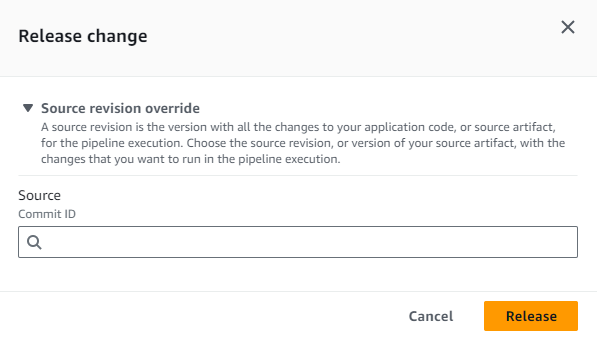

# Start a pipeline with a source

revision override

You can use overrides to start a pipeline with a specific source revision ID that you
provide for the pipeline execution. For example, if you want to start a pipeline that
will process a specific commit ID from your CodeCommit source, you can add the commit ID as
an override when you start your pipeline.

###### Note

You can also create a source override using input transform entry to use the
`revisionValue` in EventBridge for your pipeline event, where the
`revisionValue` is derived from the source event variable for your
object
key, commit, or image ID. For more information, see the optional
step for input transform entry included in the procedures under [Amazon ECR source actions and EventBridge resources](create-cwe-ecr-source.md "create-cwe-ecr-source.md"), [Connecting to Amazon S3 source actions with a
source enabled for events](create-S3-source-events.md "create-S3-source-events.md"), or [CodeCommit source actions and EventBridge](triggering.md "triggering.md").

There are four types of source revision for `revisionType`:

- `COMMIT_ID`
- `IMAGE_DIGEST`
- `S3_OBJECT_VERSION_ID`
- `S3_OBJECT_KEY`

###### Note

For the `COMMIT_ID` and `IMAGE_DIGEST` types of source
revisions, the source revision ID applies to all content in the repository, across
all branches.

###### Note

For the `S3_OBJECT_VERSION_ID` and `S3_OBJECT_KEY` types of
source revisions, either of the types can be used independently, or they can be used
together to override the source with a specific ObjectKey and VersionID. For
`S3_OBJECT_KEY`, the configuration parameter
`AllowOverrideForS3ObjectKey` needs to be set to `true`.
For more information on S3 source configuration parameters, see [Configuration parameters](action-reference-S3.md#action-reference-S3-config "action-reference-S3.md#action-reference-S3-config") .

###### Topics

- [Start a pipeline with a
  source revision override (console)](#pipelines-trigger-source-overrides-console "#pipelines-trigger-source-overrides-console")
- [Start a pipeline with a
  source revision override (CLI)](#pipelines-trigger-source-overrides-cli "#pipelines-trigger-source-overrides-cli")

## Start a pipeline with a

source revision override (console)

###### To manually start a pipeline and run the most recent revision through a

pipeline

1. Sign in to the AWS Management Console and open the CodePipeline console at [http://console.aws.amazon.com/codesuite/codepipeline/home](http://console.aws.amazon.com/codesuite/codepipeline/home "http://console.aws.amazon.com/codesuite/codepipeline/home").
2. In **Name**, choose the name of the pipeline you want to
   start.
3. On the pipeline details page, choose
   **Release change**. Choosing **Release
   change** opens the **Release change** window.
   For **Source revision override**, choose the arrow to
   expand the field. In **Source**, enter the source revision
   ID. For example, if your pipeline has a CodeCommit source, choose the commit
   ID from the field that you want to use.



## Start a pipeline with a

source revision override (CLI)

###### To manually start a pipeline and run the specified source revision ID for an

artifact through a pipeline

1. Open a terminal (Linux, macOS, or Unix) or command prompt (Windows) and use the AWS CLI
   to run the **start-pipeline-execution** command, specifying
   the name of the pipeline you want to start. You also use the
   **--source-revisions** argument to provide the source
   revision ID. The source revision is made up of the actionName, revisionType,
   and revisionValue. Valid revisionType values are `COMMIT_ID |
IMAGE_DIGEST | S3_OBJECT_VERSION_ID | S3_OBJECT_KEY`.

In the following example, to start running the specified change through a
pipeline named **codecommit-pipeline**, the following command
species a source action name of Source, a revision type of
`COMMIT_ID`, and a commit ID of
`78a25c18755ccac3f2a9eec099dEXAMPLE`.

```
aws codepipeline start-pipeline-execution --name codecommit-pipeline --source-revisions actionName=Source,revisionType=COMMIT_ID,revisionValue=78a25c18755ccac3f2a9eec099dEXAMPLE --region us-west-1
```

2. To verify success, view the returned object. This command returns an
   execution ID, similar to the following:

```
{
    "pipelineExecutionId": `"c53dbd42-This-Is-An-Example"`
}

```

###### Note

After you have started the pipeline, you can monitor its progress in
the CodePipeline console or by running the
**get-pipeline-state** command. For more information,
see [View pipelines (console)](pipelines-view-console.md "pipelines-view-console.md") and [View pipeline details and history (CLI)](pipelines-view-cli.md "pipelines-view-cli.md").
