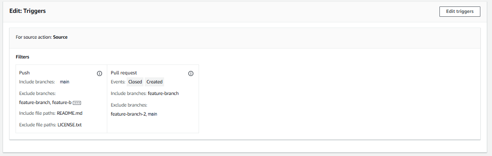
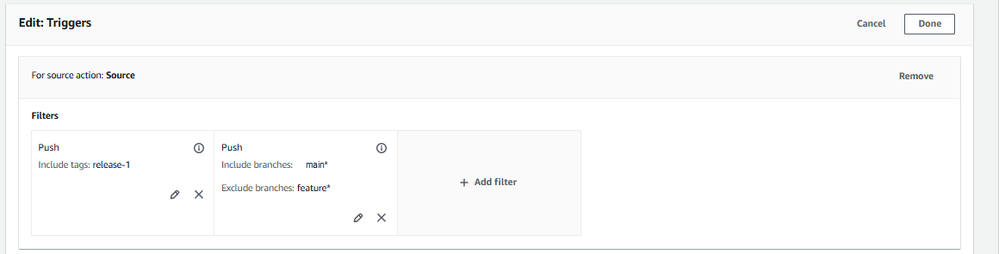
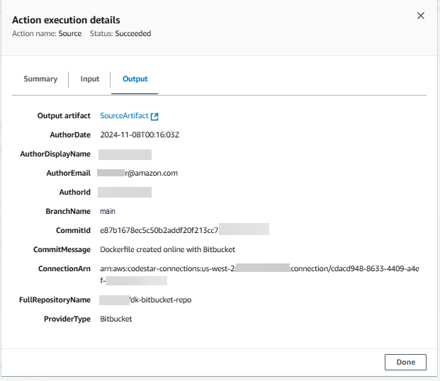
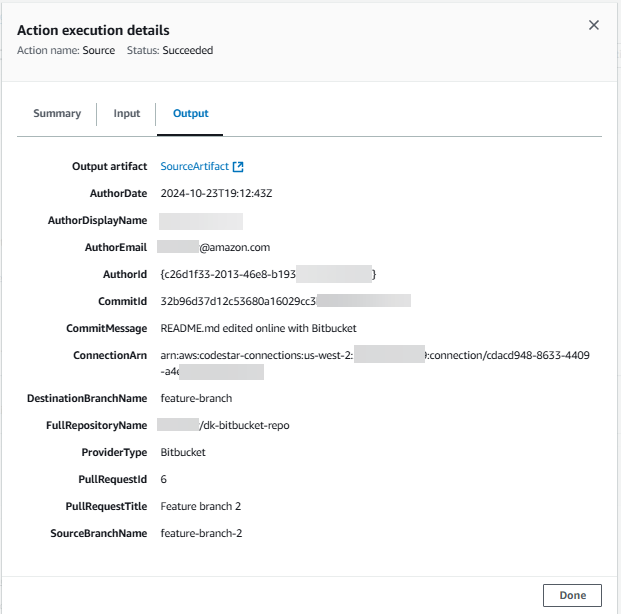

# Automate starting pipelines using triggers and

filtering

Triggers allow you to configure your pipeline to start on a particular event type or
filtered event type, such as when a change on a particular branch or pull request is
detected. Triggers are configurable for source actions with connections that use the
`CodeStarSourceConnection` action in CodePipeline, such as GitHub, Bitbucket, and
GitLab. For more information about source actions that use connections, see [Add third-party source providers to pipelines using CodeConnections](pipelines-connections.md "pipelines-connections.md").

Source actions, such as CodeCommit and S3, use automated change detection to start pipelines
when a change is made. For more information, see [CodeCommit source actions and EventBridge](triggering.md "triggering.md").

You specify triggers using the console or CLI.

You specify filter types as follows:

- **No filter**

This trigger configuration starts your pipeline on any push to the default branch
specified as part of action configuration.

- **Specify filter**

You add a filter that starts your pipeline on a specific filter, such as on branch
names for a code push, and fetches the exact commit. This also configures the
pipeline not to start automatically on any change.

    + **Push**

    	- Valid filter combinations are:

    		* **Git tags**

    		Include or exclude
    		* **branches**

    		Include or exclude
    		* **branches + file
    		 paths**

    		Include or exclude
    + **Pull request**

    	- Valid filter combinations are:

    		* **branches**

    		Include or exclude
    		* **branches + file
    		 paths**

    		Include or exclude

- **Do not detect changes**

This does not add a trigger and the pipeline does not start automatically on any
change.
The following table provides valid filter options for each event type. The table also
shows which trigger configurations default to true or false for automatic change detection
in the action configuration.

| Trigger configuration                                                                                              | Event type                                                                                                                                                                                    | Filter options                                                                | Detect changes                                                                |
| ------------------------------------------------------------------------------------------------------------------ | --------------------------------------------------------------------------------------------------------------------------------------------------------------------------------------------- | ----------------------------------------------------------------------------- | ----------------------------------------------------------------------------- | ----------------------------------------------------------------------------------------------------------------------------------------------------------------------------------------------------------------------------------------------------------------------------------------------------------------------------------------------------------------------------------------------------------------------------------------------------------------------------------------------------------------------------------------------------------------------------------------------------------------------------------------------------------------------------------------------------------------------------------------------------------------------------------------------------------------------------------------------------------------------------------------------------------------------------------------------------------------------------------------------------------------------------------------------------------------------------------------------------------------------------------------------------------------------------------------------------------------------------------------------------------------------------------------------------------------------------------------------------------------------------------------------------------------------------------------------------------------------------------------------------------------------------------------------------------------------------------------------------------------------------------------------------------------------------------------------------------------------------------------------------------------------------------------------------------------------------------------------------------------------------------------------------------------------------------------------------------------------------------------------------------------------------------------------------------------------------------------------------------------------------------------------------------------------------------------------------------------------------------------------------------------------------------------------------------------------------------------------------------------------------------------------------------------------------------------------------------------------------------------------------------------------------------------------------------------------------------------------------------------------------------------------------------- | ---------------------------------------------------------------------------------------------------------------------------------------------------------------------------------------------------------------------------------------------------------------------------------------------------------------------------------------------------------------------------------------------------------------------------------------------------------------------------------------------------------------------------------------------------------------------------------------------------------------------------------------------------------------------------------------------------------------------------------------------------------------------------------------------------------------------------------------------------------------------------------------------------------------------------------------------------------------------------------------------------------------------------------------------------------------------------------------------------------------------------------------------------------------------------------------------------------------------------------------------------------------------------------------------------------------------------------------------------------------------------------------------------------------------------------------------------------------------------------------------------------------------------------------------------------------------------------------------------------------------------------------------------------------------------------------------------------------------------------------------------------------------------------------------------------------------------------------------------------------------------------------------------------------------------------------------------------------------------------------------------------------------------------------------------------------------------------------------------------------------------------------------------------------------------------------------------------------------------------------------------------------------------------------------------------------------------------------------------------------------------------------------------------------------------------------------------------------------------------------------------------------------------------------------------------------------------------------------------------------------------------------------------------------------------------------------------------------------------------------------------------------------------------------------------------------------------------------------------------------------------------------------------------------------------------------------------------------------------------------------------------------------------------------------------------------------------------------------------------------------------------------------------------------------------------------------------------------------------------------------------------------------------------------------------------------------------------------------------------------------------------------------------------------------------------------------------------------------------------------------------------------------------------------------------------------------------------------------------------------------------------------------------------------------------------------------------------------------------------------------------------------------------------------------------------------------------------------------------------------------------------------------------------------------------------------------------------------------------------------------------------------------------------------------------------------------------------------------------------------------------------------------------------------------------------------------------------------------------------------------------------------------------------------------------------------------------------------------------------------------------------------------------------------------------------------------------------------------------------------------------------------------------------------------------------------------------------------------------------------------------------------------------------------------------------------------------------------------------------------------------------------------------------------------------------------------------------------------------------------------------------------------------------------------------------------------------------------------------------------------------------------------------------------------------------------------------------------------------------------------------------------------------------------------------------------------------------------------------------------------------------------------------------------------------------------------------------------------------------------------------------------------------------------------------------------------------------------------------------------------------------------------------------------------------------------------------------------------------------------------------------------------------------------------------------------------------------------------------------------------------------------------------------------------------------------------------------------------------------------------------------------------------------------------------------------------------------------------------------------------------------------------------------------------------------------------------------------------------------------------------------------------------------------------------------------------------------------------------------------------------------------------------------------------------------------------------------------------------------------------------------------------------------------------------------------------------------------------------------------------------------------------------------------------------------------------------------------------------------------------------------------------------------------------------------------------------------------------------------------------------------------------------------------------------------------------------------------------------------------------------------------------------------------------------------------------------------------------------------------------------------------------------------------------------------------------------------------------------------------------------------------------------------------------------------------------------------------------------------------------------------------------------------------------------------------------------------------------------------------------------------------------------------------------------------------------------------------------------------------------------------------------------------------------------------------------------------------------------------------------------------------------------------------------------------------------------------------------------------------------------------------------------------------------------------------------------------------------------------------------------------------------------------------------------------------------------------------------------------------------------------------------------------------------------------------------------------------------------------------------------------------------------------------------------------------------------------------------------------------------------------------------------------------------------------------------------------------------------------------------------------------------------------------------------------------------------------------------------------------------------------------------------------------------------------------------------------------------------------------------------------------------------------------------------------------------------------------------------------------------------------------------------------------------------------------------------------------------------------------------------------------------------------------------------------------------------------------------------------------------------------------------------------------------------------------------------------------------------------------------------------------------------------------------------------------------------------------------------------------------------------------------------------------------------------------------------------------------------------------------------------------------------------------------------------------------------------------------- |
| Add a trigger – no filter                                                                                          | none                                                                                                                                                                                          | none                                                                          | true                                                                          |
| Add a trigger – filter on code push                                                                                | push event                                                                                                                                                                                    | Git tags, branches, file paths                                                | false                                                                         |
| Add a trigger – filter for pull requests                                                                           | pull requests                                                                                                                                                                                 | branches, file paths                                                          | false                                                                         |
| No trigger – do not detect                                                                                         | none                                                                                                                                                                                          | none                                                                          | false                                                                         | ###### Note This trigger type uses automated change detection (as the `Webhook` trigger type). The source action providers that use this trigger type are connections configured for code push (Bitbucket Cloud, GitHub, GitHub Enterprise Server, GitLab.com, and GitLab self-managed). For field definitions and further reference for triggers, see For a list of field definitions in the JSON structure, see [triggers](pipeline-requirements.md#pipeline.triggers "pipeline-requirements.md#pipeline.triggers"). For filtering, regular expression patterns in glob format are supported as detailed in [Working with glob patterns in syntax](syntax-glob.md "syntax-glob.md"). ###### Note In certain cases, for pipelines with triggers that are filtered on file paths, the pipeline might not start when a branch with a file path filter is first created. For more information, see [Pipelines with connections that use trigger filtering by file paths might not start at branch creation](troubleshooting.md#troubleshooting-file-paths-filtering "troubleshooting.md#troubleshooting-file-paths-filtering"). ## Considerations for trigger filters The following considerations apply when using triggers.  • You cannot add more than one trigger per source action.  • You can add multiple filter types to a trigger. For an example, see [4: A trigger with two push filter types with conflicting includes and excludes](#example-filter-multiple-push "#example-filter-multiple-push") .  • For a trigger with branch and file paths filters, when pushing the branch for the first time, the pipeline won't run since there is not access to the list of files changed for the newly created branch.  • Merging a pull request might trigger two pipeline executions in cases where push (branches filter) and pull request (branches filter) trigger configurations intersect.  • For a filter that triggers your pipeline on pull request events, for the Closed pull request event type, the third-party repository provider for your connection might have a separate status for a merge event. For example, in Bitbucket, the Git event for a merge is not a pull request closure event. However, in GitHub, merging a pull request is a closure event. For more information, see [Pull request events for triggers by provider](#pipelines-filter-pullrequest-events "#pipelines-filter-pullrequest-events"). ## Pull request events for triggers by provider The following table provides a summary of the Git events, such as for pull request closure, that result in pull request event types by provider. |
|                                                                                                                    | Repository provider for your connection                                                                                                                                                       |                                                                               | ---                                                                           | ---                                                                                                                                                                                                                                                                                                                                                                                                                                                                                                                                                                                                                                                                                                                                                                                                                                                                                                                                                                                                                                                                                                                                                                                                                                                                                                                                                                                                                                                                                                                                                                                                                                                                                                                                                                                                                                                                                                                                                                                                                                                                                                                                                                                                                                                                                                                                                                                                                                                                                                                                                                                                                                                         |
| PR event for trigger                                                                                               | Bitbucket                                                                                                                                                                                     | GitHub                                                                        | GHES                                                                          | GitLab                                                                                                                                                                                                                                                                                                                                                                                                                                                                                                                                                                                                                                                                                                                                                                                                                                                                                                                                                                                                                                                                                                                                                                                                                                                                                                                                                                                                                                                                                                                                                                                                                                                                                                                                                                                                                                                                                                                                                                                                                                                                                                                                                                                                                                                                                                                                                                                                                                                                                                                                                                                                                                                      |
| **Open** - This option triggers the pipeline when a pull request is created for the branch/file path.              | Creating a pull request results in an **Opened** Git event.                                                                                                                                   | Creating a pull request results in an **Opened** Git event.                   | Creating a pull request results in an **Opened** Git event.                   | Creating a pull request results in an **Opened** Git event.                                                                                                                                                                                                                                                                                                                                                                                                                                                                                                                                                                                                                                                                                                                                                                                                                                                                                                                                                                                                                                                                                                                                                                                                                                                                                                                                                                                                                                                                                                                                                                                                                                                                                                                                                                                                                                                                                                                                                                                                                                                                                                                                                                                                                                                                                                                                                                                                                                                                                                                                                                                                 |
| **Update** - This option triggers the pipeline when a pull request revision is published for the branch/file path. | Publishing an update results in an **Updated** Git event.                                                                                                                                     | Publishing an update results in an **Updated** Git event.                     | Publishing an update results in an **Updated** Git event.                     | Publishing an update results in an **Updated** Git event.                                                                                                                                                                                                                                                                                                                                                                                                                                                                                                                                                                                                                                                                                                                                                                                                                                                                                                                                                                                                                                                                                                                                                                                                                                                                                                                                                                                                                                                                                                                                                                                                                                                                                                                                                                                                                                                                                                                                                                                                                                                                                                                                                                                                                                                                                                                                                                                                                                                                                                                                                                                                   |
| **Closed** - This option triggers the pipeline when a pull request is closed for the branch/file path.             | Merging a pull request in Bitbucket results in a **Closed** Git event. **Important:** Manually closing a pull request in Bitbucket without merging does not result in a **Closed** Git event. | Merging or manually closing a pull request results in a **Closed** Git event. | Merging or manually closing a pull request results in a **Closed** Git event. | Merging or manually closing a pull request results in a **Closed** Git event.                                                                                                                                                                                                                                                                                                                                                                                                                                                                                                                                                                                                                                                                                                                                                                                                                                                                                                                                                                                                                                                                                                                                                                                                                                                                                                                                                                                                                                                                                                                                                                                                                                                                                                                                                                                                                                                                                                                                                                                                                                                                                                                                                                                                                                                                                                                                                                                                                                                                                                                                                                               | ## Examples for trigger filters For a Git configuration with filters for push and pull request event types, the specified filters might conflict with each other. The following are examples of valid filter combinations for push and pull request events. A trigger can contain multiple filter types, such as two push filter types in the trigger configuration, and the push and pull request filter types will use an OR operation between them, meaning any match will start the pipeline. Similarly, each filter type can include multiple filters such as filePaths and branches; these filters will use an AND operation, meaning only a full match will start the pipeline. Each filter type can contain includes and excludes, and these will use an AND operation between them, meaning only a full match will start the pipeline. Names inside of the include/exclude, such as branch names, use an OR operation. If there is a conflict such as between two Push filters such as where one includes the `main` branch and one excludes it, then the default is to exclude. The following list summarizes the operations for each part of the Git configuration object. For a list of field definitions in the JSON structure and a detailed reference for includes and excludes, see [triggers](pipeline-requirements.md#pipeline.triggers "pipeline-requirements.md#pipeline.triggers"). ###### Example 1: A filter type with filters for branches and file paths (AND operation) For a single filter type such as pull request, you can combine filters, and these filters will use an AND operation, meaning only a full match will start the pipeline. The following example shows a Git configuration for a push event type with two different filters (`filePaths` and `branches`). In the following example, `filePaths` will be AND’ed with `branches`: `{ "filePaths": { "includes": ["common/**/*.js"] }, "branches": { "includes": ["feature/**"] } }` With the Git configuration above, this example shows an event that will start the pipeline execution because the AND operation succeeds. In other words, the file path `common/app.js` is included for the filter, which starts the pipeline as an AND even if the branch `refs/heads/feature/triggers` specified did not have an impact. `{ "ref": "refs/heads/feature/triggers", ... "commits": [ { ... "modified": [ "common/app.js" ] ... } ] }` The following example shows an event for a trigger with the above configuration that will not start the pipeline execution because the branch is able to filter, but the file path is not. `{ "ref": "refs/heads/feature/triggers", ... "commits": [ { ... "modified": [ "src/Main.java" ] ... } ] }` ###### Example 2: Includes and excludes use an AND operation between them Trigger filters, such as branch in a single pull request event type, use an AND operation between the includes and excludes. This allows you to configure multiple triggers to start the execution for the same pipeline. The following example shows a trigger configuration with a single filter type (`branches`) in the configuration object for a push event. The `Includes` and `Excludes` operations will be AND’ed, meaning that if a branch matches an exclude pattern (such as `feature-branch` in the example), the pipeline will not be triggered unless an include also matches. If the include pattern matches, such as for the `main` branch, then the pipeline will be triggered. For the following example JSON:  • Pushing a commit to the `main` branch will trigger the pipeline  • Pushing a commit to the `feature-branch` branch will not trigger the pipeline. `{ "branches": { "Includes": [ "main" ], "Excludes": [ "feature-branch" ] }` ###### Example 3: A trigger with push and pull request filter types (OR operation), filters for file paths and branches (AND operation), and includes/excludes (AND operation) Trigger configuration objects, such as a trigger that contains a push event type and a pull request event type, use an OR operation between the two event types. The following example shows a trigger configuration with a push event type with the `main` branch included and one pull request event type with the same branch `main` excluded. Additionally, the push event type has one file path `LICENSE.txt` excluded and one file path `README.MD` included. For the second event type, a pull request that is either `Closed` or `Created` on the `feature-branch` branch (included) starts the pipeline, and the pipeline does not start when creating or closing a pull request on the `feature-branch-2` or `main` branches (excluded).The `Includes` and `Excludes` operations will be AND’d, with a conflict defaulting to the exclude. For example, for a pull request event on the `feature-branch` branch (included for the pull request) while the `feature-branch` branch is excluded for the push event type, so the default will be to exclude. For the following example,  • Pushing a commit to the `main` branch (included) for the `README.MD` file path (included) will trigger the pipeline.  • On the `feature-branch` branch (excluded), pushing a commit will not trigger the pipeline.  • On the included branch, editing the `README.MD` file path (included) triggers the pipeline.  • On the included branch, editing the `LICENSE.TXT` file path (excluded) does not trigger the pipeline.  • On the `feature-branch` branch, closing a pull request for the `README.MD` file path (included for the push event) will not trigger the pipeline because the push event type specifies the `feature-branch` branch as excluded and so the conflict defaults to the exclude. The following image shows the configuration.  The following is the example JSON for the configuration. `"triggers": [ { "providerType": "CodeStarSourceConnection", "gitConfiguration": { "sourceActionName": "Source", "push": [ { "branches": { "includes": [ "main" ], "excludes": [ "feature-branch", "feature-branch-2" ] }, "filePaths": { "includes": [ "README.md" ], "excludes": [ "LICENSE.txt" ] } } ], "pullRequest": [ { "events": [ "CLOSED", "OPEN" ], "branches": { "includes": [ "feature-branch" ], "excludes": [ "feature-branch-2", "main" ] } } ] } } ] },` ###### Example 4: A trigger with two push filter types with conflicting includes and excludes The following image shows a push filter type specifying to filter on the tag `release-1` (included). A second push filter type is added specifying to filter on the branch `main` (included) and to not start for a push to the `feature*` branches (excluded). For the following example:  • Pushing a release from the tag `release-1` (included for the first push filter) on the `feature-branch` branch (excluded as `feature*` for the second push filter) will not trigger the pipeline because the two event types will be AND'd.  • Pushing a release from the `main` branch (included for the second Push filter) will start the pipeline. The following example of the Edit page shows the two Push filter types and their configuration for includes and excludes.  The following is the example JSON for the configuration. `"triggers": [ { "providerType": "CodeStarSourceConnection", "gitConfiguration": { "sourceActionName": "Source", "push": [ { "tags": { "includes": [ "release-1" ] } }, { "branches": { "includes": [ "main*" ], "excludes": [ "feature*" ] } } ] } } ] },` ###### Example 5: Trigger configured while default action configuration BranchName is used for a manual start The action configuration default `BranchName` field defines a single branch that will be used when the pipeline is started manually, while triggers with filters can be used for any branch or branches that you specify. The following is the example JSON for the action configuration showing the `BranchName` field. ``{ "name": "Source", "actions": [ { "name": "Source", "actionTypeId": { "category": "Source", "owner": "AWS", "provider": "CodeStarSourceConnection", "version": "1" }, "runOrder": 1, "configuration": { "BranchName": "main", "ConnectionArn": "ARN", "DetectChanges": "false", "FullRepositoryId": "`owner-name`/my-bitbucket-repo", "OutputArtifactFormat": "CODE_ZIP" }, "outputArtifacts": [ { "name": "SourceArtifact" } ], "inputArtifacts": [], "region": "us-west-2", "namespace": "SourceVariables" } ],`` The following example action output shows the default branch main was used when the pipeline was manually started.  The following example action output shows the pull request and branch that was used for the trigger when filtered by pull request.  |
