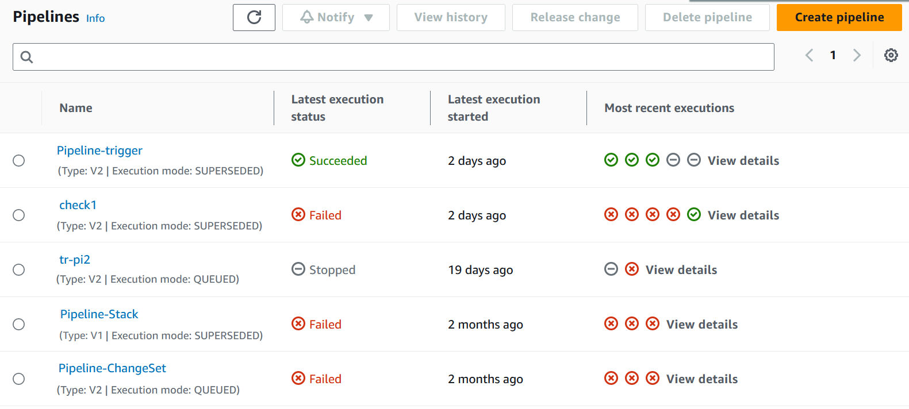
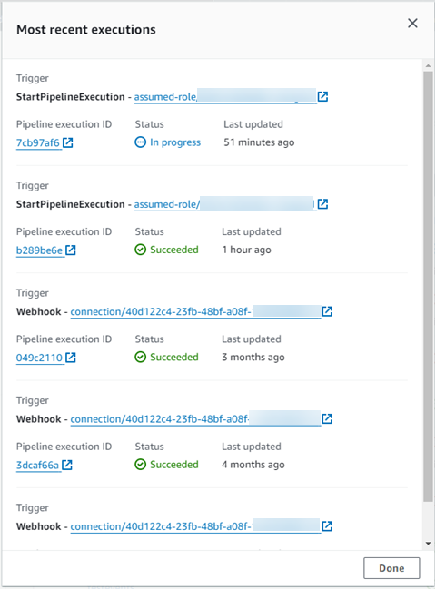
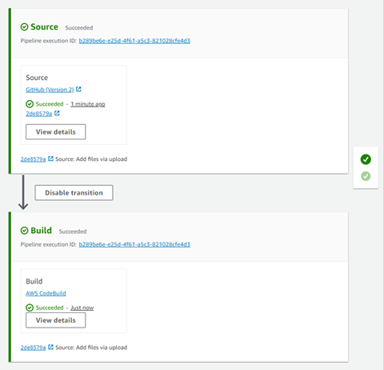

# View pipelines (console)

You can view status, transitions, and artifact updates for a pipeline.

###### Note

After an hour, the detailed view of a pipeline stops refreshing automatically in
your browser. To view current information, refresh the page.

###### To view pipelines

1. Sign in to the AWS Management Console and open the CodePipeline console at [http://console.aws.amazon.com/codesuite/codepipeline/home](http://console.aws.amazon.com/codesuite/codepipeline/home "http://console.aws.amazon.com/codesuite/codepipeline/home").

The **Pipelines** page displays. A list of all your pipelines
for that Region are shown.

The name, type, status, version, creation date, and date when last modified of
all pipelines associated with your AWS account are displayed, along with the
most recently started execution time. 2. The status for the five most recent executions is shown.

Choose **View details** next to a specific row to display a
details dialog box listing the most recent executions.

To view details about the most recent executions for the pipeline, choose
**View history**. For past executions, you can view
revision details associated with source artifacts, such as execution IDs,
status, start and end times, duration, and commit IDs and messages.

###### Note

For a pipeline in PARALLEL execution mode, the main pipeline view does not
show the pipeline structure or in-progress executions. For a pipeline in
PARALLEL execution mode, you access the pipeline structure by choosing the
ID for the execution you want to view from the execution history page.
Choose **History** in the left navigation, choose the
execution ID for the parallel execution, and then view the pipeline on the
**Visualization** tab. 3. To see details for a single pipeline, in **Name**, choose the
pipeline. A detailed view of the pipeline, including the state of each action in
each stage and the state of the transitions, is displayed.

The graphical view displays the following information for each stage:

    * The stage name.
    * Every action configured for the stage.
    * The state of transitions between stages (enabled or disabled), as
     indicated by the state of the arrow between stages. An enabled
     transition is indicated by an arrow with a **Disable
     transition** button next to it. A disabled transition is
     indicated by an arrow with a strikeout under it and an **Enable
     transition** button next to it.
    * A color bar to indicate the status of the stage:

    	+ Gray: No executions yet
    	+ Blue: In progress
    	+ Green: Succeeded
    	+ Red: Failed

The graphical view also displays the following information about actions in
each stage:

    * The name of the action.
    * The provider of the action, such as CodeDeploy.
    * When the action was last run.
    * Whether the action succeeded or failed.
    * Links to other details about the last run of the action, where
     available.
    * Details about the source revisions that are running through the latest
     pipeline execution in the stage or, for CodeDeploy deployments, the latest
     source revisions that were deployed to target instances.
    * A **View details** button that opens a dialog box
     with details about the action execution, logs, and action
     configuration.

    ###### Note

    The **Logs** tab is available for CodeBuild and CloudFormation
     actions that have run in the account of the pipeline.

4. To view the details of the provider of the action, choose the provider. For
   example, in the preceding example pipeline, if you choose CodeDeploy in either the
   Staging or Production stages the CodeDeploy console page for the deployment group
   configured for that stage is displayed.
5. To see the progress for an action is displayed next to an action in progress
   (indicated by an **In Progress** message). If the action is in
   progress, you see the incremental progress and the steps or actions as they
   occur.
6. To approve or reject actions that have been configured for manual approval,
   choose **Review**.
7. To retry actions in a stage that were not completed successfully, choose
   **Retry**.
8. The status from the last time the action ran, including the results of that
   action (**Succeeded** or **Failed**) is
   displayed.
