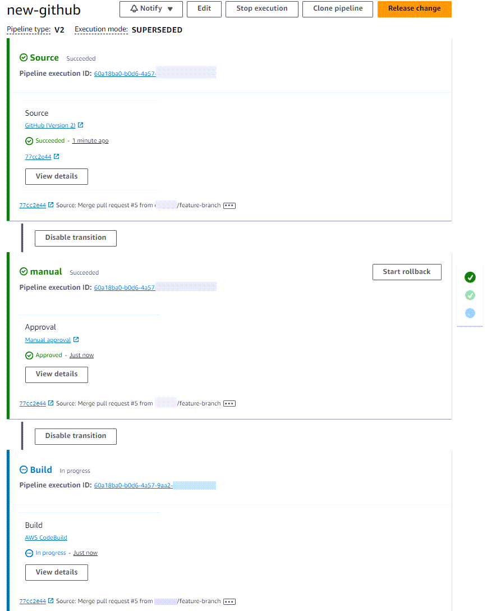
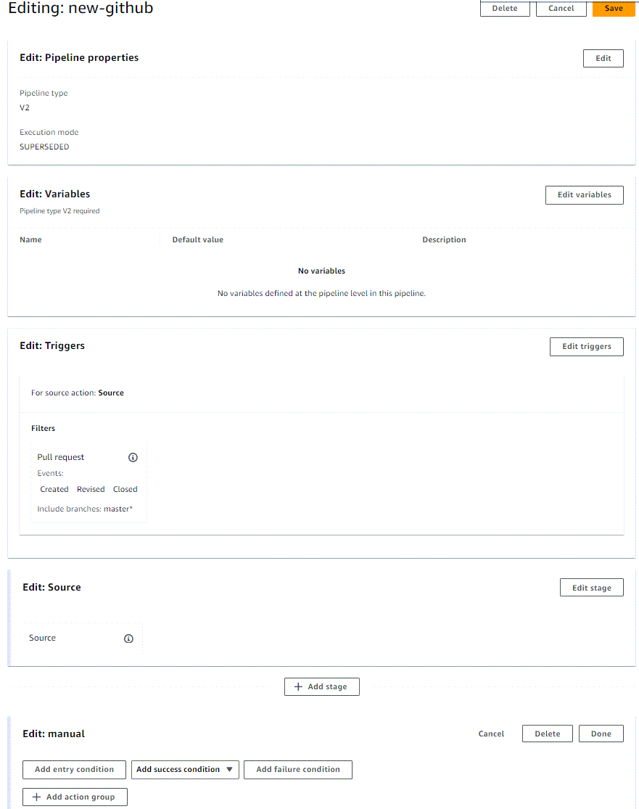

# CodePipeline pipeline structure reference

You can use CodePipeline to structure a CI/CD pipeline of automated steps that accomplish tasks
that build, test, and deploy your application source code. This reference section provides
details about the JSON structure and parameters in your pipeline. For a high-level list of
concepts that describe how pipelines are used, see [CodePipeline concepts](concepts.md "concepts.md").

- When you create a pipeline, you choose an available source action and provider,
  such as an S3 bucket, CodeCommit repository, Bitbucket repository, or GitHub repository
  that contains your source code and starts your pipeline when you commit a source
  code change. This reference section provides reference information about the
  available sources for your pipeline. For more information about how to work with
  source actions, see [Start a pipeline in CodePipeline](pipelines-about-starting.md "pipelines-about-starting.md").
- You can choose the test, build, and deploy actions and providers that you want to
  automatically include when your pipeline runs. This reference section provides
  reference information about the available actions and how they fit in your pipeline
  JSON.
- Your finished pipeline will consist of a source stage along with additional stages
  where you configure actions to deploy and test your application. For a conceptual
  example of a DevOps pipeline that deploys your application, see [DevOps pipeline example](concepts-devops-example.md "concepts-devops-example.md").
  By default, any pipeline you successfully create in AWS CodePipeline has a valid structure.
  However, if you manually create or edit a JSON file to create a pipeline or update a
  pipeline from the AWS CLI, you might inadvertently create a structure that is not valid. The
  following reference can help you better understand the requirements for your pipeline
  structure and how to troubleshoot issues. See the constraints in [Quotas in AWS CodePipeline](limits.md "limits.md"), which apply to all pipelines.

The following sections provide high level parameters and their position in the pipeline
structure. Pipeline structure requirements are detailed in each section for the following
pipeline component types:

- Field reference for the [Pipeline declaration](pipeline-requirements.md "pipeline-requirements.md")
- Field reference for the [Stage declaration](stage-requirements.md "stage-requirements.md")
- Field reference for the [Action declaration](action-requirements.md "action-requirements.md")
- List of [Valid action providers in CodePipeline](actions-valid-providers.md "actions-valid-providers.md") by action type
- Reference for [Valid settings for the
  PollForSourceChanges parameter](PollForSourceChanges-defaults.md "PollForSourceChanges-defaults.md")
- Reference for [Valid input and output artifacts for each
  action type](reference-action-artifacts.md "reference-action-artifacts.md")
- List of links for [Valid configuration parameters for
  each provider type](structure-configuration-examples.md "structure-configuration-examples.md")
  For more information, see the [PipelineDeclaration](../APIReference/API_PipelineDeclaration.md "../APIReference/API_PipelineDeclaration.md") object in the _CodePipeline API
  Guide_.

The following example pipeline console view shows the pipeline named new-github, stages
named `Source`, `manual`, and `Build`, and actions from
GitHub (via GitHub App), manual approval, and CodeBuild action providers.

The pipeline editing mode, when viewed in the console diagram, allows you to edit source
overrides, triggers, and actions as shown in the following example.

###### Topics

- [Pipeline declaration](pipeline-requirements.md "pipeline-requirements.md")
- [Stage declaration](stage-requirements.md "stage-requirements.md")
- [Action declaration](action-requirements.md "action-requirements.md")
- [Valid action providers in CodePipeline](actions-valid-providers.md "actions-valid-providers.md")
- [Valid settings for the
  PollForSourceChanges parameter](PollForSourceChanges-defaults.md "PollForSourceChanges-defaults.md")
- [Valid input and output artifacts for each
  action type](reference-action-artifacts.md "reference-action-artifacts.md")
- [Valid configuration parameters for
  each provider type](structure-configuration-examples.md "structure-configuration-examples.md")
