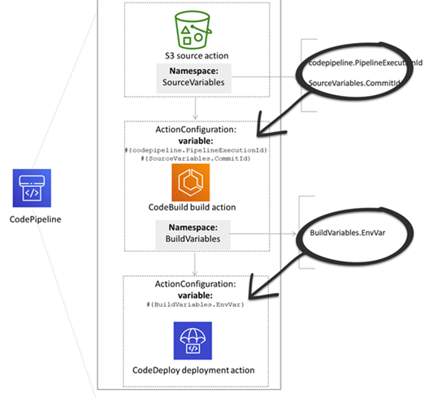

# Variables reference

This section is a reference only. For information about creating variables, see [Working with variables](actions-variables.md "actions-variables.md").

Variables allow you to configure your pipeline actions with values that are determined at
the time of the pipeline execution or the action execution.

Some action providers produce a defined set of variables. You choose from default variable
keys for that action provider, such as commit ID.

###### Important

When passing secret parameters, do not enter the value directly. The value is rendered as
plaintext and is therefore readable. For security reasons, do not use plaintext with secrets.
We strongly recommend that you use AWS Secrets Manager to store secrets.

To see step-by-step examples of using variables:

- For a tutorial with a pipeline-level variable that is passed at the time of the pipeline
  execution, see [Tutorial: Use pipeline-level variables](tutorials-pipeline-variables.md "tutorials-pipeline-variables.md").
- For a tutorial with a Lambda action that uses variables from an upstream action
  (CodeCommit) and generates output variables, see [Tutorial: Using variables with Lambda invoke
  actions](tutorials-lambda-variables.md "tutorials-lambda-variables.md").
- For a tutorial with a AWS CloudFormation action that references stack output variables from an
  upstream CloudFormation action, see [Tutorial: Create a pipeline that uses
  variables from AWS CloudFormation deployment actions](tutorials-cloudformation-action.md "tutorials-cloudformation-action.md").
- For an example manual approval action with message text that references output variables
  that resolve to the CodeCommit commit ID and commit message, see [Example: Use variables in manual
  approvals](actions-variables.md#actions-variables-examples-approvals "actions-variables.md#actions-variables-examples-approvals").
- For an example CodeBuild action with an environment variable that resolves to the GitHub
  branch name, see [Example: Use a BranchName
  variable with CodeBuild environment variables](actions-variables.md#actions-variables-examples-env-branchname "actions-variables.md#actions-variables-examples-env-branchname").
- CodeBuild actions produce as variables all environment variables that were exported as
  part of the build. For more information, see [CodeBuild action output
  variables](#reference-variables-list-configured-codebuild "#reference-variables-list-configured-codebuild").
  **Variable Limits**

For limit information, see [Quotas in AWS CodePipeline](limits.md "limits.md").

###### Note

When you enter variable syntax in the action configuration fields, do not exceed the
1000-character limit for the configuration fields. A validation error is returned when this
limit is exceeded.

###### Topics

- [Concepts](#reference-variables-concepts "#reference-variables-concepts")
- [Use cases for variables](#reference-variables-cases "#reference-variables-cases")
- [Configuring variables](#reference-variables-workflow "#reference-variables-workflow")
- [Variable resolution](#reference-variables-resolution "#reference-variables-resolution")
- [Rules for variables](#reference-variables-rules "#reference-variables-rules")
- [Variables available for pipeline actions](#reference-variables-list "#reference-variables-list")

## Concepts

This section lists key terms and concepts related to variables and namespaces.

### Variables

Variables are key-value pairs that can be used to dynamically configure actions in your
pipeline. There are currently three ways these variables are made available:

- There is a set of variables that are implicitly available at the start of each
  pipeline execution. This set currently includes `PipelineExecutionId`, the ID
  of the current pipeline execution.
- Variables at the pipeline level are defined when the pipeline is created and
  resolved at pipeline run time.

You specify pipeline-level variables when the pipeline is created, and you can
provide values at the time of the pipeline execution.

- There are action types that produce sets of variables when they are executed. You
  can see the variables produced by an action by inspecting the
  `outputVariables` field that is part of the [ListActionExecutions](../APIReference/API_ListActionExecutions.md "../APIReference/API_ListActionExecutions.md") API. For
  a list of available key names by action provider, see [Variables available for pipeline actions](#reference-variables-list "#reference-variables-list"). To see
  which variables each action type produces, see the CodePipeline [Action structure reference](action-reference.md "action-reference.md").

To reference these variables in your action configuration, you must use the variable
reference syntax with the correct namespace.

For an example variable workflow, see [Configuring variables](#reference-variables-workflow "#reference-variables-workflow") .

### Namespaces

To ensure that variables can be uniquely referenced, they must be assigned to a
namespace. After you have a set of variables assigned to a namespace, they can be referenced
in an action configuration by using the namespace and variable key with the following
syntax:

```
#{namespace.variable_key}
```

There are three types of namespaces under which variables can be assigned:

- **The codepipeline reserved namespace**

This is the namespace assigned to the set of implicit variables available at the
start of each pipeline execution. This namespace is `codepipeline`. Example
variable reference:

```
#{codepipeline.PipelineExecutionId}
```

- **The variables namespace at the pipeline
  level**

This is the namespace assigned to variables at the pipeline level. The namespace for
all variables at the pipeline level is `variables`. Example variable
reference:

```
#{variables.variable_name}
```

- **Action assigned namespace**

This is a namespace that you assign to an action. All variables produced by the
action fall under this namespace. To make the variables produced by an action available
for use in a downstream action configuration, you must configure the producing action
with a namespace. Namespaces must be unique across the pipeline definition and cannot
conflict with any artifact names. Here is an example variable reference for an action
configured with a namespace of `SourceVariables`.

```
#{SourceVariables.VersionId}
```

## Use cases for variables

The following are a few of the most common use cases for variables at the pipeline level,
helping you determine how you might use variables for your specific needs.

- Variables at the pipeline level are for CodePipeline customers who want to use the same
  pipeline each time with minor variations in the inputs to the action configuration. Any
  developer who starts a pipeline adds the variable value in the UI when the pipeline
  starts. With this configuration, you pass parameters for that execution only.
- With pipeline-level variables, you can pass dynamic inputs to actions in the pipeline.
  You can migrate your parameterized pipelines to CodePipeline without having to maintain different
  versions of the same pipeline, or create complex pipelines.
- You can use pipeline-level variables to pass input parameters that allow you to re-use
  a pipeline with each execution, such as when you want to specify which version you want to
  deploy to a production environment, so you don’t have to duplicate pipelines.
- You can use a single pipeline to deploy resources to multiple build and deployment
  environments. For example, for a pipeline with a CodeCommit repository, deploying from a
  specified branch and target deployment environment can be done with CodeBuild and CodeDeploy
  parameters passed at the pipeline level.

###### Note

For Amazon ECR, Amazon S3, or CodeCommit sources, you can also create a source override using input
transform entry to use the `revisionValue` in EventBridge for your pipeline event, where
the `revisionValue` is derived from the source event variable for your object
key, commit, or image ID. For more information, see the optional step for input transform
entry included in the procedures under [Amazon ECR source actions and EventBridge resources](create-cwe-ecr-source.md "create-cwe-ecr-source.md"), [Connecting to Amazon S3 source actions with a
source enabled for events](create-S3-source-events.md "create-S3-source-events.md"), or [CodeCommit source actions and EventBridge](triggering.md "triggering.md").

## Configuring variables

You can configure variables at the pipeline level or the action level in the pipeline
structure.

### Configuring variables at the pipeline level

You can add one or more variables at the pipeline level. You can reference this value in
the configuration of CodePipeline actions. You can add the variable names, default values, and
descriptions when you create the pipeline. Variables are resolved at the time of
execution.

###### Note

If a default value is not defined for a variable at pipeline level, the variable is
considered as required. You have to specify overrides for all required variables when you
are starting a pipeline, otherwise the pipeline execution will fail with a validation
error.

You provide variables at the pipeline level using the variables attribute in the
pipeline structure. In the following example, the variable `Variable1` has a
value of `Value1`.

```
       "variables": [
            {
                "name": "Variable1",
                "defaultValue": "Value1",
                "description": "description"
            }
        ]
```

For an example in the pipeline JSON structure, see [Create a pipeline, stages, and actions](pipelines-create.md "pipelines-create.md").

For a tutorial with a pipeline-level variable that is passed at the time of the pipeline
execution, see [Tutorial: Use pipeline-level variables](tutorials-pipeline-variables.md "tutorials-pipeline-variables.md").

Note that using pipeline-level variables in any kind of Source action is not
supported.

###### Note

If the `variables` namespace is already used in some of actions within the
pipeline, you must update the action definition and choose another namespace for the
conflicting action.

### Configuring variables at the action level

You configure an action to produce variables by declaring a namespace for the action.
The action must already be one of the action providers that generates variables. Otherwise,
the variables available are pipeline-level variables.

You declare the namespace either by:

- On the **Edit action** page of the console, entering a namespace
  in **Variable namespace**.
- Entering a namespace in the `namespace` parameter field in the JSON
  pipeline structure.

In this example, you add the `namespace` parameter to the CodeCommit source
action with the name `SourceVariables`. This configures the action to produce the
variables available for that action provider, such as `CommitId`.

```
{
    "name": "Source",
    "actions": [
        {
            "outputArtifacts": [
                {
                    "name": "SourceArtifact"
                }
            ],
            "name": "Source",
            `"namespace": "SourceVariables",`
            "configuration": {
                "RepositoryName": "MyRepo",
                "BranchName": "mainline",
                "PollForSourceChanges": "false"
            },
            "inputArtifacts": [],
            "region": "us-west-2",
            "actionTypeId": {
                "provider": "CodeCommit",
                "category": "Source",
                "version": "1",
                "owner": "AWS"
            },
            "runOrder": 1
        }
    ]
},

```

Next, you configure the downstream action to use the variables produced by the previous
action. You do this by:

- On the **Edit action** page of the console, entering the variable
  syntax (for the downstream action) in the action configuration fields.
- Entering the variable syntax (for the downstream action) in the action configuration
  fields in the JSON pipeline structure

In this example, the build action's configuration field shows environment variables that
are updated upon the action execution. The example specifies the namespace and variable for
execution ID with `#{codepipeline.PipelineExecutionId}` and the namespace and
variable for commit ID with `#{SourceVariables.CommitId}`.

```
{
    "name": "Build",
    "actions": [
        {
            "outputArtifacts": [
                {
                    "name": "BuildArtifact"
                }
            ],
            "name": "Build",
            "configuration": {
                "EnvironmentVariables": "[{\"name\":\"Release_ID\",\"value\":\"#{codepipeline.PipelineExecutionId}\",\"type\":\"PLAINTEXT\"},{\"name\":\"Commit_ID\",\"value\":\"#{SourceVariables.CommitId}\",\"type\":\"PLAINTEXT\"}]",
                "ProjectName": "env-var-test"
            },
            "inputArtifacts": [
                {
                    "name": "SourceArtifact"
                }
            ],
            "region": "us-west-2",
            "actionTypeId": {
                "provider": "CodeBuild",
                "category": "Build",
                "version": "1",
                "owner": "AWS"
            },
            "runOrder": 1
        }
    ]
},
```

## Variable resolution

Each time an action is executed as part of a pipeline execution, the variables it produces
are available for use in any action that is guaranteed to occur after the producing action. To
use these variables in a consuming action, you can add them to the consuming action's
configuration using the syntax shown in the previous example. Before it performs a consuming
action, CodePipeline resolves all of the variable references present in the configuration prior to
initiating the action execution.



## Rules for variables

The following rules help you with the configuration of variables:

- You specify the namespace and variable for an action through a new action property or
  by editing an action.
- When you use the pipeline creation wizard, the console generates a namespace for each
  action created with the wizard.
- If the namespace isn't specified, the variables produced by that action cannot be
  referenced in any action configuration.
- To reference variables produced by an action, the referencing action must occur after
  the action that produces the variables. This means it is either in a later stage than the
  action producing the variables, or in the same stage but at a higher run order.

## Variables available for pipeline actions

The action provider determines which variables can be generated by the action.

For step-by-step procedures for managing variables, see [Working with variables](actions-variables.md "actions-variables.md").

### Actions with defined variable

keys

Unlike a namespace which you can choose, the following actions use variable keys that
cannot be edited. For example, for the Amazon S3 action provider, only the `ETag` and
`VersionId` variable keys are available.

Each execution also has a set of CodePipeline-generated pipeline variables that contain data
about the execution, such as the pipeline release ID. These variables can be consumed by any
action in the pipeline.

###### Topics

- [CodePipeline execution ID variable](#w21aac63c33b7b9 "#w21aac63c33b7b9")
- [Amazon ECR action output variables](#reference-variables-output-ECR "#reference-variables-output-ECR")
- [AWS CloudFormation StackSets action output variables](#reference-variables-output-StackSets "#reference-variables-output-StackSets")
- [CodeCommit action output variables](#reference-variables-output-CodeCommit "#reference-variables-output-CodeCommit")
- [CodeStarSourceConnection action output variables](#reference-variables-output-CodeConnections "#reference-variables-output-CodeConnections")
- [GitHub action output variables (GitHub (via OAuth app) action)](#reference-variables-output-GitHub-version1 "#reference-variables-output-GitHub-version1")
- [S3 action output variables](#reference-variables-output-S3 "#reference-variables-output-S3")

#### CodePipeline execution ID variable

| CodePipeline execution ID variable | Provider              | Variable key                 | Example value                         | Example variable syntax |
| ---------------------------------- | --------------------- | ---------------------------- | ------------------------------------- | ----------------------- |
| codepipeline                       | `PipelineExecutionId` | 8abc75f0-fbf8-4f4c-bfEXAMPLE | `#{codepipeline.PipelineExecutionId}` |

#### Amazon ECR action output variables

| Amazon ECR variables | Variable key                                                 | Example value                       | Example variable syntax |
| -------------------- | ------------------------------------------------------------ | ----------------------------------- | ----------------------- |
| `ImageDigest`        | sha256:EXAMPLE1122334455                                     | `#{SourceVariables.ImageDigest}`    |
| `ImageTag`           | latest                                                       | `#{SourceVariables.ImageTag}`       |
| `ImageURI`           | 11111EXAMPLE.dkr.ecr.us-west-2.amazonaws.com/ecs-repo:latest | `#{SourceVariables.ImageURI}`       |
| `RegistryId`         | EXAMPLE12233                                                 | `#{SourceVariables.RegistryId}`     |
| `RepositoryName`     | my-image-repo                                                | `#{SourceVariables.RepositoryName}` |

#### AWS CloudFormation StackSets action output variables

| AWS CloudFormation StackSets variables | Variable key                                     | Example value                    | Example variable syntax |
| -------------------------------------- | ------------------------------------------------ | -------------------------------- | ----------------------- |
| `OperationId`                          | 11111111-2bbb-111-2bbb-11111example              | `#{DeployVariables.OperationId}` |
| `StackSetId`                           | my-stackset:1111aaaa-1111-2222-2bbb-11111example | `#{DeployVariables.StackSetId}`  |

#### CodeCommit action output variables

| CodeCommit variables | Variable key                      | Example value                       | Example variable syntax |
| -------------------- | --------------------------------- | ----------------------------------- | ----------------------- |
| `AuthorDate`         | 2019-10-29T03:32:21Z              | `#{SourceVariables.AuthorDate}`     |
| `BranchName`         | development                       | `#{SourceVariables.BranchName}`     |
| `CommitId`           | exampleb01f91b31                  | `#{SourceVariables.CommitId}`       |
| `CommitMessage`      | Fixed a bug (100 KB maximum size) | `#{SourceVariables.CommitMessage}`  |
| `CommitterDate`      | 2019-10-29T03:32:21Z              | `#{SourceVariables.CommitterDate}`  |
| `RepositoryName`     | myCodeCommitRepo                  | `#{SourceVariables.RepositoryName}` |

#### CodeStarSourceConnection action output variables

`CodeStarSourceConnection` variables (Bitbucket Cloud, GitHub, GitHub
Enterprise Repository, and GitLab.com)| Variable key | Example value | Example variable syntax |
| --- | --- | --- |
| `AuthorDate` | 2019-10-29T03:32:21Z | `#{SourceVariables.AuthorDate}` |
| `BranchName` | development | `#{SourceVariables.BranchName}` |
| `CommitId` | exampleb01f91b31 | `#{SourceVariables.CommitId}` |
| `CommitMessage` | Fixed a bug (100 KB maximum size) | `#{SourceVariables.CommitMessage}` |
| `ConnectionArn` | arn:aws:codestar-connections:region:`account-id`:connection/`connection-id` | `#{SourceVariables.ConnectionArn}` |
| `FullRepositoryName` | username/GitHubRepo | `#{SourceVariables.FullRepositoryName}` |

#### GitHub action output variables (GitHub (via OAuth app) action)

| GitHub variables (GitHub (via OAuth app) action) | Variable key                      | Example value                       | Example variable syntax |
| ------------------------------------------------ | --------------------------------- | ----------------------------------- | ----------------------- |
| `AuthorDate`                                     | 2019-10-29T03:32:21Z              | `#{SourceVariables.AuthorDate}`     |
| `BranchName`                                     | main                              | `#{SourceVariables.BranchName}`     |
| `CommitId`                                       | exampleb01f91b31                  | `#{SourceVariables.CommitId}`       |
| `CommitMessage`                                  | Fixed a bug (100 KB maximum size) | `#{SourceVariables.CommitMessage}`  |
| `CommitterDate`                                  | 2019-10-29T03:32:21Z              | `#{SourceVariables.CommitterDate}`  |
| `CommitUrl`                                      |                                   | `#{SourceVariables.CommitUrl}`      |
| `RepositoryName`                                 | myGitHubRepo                      | `#{SourceVariables.RepositoryName}` |

#### S3 action output variables

| S3 variables | Variable key    | Example value                  | Example variable syntax |
| ------------ | --------------- | ------------------------------ | ----------------------- |
| `ETag`       | example28be1c3  | `#{SourceVariables.ETag}`      |
| `VersionId`  | exampleta_IUQCv | `#{SourceVariables.VersionId}` |

### Actions with user-configured variable

keys

For CodeBuild, AWS CloudFormation, and Lambda actions, the variable keys are configured by the
user.

###### Topics

- [CloudFormation action output variables](#w21aac63c33b9b7 "#w21aac63c33b9b7")
- [CodeBuild action output
  variables](#reference-variables-list-configured-codebuild "#reference-variables-list-configured-codebuild")
- [Lambda action output variables](#w21aac63c33b9c11 "#w21aac63c33b9c11")

#### CloudFormation action output variables

| AWS CloudFormation variables                                                                                                                                                                                                                                                                                                                                                                                                                                                                                                                                                                                                                                                                                                                                                                                                                                                                                                                                                                                                         | Variable key                   | Example variable syntax |
| ------------------------------------------------------------------------------------------------------------------------------------------------------------------------------------------------------------------------------------------------------------------------------------------------------------------------------------------------------------------------------------------------------------------------------------------------------------------------------------------------------------------------------------------------------------------------------------------------------------------------------------------------------------------------------------------------------------------------------------------------------------------------------------------------------------------------------------------------------------------------------------------------------------------------------------------------------------------------------------------------------------------------------------ | ------------------------------ | ----------------------- |
| For AWS CloudFormation actions, variables are produced from any values designated in<br>the `Outputs` section of a stack template. Note that the only<br>CloudFormation action modes that generate outputs are those that result in<br>creating or updating a stack, such as stack creation, stack updates, and change<br>set execution. The corresponding action modes that generate variables<br>are:<br>• CREATE_UPDATE<br>• CHANGE_SET_EXECUTE<br>• CHANGE_SET_REPLACE<br>• REPLACE_ON_FAILURE<br>For more information about these action modes, see [AWS CloudFormation deploy action reference](action-reference-CloudFormation.md "action-reference-CloudFormation.md"). For a tutorial that shows you<br>how to create a pipeline with an AWS CloudFormation deployment action in a pipeline that uses<br>AWS CloudFormation output variables, see [Tutorial: Create a pipeline that uses<br>variables from AWS CloudFormation deployment actions](tutorials-cloudformation-action.md "tutorials-cloudformation-action.md"). | `#{DeployVariables.StackName}` |

#### CodeBuild action output

variables

| CodeBuild variables                                                                                                                                                                                                                                                                                                                                                                                                                                                                                                                                                                                                                            | Variable key                       | Example variable syntax |
| ---------------------------------------------------------------------------------------------------------------------------------------------------------------------------------------------------------------------------------------------------------------------------------------------------------------------------------------------------------------------------------------------------------------------------------------------------------------------------------------------------------------------------------------------------------------------------------------------------------------------------------------------- | ---------------------------------- | ----------------------- |
| For CodeBuild actions, variables are produced from values generated by exported<br>environment variables. Set up a CodeBuild environment variable by editing your CodeBuild<br>action in CodePipeline or by adding the environment variable to the build spec.<br>Add instructions to your CodeBuild build spec to add the environment variable<br>under the exported variables section. See [env/exported-variables](../../../codebuild/latest/userguide/build-spec-ref.md#build-spec.env.exported-variables "../../../codebuild/latest/userguide/build-spec-ref.md#build-spec.env.exported-variables") in the _AWS CodeBuild User<br>Guide_. | `<br>#{BuildVariables.EnvVar}<br>` |

#### Lambda action output variables

| Lambda variables                                                                                                                                                                                                                                                                                                                                                                                                                                                                                                          | Variable key                 | Example variable syntax |
| ------------------------------------------------------------------------------------------------------------------------------------------------------------------------------------------------------------------------------------------------------------------------------------------------------------------------------------------------------------------------------------------------------------------------------------------------------------------------------------------------------------------------- | ---------------------------- | ----------------------- |
| The Lambda action will produce as variables all key-value pairs that are<br>included in the `outputVariables` section of the [PutJobSuccessResult API](../APIReference/API_PutJobSuccessResult.md "../APIReference/API_PutJobSuccessResult.md")<br>request. For a tutorial with a Lambda action that uses variables from an<br>upstream action (CodeCommit) and generates output variables, see [Tutorial: Using variables with Lambda invoke<br>actions](tutorials-lambda-variables.md "tutorials-lambda-variables.md"). | `#{TestVariables.testRunId}` |
