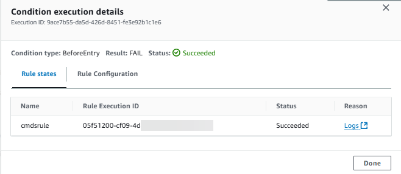
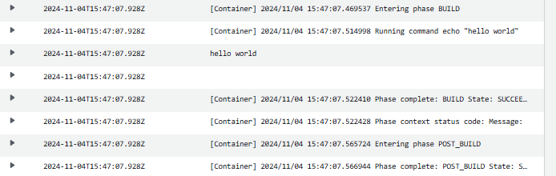

# Commands

When you create a condition, you can add the `Commands` rule. This section
provides a reference for the rule parameters. For more information about rules and
conditions, see [How do stage conditions work?](concepts-how-it-works-conditions.md "concepts-how-it-works-conditions.md").

You can use the `Commands` rule to create a condition where the succesful commands meet the rule criteria, such as the output and file path for the commands being successful for a beforeEntry condition.

###### Note

For beforeEntry conditions that are configured with the **Skip** result, only the following rules are available:
`LambdaInvoke` and `VariableCheck`.

###### Topics

- [Considerations for the Commands rule](#rule-reference-Commands-considerations "#rule-reference-Commands-considerations")
- [Service role policy permissions](#rule-reference-Commands-policy "#rule-reference-Commands-policy")
- [Rule type](#rule-reference-Commands-type "#rule-reference-Commands-type")
- [Configuration parameters](#rule-reference-Commands-config "#rule-reference-Commands-config")
- [Example rule
  configuration](#rule-reference-Commands-example "#rule-reference-Commands-example")
- [See also](#rule-reference-Commands-links "#rule-reference-Commands-links")

## Considerations for the Commands rule

The following considerations apply for the Commands rule.

- The commands rule uses CodeBuild resources similar to the CodeBuild action, while
  allowing shell environment commands in a virtual compute instance without the
  need to associate or create a build project.

###### Note

Running the commands rule will incur separate charges in AWS CodeBuild.

- Because the Commands rule in CodePipeline uses CodeBuild resources, the builds run by the
  action will be attributed to the build limits for your account in CodeBuild. Builds
  run by the Commands rule will count toward the concurrent build limits as
  configured for that account.
- The timeout for builds with the Commands rule is 55 minutes, as based on CodeBuild
  builds.
- The compute instance uses an isolated build environment in CodeBuild.

###### Note

Because the isolated build environment is used at the account level, an
instance might be reused for another pipeline execution.

- All formats are supported except multi-line formats. You must use single-line
  format when entering commands.
- For this rule, CodePipeline will assume the pipeline service role and use that role
  to allow access to resources at runtime. It is recommended to configure the
  service role so that the permissions are scoped down to the action level.
- The permissions added to the CodePipeline service role are detailed in [Add permissions to the CodePipeline
  service role](how-to-custom-role.md#how-to-update-role-new-services "how-to-custom-role.md#how-to-update-role-new-services").
- The permission needed to view logs in the console is detailed in [Permissions required to view
  compute logs in the CodePipeline console](security-iam-permissions-console-logs.md "security-iam-permissions-console-logs.md") . In the following
  example screens, use the **Logs** link to view logs
  for a successful Commands rule in CloudWatch logs.





- Unlike other actions in CodePipeline, you do not set fields in the action
  configuration; you set the action configuration fields outside of the action
  configuration.

## Service role policy permissions

When CodePipeline runs the rule, CodePipeline creates a log group using the name of the pipeline as
follows. This enables you to scope down permissions to log resources using the pipeline
name.

```
/aws/codepipeline/`MyPipelineName`
```

If you are using an existing service role, to use the Commands action, you will need
to add the following permissions for the service role.

- logs:CreateLogGroup
- logs:CreateLogStream
- logs:PutLogEvents

In the service role policy statement, scope down the permissions to the pipeline level
as shown in the following example.

```
{
    "Effect": "Allow",
    "Action": [
        "logs:CreateLogGroup",
        "logs:CreateLogStream",
        "logs:PutLogEvents"
    ],
    "Resource": "arn:aws:logs:*:`YOUR_AWS_ACCOUNT_ID`:log-group:/aws/codepipeline/`YOUR_PIPELINE_NAME`:*"
}
```

To view logs in the console using the action details dialog page, the permission to
view logs must be added to the console role. For more information, see the console
permissions policy example in [Permissions required to view
compute logs in the CodePipeline console](security-iam-permissions-console-logs.md "security-iam-permissions-console-logs.md").

## Rule type

- Category: `Rule`
- Owner: `AWS`
- Provider: `Commands`
- Version: `1`

## Configuration parameters

**Commands**

Required: Yes

You can provide shell commands for the `Commands` rule to run.
In the console, commands are entered on separate lines. In the CLI, commands
are entered as separate strings.

###### Note

Multi-line formats are not supported and will result in an error
message. Single-line format must be used for entering commands in the
**Commands** field.

The following details provide the default compute that is used for the
Commands rule. For more information, see [Build environment
compute modes and types](../../../codebuild/latest/userguide/build-env-ref-compute-types.md "../../../codebuild/latest/userguide/build-env-ref-compute-types.md") reference in the CodeBuild User
Guide.

- **CodeBuild image:**
  aws/codebuild/amazonlinux2-x86_64-standard:5.0
- **Compute type:** Linux Small
- **Environment computeType value:** BUILD_GENERAL1_SMALL
- **Environment type value:**
  LINUX_CONTAINER

## Example rule

configuration

YAML

```
result: FAIL
rules:
- name: CommandsRule
  ruleTypeId:
    category: Rule
    owner: AWS
    provider: Commands
    version: '1'
  configuration: {}
  commands:
  - ls
  - printenv
  inputArtifacts:
  - name: SourceArtifact
  region: us-east-1
```

JSON

```
{
    "result": "FAIL",
    "rules": [
        {
            "name": "CommandsRule",
            "ruleTypeId": {
                "category": "Rule",
                "owner": "AWS",
                "provider": "Commands",
                "version": "1"
            },
            "configuration": {},
            "commands": [
                "ls",
                "printenv"
            ],
            "inputArtifacts": [
                {
                    "name": "SourceArtifact"
                }
            ],
            "region": "us-east-1"
        }
    ]
}
```

## See also

The following related resources can help you as you work with this rule.

- For more information about rules and conditions, see [Condition](../APIReference/API_Condition.md "../APIReference/API_Condition.md"), [RuleTypeId](../APIReference/API_RuleTypeId.md "../APIReference/API_RuleTypeId.md"), and [RuleExecution](../APIReference/API_RuleExecution.md "../APIReference/API_RuleExecution.md") in the
  _CodePipeline API Guide_.
