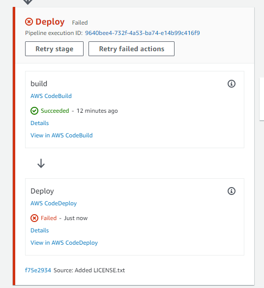
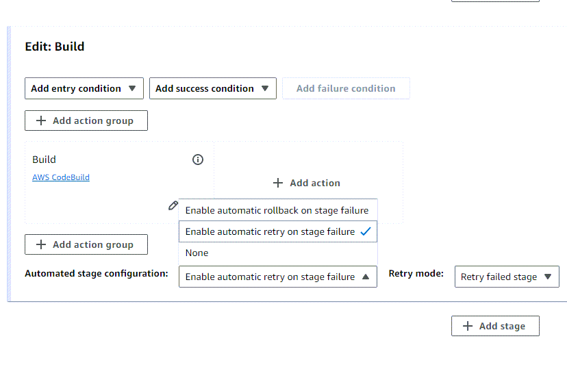
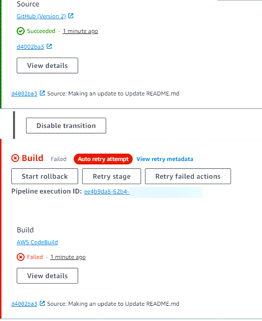
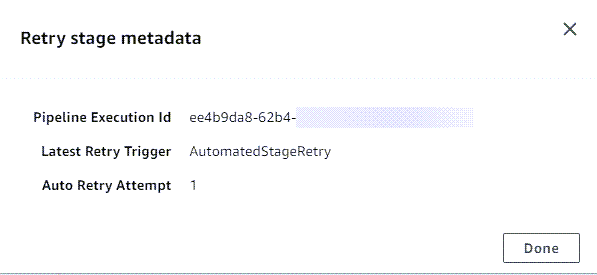

# Configuring

stage retry for a failed stage or failed
actions

You can retry a stage that has failed without having to run a pipeline again from the
beginning. You do this by either retrying the failed actions in a stage or by retrying all
actions in the stage starting from the first action in the stage. When you retry the failed
actions in a stage, all actions that are still in progress continue working, and failed
actions are triggered again. When you retry a failed stage from the first action in the
stage, the stage cannot have any actions in progress. Before a stage can be retried, it must
either have all actions failed or some actions failed and some succeeded.

###### Important

Retrying a failed stage retries all actions in the stage from the first action in the
stage, and retrying failed actions retries all failed actions in the stage. This
overrides output artifacts of previously successful actions in the same execution.

Although artifacts may be overriden, the execution history of previously successful
actions is still retained.

If you are using the console to view a pipeline, either a **Retry
stage** button or a **Retry failed actions**
button appears on the stage that can be retried.

If you are using the AWS CLI, you can use the **get-pipeline-state**
command to determine whether any actions have failed.

###### Note

In the following cases, you might not be able to retry a stage:

- All actions in the stage succeeded, and so the stage is not in a failed
  status.
- The overall pipeline structure changed after the stage failed.
- Another retry attempt in the stage is already in progress.

###### Topics

- [Considerations for stage retry](#stage-retry-considerations "#stage-retry-considerations")
- [Retry a failed stage manually](#stage-retry-manual "#stage-retry-manual")
- [Configure a stage for automatic retry on
  failure](#stage-retry-auto "#stage-retry-auto")

## Considerations for stage retry

Considerations for stage retry are as follows:

- You can only configure automatic retry on stage failure for one retry
  attempt.
- You can configure automatic retry on stage failure for all actions, including
  `Source` actions.

## Retry a failed stage manually

You can manually retry a failed stage using the console or CLI.

You can also configure a stage for retry automatically on failure as detailed in [Configure a stage for automatic retry on
failure](#stage-retry-auto "#stage-retry-auto").

### Retry a failed stage manually

(console)

###### To retry a failed stage or failed actions in a stage

- console

1. Sign in to the AWS Management Console and open the CodePipeline console at [http://console.aws.amazon.com/codesuite/codepipeline/home](http://console.aws.amazon.com/codesuite/codepipeline/home "http://console.aws.amazon.com/codesuite/codepipeline/home").

The names of all pipelines associated with your AWS account are displayed. 2. In **Name**, choose the name of the pipeline. 3. Locate the stage with the failed action, and then choose one of the following:

    * To retry all actions in the stage, choose **Retry
     stage**.
    * To retry only failed actions in the stage, choose **Retry
     failed actions**.



If all retried actions in the stage are completed successfully, the pipeline continues
to run.

### Retry a failed stage manually (CLI)

###### To retry a failed stage or failed actions in a stage - CLI

To use the AWS CLI to retry all actions or all failed actions, you run the
**retry-stage-execution** command with the following parameters:

```
--pipeline-name <value>
--stage-name <value>
--pipeline-execution-id <value>
--retry-mode ALL_ACTIONS/FAILED_ACTIONS
```

###### Note

The values you can use for `retry-mode` are `FAILED_ACTIONS` and
`ALL_ACTIONS`.

1. At a terminal (Linux, macOS, or Unix) or command prompt (Windows), run the [**retry-stage-execution**](../../../cli/latest/reference/codepipeline/get-pipeline-state.md "../../../cli/latest/reference/codepipeline/get-pipeline-state.md") command, as shown in the following
   example for a pipeline named `MyPipeline`.

```
aws codepipeline retry-stage-execution --pipeline-name MyPipeline --stage-name Deploy --pipeline-execution-id b59babff-5f34-EXAMPLE --retry-mode FAILED_ACTIONS
```

The output returns the execution ID:

```
{
    "pipelineExecutionId": "b59babff-5f34-EXAMPLE"
}
```

2.  You can also run the command with a JSON input file. You first create a JSON file that
    identifies the pipeline, the stage that contains the failed actions, and the latest
    pipeline execution in that stage. You then run the
    **retry-stage-execution** command with the
    `--cli-input-json` parameter. To retrieve the details you need for the
    JSON file, it's easiest to use the **get-pipeline-state** command.
    1. At a terminal (Linux, macOS, or Unix) or command prompt (Windows), run the [**get-pipeline-state**](../../../cli/latest/reference/codepipeline/get-pipeline-state.md "../../../cli/latest/reference/codepipeline/get-pipeline-state.md") command on a pipeline.
       For example, for a pipeline named MyFirstPipeline, you would type
       something similar to the following:

    ```
    aws codepipeline get-pipeline-state --name `MyFirstPipeline`
    ```

    The response to the command includes pipeline state information for each
    stage. In the following example, the response indicates that one or more actions
    failed in the Staging stage:

    ```
    {
        "updated": 1427245911.525,
        "created": 1427245911.525,
        "pipelineVersion": 1,
        "pipelineName": "MyFirstPipeline",
        "stageStates": [
            {
                "actionStates": [...],
                "stageName": "Source",
                "latestExecution": {
                    "pipelineExecutionId": "9811f7cb-7cf7-SUCCESS",
                    "status": "Succeeded"
                }
            },
            `{
     "actionStates": [...],
     "stageName": "Staging",
     "latestExecution": {
     "pipelineExecutionId": "3137f7cb-7cf7-EXAMPLE",
     "status": "Failed"
     }`
            }
        ]
    }
    ```

    2.  In a plain-text editor, create a file where you will record the following, in
        JSON format:

            * The name of the pipeline that contains the failed actions
            * The name of the stage that contains the failed actions
            * The ID of the latest pipeline execution in the stage
            * The retry mode.

        For the preceding MyFirstPipeline example, your file would look
        something like this:

    ```
    {
        "pipelineName": "MyFirstPipeline",
        "stageName": "Staging",
        "pipelineExecutionId": "3137f7cb-7cf7-EXAMPLE",
        "retryMode": "FAILED_ACTIONS"
    }
    ```

    3. Save the file with a name like
       `retry-failed-actions.json`.
    4. Call the file you created when you run the [**retry-stage-execution**](../../../cli/latest/reference/codepipeline/retry-stage-execution.md "../../../cli/latest/reference/codepipeline/retry-stage-execution.md") command. For
       example:

    ###### Important

    Be sure to include `file://` before the file name. It is required in this command.

    ```
    aws codepipeline retry-stage-execution --cli-input-json file://retry-failed-actions.json
    ```

    5. To view the results of the retry attempt, either open the CodePipeline console and
       choose the pipeline that contains the actions that failed, or use the
       **get-pipeline-state** command again. For more information,
       see [View pipelines and details in CodePipeline](pipelines-view.md "pipelines-view.md").

## Configure a stage for automatic retry on

failure

You can configure a stage for automatic retry on failure. The stage will make one
retry attempt and display a retry status on the failed stage on the
**View** pipeline page.

You can configure the retry mode by specifying that the stage should automatically
retry either all actions in the failed stage or only failed actions in the stage.

### Configure a stage for automatic retry on

failure (console)

You can use the console to configure a stage for automatic retry.

###### Configure a stage for automatic retry (console)

1. Sign in to the AWS Management Console and open the CodePipeline console at [http://console.aws.amazon.com/codesuite/codepipeline/home](http://console.aws.amazon.com/codesuite/codepipeline/home "http://console.aws.amazon.com/codesuite/codepipeline/home").

The names and status of all pipelines associated with your AWS account
are displayed. 2. In **Name**, choose the name of the pipeline you want to
edit. 3. On the pipeline details page, choose **Edit**. 4. On the **Edit** page, for the action you want to edit,
choose **Edit stage**. 5. Choose **Automated stage configuration:**, and then
choose **Enable automatic retry on stage failure**. Save
the changes to your pipeline. 6. In **Automated stage configuration:**, choose one of the
following retry modes:

    * To specify that the mode will retry all actions in the stage,
     choose **Retry failed stage**.
    * To specify that the mode will only retry failed actions in the
     stage, choose **Retry failed actions**.

Save the changes to your pipeline.

 7. After your pipeline runs, if the stage failure occurs, the automatic retry
attempt will be made. The following examples show a build stage that has
been retried automatically.

 8. To view details about the retry attempt, choose . The window
displays.



### Configure a stage for automatic retry

(CLI)

To use the AWS CLI to configure a stage to automatically retry on failure, use the
commands to create or update a pipeline as detailed in [Create a pipeline, stages, and actions](pipelines-create.md "pipelines-create.md") and [Edit a pipeline in CodePipeline](pipelines-edit.md "pipelines-edit.md").

- Open a terminal (Linux, macOS, or Unix) or command prompt (Windows) and use the AWS CLI
  to run the `update-pipeline` command, specifying the failure
  condition in the pipeline structure. The following example configures
  automatic retry for a staged named `S3Deploy`:

```
{
                "name": "S3Deploy",
                "actions": [
                    {
                        "name": "s3deployaction",
                        "actionTypeId": {
                            "category": "Deploy",
                            "owner": "AWS",
                            "provider": "S3",
                            "version": "1"
                        },
                        "runOrder": 1,
                        "configuration": {
                            "BucketName": "static-website-bucket",
                            "Extract": "false",
                            "ObjectKey": "SampleApp.zip"
                        },
                        "outputArtifacts": [],
                        "inputArtifacts": [
                            {
                                "name": "SourceArtifact"
                            }
                        ],
                        "region": "us-east-1"
                    }
                ],
                 "onFailure": {
                    "result": "RETRY",
                    "retryConfiguration": {
                        "retryMode": "ALL_ACTIONS",
                    },
            }
```

### Configure a stage for automatic retry

(AWS CloudFormation)

To use AWS CloudFormation to configure a stage for automatic retry on failure, use the
`OnFailure` stage lifecycle parameter. Use the
`RetryConfiguration` parameter to configure the retry mode.

```
OnFailure:
     Result: RETRY
     RetryConfiguration:
         RetryMode: ALL_ACTIONS
```

- Update the template as shown in the following snippet. The following
  example configures automatic retry for a stage named
  `Release`:

```
AppPipeline:
  Type: AWS::CodePipeline::Pipeline
  Properties:
    RoleArn:
      Ref: CodePipelineServiceRole
    Stages:
      -
        Name: Source
        Actions:
          -
            Name: SourceAction
            ActionTypeId:
              Category: Source
              Owner: AWS
              Version: 1
              Provider: S3
            OutputArtifacts:
              -
                Name: SourceOutput
            Configuration:
              S3Bucket:
                Ref: SourceS3Bucket
              S3ObjectKey:
                Ref: SourceS3ObjectKey
            RunOrder: 1
      -
        Name: Release
        Actions:
          -
            Name: ReleaseAction
            InputArtifacts:
              -
                Name: SourceOutput
            ActionTypeId:
              Category: Deploy
              Owner: AWS
              Version: 1
              Provider: CodeDeploy
            Configuration:
              ApplicationName:
                Ref: ApplicationName
              DeploymentGroupName:
                Ref: DeploymentGroupName
            RunOrder: 1
       OnFailure:
           Result: RETRY
           RetryConfiguration:
              RetryMode: ALL_ACTIONS
    ArtifactStore:
      Type: S3
      Location:
        Ref: ArtifactStoreS3Location
      EncryptionKey:
        Id: arn:aws:kms:useast-1:ACCOUNT-ID:key/KEY-ID
        Type: KMS
    DisableInboundStageTransitions:
      -
        StageName: Release
        Reason: "Disabling the transition until integration tests are completed"
    Tags:
      - Key: Project
        Value: ProjectA
      - Key: IsContainerBased
        Value: 'true'

```

For more information about configuring stage retry on failure, see [OnFailure](../../../AWSCloudFormation/latest/UserGuide/aws-properties-codepipeline-pipeline-stagedeclaration.md#cfn-codepipeline-pipeline-stagedeclaration-onfailure "../../../AWSCloudFormation/latest/UserGuide/aws-properties-codepipeline-pipeline-stagedeclaration.md#cfn-codepipeline-pipeline-stagedeclaration-onfailure") under `StageDeclaration` in the _AWS CloudFormation User Guide_.
