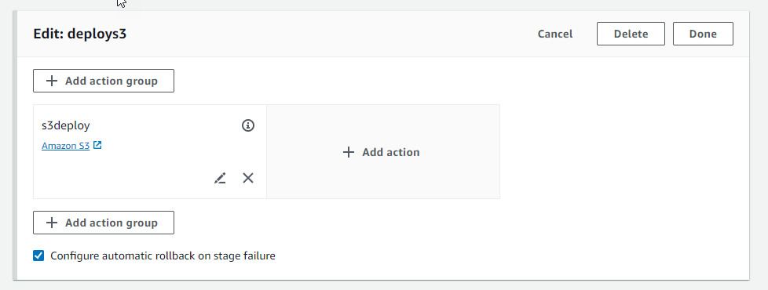

# Configure a stage for automatic rollback

You can configure stages in a pipeline to roll back automatically on failure. When the
stage fails, the stage is rolled back to the most recent successful execution. The
pipeline can only roll back to a previous execution if the previous execution was
started in the current pipeline structure version. Since, automatic rollback
configuration is part of the pipeline definition, your pipeline stage will auto-rollback
only after there is a successful pipeline execution in the pipeline stage.

## Configure a stage for automatic

rollback (console)

You can roll back a stage to a specified previous successful execution. For more
information, see [RollbackStage](../APIReference/API_RollbackStage.md "../APIReference/API_RollbackStage.md") in the _CodePipeline API
Guide_.

###### Configure a stage for automatic rollback (console)

1. Sign in to the AWS Management Console and open the CodePipeline console at [http://console.aws.amazon.com/codesuite/codepipeline/home](http://console.aws.amazon.com/codesuite/codepipeline/home "http://console.aws.amazon.com/codesuite/codepipeline/home").

The names and status of all pipelines associated with your AWS account
are displayed. 2. In **Name**, choose the name of the pipeline you want to
edit. 3. On the pipeline details page, choose **Edit**. 4. On the **Edit** page, for the action you want to edit,
choose **Edit stage**. 5. Choose **Automated stage configuration:**, and then
choose **Configure automatic rollback on stage failure**.
Save the changes to your pipeline.



## Configure a stage for automatic rollback

(CLI)

To use the AWS CLI to configure a failed stage to automatically roll back to the
most recent successful execution, use the commands to create or update a pipeline as
detailed in [Create a pipeline, stages, and actions](pipelines-create.md "pipelines-create.md") and [Edit a pipeline in CodePipeline](pipelines-edit.md "pipelines-edit.md").

- Open a terminal (Linux, macOS, or Unix) or command prompt (Windows) and use the AWS CLI
  to run the `update-pipeline` command, specifying the failure
  condition in the pipeline structure. The following example configures
  automatic rollback for a staged named `S3Deploy`:

```
{
                "name": "S3Deploy",
                "actions": [
                    {
                        "name": "s3deployaction",
                        "actionTypeId": {
                            "category": "Deploy",
                            "owner": "AWS",
                            "provider": "S3",
                            "version": "1"
                        },
                        "runOrder": 1,
                        "configuration": {
                            "BucketName": "static-website-bucket",
                            "Extract": "false",
                            "ObjectKey": "SampleApp.zip"
                        },
                        "outputArtifacts": [],
                        "inputArtifacts": [
                            {
                                "name": "SourceArtifact"
                            }
                        ],
                        "region": "us-east-1"
                    }
                ],
                `"onFailure": {
 "result": "ROLLBACK"`
                }
            }
```

For more information about configuring failure conditions for stage
rollback, see [FailureConditions](../APIReference/API_FailureConditions.md "../APIReference/API_FailureConditions.md") in the _CodePipeline API
Reference_.

## Configure a stage for automatic rollback

(CloudFormation)

To use CloudFormation to configure a stage to roll back automatically on failure, use the
`OnFailure` parameter. On failure, the stage will automatically roll
back to the most recent successful execution.

```
OnFailure:
     Result: ROLLBACK
```

- Update the template as shown in the following snippet. The following
  example configures automatic rollback for a staged named
  `Release`:

```
AppPipeline:
  Type: AWS::CodePipeline::Pipeline
  Properties:
    RoleArn:
      Ref: CodePipelineServiceRole
    Stages:
      -
        Name: Source
        Actions:
          -
            Name: SourceAction
            ActionTypeId:
              Category: Source
              Owner: AWS
              Version: 1
              Provider: S3
            OutputArtifacts:
              -
                Name: SourceOutput
            Configuration:
              S3Bucket:
                Ref: SourceS3Bucket
              S3ObjectKey:
                Ref: SourceS3ObjectKey
            RunOrder: 1
      -
        Name: Release
        Actions:
          -
            Name: ReleaseAction
            InputArtifacts:
              -
                Name: SourceOutput
            ActionTypeId:
              Category: Deploy
              Owner: AWS
              Version: 1
              Provider: CodeDeploy
            Configuration:
              ApplicationName:
                Ref: ApplicationName
              DeploymentGroupName:
                Ref: DeploymentGroupName
            RunOrder: 1
       OnFailure:
            Result: ROLLBACK
    ArtifactStore:
      Type: S3
      Location:
        Ref: ArtifactStoreS3Location
      EncryptionKey:
        Id: arn:aws:kms:useast-1:ACCOUNT-ID:key/KEY-ID
        Type: KMS
    DisableInboundStageTransitions:
      -
        StageName: Release
        Reason: "Disabling the transition until integration tests are completed"
    Tags:
      - Key: Project
        Value: ProjectA
      - Key: IsContainerBased
        Value: 'true'

```

For more information about configuring failure conditions for stage
rollback, see [OnFailure](../../../AWSCloudFormation/latest/UserGuide/aws-properties-codepipeline-pipeline-stagedeclaration.md#cfn-codepipeline-pipeline-stagedeclaration-onfailure "../../../AWSCloudFormation/latest/UserGuide/aws-properties-codepipeline-pipeline-stagedeclaration.md#cfn-codepipeline-pipeline-stagedeclaration-onfailure") under `StageDeclaration` in the _CloudFormation User
Guide_.
