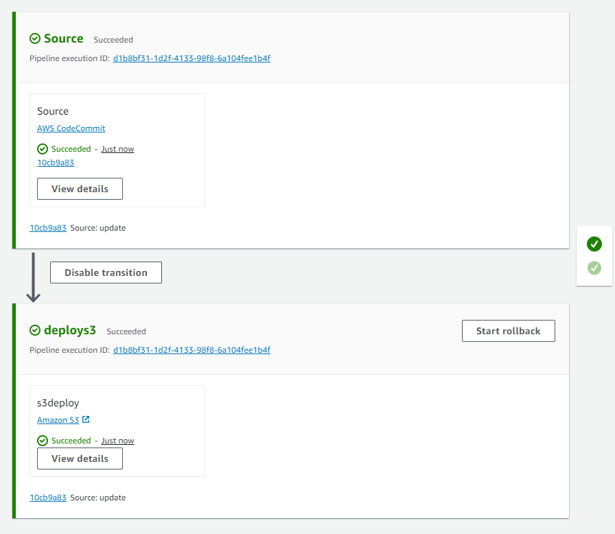
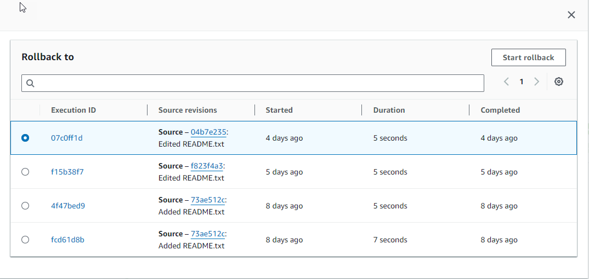
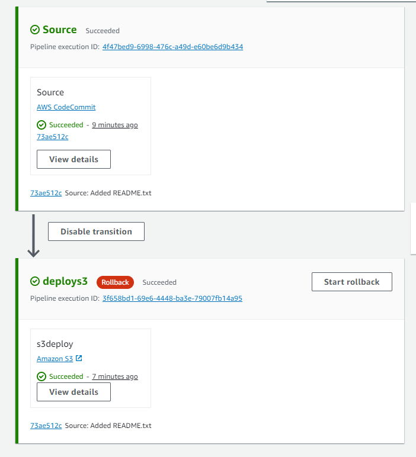

# Roll back a stage manually

You can manually roll back a stage using the console or CLI. The pipeline can only
roll back to a previous execution if the previous execution was started in the current
pipeline structure version.

You can also configure a stage to roll back automatically on failure as detailed in
[Configure a stage for automatic rollback](stage-rollback-auto.md "stage-rollback-auto.md").

## Roll back a stage manually

(console)

You can use the console to manually roll back a stage to a target pipeline
execution. When a stage is rolled back, a **Rollback** label
displays on the pipeline visualization in the console.

###### Roll back a stage manually (console)

1. Sign in to the AWS Management Console and open the CodePipeline console at [http://console.aws.amazon.com/codesuite/codepipeline/home](http://console.aws.amazon.com/codesuite/codepipeline/home "http://console.aws.amazon.com/codesuite/codepipeline/home").

The names and status of all pipelines associated with your AWS account
are displayed. 2. In **Name**, choose the name of the pipeline with the
stage to roll back.

 3. On the stage, choose **Start rollback**. The
**Roll back to** page displays. 4. Choose the target execution to which you want to roll back the
stage.

###### Note

The list of target pipeline executions available will be all
executions in the current pipeline version beginning on February 1, 2024.



The following diagram shows an example of the rolled back stage with the new
execution ID.



## Roll back a stage manually (CLI)

To use the AWS CLI to manually roll back a stage, use the
`rollback-stage` command.

You can also roll back a stage manually as detailed
in [Roll back a stage manually](stage-rollback-manual.md "stage-rollback-manual.md").

###### Note

The list of target pipeline executions available will be all
executions in the current pipeline version beginning on February 1, 2024.

###### To roll back a stage manually (CLI)

1. The CLI command for manual rollback will require the execution ID of a
   previously successful pipeline execution in the stage. To get the target
   pipeline execution ID that you will specify, use the
   list-pipeline-executions command with a filter that will return successful
   executions in the stage. Open a terminal (Linux, macOS, or Unix) or command prompt
   (Windows) and use the AWS CLI to run the `list-pipeline-executions`
   command, specifying the name of the pipeline and the filter for successful
   executions in the stage. In this example, the output will list pipeline
   executions for the pipeline named MyFirstPipeline and for
   successful executions in the stage named `deploys3`.

```
aws codepipeline list-pipeline-executions --pipeline-name MyFirstPipeline --filter succeededInStage={stageName=deploys3}
```

In the output, copy the execution ID of the previously successful
execution that you want to specify for rollback. You will use this in the
next step as the target execution ID. 2. Open a terminal (Linux, macOS, or Unix) or command prompt (Windows) and use the AWS CLI
to run the `rollback-stage` command, specifying the name of the
pipeline, the name of the stage, and the target execution that you want to
roll back to. For example, to roll back a stage named Deploy for a pipeline
named `MyFirstPipeline`:

```
aws codepipeline rollback-stage --pipeline-name MyFirstPipeline --stage-name Deploy --target-pipeline-execution-id bc022580-4193-491b-8923-9728dEXAMPLE
```

The output returns the execution ID for the new rolled-back execution.
This is a separate ID that uses the source revisions and parameters of the
specified target execution.
