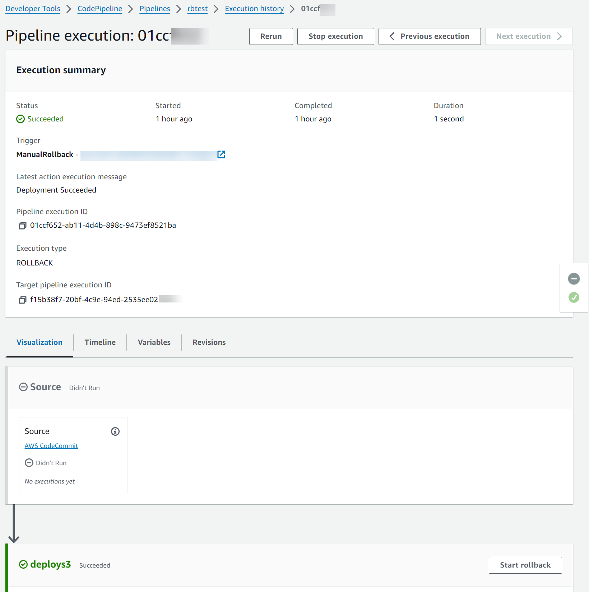

# View rollback status details

You can view the status and target execution ID for a rollback execution.

## View rollback status on detail page (console)

You can use the console to view the status and target pipeline execution ID for a
rollback execution.



## View rollback details with `get-pipeline-execution` (CLI)

Pipeline executions that have been rolled back will show in the output for getting
the pipeline execution.

- To view details about a pipeline, run the
  **[get-pipeline-execution](../../../cli/latest/reference/codepipeline/get-pipeline-execution.md "../../../cli/latest/reference/codepipeline/get-pipeline-execution.md")** command,
  specifying the unique name of the pipeline. For example, to view details
  about a pipeline named `MyFirstPipeline`,
  enter the following:

```
aws codepipeline get-pipeline-execution --pipeline-name MyFirstPipeline --pipeline-execution-id 3f658bd1-69e6-4448-ba3e-79007EXAMPLE
```

This command returns the structure of the pipeline.

The following example shows the returned data for a portion of a pipeline
named `MyFirstPipeline`, where the
rollback execution ID and metadata are shown.

```
{
    "pipelineExecution": {
        "pipelineName": "MyFirstPipeline",
        "pipelineVersion": 6,
        "pipelineExecutionId": "2004a94e-8b46-4c34-a695-c8d20EXAMPLE",
        "status": "Succeeded",
        "artifactRevisions": [
            {
                "name": "SourceArtifact",
                "revisionId": "<ID>",
                "revisionSummary": "Added README.txt",
                "revisionUrl": "<console_URL>"
            }
        ],
        `"trigger": {
 "triggerType": "ManualRollback",
 "triggerDetail": "arn:aws:sts::<account_ID>:assumed-role/<role>"
 },
 "executionMode": "SUPERSEDED",
 "executionType": "ROLLBACK",
 "rollbackMetadata": {
 "rollbackTargetPipelineExecutionId": "4f47bed9-6998-476c-a49d-e60beEXAMPLE"
 }`
    }
}
```

## View rollback state with `get-pipeline-state` (CLI)

Pipeline executions that have been rolled back will show in the output for getting
the pipeline state.

- To view details about a pipeline, run the
  **get-pipeline-state** command, specifying the unique
  name of the pipeline. For example, to view state details about a pipeline
  named `MyFirstPipeline`, enter the
  following:

```
aws codepipeline get-pipeline-state --name MyFirstPipeline
```

The following example shows the returned data with the rollback execution
type.

```
{
    "pipelineName": "MyFirstPipeline",
    "pipelineVersion": 7,
    "stageStates": [
        {
            "stageName": "Source",
            "inboundExecutions": [],
            "inboundTransitionState": {
                "enabled": true
            },
            "actionStates": [
                {
                    "actionName": "Source",
                    "currentRevision": {
                        "revisionId": "<Revision_ID>"
                    },
                    "latestExecution": {
                        "actionExecutionId": "13bbd05d-b439-4e35-9c7e-887cb789b126",
                        "status": "Succeeded",
                        "summary": "update",
                        "lastStatusChange": "2024-04-24T20:13:45.799000+00:00",
                        "externalExecutionId": "10cbEXAMPLEID"
                    },
                    "entityUrl": "console-url",
                    "revisionUrl": "console-url"
                }
            ],
            "latestExecution": {
                "pipelineExecutionId": "cf95a8ca-0819-4279-ae31-03978EXAMPLE",
                "status": "Succeeded"
            }
        },
        {
            "stageName": "deploys3",
            "inboundExecutions": [],
            "inboundTransitionState": {
                "enabled": true
            },
            "actionStates": [
                {
                    "actionName": "s3deploy",
                    "latestExecution": {
                        "actionExecutionId": "3bc4e3eb-75eb-45b9-8574-8599aEXAMPLE",
                        "status": "Succeeded",
                        "summary": "Deployment Succeeded",
                        "lastStatusChange": "2024-04-24T20:14:07.577000+00:00",
                        "externalExecutionId": "mybucket/SampleApp.zip"
                    },
                    "entityUrl": "console-URL"
                }
            ],
            `"latestExecution": {
 "pipelineExecutionId": "fdf6b2ae-1472-4b00-9a83-1624eEXAMPLE",
 "status": "Succeeded",
 "type": "ROLLBACK"
 }`
        }
    ],
    "created": "2024-04-15T21:29:01.635000+00:00",
    "updated": "2024-04-24T20:12:24.480000+00:00"
}
```
