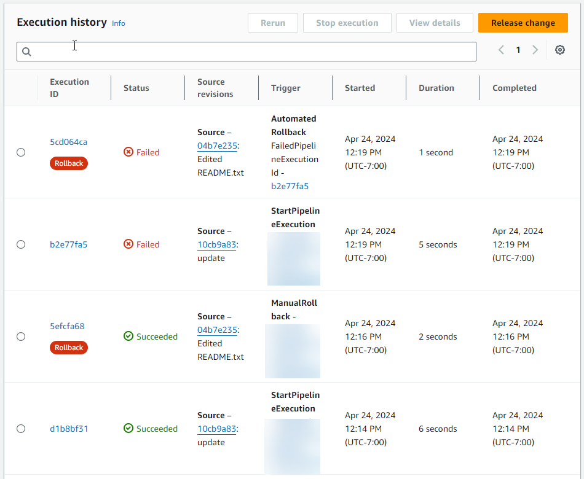

# View rollback status in execution listing

You can view the status and target execution ID for a rollback execution.

## View rollback status in list of executions (console)

You can use the console to view the status and target execution ID for a rollback
execution in the execution listing.

###### View rollback execution status in list of executions (console)

1. Sign in to the AWS Management Console and open the CodePipeline console at [http://console.aws.amazon.com/codesuite/codepipeline/home](http://console.aws.amazon.com/codesuite/codepipeline/home "http://console.aws.amazon.com/codesuite/codepipeline/home").

The names and status of all pipelines associated with your AWS account
are displayed. 2. In **Name**, choose the name of the pipeline you want to
view. 3. Choose **History**. The list of executions shows the
label **Rollback**.



Choose the execution ID for which you want to view details.

## View rollback status with `list-pipeline-executions` (CLI)

You can use the CLI to view the status and target execution ID for a rollback
execution.

- Open a terminal (Linux, macOS, or Unix) or command prompt (Windows) and use the AWS CLI
  to run the **list-pipeline-executions** command:

```
aws codepipeline list-pipeline-executions --pipeline-name MyFirstPipeline
```

This command returns a list of all of the completed executions associated
with the pipeline.

The following example shows the returned data for a pipeline named
`MyFirstPipeline` where a rollback
execution started the pipeline.

```
{
    "pipelineExecutionSummaries": [
        {
            "pipelineExecutionId": "eb7ebd36-353a-4551-90dc-18ca5EXAMPLE",
            "status": "Succeeded",
            "startTime": "2024-04-16T09:00:28.185000+00:00",
            "lastUpdateTime": "2024-04-16T09:00:29.665000+00:00",
            "sourceRevisions": [
                {
                    "actionName": "Source",
                    "revisionId": "revision_ID",
                    "revisionSummary": "Added README.txt",
                    "revisionUrl": "console-URL"
                }
            ],
            `"trigger": {
 "triggerType": "ManualRollback",
 "triggerDetail": "{arn:aws:sts::<account_ID>:assumed-role/<role>"}"
 },
 "executionMode": "SUPERSEDED",
 "executionType": "ROLLBACK",
 "rollbackMetadata": {
 "rollbackTargetPipelineExecutionId": "f15b38f7-20bf-4c9e-94ed-2535eEXAMPLE"
 }`
        },
        {
            "pipelineExecutionId": "fcd61d8b-4532-4384-9da1-2aca1EXAMPLE",
            "status": "Succeeded",
            "startTime": "2024-04-16T08:58:56.601000+00:00",
            "lastUpdateTime": "2024-04-16T08:59:04.274000+00:00",
            "sourceRevisions": [
                {
                    "actionName": "Source",
                    "revisionId": "revision_ID",
                    "revisionSummary": "Added README.txt",
                    "revisionUrl": "console_URL"
                }
            ],
            "trigger": {
                "triggerType": "StartPipelineExecution",
                "triggerDetail": "arn:aws:sts::<account_ID>:assumed-role/<role>"
            },
            "executionMode": "SUPERSEDED"
        },
        {
            "pipelineExecutionId": "5cd064ca-bff7-425f-8653-f41d9EXAMPLE",
            "status": "Failed",
            "startTime": "2024-04-24T19:19:50.781000+00:00",
            "lastUpdateTime": "2024-04-24T19:19:52.119000+00:00",
            "sourceRevisions": [
                {
                    "actionName": "Source",
                    "revisionId": "<revision_ID>",
                    "revisionSummary": "Edited README.txt",
                    "revisionUrl": "<revision_URL>"
                }
            ],
            `"trigger": {
 "triggerType": "AutomatedRollback",
 "triggerDetail": "{\"FailedPipelineExecutionId\":\"b2e77fa5-9285-4dea-ae66-4389EXAMPLE\"}"
 },
 "executionMode": "SUPERSEDED",
 "executionType": "ROLLBACK",
 "rollbackMetadata": {
 "rollbackTargetPipelineExecutionId": "5efcfa68-d838-4ca7-a63b-4a743EXAMPLE"
 }`
         },

```
