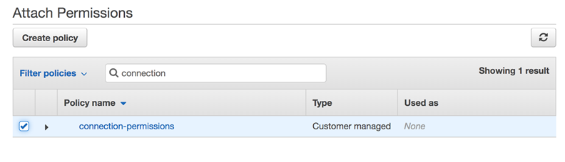

# Troubleshooting CodePipeline

The following information might help you troubleshoot common issues in AWS CodePipeline.

###### Topics

- [Pipeline error: A pipeline configured with AWS Elastic Beanstalk
  returns an error message: "Deployment failed. The provided role does not have sufficient
  permissions: Service:AmazonElasticLoadBalancing"](#troubleshooting-aeb1 "#troubleshooting-aeb1")
- [Deployment error: A pipeline configured with an
  AWS Elastic Beanstalk deploy action hangs instead of failing if the "DescribeEvents" permission is
  missing](#troubleshooting-aeb2 "#troubleshooting-aeb2")
- [Pipeline error: A source action
  returns the insufficient permissions message: "Could not access the CodeCommit repository
  repository-name. Make sure that the pipeline IAM role has sufficient
  permissions to access the repository."](#troubleshooting-service-role-permissions "#troubleshooting-service-role-permissions")
- [Pipeline error: A Jenkins build or test action runs for
  a long time and then fails due to lack of credentials or permissions](#troubleshooting-jen1 "#troubleshooting-jen1")
- [Pipeline error: A pipeline created in one AWS Region
  using a bucket created in another AWS Region returns an "InternalError" with the code
  "JobFailed"](#troubleshooting-reg-1 "#troubleshooting-reg-1")
- [Deployment error: A ZIP file that contains a WAR file
  is deployed successfully to AWS Elastic Beanstalk, but the application URL reports a 404 not found
  error](#troubleshooting-aeb2 "#troubleshooting-aeb2")
- [Pipeline artifact folder names appear to
  be truncated](#troubleshooting-truncated-artifacts "#troubleshooting-truncated-artifacts")
- [Add CodeBuild GitClone permissions for connections to
  Bitbucket, GitHub, GitHub Enterprise Server, or GitLab.com](#codebuild-role-connections "#codebuild-role-connections")
- [Add CodeBuild GitClone permissions for CodeCommit
  source actions](#codebuild-role-codecommitclone "#codebuild-role-codecommitclone")
- [Pipeline error: A deployment with the
  CodeDeployToECS action returns an error message: "Exception while trying to read the task
  definition artifact file from: <source artifact name>"](#troubleshooting-ecstocodedeploy-size "#troubleshooting-ecstocodedeploy-size")
- [GitHub (via OAuth app) source action:
  Repository list shows different repositories](#troubleshooting-connections-GitHub-org "#troubleshooting-connections-GitHub-org")
- [GitHub (via GitHub App) source
  action: Unable to complete the connection for a repository](#troubleshooting-connections-GitHub-admin "#troubleshooting-connections-GitHub-admin")
- [Amazon S3 error: CodePipeline service role
  <ARN> is getting S3 access denied for the S3 bucket <BucketName>](#troubleshooting-S3-access-denied-list "#troubleshooting-S3-access-denied-list")
- [Pipelines with an Amazon S3, Amazon ECR, or CodeCommit
  source no longer start automatically](#troubleshooting-events-identifiers "#troubleshooting-events-identifiers")
- [Connections error when
  connecting to GitHub: "A problem occurred, make sure cookies are enabled in your browser" or
  "An organization owner must install the GitHub app"](#troubleshooting-connections-GitHub-organization-owner "#troubleshooting-connections-GitHub-organization-owner")
- [Pipelines with execution mode changed to QUEUED
  or PARALLEL mode fails when run limit reached](#troubleshooting-queued-mode "#troubleshooting-queued-mode")
- [Pipelines in PARALLEL mode have an
  outdated pipeline definition if edited when changing to QUEUED or SUPERSEDED mode](#troubleshooting-execution-mode-editing "#troubleshooting-execution-mode-editing")
- [Pipelines changed from
  PARALLEL mode will display a previous execution mode](#troubleshooting-execution-mode-displayedstate "#troubleshooting-execution-mode-displayedstate")
- [Pipelines with connections that use
  trigger filtering by file paths might not start at branch creation](#troubleshooting-file-paths-filtering "#troubleshooting-file-paths-filtering")
- [Pipelines with connections that use trigger
  filtering by file paths might not start when file limit is reached](#troubleshooting-file-paths-files "#troubleshooting-file-paths-files")
- [CodeCommit or S3 source revisions in PARALLEL
  mode might not match EventBridge event](#troubleshooting-revisions-parallel "#troubleshooting-revisions-parallel")
- [EC2 Deploy action fails with an error message
  No such file](#troubleshooting-ec2-deploy "#troubleshooting-ec2-deploy")
- [EKS Deploy action fails with a cluster
  unreachable error message](#troubleshooting-eks-deploy "#troubleshooting-eks-deploy")
- [Need help with a different issue?](#troubleshooting-other "#troubleshooting-other")

## Pipeline error: A pipeline configured with AWS Elastic Beanstalk

returns an error message: "Deployment failed. The provided role does not have sufficient
permissions: Service:AmazonElasticLoadBalancing"

**Problem:** The service role for CodePipeline does not have
sufficient permissions for AWS Elastic Beanstalk, including, but not limited to, some operations in Elastic Load Balancing.
The service role for CodePipeline was updated on August 6, 2015 to address this issue. Customers who
created their service role before this date must modify the policy statement for their service
role to add the required permissions.

**Possible fixes:** The easiest solution is to edit the
policy statement for your service role as detailed in [Add permissions to the CodePipeline
service role](how-to-custom-role.md#how-to-update-role-new-services "how-to-custom-role.md#how-to-update-role-new-services").

After you apply the edited policy, follow the steps in [Start a pipeline manually](pipelines-rerun-manually.md "pipelines-rerun-manually.md") to manually
rerun any pipelines that use Elastic Beanstalk.

Depending on your security needs, you can modify the permissions in other ways, too.

## Deployment error: A pipeline configured with an

AWS Elastic Beanstalk deploy action hangs instead of failing if the "DescribeEvents" permission is
missing

**Problem:** The service role for CodePipeline must include the
`"elasticbeanstalk:DescribeEvents"` action for any pipelines that use AWS Elastic Beanstalk.
Without this permission, AWS Elastic Beanstalk deploy actions hang without failing or indicating an error.
If this action is missing from your service role, then CodePipeline does not have permissions to run
the pipeline deployment stage in AWS Elastic Beanstalk on your behalf.

**Possible fixes:** Review your CodePipeline service role. If the
`"elasticbeanstalk:DescribeEvents"` action is missing, use the steps in [Add permissions to the CodePipeline
service role](how-to-custom-role.md#how-to-update-role-new-services "how-to-custom-role.md#how-to-update-role-new-services")
to add it using the **Edit Policy** feature in the IAM console.

After you apply the edited policy, follow the steps in [Start a pipeline manually](pipelines-rerun-manually.md "pipelines-rerun-manually.md") to manually
rerun any pipelines that use Elastic Beanstalk.

## Pipeline error: A source action

returns the insufficient permissions message: "Could not access the CodeCommit repository
`repository-name`. Make sure that the pipeline IAM role has sufficient
permissions to access the repository."

**Problem:** The service role for CodePipeline does not have
sufficient permissions for CodeCommit and likely was created before support for using CodeCommit
repositories was added on April 18, 2016. Customers who created their service role before this
date must modify the policy statement for their service role to add the required permissions.

**Possible fixes:** Add the required permissions for CodeCommit to
your CodePipeline service role's policy. For more information, see [Add permissions to the CodePipeline
service role](how-to-custom-role.md#how-to-update-role-new-services "how-to-custom-role.md#how-to-update-role-new-services").

## Pipeline error: A Jenkins build or test action runs for

a long time and then fails due to lack of credentials or permissions

**Problem:** If the Jenkins server is installed on an Amazon EC2
instance, the instance might not have been created with an instance role that has the
permissions required for CodePipeline. If you are using an IAM user on a Jenkins server, an
on-premises instance, or an Amazon EC2 instance created without the required IAM role, the
IAM user either does not have the required permissions, or the Jenkins server cannot access
those credentials through the profile configured on the server.

**Possible fixes:** Make sure that Amazon EC2 instance role or
IAM user is configured with the `AWSCodePipelineCustomActionAccess` managed
policy or with the equivalent permissions. For more information, see [AWS managed policies for AWS CodePipeline](managed-policies.md "managed-policies.md").

If you are using an IAM user, make sure the AWS profile configured on the instance
uses the IAM user configured with the correct permissions. You might have to provide the
IAM user credentials you configured for integration between Jenkins and CodePipeline directly into
the Jenkins UI. This is not a recommended best practice. If you must do so, be sure the
Jenkins server is secured and uses HTTPS instead of HTTP.

## Pipeline error: A pipeline created in one AWS Region

using a bucket created in another AWS Region returns an "InternalError" with the code
"JobFailed"

**Problem:** The download of an artifact stored in an Amazon S3
bucket will fail if the pipeline and bucket are created in different AWS Regions.

**Possible fixes:** Make sure the Amazon S3 bucket where your
artifact is stored is in the same AWS Region as the pipeline you have created.

## Deployment error: A ZIP file that contains a WAR file

is deployed successfully to AWS Elastic Beanstalk, but the application URL reports a 404 not found
error

**Problem:** A WAR file is deployed successfully to an
AWS Elastic Beanstalk environment, but the application URL returns a 404 Not Found error.

**Possible fixes:** AWS Elastic Beanstalk can unpack a ZIP file, but not
a WAR file contained in a ZIP file. Instead of specifying a WAR file in your
`buildspec.yml` file, specify a folder that contains the content to be
deployed. For example:

```
version: 0.2

phases:
  post_build:
    commands:
      - mvn package
      - mv target/my-web-app ./
artifacts:
  files:
    - my-web-app/**/*
 discard-paths: yes
```

For an example, see [AWS Elastic Beanstalk
Sample for CodeBuild](../../../codebuild/latest/userguide/sample-elastic-beanstalk.md "../../../codebuild/latest/userguide/sample-elastic-beanstalk.md").

## Pipeline artifact folder names appear to

be truncated

**Problem:** When you view pipeline artifact names in CodePipeline,
the names appear to be truncated. This can make the names appear to be similar or seem to no
longer contain the entire pipeline name.

**Explanation:** CodePipeline truncates artifact names to ensure
that the full Amazon S3 path does not exceed policy size limits when CodePipeline generates temporary
credentials for job workers.

Even though the artifact name appears to be truncated, CodePipeline maps to the artifact bucket
in a way that is not affected by artifacts with truncated names. The pipeline can function
normally. This is not an issue with the folder or artifacts. There is a 100-character limit to
pipeline names. Although the artifact folder name might appear to be shortened, it is still
unique for your pipeline.

## Add CodeBuild GitClone permissions for connections to

Bitbucket, GitHub, GitHub Enterprise Server, or GitLab.com

When you use an AWS CodeStar connection in a source action and a CodeBuild action, there are two ways
the input artifact can be passed to the build:

- The default: The source action produces a zip file that contains the code that CodeBuild
  downloads.
- Git clone: The source code can be directly downloaded to the build environment.

The Git clone mode allows you to interact with the source code as a working Git
repository. To use this mode, you must grant your CodeBuild environment permissions to use the
connection.

To add permissions to your CodeBuild service role policy, you create a customer-managed policy
that you attach to your CodeBuild service role. The following steps create a policy where the
`UseConnection` permission is specified in the `action` field, and the
connection ARN is specified in the `Resource` field.

###### To use the console to add the UseConnection permissions

1. To find the connection ARN for your pipeline, open your pipeline and click the (i)
   icon on your source action. You add the connection ARN to your CodeBuild service role
   policy.

An example connection ARN is:

```
arn:aws:codeconnections:eu-central-1:123456789123:connection/sample-1908-4932-9ecc-2ddacee15095
```

2. To find your CodeBuild service role, open the build project used in your pipeline and
   navigate to the **Build details** tab.
3. Choose the **Service role** link. This opens the IAM console where
   you can add a new policy that grants access to your connection.
4. In the IAM console, choose **Attach policies**, and then choose
   **Create policy**.

Use the following sample policy template. Add your connection ARN in the
`Resource` field, as shown in this example:

JSON

```
`{
 "Version":"2012-10-17",
 "Statement": [
 {
 "Effect": "Allow",
 "Action": "codestar-connections:UseConnection",
 "Resource": "`arn:aws:iam::*:role/Service*`"
 }
 ]
}`

```

On the **JSON** tab, paste your policy. 5. Choose **Review policy**. Enter a name for the policy (for example,
`connection-permissions`), and then choose **Create
policy**. 6. Return to the page where you were attaching permissions, refresh the policy list, and
select the policy you just created. Choose **Attach policies**.



## Add CodeBuild GitClone permissions for CodeCommit

source actions

When your pipeline has a CodeCommit source action, there are two ways you can pass the input
artifact to the build:

- **Default** – The source action produces a zip
  file that contains the code that CodeBuild downloads.
- **Full clone** – The source code can be directly
  downloaded to the build environment.

The **Full clone** option allows you to interact with the source code
as a working Git repository. To use this mode, you must add permissions for your CodeBuild
environment to pull from your repository.

To add permissions to your CodeBuild service role policy, you create a customer-managed policy
that you attach to your CodeBuild service role. The following steps create a policy that specifies
the `codecommit:GitPull` permission in the `action` field.

###### To use the console to add the GitPull permissions

1. To find your CodeBuild service role, open the build project used in your pipeline and
   navigate to the **Build details** tab.
2. Choose the **Service role** link. This opens the IAM console where
   you can add a new policy that grants access to your repository.
3. In the IAM console, choose **Attach policies**, and then choose
   **Create policy**.
4. On the **JSON** tab, paste the following sample policy.

```
{
    "Action": [
        "codecommit:GitPull"
    ],
    "Resource": "*",
    "Effect": "Allow"
},
```

5. Choose **Review policy**. Enter a name for the policy (for example,
   `codecommit-gitpull`), and then choose **Create
   policy**.
6. Return to the page where you were attaching permissions, refresh the policy list, and
   select the policy you just created. Choose **Attach policies**.

## Pipeline error: A deployment with the

CodeDeployToECS action returns an error message: "Exception while trying to read the task
definition artifact file from: <source artifact name>"

**Problem:**

The task definition file is a required artifact for the CodePipeline deploy action to Amazon ECS
through CodeDeploy (the `CodeDeployToECS` action). The maximum artifact ZIP size in the
`CodeDeployToECS` deploy action is 3 MB. The following error message is returned
when the file is not found or the artifact size exceeds 3 MB:

Exception while trying to read the task definition artifact file from: <source
 artifact name>

**Possible fixes:** Make sure the task definition file is
included as an artifact. If the file already exists, makes sure the compressed size is less
than 3 MB.

## GitHub (via OAuth app) source action:

Repository list shows different repositories

**Problem:**

After a successful authorization for a GitHub (via OAuth app) action in the CodePipeline console,
you can choose from a list of your GitHub repositories. If the list does not include the
repositories you expected to see, then you can troubleshoot the account used for
authorization.

**Possible fixes:** The list of repositories provided in the
CodePipeline console are based on the GitHub organization the authorized account belongs to. Verify
that the account you are using to authorize with GitHub is the account associated with the
GitHub organization where your repository is created.

## GitHub (via GitHub App) source

action: Unable to complete the connection for a repository

**Problem:**

Because a connection to a GitHub repository uses the AWS Connector for GitHub, you need
organization owner permissions or admin permissions to the repository to create the
connection.

**Possible fixes:** For information about permission levels
for a GitHub repository, see [https://docs.github.com/en/free-pro-team@latest/github/setting-up-and-managing-organizations-and-teams/permission-levels-for-an-organization](https://docs.github.com/en/free-pro-team@latest/github/setting-up-and-managing-organizations-and-teams/permission-levels-for-an-organization "https://docs.github.com/en/free-pro-team@latest/github/setting-up-and-managing-organizations-and-teams/permission-levels-for-an-organization").

## Amazon S3 error: CodePipeline service role

<ARN> is getting S3 access denied for the S3 bucket <BucketName>

**Problem:**

While in progress, the CodeCommit action in CodePipeline checks that the pipeline artifact bucket
exists. If the action does not have permission to check, an `AccessDenied` error
occurs in Amazon S3 and the following error message displays in CodePipeline:

CodePipeline service role
"arn:aws:iam::`AccountID`:role/service-role/`RoleID`"
is getting S3 access denied for the S3 bucket "`BucketName`"

The CloudTrail logs for the action also log the `AccessDenied` error.

**Possible fixes:** Do the following:

- For the policy attached to your CodePipeline service role, add `s3:ListBucket` to
  the list of actions in your policy. For instructions on to view your service role policy,
  see [View the pipeline ARN and service role ARN
  (console)](pipelines-settings-console.md "pipelines-settings-console.md"). Edit the policy statement for your service role as detailed in [Add permissions to the CodePipeline
  service role](how-to-custom-role.md#how-to-update-role-new-services "how-to-custom-role.md#how-to-update-role-new-services").
- For the resource-based policy attached to the Amazon S3 artifact bucket for your pipeline,
  also called the _artifact bucket policy_, add a statement to allow the
  `s3:ListBucket` permission to be used by your CodePipeline service role.

###### To add your policy to the artifact bucket

    1. Follow the steps in [View the pipeline ARN and service role ARN
     (console)](pipelines-settings-console.md "pipelines-settings-console.md") to choose your artifact bucket on the
     pipeline **Settings** page and then view it in the Amazon S3
     console.
    2. Choose **Permissions**.
    3. Under **Bucket policy**, choose **Edit**.
    4. In the **Policy** text field, enter a new bucket policy, or edit
     the existing policy as shown in the following example. The bucket policy is a JSON
     file, so you must enter valid JSON.


    The following example shows a bucket policy statement for an artifact bucket where
     the example role ID for the service role is
     `AROAEXAMPLEID`.


    ```
    {
        "Effect": "Allow",
        "Principal": "*",
        "Action": "s3:ListBucket",
        "Resource": "arn:aws:s3:::`BucketName`",
        "Condition": {
            "StringLike": {
                "aws:userid": "`AROAEXAMPLEID`:*"
            }
        }
    }
    ```

    The following example shows the same bucket policy statement after the permission
     is added.


    JSON


    ```
    `{
     "Version":"2012-10-17",
     "Id": "SSEAndSSLPolicy",
     "Statement": [
     `{
     "Effect": "Allow",
     "Principal": "*",
     "Action": "s3:ListBucket",
     "Resource": "arn:aws:s3:::`amzn-s3-demo-bucket`",
     "Condition": {
     "StringLike": {
     "aws:userid": "`AROAEXAMPLEID`:*"
     }
     }
     },`
     {
     "Sid": "DenyUnEncryptedObjectUploads",
     "Effect": "Deny",
     "Principal": "*",
     "Action": "s3:PutObject",
     "Resource": "arn:aws:s3:::`amzn-s3-demo-bucket`/*",
     "Condition": {
     "StringNotEquals": {
     "s3:x-amz-server-side-encryption": "aws:kms"
     }
     }
     },
     {
     "Sid": "DenyInsecureConnections",
     "Effect": "Deny",
     "Principal": "*",
     "Action": "s3:*",
     "Resource": "arn:aws:s3:::`amzn-s3-demo-bucket`/*",
     "Condition": {
     "Bool": {
     "aws:SecureTransport": false
     }
     }
     }
     ]
    }`

    ```


    For more information, see the steps in [https://aws.amazon.com/blogs/security/writing-iam-policies-how-to-grant-access-to-an-amazon-s3-bucket/](https://aws.amazon.com/blogs/security/writing-iam-policies-how-to-grant-access-to-an-amazon-s3-bucket/ "https://aws.amazon.com/blogs/security/writing-iam-policies-how-to-grant-access-to-an-amazon-s3-bucket/").
    5. Choose **Save**.

After you apply the edited policy, follow the steps in [Start a pipeline manually](pipelines-rerun-manually.md "pipelines-rerun-manually.md") to manually
rerun your pipeline.

## Pipelines with an Amazon S3, Amazon ECR, or CodeCommit

source no longer start automatically

**Problem:**

After making a change to configuration settings for an action that uses event rules (EventBridge
or CloudWatch Events) for change detection, the console might not detect a change where source trigger
identifiers are similar and have identical initial characters. Because the new event rule is
not created by the console, the pipeline no longer starts automatically.

An example of a minor change at the end of the parameter name for CodeCommit would be changing
your CodeCommit branch name `MyTestBranch-1` to `MyTestBranch-2`. Because the
change is at the end of the branch name, the event rule for the source action might not update
or create a rule for the new source settings.

This applies to source actions that use CWE events for change detection as follows:

| Source action | Parameters / trigger identifiers (console) |
| ------------- | ------------------------------------------ |
| Amazon ECR    | **Repository name**<br>**Image tag**       |
| Amazon S3     | **Bucket**<br>**S3 object key**            |
| CodeCommit    | **Repository name**<br>**Branch name**     |

**Possible fixes:**

Do one of the following:

- Change the CodeCommit/S3/ECR configuration settings so that changes are made to the
  starting portion of the parameter value.

**Example:** Change your branch name
`release-branch` to `2nd-release-branch`. Avoid a change at the
end of the name, such as `release-branch-2`.

- Change the CodeCommit/S3/ECR configuration settings for each pipeline.

**Example:** Change your branch name
`myRepo/myBranch` to `myDeployRepo/myDeployBranch`. Avoid a
change at the end of the name, such as `myRepo/myBranch*2*`.

- Instead of the console, use the CLI or CloudFormation to create and update your
  change-detection event rules. For instructions on creating event rules for an S3 source
  action, see [Connecting to Amazon S3 source actions that use
  EventBridge and AWS CloudTrail](create-cloudtrail-S3-source.md "create-cloudtrail-S3-source.md"). For instructions on creating event rules
  for an Amazon ECR action, see [Amazon ECR source actions and EventBridge resources](create-cwe-ecr-source.md "create-cwe-ecr-source.md"). For instructions on creating event rules for a
  CodeCommit action, see [CodeCommit source actions and EventBridge](triggering.md "triggering.md").

After you edit your action configuration in the console, accept the updated
change-detection resources created by the console.

## Connections error when

connecting to GitHub: "A problem occurred, make sure cookies are enabled in your browser" or
"An organization owner must install the GitHub app"

**Problem:**

To create the connection for a GitHub source action in CodePipeline, you must be the GitHub
organization owner. For repositories that are not under an organization, you must be the
repository owner. When a connection is created by someone other than the organization owner, a
request is created for the organization owner, and one of the following errors display:

A problem occurred, make sure cookies are enabled in your browser

OR

An organization owner must install the GitHub app

**Possible fixes:** For repositories in a GitHub
organization, the organization owner must create the connection to the GitHub repository. For
repositories that are not under an organization, you must be the repository owner.

## Pipelines with execution mode changed to QUEUED

or PARALLEL mode fails when run limit reached

**Problem:** The maximum number of concurrent executions for
a pipeline in QUEUED mode is 50 executions. When this limit is reached, the pipeline fails
without a status message.

**Possible fixes:** When editing the pipeline definition for
execution mode, make the edit separately from other edit actions.

For more information about QUEUED or PARALLEL execution mode, see [CodePipeline concepts](concepts.md "concepts.md").

## Pipelines in PARALLEL mode have an

outdated pipeline definition if edited when changing to QUEUED or SUPERSEDED mode

**Problem:** For pipelines in parallel mode, when editing the
pipeline execution mode to QUEUED or SUPERSEDED, the pipeline definition for PARALLEL mode
will not be updated. The updated pipeline definition when updating PARALLEL mode is not used
in the SUPERSEDED or QUEUED mode

**Possible fixes:** For pipelines in parallel mode, when
editing the pipeline execution mode to QUEUED or SUPERSEDED, avoid updating the pipeline
definition at the same time.

For more information about QUEUED or PARALLEL execution mode, see [CodePipeline concepts](concepts.md "concepts.md").

## Pipelines changed from

PARALLEL mode will display a previous execution mode

**Problem:** For pipelines in PARALLEL mode, when editing the
pipeline execution mode to QUEUED or SUPERSEDED, the pipeline state will not display the
updated state as PARALLEL. If the pipeline changed from PARALLEL to QUEUED or SUPERSEDED, the
state for the pipeline in SUPERSEDED or QUEUED mode will be the last known state in either of
those modes. If the pipeline was never run in that mode before, then the state will be
empty.

**Possible fixes:** For pipelines in parallel mode, when
editing the pipeline execution mode to QUEUED or SUPERSEDED, note that the execution mode
display will not show the PARALLEL state.

For more information about QUEUED or PARALLEL execution mode, see [CodePipeline concepts](concepts.md "concepts.md").

## Pipelines with connections that use

trigger filtering by file paths might not start at branch creation

**Description:** For pipelines with source actions that use
connections, such as a BitBucket source action, you can set up a trigger with a Git
configuration that allows you to filter by file paths to start your pipeline. In certain
cases, for pipelines with triggers that are filtered on file paths, the pipeline might not
start when a branch with a file path filter is first created, since this does not allow the
CodeConnections connection to resolve the files that changed. When the Git configuration for the trigger
is set up to filter on file paths the pipeline will not start when the branch with the filter
has just been created in the source repository, For more information about filtering on file
paths, see [Add trigger with code push or pull request event
types](pipelines-filter.md "pipelines-filter.md").

**Result:** For example, pipelines in CodePipeline that have a file
path filter on a branch "B" will not be triggered when branch "B" is created. If there are no
file path filters, the pipeline will still start.

## Pipelines with connections that use trigger

filtering by file paths might not start when file limit is reached

**Description:** For pipelines with source actions that use
connections, such as a BitBucket source action, you can set up a trigger with a Git
configuration that allows you to filter by file paths to start your pipeline. CodePipeline retrieves
up to the first 100 files; therefore, when the Git configuration for the trigger is set up to
filter on file paths, the pipeline might not start if there are over 100 files, For more
information about filtering on file paths, see [Add trigger with code push or pull request event
types](pipelines-filter.md "pipelines-filter.md").

**Result:** For example, if a diff contains 150 files, CodePipeline
looks at the first 100 files (in no particular order) to check against the file path filter
specified. If the file that matches the file path filter is not among the 100 files retrieved
by CodePipeline, the pipeline will not be invoked.

## CodeCommit or S3 source revisions in PARALLEL

mode might not match EventBridge event

**Description:** For pipeline executions in PARALLEL mode, an
execution might start with the most recent change, such as the CodeCommit repository commit,
that might not be the same as the change for the EventBridge event. In some cases, where a split
second might be between commits or image tags that start the pipeline, when CodePipeline
receives the event and starts that execution, another commit or image tag has been pushed,
CodePipeline (for example, the CodeCommit action) will clone the HEAD commit at that moment.

**Result:** For pipelines in PARALLEL mode with a CodeCommit
or S3 source, regardless of the change that triggered the pipeline execution, the source
action will always clone the HEAD at the time it is started. For example, for a pipeline in
PARALLEL mode, a commit is pushed, which starts the pipeline for execution 1, and the second
pipeline execution uses the second commit.

## EC2 Deploy action fails with an error message

`No such file`

**Description:** After the EC2 deploy action unzips the
artifacts in the target directory on the instances, the action runs the script. If the script
is in the target directory but the action is unable to run the script, the action fails on
that instance, and the remaining instances fail deployment.

An error similar to the following error messages displays in the logs for a deployment
where the target directory is `/home/ec2-user/deploy/` and the source repository
path is `myRepo/postScript.sh`.

- ```
  Instance i-0145a2d3f3EXAMPLE is FAILED on event AFTER_DEPLOY, message:
  ----------ERROR-------
  chmod: cannot access '/home/ec2-user/deploy/myRepo/postScript.sh': No such file or directory
  /var/lib/<path>/_script.sh: line 2: /home/ec2-user/deploy/myRepo/postScript.sh: No such file or directory
  failed to run commands: exit status 127
  ```

````
* ```
Executing commands on instances i-0145a2d3f3EXAMPLE, SSM command id <ID>, commands: chmod u+x /home/ec2-user/deploy/script.sh
----------ERROR-------: No such file or directory
````

**Result:** The deployment action fails in the
pipeline.

**Possible fixes:** To troubleshoot, use the following
steps.

1. View the logs to verify which instance caused the script to fail.
2. Change directory (`cd`) to the target directory on your instance. Test run
   the script on the instance.
3. In your source repository, edit the script file to remove any comments or commands
   that might be causing the issue.

## EKS Deploy action fails with a `cluster

unreachable` error message

**Description:** After the EKS deploy action runs, the action
fails with a `cluster unreachable` error message. The message shows an access issue
on the cluster due to missing permissions. Based on the type of files (Helm chart or
Kubernetes manifest files), the error message displays as follows.

- For an EKS deploy action that is using a Helm chart, an error similar to the following
  error message displays.

```
error message:

helm upgrade --install my-release test-chart --wait
Error: Kubernetes cluster unreachable: the server has asked for the client to provide credentials
```

- For an EKS deploy action that is using Kubernetes manifest files, an error similar to
  the following error message displays.

```
kubectl apply -f deployment.yaml
Error: error validating "deployment.yaml": error validating data: failed to download openapi: the server has asked for the client to provide credentials
```

**Result:** The deployment action fails in the
pipeline.

**Possible fixes:** If using an existing role, the
CodePipeline service role must be updated with the required permissions to use the EKS deploy
action. Additionally, to allow the CodePipeline service role access to your cluster, you must
add an access entry to your cluster and specify the service role for the access entry.

1. Verify that the CodePipeline service role has the required permissions for the EKS
   deploy action. For the permissions reference, see [Service role policy
   permissions](action-reference-EKS.md#action-reference-EKS-service-role "action-reference-EKS.md#action-reference-EKS-service-role").
2. Add an access entry to your cluster and specify the CodePipeline service role for the
   access. For an example, see [Step 4: Create an access entry for
   the CodePipeline service role](tutorials-eks-deploy.md#tutorials-eks-deploy-access-entry "tutorials-eks-deploy.md#tutorials-eks-deploy-access-entry").

## Need help with a different issue?

Try these other resources:

- Contact [AWS Support](https://aws.amazon.com/contact-us/ "https://aws.amazon.com/contact-us/").
- Ask a question in the [CodePipeline
  forum](https://forums.aws.amazon.com/forum.jspa?forumID=197 "https://forums.aws.amazon.com/forum.jspa?forumID=197").
- [Request a quota increase](https://console.aws.amazon.com/support/home#/case/create%3FissueType=service-limit-increase "https://console.aws.amazon.com/support/home#/case/create%3FissueType=service-limit-increase"). For more information, see [Quotas in AWS CodePipeline](limits.md "limits.md").

###### Note

It can take up to two weeks to process requests for a quota increase.
