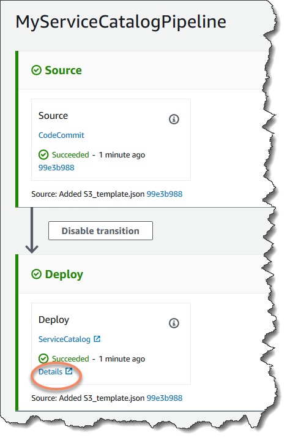

# Tutorial: Create a pipeline that deploys to

Service Catalog

Service Catalog enables you to create and provision products based on AWS CloudFormation templates.

###### Important

As part of creating a pipeline, an S3 artifact bucket provided by the customer will be
used by CodePipeline for artifacts. (This is different from the bucket used for an S3 source action.)
If the S3 artifact bucket is in a different account from the account for your pipeline, make
sure that the S3 artifact bucket is owned by AWS accounts that are safe and will be
dependable.

This tutorial shows you how to create and configure a pipeline to deploy your product
template to Service Catalog and deliver changes you have made in your source repository (already created in
GitHub, CodeCommit, or Amazon S3).

###### Note

When Amazon S3 is the source provider for your pipeline, you must upload to your bucket all
source files packaged as a single .zip file. Otherwise, the source action fails.

First, you create a product in Service Catalog, and then you create a pipeline in AWS CodePipeline. This
tutorial provides two options for setting up the deployment configuration:

- Create a product in Service Catalog and upload a template file to your source repository. Provide
  product version and deployment configuration in the CodePipeline console (without a separate
  configuration file). See [Option 1: Deploy to Service Catalog without a
  configuration file](#tutorials-S3-servicecatalog-ex1-configure "#tutorials-S3-servicecatalog-ex1-configure").

###### Note

The template file can be created in YAML or JSON format.

- Create a product in Service Catalog and upload a template file to your source repository. Provide
  product version and deployment configuration in a separate configuration file. See [Option 2: Deploy to Service Catalog using a
  configuration file](#tutorials-S3-servicecatalog-ex2-configure "#tutorials-S3-servicecatalog-ex2-configure").

## Option 1: Deploy to Service Catalog without a

configuration file

In this example, you upload the sample AWS CloudFormation template file for an S3 bucket, and then
create your product in Service Catalog. Next, you create your pipeline and specify deployment
configuration in the CodePipeline console.

### Step 1: Upload sample template file

to source repository

1. Open a text editor. Create a sample template by pasting the following into the file.
   Save the file as `S3_template.json`.

```
{
  "AWSTemplateFormatVersion": "2010-09-09",
  "Description": "CloudFormation Sample Template S3_Bucket: Sample template showing how to create a privately accessible S3 bucket. **WARNING** This template creates an S3 bucket. You will be billed for the resources used if you create a stack from this template.",
  "Resources": {
    "S3Bucket": {
      "Type": "AWS::S3::Bucket",
      "Properties": {}
    }
  },
  "Outputs": {
    "BucketName": {
      "Value": {
        "Ref": "S3Bucket"
      },
      "Description": "Name of Amazon S3 bucket to hold website content"
    }
  }
}
```

This template allows AWS CloudFormation to create an S3 bucket that can be used by
Service Catalog. 2. Upload the `S3_template.json` file to your AWS CodeCommit
repository.

### Step 2: Create a product in

Service Catalog

1. As an IT administrator, sign in to the Service Catalog console, go to the
   **Products** page, and then choose **Upload new
   product**.
2. On the **Upload new product** page, complete the following:
   1. In **Product name**, enter the name you want to use for your
      new product.
   2. In **Description**, enter the product catalog description. This
      description is shown in the product listing to help the user choose the correct
      product.
   3. In **Provided by**, enter the name of your IT department or
      administrator.
   4. Choose **Next**.

3. (Optional) In **Enter support details**, enter contact information
   for product support, and choose **Next**.
4. In **Version details**, complete the following:
   1. Choose **Upload a template file**. Browse for your
      `S3_template.json` file and upload it.
   2. In **Version title**, enter the name of the product version
      (for example, `devops S3 v2`).
   3. In **Description**, enter details that distinguish this version
      from other versions.
   4. Choose **Next**.

5. On the **Review** page, verify that the information is correct, and
   then choose **Create**.
6. On the **Products** page, in the browser, copy the URL of your new
   product. This contains the product ID. Copy and retain this product ID. You use it when
   you create your pipeline in CodePipeline.

Here is the URL for a product named `my-product`. To extract the product
ID, copy the value between the equals sign (`=`) and the ampersand
(`&`). In this example, the product ID is
`prod-example123456`.

```
https://<region-URL>/servicecatalog/home?region=<region>#/admin-products?productCreated=prod-example123456&createdProductTitle=my-product
```

###### Note

Copy the URL for your product before you navigate away from the page. Once you
navigate away from this page, you must use the CLI to obtain your product ID.

After a few seconds, your product appears on the **Products** page.
You might need to refresh your browser to see the product in the list.

### Step 3: Create your pipeline

1. To name your pipeline and select parameters for your pipeline, do the
   following:
   1. Sign in to the AWS Management Console and open the CodePipeline console at
      [https://console.aws.amazon.com/codepipeline/](https://console.aws.amazon.com/codepipeline/ "https://console.aws.amazon.com/codepipeline/").
   2. On the **Welcome** page, **Getting started**
      page, or the **Pipelines** page, choose **Create
      pipeline**.
   3. On the **Step 1: Choose creation option** page, under
      **Creation options**, choose the **Build custom
      pipeline** option. Choose **Next**.
   4. In **Step 2: Choose pipeline settings**, in **Pipeline
      name**, enter a name for your pipeline.
   5. CodePipeline provides V1 and V2 type pipelines, which differ in characteristics and
      price. The V2 type is the only type you can choose in the console. For more
      information, see [pipeline types](pipeline-types-planning.md "pipeline-types-planning.md"). For information about pricing for CodePipeline, see [Pricing](https://aws.amazon.com/codepipeline/pricing/ "https://aws.amazon.com/codepipeline/pricing/").
   6. In **Service role**, choose **New service
      role** to allow CodePipeline to create a service role in IAM.
   7. Leave the settings under **Advanced settings** at their
      defaults, and then choose **Next**.

2. To add a source stage on the **Step 3: Add source stage** page, do
   the following:
   1. In **Source provider**, choose
      **AWS CodeCommit**.
   2. In **Repository name** and **Branch name**,
      enter the repository and branch you want to use for your source action.
   3. Choose **Next**.

3. In **Step 4: Add build stage**, choose **Skip build
   stage**, and then accept the warning message by choosing
   **Skip** again.
4. In **Step 5: Add test stage**, choose **Skip test
   stage**, and then accept the warning message by choosing
   **Skip** again.

Choose **Next**. 5. In **Step 6: Add deploy stage**, complete the following:

    1. In **Deploy provider**, choose
     **AWS Service Catalog**.
    2. For deployment configuration, choose **Enter deployment
     configuration**.
    3. In **Product ID**, paste the product ID you copied from the
     Service Catalog console.
    4. In **Template file path**, enter the relative path where the
     template file is stored.
    5. In **Product type**, choose **CloudFormation
     template**.
    6. In **Product version name**, enter the name of the product
     version you specified in Service Catalog. If you want to have the template change deployed to a
     new product version, enter a product version name that has not been used for any
     previous product version in the same product.
    7. For **Input artifact**, choose the source input
     artifact.
    8. Choose **Next**.

6. In **Step 7: Review**, review your pipeline settings, and then
   choose **Create**.
7. After your pipeline runs successfully, on the deployment stage, choose
   **Details**. This opens your product in Service Catalog.

 8. Under your product information, choose your version name to open the product
template. View the template deployment.

### Step 4: Push a change and verify your

product in Service Catalog

1. View your pipeline in the CodePipeline console, and on your source stage, choose
   **Details**. Your source AWS CodeCommit repository opens in the console.
   Choose **Edit**, and make a change in the file (for example, to the
   description).

```
"Description": "Name of Amazon S3 bucket to hold and version website content"
```

2. Commit and push your change. Your pipeline starts after you push the change. When
   the run of the pipeline is complete, on the deployment stage, choose
   **Details** to open your product in Service Catalog.
3. Under your product information, choose the new version name to open the product
   template. View the deployed template change.

## Option 2: Deploy to Service Catalog using a

configuration file

In this example, you upload the sample AWS CloudFormation template file for an S3 bucket, and then
create your product in Service Catalog. You also upload a separate configuration file that specifies your
deployment configuration. Next, you create your pipeline and specify the location of your
configuration file.

### Step 1: Upload sample template file to

source repository

1. Open a text editor. Create a sample template by pasting the following into the file.
   Save the file as `S3_template.json`.

```
{
  "AWSTemplateFormatVersion": "2010-09-09",
  "Description": "CloudFormation Sample Template S3_Bucket: Sample template showing how to create a privately accessible S3 bucket. **WARNING** This template creates an S3 bucket. You will be billed for the resources used if you create a stack from this template.",
  "Resources": {
    "S3Bucket": {
      "Type": "AWS::S3::Bucket",
      "Properties": {}
    }
  },
  "Outputs": {
    "BucketName": {
      "Value": {
        "Ref": "S3Bucket"
      },
      "Description": "Name of Amazon S3 bucket to hold website content"
    }
  }
}
```

This template allows AWS CloudFormation to create an S3 bucket that can be used by
Service Catalog. 2. Upload the `S3_template.json` file to your AWS CodeCommit
repository.

### Step 2: Create your product

deployment configuration file

1. Open a text editor. Create the configuration file for your product. The
   configuration file is used to define your Service Catalog deployment parameters/preferences. You
   use this file when you create your pipeline.

This sample provides a `ProductVersionName` of "devops S3 v2" and a
`ProductVersionDescription` of `MyProductVersionDescription`. If
you want to have the template change deployed to a new product version, just enter a
product version name that has not been used for any previous product version in the same
product.

Save the file as `sample_config.json`.

```
{
    "SchemaVersion": "1.0",
    "ProductVersionName": "devops S3 v2",
    "ProductVersionDescription": "MyProductVersionDescription",
    "ProductType": "CLOUD_FORMATION_TEMPLATE",
    "Properties": {
        "TemplateFilePath": "/S3_template.json"
    }
}
```

This file creates the product version information for you each time your pipeline
runs. 2. Upload the `sample_config.json` file to your AWS CodeCommit
repository. Make sure you upload this file to your source repository.

### Step 3: Create a product in

Service Catalog

1. As an IT administrator, sign in to the Service Catalog console, go to the
   **Products** page, and then choose **Upload new
   product**.
2. On the **Upload new product** page, complete the following:
   1. In **Product name**, enter the name you want to use for your
      new product.
   2. In **Description**, enter the product catalog description. This
      description appears in the product listing to help the user choose the correct
      product.
   3. In **Provided by**, enter the name of your IT department or
      administrator.
   4. Choose **Next**.

3. (Optional) In **Enter support details**, enter product support
   contact information, and then choose **Next**.
4. In **Version details**, complete the following:
   1. Choose **Upload a template file**. Browse for your
      `S3_template.json` file and upload it.
   2. In **Version title**, enter the name of the product version
      (for example, "devops S3 v2").
   3. In **Description**, enter details that distinguish this version
      from other versions.
   4. Choose **Next**.

5. On the **Review** page, verify that the information is
   correct, and then choose **Confirm and upload**.
6. On the **Products** page, in the browser, copy the URL of your new
   product. This contains the product ID. Copy and retain this product ID. You use when you
   create your pipeline in CodePipeline.

Here is the URL for a product named `my-product`. To extract the product
ID, copy the value between the equals sign (`=`) and the ampersand
(`&`). In this example, the product ID is
`prod-example123456`.

```
https://<region-URL>/servicecatalog/home?region=<region>#/admin-products?productCreated=prod-example123456&createdProductTitle=my-product
```

###### Note

Copy the URL for your product before you navigate away from the page. Once you
navigate away from this page, you must use the CLI to obtain your product ID.

After a few seconds, your product appears on the **Products** page. You might need to refresh your browser to see the product
in the list.

### Step 4: Create your pipeline

1. To name your pipeline and select parameters for your pipeline, do the
   following:
   1. Sign in to the AWS Management Console and open the CodePipeline console at
      [https://console.aws.amazon.com/codepipeline/](https://console.aws.amazon.com/codepipeline/ "https://console.aws.amazon.com/codepipeline/").
   2. Choose **Getting started**. Choose **Create
      pipeline**, and then enter a name for your pipeline.
   3. In **Service role**, choose **New service
      role** to allow CodePipeline to create a service role in IAM.
   4. Leave the settings under **Advanced settings** at their
      defaults, and then choose **Next**.

2. To add a source stage, do the following:
   1. In **Source provider**, choose
      **AWS CodeCommit**.
   2. In **Repository name** and **Branch name**,
      enter the repository and branch you want to use for your source action.
   3. Choose **Next**.

3. In **Add build stage**, choose **Skip build
   stage**, and then accept the warning message by choosing
   **Skip** again.
4. In **Add deploy stage**, complete the following:
   1. In **Deploy provider**, choose
      **AWS Service Catalog**.
   2. Choose **Use configuration file**.
   3. In **Product ID**, paste the product ID you copied from the
      Service Catalog console.
   4. In **Configuration file path**, enter the file path of the
      configuration file in your repository.
   5. Choose **Next**.

5. In **Review**, review your pipeline settings, and then choose
   **Create**.
6. After your pipeline runs successfully, on your deployment stage, choose
   **Details** to open your product in Service Catalog.

 7. Under your product information, choose your version name to open the product
template. View the template deployment.

### Step 5: Push a change and verify your

product in Service Catalog

1. View your pipeline in the CodePipeline console, and on the source stage, choose
   **Details**. Your source AWS CodeCommit repository opens in the console.
   Choose **Edit**, and then make a change in the file (for example, to
   the description).

```
"Description": "Name of Amazon S3 bucket to hold and version website content"
```

2. Commit and push your change. Your pipeline starts after you push the change. When
   the run of the pipeline is complete, on the deployment stage, choose
   **Details** to open your product in Service Catalog.
3. Under your product information, choose the new version name to open the product
   template. View the deployed template change.
